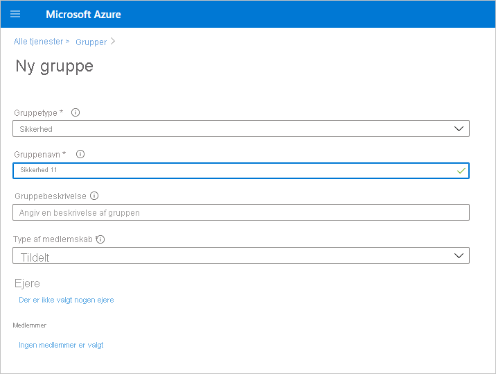
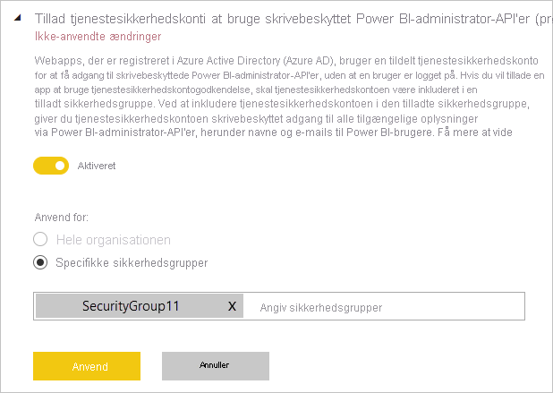

# Aktivér godkendelse med tjenesteprincipal for skrivebeskyttede administrator-API'er (prøveversion)

Tjenesteprincipal er en godkendelsesmetode, som kan bruges til at give et Azure AD-program (Azure Active Directory) adgang til Power BI-tjenesteindhold og API'er.
Når du opretter et Azure AD-program, oprettes der et [objekt for en tjenesteprincipal](https://docs.microsoft.com/azure/active-directory/develop/app-objects-and-service-principals#service-principal-object). Objektet for tjenesteprincipalen, der også ganske enkelt er kendt som tjenesteprincipal, giver Azure AD mulighed for at godkende dit program. Når appen er godkendt, kan den få adgang til Microsoft Azure AD-lejerressourcer.

## Metode

Følg disse trin for at aktivere godkendelse med tjenesteprincipal for skrivebeskyttede API'er til Power BI:

1. [Opret et Azure AD-program](https://docs.microsoft.com/azure/active-directory/develop/howto-create-service-principal-portal). Du kan springe dette trin over, hvis du allerede har et Azure AD-program, du vil bruge. Notér program-id'et til senere trin. 
2. Opret en ny **sikkerhedsgruppe** i Azure Active Directory. [Få mere at vide om, hvordan du opretter en grundlæggende gruppe og tilføjer medlemmer ved hjælp af Azure Active Directory](https://docs.microsoft.com/azure/active-directory/fundamentals/active-directory-groups-create-azure-portal). Du kan springe dette trin over, hvis du allerede har en sikkerhedsgruppe, du vil bruge.
    Sørg for at vælge **Sikkerhed** som gruppetype.

    

3. Tilføj dit program-id som medlem af den sikkerhedsgruppe, du har oprettet. Sådan gør du:
    1. Naviger til **Azure Portal > Azure Active Directory > Grupper**, og vælg den sikkerhedsgruppe, du oprettede i Trin 2.
    1. Vælg **Tilføj medlemmer**.
    Bemærk! Sørg for, at der ikke er angivet nogen Power BI-administratorroller for det anvendte program på Azure Portal. Sådan tjekker du dette: 
       * Log på **Azure Portal** som global administrator, programadministrator eller administrator af cloudprogram. 
        * Vælg **Azure Active Directory** og derefter **Virksomhedsprogrammer**. 
        * Vælg det program, som du vil tildele adgang til Power BI. 
        * Vælg **Tilladelser**. Sørg for, at der ikke er angivet tilladelser af typen admin-consent-required i Power BI for dette program. Se [Administration af samtykke til programmer og evaluering af anmodninger om indhold](https://docs.microsoft.com/azure/active-directory/manage-apps/manage-consent-requests) for at få flere oplysninger. 
4. Aktivér indstillingerne for Power BI-tjenesteadministration. Hvis du vil dette, skal du gøre som følger:
    1. Log på Power BI-administrationsportalen. Du skal være Power BI-administrator for at se siden med lejerindstillinger.
    1. Under **API-indstillinger for administrator** kan du se **Giv tjenesteprincipaler tilladelse til at bruge skrivebeskyttede administrator-API'er i Power BI (prøveversion)** . Indstil til/fra-knappen til Aktiveret, og vælg derefter alternativknappen for **specifikke sikkerhedsgrupper**. Føj den sikkerhedsgruppe, du oprettede i Trin 2, til den tekstfelt, som vises under den, som vist på nedenstående figur.

        

 5. Begynd at bruge de skrivebeskyttede administrator-API'er. Se listen over understøttede API'er nedenfor.

    >[!IMPORTANT]
    >Når du aktiverer den tjenesteprincipal, der skal bruges med Power BI, er Azure AD-tilladelserne for programmet ikke længere gældende. Tilladelserne for programmet administreres derefter via Power BI-administrationsportalen.

## Overvejelser og begrænsninger
* Du kan ikke logge på Power BI-portalen ved hjælp af en tjenesteprincipal.
* Du skal have rettigheder som Power BI-administrator for at aktivere tjenesteprincipalen under API-indstillinger for administrator på Power BI-administrationsportalen.
* Tjenesteprincipalen understøtter i øjeblikket følgende API'er:
    * [GetGroupsAsAdmin](https://docs.microsoft.com/rest/api/power-bi/admin/groups_getgroupsasadmin) med $expand for dashboards, datasæt, rapporter og dataflow 
    * [GetDashboardsAsAdmin](https://docs.microsoft.com/rest/api/power-bi/admin/dashboards_getdashboardsasadmin) med $expand-felter
    * [GetDatasourcesAsAdmin](https://docs.microsoft.com/rest/api/power-bi/admin/datasets_getdatasourcesasadmin) 
    * [GetDatasetToDataflowsLinksAsAdmin](https://docs.microsoft.com/rest/api/power-bi/admin/datasets_getdatasettodataflowslinksingroupasadmin)
    * [GetDataflowDatasourcesAsAdmin](https://docs.microsoft.com/rest/api/power-bi/admin/dataflows_getdataflowdatasourcesasadmin) 
    * [GetDataflowUpstreamDataflowsAsAdmin](https://docs.microsoft.com/rest/api/power-bi/admin/dataflows_getupstreamdataflowsingroupasadmin) 
    * [GetCapacitiesAsAdmin](https://docs.microsoft.com/rest/api/power-bi/admin/getcapacitiesasadmin)
    * [GetActivityLog](https://docs.microsoft.com/rest/api/power-bi/admin/getactivityevents)
    * [GetModifiedWorkspaces](https://docs.microsoft.com/rest/api/power-bi/admin/workspaceinfo_getmodifiedworkspaces)
    * [WorkspaceGetInfo](https://docs.microsoft.com/rest/api/power-bi/admin/workspaceinfo_postworkspaceinfo)
    * [WorkspaceScanStatus](https://docs.microsoft.com/rest/api/power-bi/admin/workspaceinfo_getscanstatus)
    * [WorkspaceScanResult](https://docs.microsoft.com/rest/api/power-bi/admin/workspaceinfo_getscanresult)
