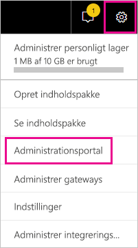
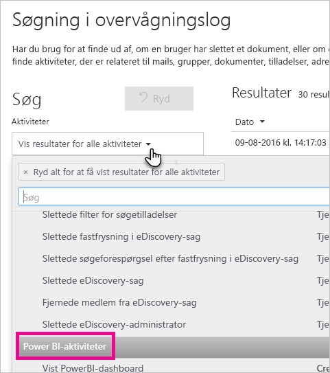
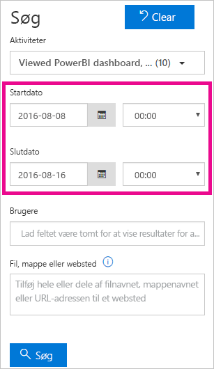
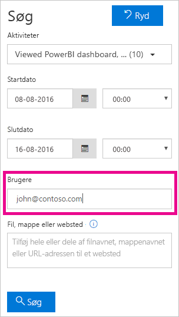
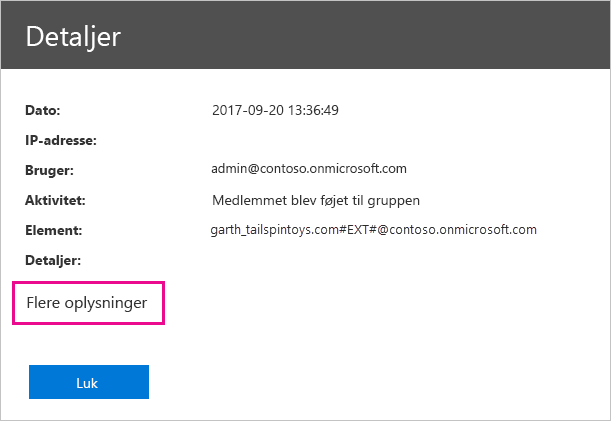

# <a name="track-user-activities-in-power-bi"></a>Spor brugeraktiviteter i Power BI

Det kan være vigtigt at vide, hvem der udfører en bestemt handling på et element i din Power BI-lejer, for at hjælpe din organisation med at opfylde sine krav, f.eks. at efterleve lovmæssig overholdelse af angivne standarder og datastyring. Med Power BI har du to muligheder for at spore brugeraktivitet: [Power BI-aktivitetsloggen](#use-the-activity-log) og den [samlede overvågningslog](#use-the-audit-log). Disse logge indeholder begge en komplet kopi af [Power BI-overvågningsdataene](#operations-available-in-the-audit-and-activity-logs), men der er flere vigtige forskelle, som er opsummeret i følgende tabel.

| **Samlet overvågningslog** | **Power BI-aktivitetslog** |
| --- | --- |
| Omfatter hændelser fra SharePoint Online, Exchange Online, Dynamics 365 og andre tjenester foruden Power BI-overvågningshændelser. | Omfatter kun Power BI-overvågningshændelser. |
| Det er kun brugere, der har tilladelserne Skrivebeskyttede overvågningslogge eller Overvågningslogge, som har adgang, f.eks. globale administratorer og auditører. | Globale administratorer og administratorer af Power BI-tjenesten har adgang. |
| Globale administratorer og auditører kan søge i den samlede overvågningslog ved hjælp af Microsoft 365 Sikkerhedscenter og Microsoft 365 Overholdelsescenter. | Der er endnu ingen brugergrænseflade til at søge efter aktivitetsloggen. |
| Globale administratorer og auditører kan downloade poster i overvågningsloggen ved hjælp af administrations-API'er og -cmdlet'er i Microsoft 365. | Globale administratorer og administratorer af Power BI-tjenesten kan downloade poster i aktivitetsloggen ved hjælp af en REST API i Power BI og en administrations-cmdlet. |
| Bevarer overvågningsdata i 90 dage | Bevarer aktivitetsdata i 30 dage (offentlig prøveversion). |
| Bevarer overvågningsdata, selvom lejeren flyttes til et andet Azure-område. | Bevarer ikke aktivitetsdata, når lejeren flyttes til et andet Azure-område. |


## <a name="use-the-activity-log"></a>Brug aktivitetsloggen

> [!NOTE]
> Logføring af aktivitet understøttes ikke til Microsoft Cloud Deutschland. Få mere at vide om tjenestebegrænsninger for Germany Cloud under [Ofte stillede spørgsmål om Power BI til Germany Cloud-kunder](service-govde-faq.md).


Som administrator af Power BI-tjenesten kan du analysere forbruget for alle Power BI-ressourcer på lejerniveau ved hjælp af brugerdefinerede rapporter, der er baseret på Power BI-aktivitetsloggen. Du kan downloade aktiviteterne ved hjælp af en REST API eller PowerShell-cmdlet. Du kan også filtrere aktivitetsdataene efter datoområde, bruger og aktivitetstype.

### <a name="activity-log-requirements"></a>Krav til aktivitetslog

Du skal opfylde disse krav for at få adgang til Power BI-aktivitetsloggen:

- Du skal enten være global administrator eller administrator af Power BI-tjenesten.
- Du har installeret [administrations-cmdlet'er i Power BI](https://www.powershellgallery.com/packages/MicrosoftPowerBIMgmt) lokalt eller bruger administrations-cmdlet'er i Power BI i Azure Cloud Shell.

### <a name="activityevents-rest-api"></a>REST API'en ActivityEvents

Du kan bruge et administrativt program, der er baseret på REST API'er til Power BI, til at eksportere aktivitetshændelser til et blob-lager eller en SQL-database. Du kan derefter oprette en brugerdefineret forbrugsrapport oven på de eksporterede data. I kaldet til REST API'en **ActivityEvents** skal du angive en startdato og en slutdato og evt. filtrere for at vælge aktiviteter efter aktivitetstype eller bruger-id. Da aktivitetsloggen kan indeholde en stor mængde data, understøtter API'en **ActivityEvents** i øjeblikket kun download af op til én dag med data pr. anmodning. Det vil sige, at startdato og slutdato skal angive samme dag, ligesom i følgende eksempel. Sørg for at angive værdier for dato/klokkeslæt i UTC-format.

```
https://api.powerbi.com/v1.0/myorg/admin/activityevents?startDateTime='2019-08-31T00:00:00'&endDateTime='2019-08-31T23:59:59'
```

Hvis antallet af poster er stort, returnerer API'en **ActivityEvents** kun ca. 5.000 til 10.000 poster og et fortsættelsestoken. Kald derefter API'en **ActivityEvents** igen med fortsættelsestokenet for at hente den næste batch af poster, indtil du har hentet alle poster og ikke længere modtager et fortsættelsestoken. I følgende eksempel kan du se, hvordan du bruger fortsættelsestokenet.

```
https://api.powerbi.com/v1.0/myorg/admin/activityevents?continuationToken='%2BRID%3ARthsAIwfWGcVAAAAAAAAAA%3D%3D%23RT%3A4%23TRC%3A20%23FPC%3AARUAAAAAAAAAFwAAAAAAAAA%3D'
```

Hvis resultaterne indeholder et fortsættelsestoken, skal du sørge for at kalde API'en igen, uanset antallet af returnerede poster, ved hjælp af det pågældende token for at hente de resterende data, indtil der ikke længere returneres et fortsættelsestoken. Det kan ske, at et kald også returnerer et fortsættelsestoken uden nogen hændelsesposter. Følgende eksempel viser, hvordan du kan udføre en løkke med et fortsættelsestoken, der returneres i svaret:

```
while(response.ContinuationToken != null)
{
   // Store the activity event results in a list for example
    completeListOfActivityEvents.AddRange(response.ActivityEventEntities);

    // Make another call to the API with continuation token
    response = GetPowerBIActivityEvents(response.ContinuationToken)
}
completeListOfActivityEvents.AddRange(response.ActivityEventEntities);
```
> [!NOTE]
> Det kan tage op til 24 timer, før alle begivenheder vises, selvom alle data normalt er tilgængelige meget hurtigere.
>
>
Du kan finde flere oplysninger om REST API til Power BI, herunder eksempler på, hvordan du får vist aktivitetshændelser for overvågning, under [Administrator – Få aktivitetshændelser](/rest/api/power-bi/admin/getactivityevents) i referencedokumentationen til REST API til Power BI.

### <a name="get-powerbiactivityevent-cmdlet"></a>Cmdlet'en Get-PowerBIActivityEvent

Download aktivitetshændelser ved hjælp af Power BI Management-cmdlet'er til PowerShell. Cmdlet'en **Get-PowerBIActivityEvent** håndterer automatisk fortsættelsestokenet for dig. Cmdlet'en **Get-PowerBIActivityEvent** bruger en parameter af typen StartDateTime og EndDateTime med de samme begrænsninger som REST API'en **ActivityEvents**. Det vil sige, at startdato og slutdato skal referere til den samme datoværdi, da du kun kan hente aktivitetsdataene for én dag ad gangen.

Følgende script viser, hvordan du downloader alle Power BI-aktiviteter. Kommandoen konverterer resultaterne fra JSON til .NET-objekter, så der opnås direkte adgang til separate aktivitetsegenskaber. Disse eksempler viser det mindste mulige og det største mulige tidsstempel for en dag for at sikre, at ingen hændelser springes over.

```powershell
Login-PowerBI

$activities = Get-PowerBIActivityEvent -StartDateTime '2019-08-31T00:00:00' -EndDateTime '2019-08-31T23:59:59' | ConvertFrom-Json

$activities.Count
$activities[0]

```

### <a name="filter-activity-data"></a>Filtrer aktivitetsdata

Du kan filtrere aktivitetshændelser efter aktivitetstype og bruger-id. Følgende script viser, hvordan du kun downloader hændelsesdata for aktiviteten **ViewDashboard**. Du kan finde flere oplysninger om understøttede parametre ved at bruge kommandoen `Get-Help Get-PowerBIActivityEvent`.

```powershell
Login-PowerBI

$activities = Get-PowerBIActivityEvent -StartDateTime '2019-08-31T00:00:00' -EndDateTime '2019-08-31T23:59:59' -ActivityType 'ViewDashboard' | ConvertFrom-Json

$activities.Count
$activities[0]

```

> [!NOTE]
> Der er et PowerShell-eksempel tilgængelig, så du kan få hjælp til at lære, hvordan du filtrerer og henter loghændelser for Power BI-aktiviteter. Du kan få flere oplysninger under [Få adgang til Power BI-aktivitetslog](../guidance/admin-activity-log.md).

## <a name="use-the-audit-log"></a>Brug overvågningsloggen

Hvis din opgave er at spore brugeraktiviteter på tværs af Power BI og Microsoft 365, arbejder du med overvågning i Office 365 Security & Compliance Center eller bruger PowerShell. Overvågning er afhængig af funktionaliteten i Exchange Online, som er klargjort automatisk til at understøtte Power BI.

Du kan filtrere overvågningsdataene efter datointerval, bruger, dashboard, rapport, datasæt og aktivitetstype. Du kan også downloade aktiviteterne i en csv-fil (fil med kommaseparerede værdier), der kan analyseres offline.

### <a name="audit-log-requirements"></a>Krav til overvågningslog

Du skal opfylde disse krav for at få adgang til overvågningslogfiler:

- Du skal enten være global administrator eller være tildelt rollen Overvågningslogge eller Skrivebeskyttede overvågningslogge i Exchange Online for at få adgang til overvågningsloggen. Disse roller er som standard tildelt rollegrupperne Administration af overholdelse og Organisationsstyring på siden **Tilladelser** i Exchange Administration. Du kan finde flere oplysninger om de roller, der kan få vist overvågningslogge, under [Krav til søgning i overvågningsloggen](/microsoft-365/compliance/search-the-audit-log-in-security-and-compliance?view=o365-worldwide#requirements-to-search-the-audit-log).

    Hvis du vil give konti, der ikke er administratorer, adgang til overvågningslogfilerne, skal du tilføje brugeren som medlem af en af disse rollegrupper. Hvis du vil gøre det på en anden måde, kan du oprette en brugerdefineret rollegruppe i Exchange Administration, tildele rollen Overvågningslogge eller Skrivebeskyttede overvågningslogge til denne gruppe og derefter føje den konto, der ikke er administrator, til den nye rollegruppe. Du kan finde flere oplysninger under [Administrer rollegrupper i Exchange Online](/Exchange/permissions-exo/role-groups).

    Hvis du ikke kan få adgang til Exchange Administration via Microsoft 365 Administration, skal du gå til https://outlook.office365.com/ecp og logge på ved hjælp af dine legitimationsoplysninger.

- Hvis du har adgang til overvågningsloggen, men ikke er global administrator eller administrator af Power BI-tjenesten, har du ikke adgang til Power BI-administrationsportalen. I dette tilfælde skal du bruge et direkte link til [Office 365 Security & Compliance Center](https://sip.protection.office.com/#/unifiedauditlog).

### <a name="access-your-audit-logs"></a>Tilgå dine overvågningslogge

For at tilgå loggene skal du først sørge for at aktivere logføring i Power BI. Du kan finde flere oplysninger i [Overvågningslogs](service-admin-portal.md#audit-logs) i dokumentationen til administrationsportalen. Der kan være en forsinkelse på op til 48 timer, fra du aktiverer overvågning, til du kan få vist overvågningsdata. Hvis du ikke får vist data med det samme, skal du tjekke overvågningsloggene senere. Der kan være en lignende forsinkelse mellem at få tilladelse til at få vist overvågningslogge og til at kunne åbne logfilerne.

Power BI-overvågningslogs er tilgængelige direkte via [Office 365 Security & Compliance Center](https://sip.protection.office.com/#/unifiedauditlog). Der er også et link fra Power BI-administrationsportalen:

1. Vælg **tandhjulsikonet** i øverste højre hjørne i Power BI, og vælg derefter **Administrationsportal**.

   

1. Vælg **Overvågningslogger**.

1. Vælg **Gå til Microsoft 365 Administration**.

   

### <a name="search-only-power-bi-activities"></a>Søg kun i Power BI-aktiviteter

Begræns resultaterne til aktiviteter, der kun er for Power BI, ved at følge disse trin. Se listen over [aktiviteter, der overvåges af Power BI](#operations-available-in-the-audit-and-activity-logs) senere i denne artikel for at få et overblik.

1. På siden **Søgning i overvågningslog** under **Søg** skal du vælge rullelisten for **Aktiviteter**.

2. Vælg **Power BI-aktiviteter**.

   

3. Klik et vilkårligt sted uden for markeringsfeltet for at lukke det.

Dine søgninger returnerer kun Power BI-aktiviteter.

### <a name="search-the-audit-logs-by-date"></a>Søg i overvågningslogfilerne efter dato

Du kan søge i logfilerne efter datointerval ved hjælp af felterne **Startdato** og **Slutdato**. Standardvalget er de seneste syv dage. Datoen og klokkeslættet vises i UTC-format (Coordinated Universal Time). Det maksimale datointerval, du kan angive, er 90 dage. 

Du får vist en fejlmeddelelse, hvis det valgte datointerval er mere end 90 dage. Hvis du bruger det maksimale datointerval på 90 dage, skal du vælge det aktuelle klokkeslæt som **Startdato**. Ellers får du vist en fejlmeddelelse om, at startdatoen ligger tidligere end slutdatoen. Hvis du har slået overvågning til inden for de sidste 90 dage, kan datointervallet ikke starte før den dato, hvor overvågning blev slået til.



### <a name="search-the-audit-logs-by-users"></a>Søg i overvågningslogfilerne efter brugere

Du kan søge efter overvågningslogposter for aktiviteter, der er udført af bestemte brugere. Angiv et eller flere brugernavne i feltet **Brugere**. Brugernavnet ligner en mailadresse. Det er den konto, som brugerne logger på Power BI med. Lad dette felt være tomt for at returnere poster for alle brugere (og tjenestekonti) i din organisation.



### <a name="view-search-results"></a>Få vist søgeresultaterne

Når du har valgt **Søg**, indlæses søgeresultaterne. Efter et øjeblik vises de under **Resultater**. Når søgningen er fuldført, vises antallet af fundne resultater. Der vises maksimalt 1000 hændelser i forbindelse med **Søgning i overvågningslog**. Hvis mere end 1000 hændelser opfylder søgekriterierne, viser appen de nyeste 1000 hændelser.

#### <a name="view-the-main-results"></a>Få vist de vigtigste resultater

Området **Resultater** indeholder følgende oplysninger om hver hændelse, der returneres af søgningen. Vælg en kolonneoverskrift under **Resultater** for at sortere resultaterne.

| **Kolonne** | **Definition** |
| --- | --- |
| Dato |Den dato og det klokkeslæt (i UTC-format), da hændelsen fandt sted. |
| IP-adresse |IP-adressen for den enhed, der bruges til den logførte aktivitet. Appen viser IP-adressen enten i et IPv4- eller IPv6-adresseformat. |
| Bruger |Brugeren (eller tjenestekontoen), som udførte den handling, der udløste hændelsen. |
| Aktivitet |Den aktivitet, der blev udført af brugeren. Denne værdi svarer til de aktiviteter, som du har valgt på rullelisten **Aktiviteter**. For en hændelse fra Exchange-administratorens overvågningslogfil er værdien i denne kolonne en Exchange-cmdlet . |
| Element |Det objekt, der blev oprettet eller ændret som følge af den tilsvarende aktivitet. For eksempel den viste eller ændrede fil eller den opdaterede brugerkonto. Ikke alle aktiviteter har en værdi i denne kolonne. |
| Detaljer |Yderligere oplysninger om en aktivitet. Igen er det ikke alle aktiviteter, der har en værdi. |

#### <a name="view-the-details-for-an-event"></a>Få vist oplysninger om en hændelse

Hvis du vil se flere oplysninger om en hændelse, skal du vælge hændelsesposten på listen over søgeresultater. Siden **Detaljer** vises, som indeholder de detaljerede egenskaber fra hændelsesposten. På siden **Detaljer** vises egenskaberne afhængigt af den Microsoft 365-tjeneste, som hændelsen opstod i.

Vælg **Flere oplysninger** for at få vist disse detaljer. Alle poster i Power BI har en værdi på 20 for egenskaben RecordType. Du kan finde oplysninger om andre egenskaber i [Detaljerede egenskaber i overvågningsloggen](/office365/securitycompliance/detailed-properties-in-the-office-365-audit-log/).

   

### <a name="export-search-results"></a>Eksporter søgeresultaterne

Følg disse trin for at eksportere Power BI-overvågningsloggen til en csv-fil.

1. Vælg **Eksportér resultater**.

1. Vælg enten **Gem indlæste resultater** eller **Download alle resultater**.

    

### <a name="use-powershell-to-search-audit-logs"></a>Brug PowerShell til at søge efter overvågningslogs

Du kan også bruge PowerShell til at få adgang til overvågningslogfilerne baseret på dit logon. I følgende eksempel kan du se, hvordan du opretter forbindelse til Exchange Online PowerShell og derefter bruger kommandoen [Search-UnifiedAuditLog](/powershell/module/exchange/policy-and-compliance-audit/search-unifiedauditlog?view=exchange-ps/) til at trække poster fra Power BI-overvågningsloggen. Hvis du vil køre scriptet, skal en administrator tildele de nødvendige tilladelser til dig, som beskrevet i afsnittet [Krav til overvågningslog](#audit-log-requirements).

```powershell
Set-ExecutionPolicy RemoteSigned

$UserCredential = Get-Credential

$Session = New-PSSession -ConfigurationName Microsoft.Exchange -ConnectionUri https://outlook.office365.com/powershell-liveid/ -Credential $UserCredential -Authentication Basic -AllowRedirection

Import-PSSession $Session
Search-UnifiedAuditLog -StartDate 9/11/2018 -EndDate 9/15/2018 -RecordType PowerBI -ResultSize 1000 | Format-Table | More
```

### <a name="use-powershell-to-export-audit-logs"></a>Brug PowerShell til at eksportere overvågningslogge

Du kan også bruge PowerShell til at eksportere resultaterne af søgningen i overvågningsloggen. I følgende eksempel kan du se, hvordan du sender fra kommandoen [Search-UnifiedAuditLog](/powershell/module/exchange/policy-and-compliance-audit/search-unifiedauditlog?view=exchange-ps/) og eksporterer resultaterne ved hjælp af cmdlet'en [Export-Csv](/powershell/module/microsoft.powershell.utility/export-csv). Hvis du vil køre scriptet, skal en administrator tildele de nødvendige tilladelser til dig, som beskrevet i afsnittet [Krav til overvågningslog](#audit-log-requirements).

```powershell
$UserCredential = Get-Credential

$Session = New-PSSession -ConfigurationName Microsoft.Exchange -ConnectionUri https://outlook.office365.com/powershell-liveid/ -Credential $UserCredential -Authentication Basic -AllowRedirection

Import-PSSession $Session
Search-UnifiedAuditLog -StartDate 9/11/2019 -EndDate 9/15/2019 -RecordType PowerBI -ResultSize 5000 |
Export-Csv -Path "c:\temp\PowerBIAuditLog.csv" -NoTypeInformation

Remove-PSSession $Session
```

Du kan finde flere oplysninger om at oprette forbindelse til Exchange Online under [Opret forbindelse til Exchange Online PowerShell](/powershell/exchange/exchange-online/connect-to-exchange-online-powershell/connect-to-exchange-online-powershell/). Hvis du vil se et andet eksempel på brug af PowerShell med overvågningslogs, skal du se [Brug af Power BI-overvågningslog og PowerShell til at tildele Power BI Pro-licenser](https://powerbi.microsoft.com/blog/using-power-bi-audit-log-and-powershell-to-assign-power-bi-pro-licenses/).

## <a name="operations-available-in-the-audit-and-activity-logs"></a>Tilgængelige handlinger i overvågnings- og aktivitetslogge

Følgende handlinger er tilgængelige både i overvågnings- og aktivitetslogge.

| Brugervenligt navn                                     | Handlingsnavn                              | Noter                                  |
|---------------------------------------------------|---------------------------------------------|------------------------------------------|
| Tilgik udvalgte Power BI-tabeller i Excel | AnalyzedByExternalApplication |    |
| Føjede datakilde til Power BI-gateway             | AddDatasourceToGateway                      |                                          |
| Tilføjede adgang til Power BI-mapper                      | AddFolderAccess                             | Anvendes ikke i øjeblikket                       |
| Tilføjede Power BI-gruppemedlemmer                      | AddGroupMembers                             |                                          |
| Administratoren har knyttet dataflowlagerkontoen til lejer | AdminAttachedDataflowStorageAccountToTenant | Anvendes ikke i øjeblikket                       |
| Analyseret Power BI-datasæt                         | AnalyzedByExternalApplication               | Genereres, når brugerne interagerer med tjenesten                                         |
| Analyserede Power BI-rapport                          | AnalyzeInExcel                              |                                          |
| Tildelt et arbejdsområde til en udrulningspipeline                          | AssignWorkspaceToPipeline                              |                                          |
| Tilknyttet lagerkonto for dataflow                 | AttachedDataflowStorageAccount              |                                          |
| Bundne Power BI-datasæt til gateway                | BindToGateway                               |                                          |
| Annulleret opdatering af dataflow                        | CancelDataflowRefresh                       |                                          |
| Ændrede kapacitetstilstand                            | ChangeCapacityState                         |                                          |
| Ændrede kapacitet for brugertildeling                  | UpdateCapacityUsersAssignment               |                                          |
| Ændrede Power BI-datasætforbindelser              | SetAllConnections                           |                                          |
| Ændrede administratorer af Power BI-gateway                   | ChangeGatewayAdministrators                 |                                          |
| Ændrede brugere af datakilde fra Power BI-gateway        | ChangeGatewayDatasourceUsers                |                                          |
| Oprettede en brugerdefineret visualisering til virksomheder                          | InsertOrganizationalGalleryItem                                |                                          |
| Oprettede Power BI-indholdspakke til organisationer      | CreateOrgApp                                |                                          |
| Oprettede installationspipeline      | CreateAlmPipeline                                |                                          |
| Oprettede Power BI-app                              | CreateApp                                   |                                          |
| Oprettede Power BI-dashboard                        | CreateDashboard                             |                                          |
| Oprettede Power BI-dataflow                         | CreateDataflow                              |                                          |
| Oprettede Power BI-datasæt                          | CreateDataset                               |                                          |
| Oprettede Power BI-mailabonnement               | CreateEmailSubscription                     |                                          |
| Oprettede Power BI-mappe                           | CreateFolder                                |                                          |
| Oprettede Power BI-gateway                          | CreateGateway                               |                                          |
| Oprettede Power BI-gruppe                            | CreateGroup                                 |                                          |
| Oprettede Power BI-rapport                           | CreateReport <sup>1</sup>                                |                                          |
| Opret arbejdsområde for Power BI-skabelonprogram | CreateTemplateApp   |
| Opret installationsanmodning for Power BI-skabelonprogram | CreateTemplateAppInstallTicket |
| Opret pakke til Power BI-skabelonprogram | CreateTemplateAppPackage |
| Brugerdefineret visuelt element anmodede om Azure AD-adgangstoken                           | GenerateCustomVisualAADAccessToken                                |                                          |
| Brugerdefineret visualisering anmodede om adgang til Office Web Apps                           | GenerateCustomVisualWACAccessToken                                |                                          |
| Migrerede dataflowet til ekstern lagerkonto     | DataflowMigratedToExternalStorageAccount    | Anvendes ikke i øjeblikket                       |
| Tilføjede dataflowtilladelser                        | DataflowPermissionsAdded                    | Anvendes ikke i øjeblikket                       |
| Fjernede dataflowtilladelser                      | DataflowPermissionsRemoved                  | Anvendes ikke i øjeblikket                       |
| Slettede en brugerdefineret visualisering til organisationer     | DeleteOrganizationalGalleryItem                                |                                          |
| Slettede en installationspipeline      | DeleteAlmPipeline                                |                                          |
| Slettede Power BI-indholdspakke til organisationer      | DeleteOrgApp                                |                                          |
| Slettede Power BI-kommentar                          | DeleteComment                               |                                          |
| Slettede Power BI-dashboard                        | DeleteDashboard                             | Anvendes ikke i øjeblikket                       |
| Slettede Power BI-dataflow                         | DeleteDataflow                              | Anvendes ikke i øjeblikket                       |
| Slettede Power BI-datasæt                          | DeleteDataset                               |                                          |
| Slettede Power BI-mailabonnement               | DeleteEmailSubscription                     |                                          |
| Slettede Power BI-mappe                           | DeleteFolder                                |                                          |
| Slettede adgang til Power BI-mapper                    | DeleteFolderAccess                          | Anvendes ikke i øjeblikket                       |
| Slettede Power BI-gateway                          | DeleteGateway                               |                                          |
| Slettede Power BI-gruppe                            | DeleteGroup                                 |                                          |
| Slettede Power BI-rapport                           | DeleteReport                                |                                          |
| Slettede arbejdsområde for Power BI-skabelonprogram | DeleteTemplateApp |
| Slettede pakke til Power BI-skabelonprogram | DeleteTemplateAppPackage |
| Udrullede til en pipelinefase                           | DeployAlmPipeline                                |                                          |
| Fandt datakilder til Power BI-datasæt          | GetDatasources                              |                                          |
| Downloadet Power BI-rapport                        | DownloadReport                              |                                          |
| Redigerede egenskaber for dataflow                        | EditDataflowProperties                      |                                          |
| Power BI-certificeringstilladelse blev redigeret          | EditCertificationPermission                 | Anvendes ikke i øjeblikket                       |
| Redigerede Power BI-dashboard                         | EditDashboard                               | Anvendes ikke i øjeblikket                       |
| Redigerede Power BI-datasæt                           | EditDataset                                 |                                          |
| Redigerede egenskaber for Power BI-datasæt                | EditDatasetProperties                       | Anvendes ikke i øjeblikket                       |
| Redigerede Power BI-rapport                            | EditReport                                  |                                          |
| Eksporterede Power BI-dataflow                        | ExportDataflow                              |                                          |
| Eksporterede visualiseringsdata for Power BI-rapporten              | ExportReport                                |                                          |
| Eksporterede Power BI-feltdata                       | ExportTile                                  |                                          |
| Udpakkede pakke til Power BI-skabelonprogram til arbejdsområde | ExtractTemplateAppPackage |
| Dataflowtilladelser blev ikke tilføjet                | FailedToAddDataflowPermissions              | Anvendes ikke i øjeblikket                       |
| Dataflowtilladelser blev ikke fjernet             | FailedToRemoveDataflowPermissions           | Anvendes ikke i øjeblikket                       |
| Genererede SAS-token til Power BI-dataflow             | GenerateDataflowSasToken                    |                                          |
| Genererede integrationstoken til Power BI                    | GenerateEmbedToken                          |                                          |
| Generér skærmbillede                       | GenerateScreenshot |                     |
| Importerede fil i Power BI                         | Importér                                      |                                          |
| Installerede Power BI-app                            | InstallApp                                  |                                          |
| Installerede Power BI-skabelonprogram | InstallTemplateApp |
| Migrerede arbejdsområde til en kapacitet                  | MigrateWorkspaceIntoCapacity                |                                          |
| Postede Power BI-kommentar                           | PostComment                                 |                                          |
| Udskrev Power BI-dashboard                        | PrintDashboard                              |                                          |
| Udskrev Power BI-rapportside                      | PrintReport                                 |                                          |
| Fremhævede pakke til Power BI-skabelonprogram | PromoteTemplateAppPackage |
| Publicerede Power BI-rapport på internettet                  | PublishToWebReport <sup>2</sup>                         |                                          |
| Udvalgte udgivne eller opdaterede tabeller | UpdateFeaturedTables <sup>3</sup>   | |
| Modtiog Power BI-dataflowhemmelighed fra Key Vault  | ReceiveDataflowSecretFromKeyVault           |                                          |
| Fjernede et arbejdsområde fra en udrulningspipeline         | UnassignWorkspaceFromPipeline                 |                                          |
| Datakilde fjernet fra Power BI-gateway         | RemoveDatasourceFromGateway                 |                                          |
| Fjernede Power BI-gruppemedlemmer                    | DeleteGroupMembers                          |                                          |
| Fjernede arbejdsområde fra en kapacitet                 | RemoveWorkspacesFromCapacity                |                                          |
| Omdøbte Power BI-dashboard                        | RenameDashboard                             |                                          |
| Anmodede om opdatering af Power BI-dataflowet               | RequestDataflowRefresh                      | Anvendes ikke i øjeblikket                       |
| Anmodede om opdatering af Power BI-datasættet                | RefreshDataset                              |                                          |
| Hentede Power BI-arbejdsområder                     | GetWorkspaces                               |                                          |
| Følsomhedsmærkat blev anvendt                         | SensitivityLabelApplied                     |                                          |
| Følsomhedsmærkat blev ændret                         | SensitivityLabelChanged                     |                                          |
| Følsomhedsmærkat blev fjernet                         | SensitivityLabelRemoved                     |                                          |
| Angiv lagringsplacering for et arbejdsområdes dataflow     | SetDataflowStorageLocationForWorkspace      |                                          |
| Angiv planlagt opdatering af Power BI-dataflow        | SetScheduledRefreshOnDataflow               |                                          |
| Angiv planlagt opdatering af Power BI-datasæt         | SetScheduledRefresh                         |                                          |
| Delte Power BI-dashboard                         | ShareDashboard                              |                                          |
| Delte Power BI-rapport                            | ShareReport                                 |                                          |
| Påbegyndt udvidet prøveperiode med Power BI                   | OptInForExtendedProTrial                    | Anvendes ikke i øjeblikket                       |
| Startede Power BI-prøveperiode                            | OptInForProTrial                            |                                          |
| Overtog Power BI-datakilde                   | TakeOverDatasource                          |                                          |
| Overtog Power BI-datasæt                        | TakeOverDataset                             |                                          |
| Overtog et Power BI-dataflow                     | TookOverDataflow                             |                                          |
| Fjernede publicering af Power BI-app                          | UnpublishApp                                |                                          |
| Opdater indstillinger for ressourcestyring af kapacitet      | UpdateCapacityResourceGovernanceSettings    | Findes i øjeblikket ikke i Microsoft 365 Administration |
| Opdaterede en brugerdefineret visualisering til organisationer                     | UpdateOrganizationalGalleryItem                   |                                          |
| Opdaterede kapacitetsadministrator                            | UpdateCapacityAdmins                        |                                          |
| Opdaterede vist navn for kapacitet                     | UpdateCapacityDisplayName                   |                                          |
| Opdaterede tilladelser for tildeling af dataflowlager   | UpdatedDataflowStorageAssignmentPermissions |                                          |
| Opdaterede adgang til installationspipeline   | UpdateAlmPipelineAccess |                                          |
| Opdaterede installerede parametre for Power BI-skabelonprogram | UpdateInstalledTemplateAppParameters |
| Opdaterede konfiguration for installationspipeline   | SetConfigurationAlmPipeline |                                          |
| Opdaterede organisationens Power BI-indstillinger          | UpdatedAdminFeatureSwitch                   |                                          |
| Opdaterede Power BI-appen                              | UpdateApp                                   |                                          |
| Opdaterede Power BI-dataflowet                         | UpdateDataflow                              |                                          |
| Opdaterede datakilder til Power BI-datasæt             | UpdateDatasources                           |                                          |
| Opdaterede parametre for Power BI-datasæt               | UpdateDatasetParameters                     |                                          |
| Opdaterede Power BI-mailabonnement               | UpdateEmailSubscription                     |                                          |
| Opdaterede Power BI-mappe                           | UpdateFolder                                |                                          |
| Opdaterede adgang til Power BI-mappe                    | UpdateFolderAccess                          |                                          |
| Opdaterede legitimationsoplysninger for Power BI-gatewaydatakilde  | UpdateDatasourceCredentials                 |                                          |
| Opdaterede indstillinger for Power BI-skabelonprogram | UpdateTemplateAppSettings |
| Opdaterede adgangstilladelser til test af Power BI-skabelonprogram | UpdateTemplateAppTestPackagePermissions |
| Fik vist Power BI-dashboard                         | ViewDashboard                               |                                          |
| Fik vist Power BI-dataflow                          | ViewDataflow                                |                                          |
| Fik vist Power BI-rapport                            | ViewReport                                  |                                          |
| Fik vist Power BI-felt                              | ViewTile                                    |                                          |
| Fik vist Power BI-forbrugsdata                     | ViewUsageMetrics                            |                                          |
|                                                   |                                             |                                          |

<sup>1</sup> Publicering fra Power BI Desktop til tjenesten er en CreateReport-hændelse i tjenesten.

<sup>2</sup> PublishtoWebReport henviser til funktionen [Publicer på internettet](../collaborate-share/service-publish-to-web.md).

<sup>3</sup> UpdateFeaturedTables refererer til [udvalgte Power BI-tabeller i Excel](../collaborate-share/service-excel-featured-tables.md).

## <a name="next-steps"></a>Næste trin

- [Hvad er Power BI-administration?](service-admin-administering-power-bi-in-your-organization.md)
- [Power BI-administrationsportal](service-admin-portal.md)
- [Få adgang til Power BI-aktivitetsloggen](../guidance/admin-activity-log.md)
- Har du spørgsmål? [Prøv at spørge Power BI-community'et](https://community.powerbi.com/)
- Forslag? [Få ideer til at forbedre Power BI](https://ideas.powerbi.com/)