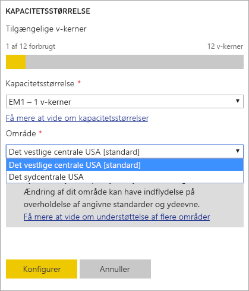
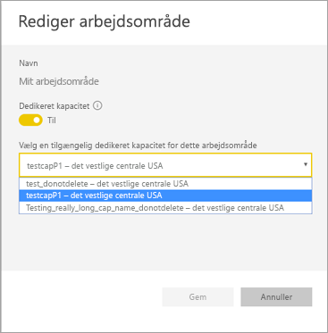

# Konfigurer understøttelse af Multi-Geo til Power BI Premium

Multi-Geo er en Power BI Premium-funktion, som hjælper multinationale kunder med at opfylde regionale, industrispecifikke eller organisatoriske krav til dataopbevaring. Som en Power BI Premium-kunde kan du udrulle indhold til datacentre i andre områder end i Power BI-lejerens lokalområde. Et geografisk område (geografi) kan dække mere end ét område. F.eks. er USA et geografisk område, og det vestlige centrale USA og det sydcentrale USA er områder i USA. Du kan vælge at udrulle indhold til en af de følgende geografiske områder:

- USA
- Canada
- Storbritannien
- Brasilien
- Europa
- Japan
- Indien
- Asien og Stillehavsområdet
- Australien
- Afrika

Multi-Geo fås ikke til Power BI Germany, Power BI China drevet af 21Vianet eller Power BI til myndigheder i USA.

Multi-Geo er nu også tilgængelig i Power BI Embedded. Læs mere i [Multi-Geo-understøttelse i Power BI Embedded](../developer/embedded/embedded-multi-geo.md).

## Aktivér og konfigurer

Nye kapaciteter tilgås ved at aktivere Multi-Geo og vælge et andet område end standardområdet på rullelisten.  Hver tilgængelige kapacitet viser området, hvor den aktuelt er placeret, som f.eks. **det vestlige centrale USA**.

Når du har oprettet kapacitet, forbliver den i det pågældende område, og alle oprettede arbejdsområder får deres indhold lagret i dette område. Du kan overføre arbejdsområder fra ét område til et andet via rullelisten på indstillingsskærmen for arbejdsområde.

Du ser denne meddelelse, så du kan bekræfte ændringen.

Du behøver ikke at nulstille gateway-legitimationsoplysningerne under en overførsel på dette tidspunkt.  Når de er lagret i området Premium-kapacitet, skal du nulstille dem ved overførsel.

Under overførsel kan det være, at visse handlinger mislykkes, såsom udgivelse af nye datasæt eller planlagt opdatering af data.  

Følgende elementer er gemt i Premium-området, når Multi-Geo er aktiveret:

- Modeller (.ABF-filer) til import og Direct Query-datasæt
- Forespørgselscache
- R-billeder

Disse elementer forbliver i lejerens lokalområde:

- Push-datasæt
- Excel-projektmapper
- Dashboard/report metadata: e.g., feltnavne, feltforespørgsler
- Tjenestebusser til gateway-forespørgsler eller planlagt opdatering af jobs
- Tilladelser
- Datasæts legitimationsoplysninger

## Få vist kapacitetsområder

I administrationsportalen kan du få vist alle kapaciteterne for din Power BI-lejer og de områder, hvor de er placeret i øjeblikket.

 

## Skift område for eksisterende indhold

Hvis du vil ændre området for eksisterende indhold, så har du to valgmuligheder.

- Opret endnu en kapacitet, og flyt arbejdsområder. Gratisbrugere oplever ikke nogen nedetid, så længe lejeren har ledige v-kerner.
- Hvis oprettelse af endnu en kapacitet ikke er en mulighed, kan du midlertidigt flytte indhold tilbage til delt kapacitet for Premium. Du behøver ikke ekstra v-kerner, men gratisbrugere vil opleve noget nedetid.

## Flyt indhold ud af Multi-Geo  

Du kan fjerne arbejdsområder fra Multi-Geo-kapacitet på to måder:

- Slet den aktuelle kapacitet, hvor arbejdsområdet er placeret.  Derved flyttes arbejdsområdet tilbage til delt kapacitet i det lokale område.
- Overfør individuelle arbejdsområder tilbage til Premium-kapacitet, der er placeret i den lokale lejer.

Datasæt med store lagerformater bør ikke flyttes fra det område, hvor de blev oprettet. Rapporter, der er baseret på et datasæt i et stort format, kan ikke indlæse datasættet og returnerer fejlen *Modellen kan ikke indlæses*. Flyt datasættet med det store lagerformat tilbage til det oprindelige område for at gøre det tilgængeligt igen.

## Begrænsninger og overvejelser

- Bekræft, at enhver bevægelse, du indleder mellem områder, opfylder alle erhvervs- og myndighedsbestemmelser før igangsætning af dataoverførslen.
- En cachelagret forespørgsel, der er gemt i et fjernområde, forbliver i dette område som inaktive data. Dog kan andre data under overførsel føres frem og tilbage mellem flere geografiske områder.
- Når du flytter data fra ét område til et andet i et Multi-Geo-miljø, kan kildedataene forblive i det område, hvorfra dataene blev flyttet, i op til 30 dage. I denne periode har slutbrugere ikke adgang til dem. De fjernes fra det pågældende område og destrueres i løbet perioden på 30 dage.
- Forespørgselsteksten og forespørgselsresultattrafikken for importerede datamodeller passerer ikke gennem hjemmeområdet. Rapportens metadata kommer stadig fra det eksterne område, og visse DNS-routing-tilstande kan føre trafik ud af området. 
- Funktionen [Dataflow](../transform-model/dataflows/dataflows-introduction-self-service.md) understøttes ikke på Multi-GEO i øjeblikket.
- Flytning af datasæt i store lagerformater fra det område, hvor de blev oprettet, medfører, at rapporter ikke kan indlæse datasættet. Flyt datasættet med det store lagerformat tilbage til det oprindelige område for at gøre det tilgængeligt. 

## Næste trin

- [Hvad er Power BI Premium?](service-premium-what-is.md)
- [Multi-Geo til Power BI Embedded-kapaciteter](../developer/embedded/embedded-multi-geo.md)

Har du flere spørgsmål? [Prøv at spørge Power BI-community'et](https://community.powerbi.com/)