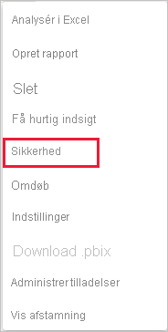
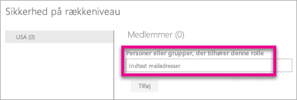
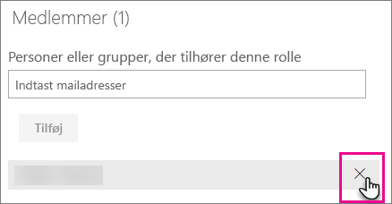
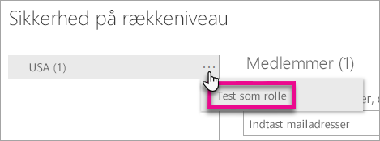
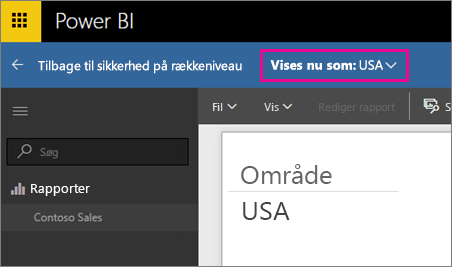

# Sikkerhed på rækkeniveau (RLS) med Power BI

Sikkerhed på rækkeniveau (RLS) med Power BI kan bruges til at begrænse adgang til datakilder for bestemte brugere. Filtre begrænser adgangen til data på rækkeniveau, og du kan definere filtre inden for roller. I Power BI-tjenesten har medlemmer af et arbejdsområde adgang til datasæt i arbejdsområdet. Sikkerhed på rækkeniveau (RLS) begrænser ikke adgangen til data.

Du kan konfigurere sikkerhed på rækkeniveau for datamodeller, der er importeret til Power BI, med Power BI Desktop. Du kan også konfigurere sikkerhed på rækkeniveau for datasæt, der anvender DirectQuery, f.eks. SQL Server. Hvis du vil have Analysis Services- eller Azure Analysis Services-liveforbindelser, skal du konfigurere sikkerhed på rækkeniveau i modellen, ikke i Power BI Desktop. Sikkerhedsindstillingen vises ikke for datasæt med liveforbindelse.

[!INCLUDE [include-short-name](../includes/rls-desktop-define-roles.md)]

Filtrering af sikkerhed på rækkeniveau bruger som standard envejsfiltre, uanset om relationerne er angivet til envejs eller tovejs. Du kan aktivere tovejskrydsfiltrering med sikkerhed på rækkeniveau manuelt ved at vælge relationen og markere afkrydsningsfeltet **Anvend sikkerhedsfilter i begge retninger**. Du skal markere dette afkrydsningsfelt, når du også har implementeret dynamisk sikkerhed på rækkeniveau på serverniveau, hvor sikkerhed på rækkeniveau er baseret på brugernavn eller logon-id.

Du kan finde flere oplysninger på [Tovejskrydsfiltrering ved hjælp af DirectQuery i Power BI Desktop](../transform-model/desktop-bidirectional-filtering.md) og den tekniske artikel [Sikring af modellen for tabellarisk BI-semantik](https://download.microsoft.com/download/D/2/0/D20E1C5F-72EA-4505-9F26-FEF9550EFD44/Securing%20the%20Tabular%20BI%20Semantic%20Model.docx).

[!INCLUDE [include-short-name](../includes/rls-desktop-view-as-roles.md)]

## Administrer sikkerheden for din model

Hvis du vil administrere sikkerheden for din datamodel, skal du benytte følgende fremgangsmåde:

1. Vælg menuen **Flere indstillinger** for et datasæt i Power BI-tjenesten. Denne menu vises, når du peger på navnet på et datasæt, uanset om du vælger det i navigationsmenuen eller på arbejdsområdesiden.

    

    

1. Vælg **Sikkerhed**.

   

Hvis du vælger Sikkerhed, kommer du til RLS-siden, hvor du skal føje medlemmer til en rolle, du har oprettet i Power BI Desktop. Kun ejerne af datasættet får vist indstillingen Sikkerhed. Hvis datasættet er i en gruppe, kan kun administratorer af gruppen se sikkerhedsindstillingen.

Du kan kun oprette eller redigere roller i Power BI Desktop.

## Arbejd med medlemmer

### Tilføj medlemmer

Du kan føje et medlem til rollen ved at skrive mailadressen eller navnet på brugeren eller sikkerhedsgruppen. Du kan ikke tilføje grupper, der er oprettet i Power BI. Du kan tilføje medlemmer, som [ikke er fra organisationen](../guidance/whitepaper-azure-b2b-power-bi.md#data-security-for-external-partners).

Du kan også se, hvor mange medlemmer der er en del af rollen, ud fra tallet i parentes ud for rollenavnet eller ud for Medlemmer.

### Fjern medlemmer

Du kan fjerne medlemmer ved at vælge X ud for medlemmets navn. 

## Validering af rollen i Power BI-tjenesten

Du kan bekræfte, at den rolle, du har defineret, fungerer korrekt, ved at teste rollen.

1. Vælg **Flere indstillinger** (...) ud for rollen.
2. Vælg **Test data som rolle**

Derefter får du vist rapporter, der er tilgængelige for denne rolle. Dashboards vises ikke i denne visning. I sidehovedet vises den rolle, der anvendes.

Du kan teste andre roller eller en kombination af roller ved at vælge **Får nu vist som**.

Du kan vælge at få vist data som en bestemt person, eller du kan vælge en kombination af tilgængelige roller for at bekræfte, om de fungerer.

Hvis du vil vende tilbage til normal visning, skal du vælge **Tilbage til sikkerhed på rækkeniveau**.

[!INCLUDE [include-short-name](../includes/rls-usernames.md)]

## Brug sikkerhed på rækkeniveau med arbejdsområder i Power BI

Hvis du publicerer din Power BI Desktop-rapport i et arbejdsområde i Power BI-tjenesten, anvendes rollerne for medlemmer, som kun har tilladelse til at få vist indhold. Du skal angive, at medlemmerne kan få vist Power BI-indhold, i indstillingerne for arbejdsområdet.

> [!WARNING]
> Hvis du har konfigureret arbejdsområdet, så medlemmerne har redigeringstilladelser, anvendes rollerne for sikkerhed på rækkeniveau ikke for dem. Brugerne kan se alle dataene.

[!INCLUDE [include-short-name](../includes/rls-limitations.md)]

[!INCLUDE [include-short-name](../includes/rls-faq.md)]

## Næste trin

- [Begræns dataadgang med sikkerhed på rækkeniveau (RLS) for Power BI Desktop](../create-reports/desktop-rls.md)
- [Sikkerhed på rækkeniveau (RLS) i Power BI Desktop](../guidance/rls-guidance.md)
- Har du spørgsmål? [Prøv at spørge Power BI-community'et](https://community.powerbi.com/)
- Forslag? [Få ideer til at forbedre Power BI](https://ideas.powerbi.com/)
