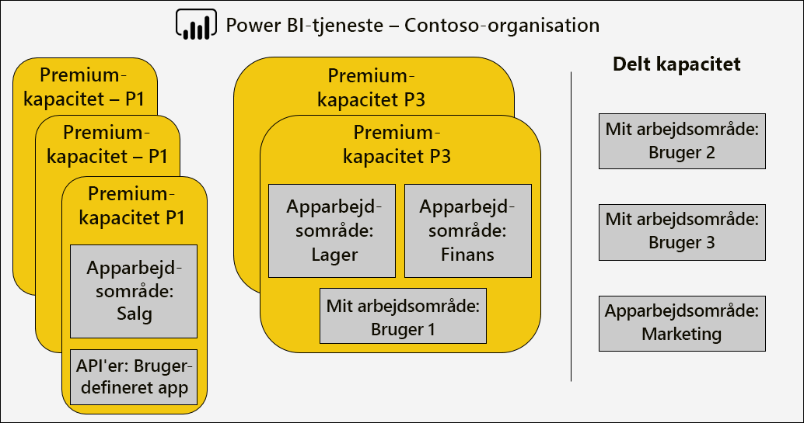
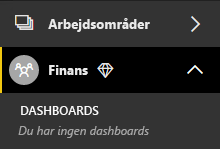
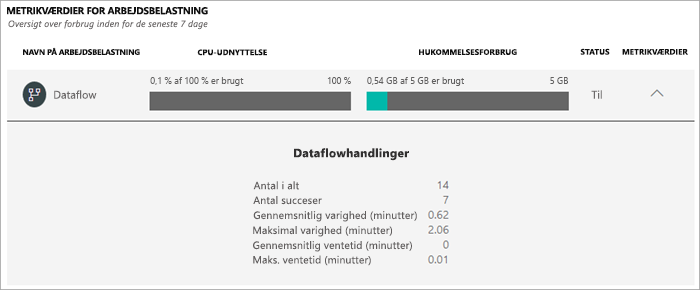
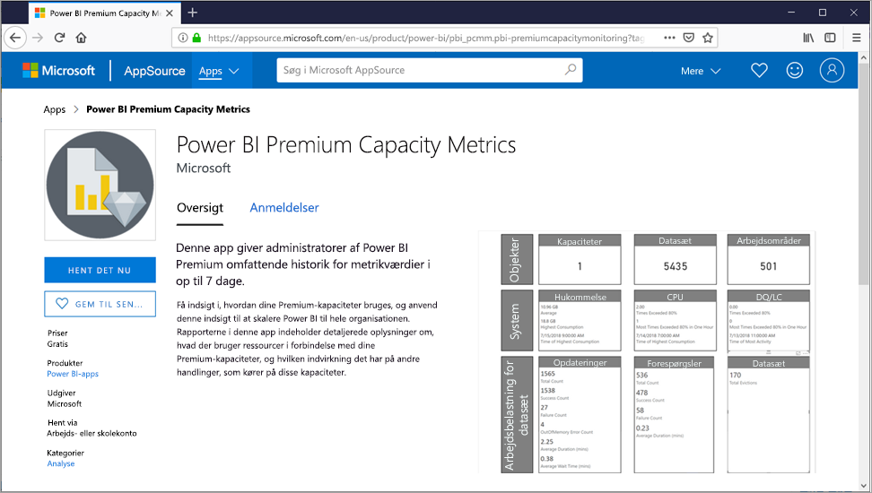

# Administration af Premium-kapaciteter

Administration af Power BI Premium omfatter oprettelse, administration og overvågning af Premium-kapaciteter. Denne artikel indeholder en oversigt over kapaciteter. Hvis du vil have en trinvis vejledning, skal du se [Konfigurer og administrer kapaciteter](service-admin-premium-manage.md).

## Oprettelse og administration af kapaciteter

På siden **Kapacitetsindstillinger** på Power BI-administrationsportalen vises antallet af købte v-kerner og tilgængelige Premium-kapaciteter. På siden kan globale administratorer eller administratorer af Power BI-tjenesten oprette Premium-kapaciteter fra tilgængelige v-kerner eller redigere eksisterende Premium-kapaciteter.

Når en Premium-kapacitet oprettes, skal administratoren definere:

- Kapacitetsnavn (entydigt i lejeren).
- Kapacitetsadministratorer.
- Kapacitetsstørrelse.
- Område for dataopbevaring.

Der skal være udpeget mindst én kapacitetsadministrator. Brugere, der er udpeget som kapacitetsadministratorer, kan:

- tildele arbejdsområder til kapaciteten.
- administrere brugertilladelser for at tilføje flere kapacitetsadministratorer eller brugere med tildelingstilladelser (så de kan tildele arbejdsområder til kapaciteten).
- administrere arbejdsbelastninger for at konfigurere det maksimale hukommelsesforbrug for sideinddelte rapporter og arbejdsbelastninger for dataflow.
- genstarte kapaciteten for at nulstille alle handlinger i tilfælde af, at systemet overbelastes.

Kapacitetsadministratorer kan ikke få adgang til indhold i arbejdsområdet, medmindre der udtrykkeligt er tildelt tilladelser til arbejdsområdet. De har heller ikke adgang til alle områder i Power BI-administration (medmindre det udtrykkeligt er tildelt), f.eks. forbrugsdata, overvågningslogge eller lejerindstillinger. Kapacitetsadministratorer har heller ikke tilladelse til at konfigurere nye kapaciteter eller skalere eksisterende kapaciteter. Administratorer bliver tildelt pr. kapacitet, hvilket sikrer, at de kun kan få vist og administrere de kapaciteter, som de er blevet tildelt.

Kapacitetsstørrelsen vælges på en tilgængelig liste over SKU-muligheder, som er begrænset af antallet af tilgængelige v-kerner i puljen. Det er muligt at oprette flere kapaciteter fra puljen, som kan købes fra en eller flere købte SKU'er. En P3-SKU (32 v-kerner) kan f.eks. bruges til at oprette tre kapaciteter: én P2 (16 v-kerner) og to P1 (2 x 8 v-kerner). Der kan opnås forbedret ydeevne og skalering ved at oprette mindre kapaciteter, som beskrevet i artiklen [Optimering af Premium-kapaciteter](service-premium-capacity-optimize.md). På følgende billede vises et eksempel på konfiguration af den fiktive virksomhed Contoso bestående af fem Premium-kapaciteter (3 x P1 og 2 x P3), som hver især indeholder arbejdsområder herunder flere arbejdsområder i en delt kapacitet.

En Premium-kapacitet kan tildeles et andet område end Power BI-lejerens hjemmeområde – også kendt som flere geografiske områder. Flere geografiske områder giver dig administrativ kontrol over, hvilke datacentre dit Power BI-indhold findes på inden for definerede geografiske områder. En multi-geo-installation kommer til sin ret i forbindelse med overholdelse af angivne standarder i store virksomheder eller regeringer, fremfor i forbindelse med ydeevne og skalering. Indlæsning af rapporter og dashboards omfatter stadig anmodninger til det lokale område for metadata. Du kan få mere at vide under [Multi-Geo-understøttelse i Power BI Premium](service-admin-premium-multi-geo.md).

Administratorer af Power BI-tjenesten og globale administratorer kan redigere Premium-kapaciteter. De kan:

- ændre kapacitetsstørrelsen for at skalere ressourcer op eller ned.
- tilføje eller fjerne kapacitetsadministratorer.
- tilføje eller fjerne brugere, der har tildelingstilladelser.
- tilføje eller fjerne yderligere arbejdsbelastninger.
- skifte område.

Tildelingstilladelser er påkrævede for at kunne tildele et arbejdsområde til en bestemt Premium-kapacitet. Tilladelserne kan tildeles til hele organisationen, bestemte brugere eller grupper.

Premium-kapaciteter understøtter som standard kun de arbejdsbelastninger, der er tilknyttet kørende Power BI-forespørgsler. Premium-kapaciteter understøtter også yderligere arbejdsbelastninger: **Kunstig intelligens (Cognitive Services)** , **sideinddelte rapporter** og **dataflow**. Hver arbejdsbelastning kræver, at den maksimale hukommelse (som en procentdel af den samlede tilgængelige hukommelse), der kan bruges af arbejdsbelastningen, konfigureres. Det er vigtigt at forstå, at forøgelse af de maksimale hukommelsesallokeringer kan påvirke antallet af aktive modeller, der kan hostes og gennemløbet af opdateringer. 

Hukommelse allokeres dynamisk til dataflow, men den allokeres statisk til sideinddelte rapporter. Årsagen til statisk allokering af den maksimale hukommelse er, at sideinddelte rapporter kører i et sikret område i kapaciteten. Man bør konfigurere hukommelse til sideinddelte rapporter med omhu, da det reducerer den tilgængelige hukommelse til indlæsning af modeller. Du kan få mere at vide ved at se [Standardindstillingerne for hukommelse](service-admin-premium-workloads.md#default-memory-settings).

Det er muligt at slette en Premium-kapacitet, og det medfører ikke sletning af de tilhørende arbejdsområder og indhold. I stedet flyttes tildelte arbejdsområder til en delt kapacitet. Når Premium-kapaciteten oprettes i et andet område, flyttes arbejdsområdet til en delt kapacitet i hjemmeområdet.

### Tildeling af arbejdsområder til kapaciteter

Arbejdsområder kan tildeles til en Premium-kapacitet på Power BI-administrationsportalen eller i ruden **Arbejdsområde** for et arbejdsområde.

Kapacitetsadministratorer samt globale administratorer eller administratorer af Power BI-tjenesten kan massetildele arbejdsområder på Power BI-administrationsportalen. Massetildelingen kan gælde for:

- **Arbejdsområder efter brugere** – Alle arbejdsområder, der ejes af disse brugere, herunder personlige arbejdsområder, tildeles til Premium-kapaciteten. Dette omfatter tildeling påny af arbejdsområder, når de er allerede er tildelt til en anden Premium-kapacitet. Herudover tildeles brugerne også tilladelser til arbejdsområdetildelinger.

- **Specifikke arbejdsområder**
- **Hele organisationens arbejdsområder** – Alle arbejdsområder, herunder personlige arbejdsområder, tildeles til Premium-kapaciteten. Alle aktuelle og fremtidige brugere tildeles også tilladelser til arbejdsområdetildelinger. Denne tilgang anbefales ikke. Der foretrækkes en mere målrettet tilgang.

Et arbejdsområde kan føjes til en Premium-kapacitet ved hjælp af ruden **Arbejdsområde**, hvis brugeren både er arbejdsområdeadministrator og har tildelingstilladelser.

Arbejdsområdeadministratorer kan fjerne et arbejdsområde fra en kapacitet (til delt kapacitet) uden at have tildelingstilladelser. Fjernelse af arbejdsområder fra dedikerede kapaciteter flytter effektivt arbejdsområdet til en delt kapacitet. Bemærk, at det kan have negative konsekvenser at fjerne et arbejdsområde fra en Premium-kapacitet, da delt indhold f.eks. kan blive utilgængeligt for brugere med en Power BI Free-licens, eller en planlagt opdatering kan blive suspenderet, når brugerne når det tilladte forbrug, der er understøttet af delte kapaciteter.

I Power BI-tjenesten er et arbejdsområde, der er tildelt til en Premium-kapacitet, markeret med et rombeikon ud for navnet på arbejdsområdet.

## Overvågning af kapaciteter

Overvågning af Premium-kapaciteter giver administratorer en forståelse af, hvordan kapaciteterne kører. Kapaciteter kan overvåges ved hjælp af Power BI-administrationsportalen eller appen **Power BI Premium Capacity Metrics** (Power BI).

### Power BI-administrationsportal

På administrationsportalen kan du for hver kapacitet se opsummerede målepunkter for kapaciteten og hver enkelt aktiverede arbejdsbelastning under fanen **Tilstand**. Målepunkterne viser et gennemsnit for de sidste syv dage.  

På kapacitetsniveau er målepunkterne kumulative for alle aktiverede arbejdsbelastninger. Der findes følgende målepunkter:

- **CPU-FORBRUG** – Angiver det gennemsnitlige CPU-forbrug som en procentdel af den samlede tilgængelige CPU for kapaciteten.  
- **HUKOMMELSESFORBRUG** – Angiver det gennemsnitlige hukommelsesforbrug (i GB) som en samlet del af den tilgængelige hukommelse for kapaciteten. 

For hver aktiverede arbejdsbelastning angives der CPU-forbrug og hukommelsesforbrug samt et antal specifikke målepunkter for arbejdsbelastning. For arbejdsbelastningen for dataflow viser **Samlet antal** f.eks. det samlede antal opdateringer for hvert dataflow, og **Gennemsnitlig varighed** viser den gennemsnitlige varighed for opdateringen af dataflowet.

Du kan få mere at vide om alle tilgængelige målepunkter for hver arbejdsbelastning under [Overvåg kapaciteter på administrationsportalen](service-admin-premium-monitor-portal.md).

Overvågningsfunktionaliteten på Power BI-administrationsportalen er designet til at give et hurtigt overblik over vigtige målepunkter for kapaciteter. Hvis du vil have mere detaljeret overvågning, anbefales det, at du bruger appen **Power BI Premium Capacity Metrics**.

### Appen Power BI Premium Capacity Metrics

Appen [Power BI Premium Capacity Metrics](https://appsource.microsoft.com/product/power-bi/pbi_pcmm.pbi-premiumcapacitymonitoring?tab=Overview) er en Power BI-app, der er tilgængelig for kapacitetsadministratorer og installeres på samme måde som en hvilken som helst anden Power BI-app. Den indeholder et dashboard og en rapport.

Når appen åbnes, indlæses dashboardet og viser de mange felter, der udtrykker en samlet visning over alle de kapaciteter, som brugeren er kapacitetsadministrator for. Dashboardlayoutet indeholder fem hovedafsnit:

- **Oversigt** – appversion samt antallet af kapaciteter og arbejdsområder
- **Systemoplysninger** – hukommelse og CPU-målepunkter
- **Oplysninger om datasæt** – antallet af datasæt, DQ/LC, opdatering og målepunkter for forespørgsler
- **Oplysninger om dataflow** – antallet af dataflow og målepunkter for datasæt
- **Oplysninger om sideinddelt rapport** – opdater og få vist målepunkter

Du kan få adgang til den underliggende rapport, som felterne på dashboardet er fastgjort fra, ved at klikke på et vilkårligt felt på dashboardet. Den giver et mere detaljeret overblik over hvert af dashboardafsnittene og understøtter interaktiv filtrering. 

Du kan filtrere ved at angive udsnit efter datointerval, kapacitet, arbejdsområde og arbejdsbelastning (rapport, datasæt, dataflow) og ved at vælge elementer i rapportvisualiseringer for at filtrere på tværs af rapportsiden. Tværgående filtrering er en effektiv teknik til at indsnævre til bestemte tidsperioder, kapaciteter, arbejdsområder, datasæt, osv., og det kan være meget nyttigt, når du diagnosticerer den underliggende årsag.

Du kan finde detaljerede oplysninger om målepunkter for dashboard og rapporter i appen under [Overvåg Premium-kapaciteter med appen](service-admin-premium-monitor-capacity.md).

### Fortolkning af målepunkter

Målepunkter skal overvåges for at oprette en grundlæggende forståelse af ressourceforbruget og arbejdsbelastningsaktiviteterne. Hvis kapaciteten bliver langsom, er det vigtigt at forstå, hvilke målepunkter der skal overvåges og de konklusioner, du kan drage.

Ideelt set bør forespørgsler være fuldført inden for et sekund for at levere dynamiske oplevelser til rapportbrugerne og muliggøre et højere gennemløb af forespørgsler. Det er som regel mindre væsentligt, når processer i baggrunden – herunder opdateringer – tager længere tid at fuldføre.

Langsomme rapporter kan generelt være en indikation af en overbebyrdet kapacitet. Når rapporter ikke indlæses, er det en indikation af en overbebyrdet kapacitet. I begge situationer kan hovedårsagen henføres til flere forskellige faktorer, herunder:

- **Mislykkede forespørgsler** angiver i høj grad en belastning af hukommelsen, og at en model ikke kunne indlæses i hukommelsen. Power BI-tjenesten vil forsøge at indlæse en model i 30 sekunder, før der opstår en fejl.

- **Overdrevne ventetider for forespørgsler** kan skyldes flere forskellige årsager:
  - Behovet for, at Power BI-tjenesten først fjerner en eller flere modeller og derefter indlæser den model, der skal forespørges, igen (husk, at høje fjernelsesrater for datasæt alene ikke indikerer overbelastning af kapaciteten, medmindre de ledsages af lange ventetider for forespørgsler, hvilket indikerer, at en hukommelsesudskiftning finder sted).
  - Indlæsningstider for modeller (især ventetid i forbindelse med at indlæse en stor model i hukommelsen).
  - Langvarige forespørgsler.
  - For mange LC\DQ-forbindelser (overskrider kapacitetsgrænserne).
  - CPU-mætning.
  - Komplekse rapportdesign med et stort antal visualiseringer på en side (husk, at hver visualisering er en forespørgsel).

- **Lange varigheder af forespørgsler** kan indikere, at modeldesignet ikke er optimeret, især når flere datasæt er aktive i en kapacitet, og kun ét datasæt genererer lange varigheder af forespørgsler. Dette tyder på, at kapaciteten ikke har tilstrækkeligt med ressourcer, og at det pågældende datasæt ikke er optimalt eller blot langsomt. Lange forespørgsler kan være problematiske, da de kan blokere adgang til ressourcer, der kræves af andre processer.
- **Lange ventetider for opdateringer** indikerer utilstrækkelig hukommelse på grund af mange aktive modeller, der bruger for meget hukommelse, eller at en problematisk opdatering blokerer andre opdateringer (overstiger grænserne for parallelle opdateringer).

Du kan få en mere detaljeret beskrivelse af, hvordan du bruger målepunkter, i artiklen [Optimering af Premium-kapaciteter](service-premium-capacity-optimize.md).

## Referencer

Denne artikel er skrevet af Peter Myers, som er Data Platform MVP og uafhængig BI-ekspert hos [Bitwise Solutions](https://www.bitwisesolutions.com.au/).

## Næste trin

> [!div class="nextstepaction"]
> [Optimering af Premium-kapaciteter](service-premium-capacity-optimize.md)   
> [!div class="nextstepaction"]
> [Konfigurer arbejdsbelastninger i en Premium-kapacitet](service-admin-premium-workloads.md)   

Har du flere spørgsmål? [Prøv at spørge Power BI-community'et](https://community.powerbi.com/)

