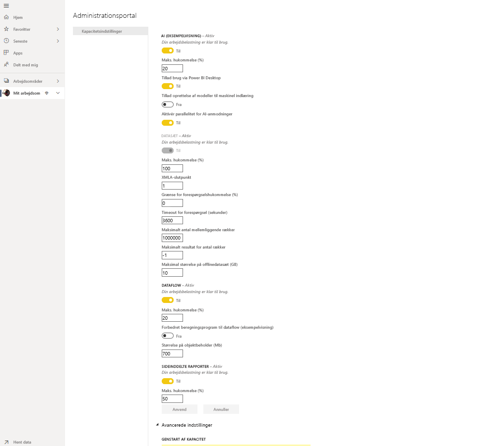
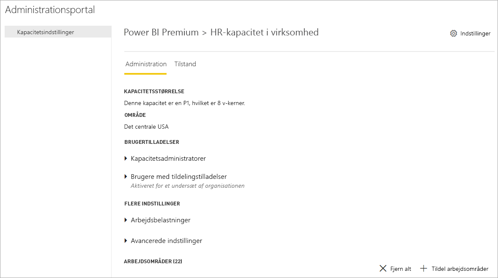
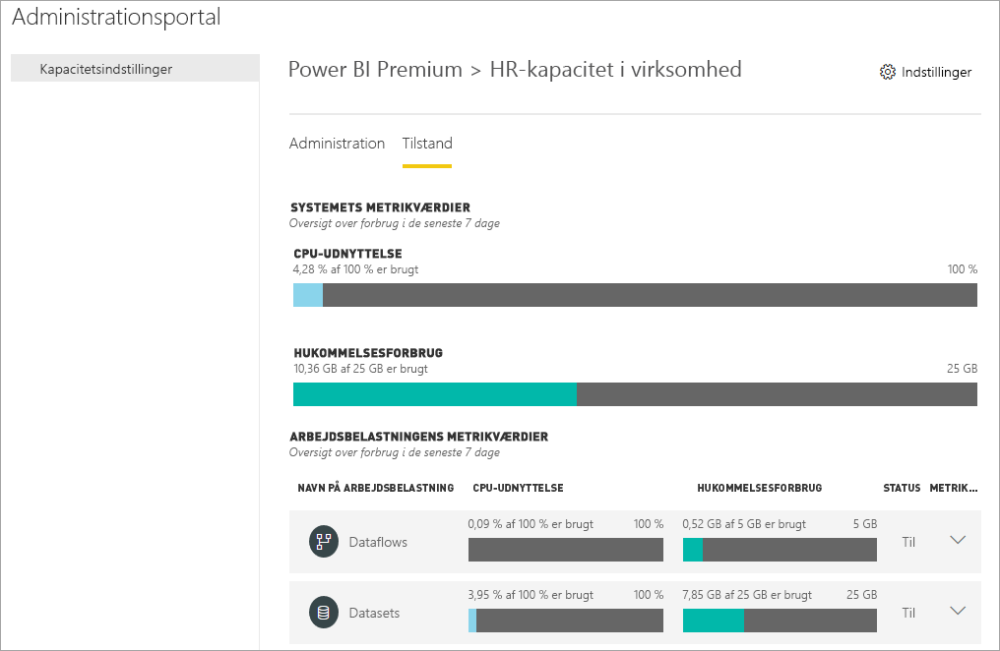
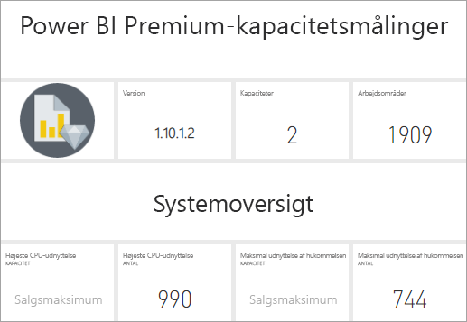
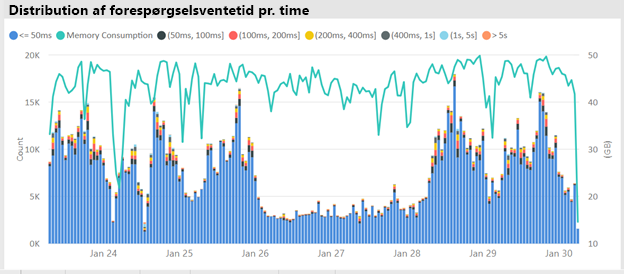
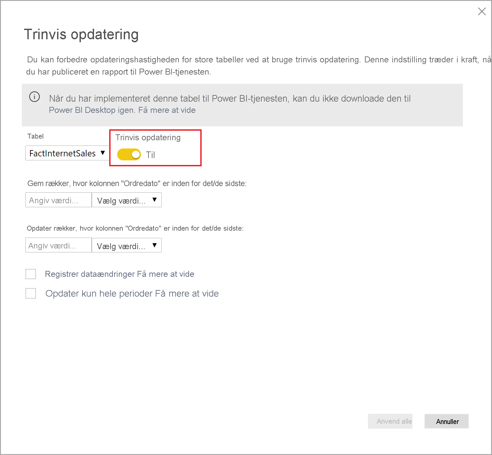
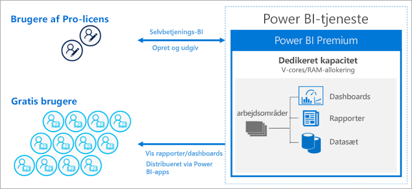
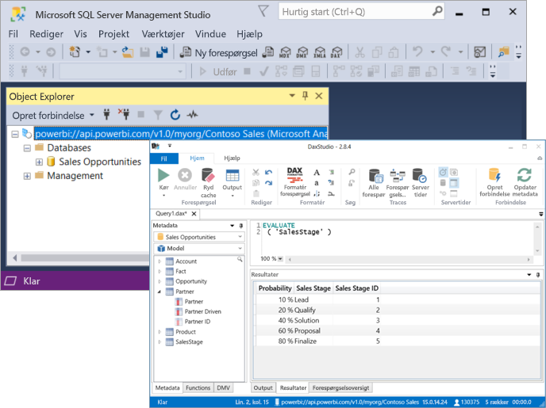

# Hvad er Power BI Premium?

Du kan bruge Power BI Premium til at få adgang til funktioner og egenskaber, der kun er tilgængelige i Premium, og som giver større skaleringsmuligheder og ydeevne til Power BI-indhold i din organisation. Power BI Premium gør det muligt for flere brugere i din organisation at få mest muligt ud af Power BI med bedre ydeevne og svartid. Med Power BI Premium får du og din organisations brugere f.eks. adgang til følgende funktionalitet:

> [!div class="checklist"]
> * Større skaleringsmuligheder og ydeevne for dine Power BI-rapporter
> * Fleksibilitet til at licensere efter kapacitet
> * De bedste funktioner til datavisualisering og udtræk af indsigt, f. eks. AI-baseret analyse, dataflow, der kan sammensættes og genbruges, samt sideinddelte rapporter
> * Foren selvbetjenings- og virksomheds-BI med en række Premium-funktioner, der understøtter tungere arbejdsprocesser og kræver skalering på virksomhedsniveau
> * Indbygget licens, så BI kan udvides i det lokale miljø med Power BI-rapportserver
> * Understøttelse af dataopbevaring efter område (Multi-Geo) og kundeadministrerede krypteringsnøgler til inaktive data (BYOK)
> * Mulighed for at dele Power BI indhold med alle (også uden for din organisation) uden at købe en licens pr. bruger

 

I denne artikel introduceres vigtige funktioner i Power BI Premium. Hvor det er nødvendigt, leveres der links til flere artikler med mere detaljerede oplysninger. Du kan finde flere oplysninger om Power BI Pro og Power BI Premium i afsnittet _Sammenligning af Power BI-funktioner_ under [Power BI-priser](https://powerbi.microsoft.com/pricing/).

## Power BI Premium Generation 2 (prøveversion)

Power BI Premium har for nylig udgivet en ny version af Power BI Premium, **Power BI Premium Generation 2**, der også kaldes **Premium Gen2**. Premium Gen2 fås i øjeblikket som prøveversion og er tilgængelig for de Premium-abonnenter, der skal bruges i prøveperioden. Du kan vælge at bruge den oprindelige version af Premium eller skifte til at bruge Premium Gen2. Du kan kun bruge én af dem til din Premium-kapacitet.

Premium Gen2 omfatter følgende opdateringer eller forbedrede oplevelser:

* Mulighed for **Premium pr. bruger**-licens ud over efter kapacitet.

* Forbedret **ydeevne** på en hvilken som helst kapacitetsstørrelse når som helst: Analysehandlinger kører op til 16X hurtigere på Premium Gen2. Handlinger udføres altid med den højeste hastighed og kører ikke langsommere, når belastningen af kapaciteten nærmer sig kapacitetsgrænserne.

* **Større skalering**:
    * *Ingen grænser* for opdateringssamtidighed, så du behøver ikke længere at spore tidsplaner for datasæt, der opdateres på din kapacitet
    * Færre hukommelsesbegrænsninger
    * Komplet adskillelse mellem rapportinteraktion og planlagte opdateringer

* **Forbedrede målepunkter** med tydelige og normaliserede data for kapacitetsudnyttelse, som kun er afhængige af kompleksiteten af de analyser, som kapaciteten udfører, og ikke af dens størrelse, belastningsniveauet på systemet under udførelse af analyse eller andre faktorer. De forbedrede målepunkter tydeliggør brugsanalyse, budgetplanlægning, tilbageførsler samt behovet for opgradering med indbygget rapportering. Forbedrede metrikværdier bliver tilgængelige senere i prøveperioden. Kunder, der ønsker adgang til metrikværdier for udnyttelse inden for de sidste 7 dage, kan gøre dette ved at kontakte kundesupport. 

* **Autoskalering** muliggør *automatisk tilføjelse* af én v-kerne ad gangen i 24 timers-perioder, når belastningen på kapaciteten overskrider grænserne, hvilket forhindrer forsinkelser. V-kerner fjernes automatisk, når der registreres inaktiv tid. Yderligere v-kerner faktureres til dit Azure-abonnement på betalt efter forbrug-basis. Autoskalering er tilgængelig i løbet af prøveperioden. 

* **Reducerede administrationsomkostninger** med proaktive og konfigurerbare administratormeddelelser om kapacitetsforbrug og belastningsforøgelser.

### Brug af Premium Gen2

Aktivér Premium Gen2 for at drage fordel af opdateringerne. Benyt følgende fremgangsmåde for at aktivere Premium Gen2:

1. Gå til **Kapacitetsindstillinger** i administrationsportalen.
2. Vælg **Power BI Premium**.
3. Der vises et afsnit med titlen **Premium Generation 2 (prøveversion)** , og i dette afsnit er der en skyder, der aktiverer Premium Generation 2 (prøveversion). 
4. Flyt skyderen for at **Aktiveret**.

På følgende billede kan du se, hvordan du aktiverer Premium Gen2. 

 

### Kendte begrænsninger i Premium Gen2

Følgende kendte begrænsninger gælder i øjeblikket for Premium Gen2:

1.    Premium Gen2-kapacitetsudnyttelse kan ikke spores i målepunktsappen.

2.    Indstillinger for Premium Gen2-kapacitet for bestemte arbejdsbelastninger er endnu ikke synlige på siden med indstillinger for Premium Gen2-kapacitet på administrationsportalen. Hvis du vil ændre indstillingerne, skal du overføre kapaciteten til den oprindelige version af Premium, ændre indstillingerne og derefter angive kapaciteten til at bruge Premium Gen2 en gang til. Indstillinger for allokering af hukommelse gælder ikke for Premium Gen2-kapaciteter.

3.  Hvis du bruger XMLA på Premium Gen2, skal du sørge for, at du bruger de nyeste versioner af [datamodellerings- og administrationsværktøjer](service-premium-connect-tools.md#data-modeling-and-management-tools). 

4.  Funktioner til analysetjenester i Premium Gen2 understøttes kun på de nyeste klientbiblioteker. Anslåede udgivelsesdatoer for afhængige værktøjer, der understøtter dette krav, er:

    |Værktøj|Påkrævet minimumversion|Anslået udgivelsesdato|
    |---|---|---|
    |SQL Server Management Studio (SSMS)|18.8|8\. december 2020|
    |SQL Server Data Tools (SSDT)|2.9.15|Generel tilgængelighed – 30. november 2020|
    | AS PowerShell| Større end 21.1.18229|26. november 2020|

## Abonnementer og licenser

Power BI Premium er et Microsoft 365-abonnement på lejerniveau, der er tilgængeligt i to SKU-serier (lagerenheder):

- **P**-SKU'er (P1-P5) til integrering og virksomhedsfunktioner kræver en månedlig eller årlig forpligtelse, faktureres månedsvis og indeholder en licens til at installere Power BI-rapportserveren i det lokale miljø.

- **EM**-SKU'er (EM1-EM3) til integrering i _organisationer_ kræver en årlig forpligtelse og faktureres månedsvis. EM1- og EM2-SKU'er er kun tilgængelige via volumenlicensplaner. Du kan ikke købe dem direkte.

### Indkøb

Power BI Premium-abonnementer købes af administratorer i Microsoft 365 Administration. Kun globale administratorer eller faktureringsadministratorer kan købe SKU'er. Når de er blevet købt, modtager lejeren et tilsvarende antal v-kerner, som kan tildeles til kapaciteter, der kaldes *gruppering af v-kerner*. Køb af en P3-SKU giver f.eks. lejeren 32 v-kerner. Du kan finde flere oplysninger under [Sådan køber du Power BI Premium](service-admin-premium-purchase.md).

#### Power BI Premium pr. bruger (prøveversion)

Power BI **Premium pr. bruger** giver organisationer mulighed for at give Premium-funktioner i licens pr. bruger. Premium pr. bruger omfatter alle Power BI Pro-licensfunktioner og tilføjer funktioner som sideinddelte rapporter, kunstig intelligens og anden funktionalitet, der kun er tilgængelig til Premium-abonnenter. Premium pr. bruger er i øjeblikket tilgængelig som prøveversion. Du kan finde flere oplysninger om Premium pr. bruger, herunder en sammenligning af funktioner og andre oplysninger om udgivelsen af prøveversionen, i artiklen [Ofte stillede spørgsmål om Power BI Premium pr. bruger (prøveversion)](service-premium-per-user-faq.md) (artiklen er muligvis kun tilgængelig på engelsk). 

## Reserverede kapaciteter

Med Power BI Premium får du *reserverede kapaciteter*. I modsætning til en delt kapacitet, hvor arbejdsbelastninger kører på databehandlingsressourcer, der deles med andre kunder, skal en reserveret kapacitet udelukkende bruges af en organisation. Den er isoleret og har dedikerede databehandlingsressourcer, som sikrer en pålidelig og konsekvent ydeevne for indhold, der hostes. Bemærk, at behandlingen af følgende typer Power BI-indhold gemmes i en delt kapacitet i stedet for din reserverede kapacitet:

* Excel-projektmapper (medmindre data importeres først i Power BI Desktop)
* [Send datasæt via push](/rest/api/power-bi/pushdatasets)
* [Streamingdatasæt](../connect-data/service-real-time-streaming.md#set-up-your-real-time-streaming-dataset-in-power-bi)
* [Spørgsmål og svar](../create-reports/power-bi-tutorial-q-and-a.md)

Der er placeret arbejdsområder i kapaciteter. Hver bruger af Power BI har et personligt arbejdsområde, der er kendt som **Mit arbejdsområde**. Der kan oprettes flere arbejdsområder – kendt som **arbejdsområder** – for at muliggøre samarbejde. Arbejdsområder, herunder personlige arbejdsområder, oprettes som standard i den delte kapacitet. Når du har Premium-kapaciteter, kan både Mine arbejdsområder og arbejdsområder tildeles til Premium-kapaciteter.

Kapacitetsadministratorer får automatisk deres egne arbejdsområder tildelt til Premium-kapaciteter.

### Opdateringer til Premium Gen2 (prøveversion)

Premium gen 2-noder bruger ikke længere en reserveret infrastruktur. Tjenesten sørger i stedet for, at der er tilstrækkelig beregningskraft til hver kørende arbejdsbelastning ved at tildele tilstrækkeligt mange ressourcer til en delt pulje af beregningsnoder med høj kapacitet.

### Kapacitetsnoder

Som beskrevet i afsnittet [Abonnementer og licenser](#subscriptions-and-licensing) er der to Power BI Premium SKU-serier: **EM** og **P**. Alle Power BI Premium-SKU'er er tilgængelige som *kapacitetsnoder*, som hver især repræsenterer en bestemt mængde ressourcer, der består af processor, hukommelse og lager. Ud over ressourcer har hver SKU en driftsmæssig begrænsning for antallet af DirectQuery-forbindelser og direkte forbindelser pr. sekund samt antallet af parallelle modelopdateringer.

Behandling opnås ved et angivet antal v-kerner, der er ligeligt fordelt mellem backend og frontend.

De **virtuelle back end-kerner** er ansvarlige for Power BI-kernefunktionalitet, herunder behandling af forespørgsler, administration af cache, kørsel af R-tjenester, opdatering af model og gengivelse af rapporter og billeder på serversiden. Backend-v-kerner tildeles en fast mængde hukommelse, der primært bruges til at hoste modeller, som også kaldes aktive datasæt.

**Frontend-v-kerner** er ansvarlige for webtjenesten, dashboardet og dokumentstyringen af rapporter, administration af adgangsrettigheder, planlægning, API'er, uploads og downloads og generelt alt, hvad der er relateret til brugeroplevelsen.

Lagerpladsen er angivet til **100 TB pr. kapacitetsnode**.

Ressourcerne og grænserne for hver Premium-SKU (og A-SKU'er i en tilsvarende størrelse) er beskrevet i følgende tabel:

| Kapacitetsnoder | V-kerner i alt | Backend-v-kerner | RAM (GB) | Frontend-v-kerner | DirectQuery/direkte forbindelser (pr. sek.) | Parallel opdatering af modeller |
| --- | --- | --- | --- | --- | --- | --- |
| EM1/A1 | 1 | 0,5 | 3 | 0,5 | 3,75 | 1 |
| EM2/A2 | 2 | 1 | 5 | 1 | 7,5 | 2 |
| EM3/A3 | 4 | 2 | 10 | 2 | 15 | 3 |
| P1 | 8 | 4 | 25 | 4 | 30 | 6 |
| P2 | 16 | 8 | 50 | 8 | 60 | 12 |
| P3 | 32 | 16 | 100 | 16 | 120 | 24 |
| P4 [1](#limit)| 64 | 32 | 200 | 32 | 240 | 48 |
| P5 [1](#limit)| 128 | 64 | 400 | 64 | 480 | 96 |
| | | | | | | |

<a name="limit">1</a> – Kun efter speciel anmodning. For meget store modeller, der er større end 100 GB.

>[!NOTE]
>Det kan være en fordel at bruge en enkelt større SKU (f.eks. én P2-SKU) til at kombinere mindre SKU'er (f.eks. to P1-SKU'er). Du kan f.eks. bruge større modeller og opnå bedre parallelitet med P2.

#### Opdateringer til Premium Gen2 (prøveversion)

Med **Premium Gen2** er den mængde hukommelse, der er tilgængelig på hver nodestørrelse, angivet til grænsen for hukommelsesforbrug for en enkelt artefakt og ikke for det samlede hukommelsesforbrug. I Premium Gen2 er størrelsesgrænsen for et enkelt datasæt f.eks. 25 GB i forhold til det oprindelige Premium, hvor det samlede hukommelsesforbrug for de datasæt, der håndteres på samme tid, er begrænset til 25 GB.

### Kapacitetsarbejdsbelastninger

Kapacitetarbejdsbelastninger er tjenester, som gøres tilgængelige for brugere. Som standard understøtter Premium- og Azure-kapaciteter kun den datasætarbejdsbelastning, der er knyttet til kørende Power BI-forespørgsler. Arbejdsbelastningen for datasæt kan ikke deaktiveres. Yderligere arbejdsbelastninger kan aktiveres for [AI (Cognitive Services)](https://powerbi.microsoft.com/blog/easy-access-to-ai-in-power-bi-preview/), [Dataflows](../transform-model/dataflows/dataflows-introduction-self-service.md) og [Sideinddelte rapporter](../paginated-reports/paginated-reports-save-to-power-bi-service.md). Disse arbejdsbelastninger understøttes kun i Premium-abonnementer. 

Hver ekstra arbejdsbelastning gør det muligt at konfigurere den maksimale hukommelse (som en procentdel af den samlede kapacitetshukommelse), der kan bruges af arbejdsbelastningen. Standardværdier for maksimumhukommelse bestemmes af SKU. Du kan maksimere din kapacitets tilgængelige ressourcer ved at aktivere disse yderligere arbejdsbelastninger, når de bruges. Og du kan kun ændre hukommelsesindstillinger, når du har bestemt, at standardindstillingerne ikke opfylder dine krav til kapacitetsressourcer. Arbejdsbelastninger kan aktiveres og konfigureres for en kapacitet af kapacitetsadministratorer ved hjælp af **Kapacitetsindstillinger** på [administrationsportalen](service-admin-portal.md) eller ved hjælp af [REST-API'er for kapaciteter](/rest/api/power-bi/capacities).  

Du kan få mere at vide under [Konfigurer arbejdsbelastninger i en Premium-kapacitet](service-admin-premium-workloads.md). 

### Sådan fungerer kapaciteter

Power BI-tjenesten udnytter hele tiden kapacitetsressourcerne bedst muligt uden at overskride de grænser, der er pålagt kapaciteten.

Kapacitetshandlinger er klassificeret som enten *interaktive* eller *baggrundshandlinger*. Interaktive handlinger omfatter gengivelse af anmodninger og svare på Brugerinteraktioner (filtrering, spørgsmål og svar-forespørgsel, osv.). Handlinger i baggrunden omfatter opdateringer af dataflows og importmodeller samt cachelagring af dashboardforespørgsler.

Det er vigtigt at forstå, at interaktive handlinger altid går forud for handlinger i baggrunden for at sikre den bedst mulige brugeroplevelse. Hvis der ikke er tilstrækkelige ressourcer, føjes handlinger i baggrunden til en ventende kø, indtil ressourcerne frigøres. Handlinger i baggrunden, f.eks. opdateringer af datasæt, kan afbrydes midt i processen af Power BI-tjenesten, føjes til en kø og prøves igen senere.

Importmodeller skal være fuldt indlæst i hukommelsen, så de kan forespørges eller opdateres. Power BI-tjenesten bruger avancerede algoritmer til at administrere hukommelsesforbruget forholdsvist, men i sjældne tilfælde kan kapaciteten blive overbelastet, hvis der ikke er tilstrækkelige ressourcer til at opfylde kundernes krav i realtid. Selvom det er muligt for en kapacitet at gemme mange vigtige modeller på et fast lager (op til 100 TB pr. Premium-kapacitet), er alle modeller ikke nødvendigvis placeret i hukommelsen samtidigt, ellers ville størrelsen af datasættet i hukommelsen hurtigt overstige grænsen for kapacitetshukommelsen. Ud over den hukommelse, der kræves for at indlæse datasættene, er der behov for ekstra hukommelse til at udføre forespørgsler og opdateringshandlinger.

Importmodeller indlæses derfor i hukommelsen og fjernes derfra i henhold til brugen. En importmodel indlæses, når den forespørges (interaktiv handling), eller hvis den skal opdateres (handling i baggrunden).

Sletning af en model fra hukommelsen kaldes *fjernelse*. Det er en handling, som Power BI kan udføre hurtigt afhængigt af størrelsen på modellerne. Hvis kapaciteten ikke oplever noget hukommelsespres, og modellen ikke er inaktiv (dvs. den bruges aktivt), kan modellen være placeret i hukommelsen uden at blive fjernet. Når Power BI fastslår, at der ikke er tilstrækkelig hukommelse til at indlæse en model, forsøger Power BI-tjenesten at frigøre hukommelse ved at fjerne inaktive modeller, der typisk er defineret som modeller, der er indlæst til interaktive handlinger, som ikke er blevet brugt inden for de sidste tre minutter \[[1](#endnote-1)\]. Hvis der ikke er nogen inaktive modeller at fjerne, forsøger Power BI-tjenesten at fjerne modeller, der er indlæst til handlinger i baggrunden. En sidste udvej efter 30 sekunder med mislykkede forsøg \[[1](#endnote-1)\] er at afbryde den interaktive handling. I dette tilfælde får rapportbrugeren besked om fejlen med et forslag om at prøve igen om et øjeblik. I nogle tilfælde fjernes modeller fra hukommelsen pga. servicehandlinger.

Det er vigtigt at understrege, at fjernelse af datasæt er en normal funktionsmåde i kapaciteten. Kapaciteten bestræber sig på at balancere hukommelsesforbruget ved at administrere levetiden af modeller i hukommelsen på en måde, der er gennemskuelig for brugerne. En høj fjernelsesrate betyder ikke nødvendigvis, at kapaciteten har fået tildelt utilstrækkelige ressourcer. Det kan dog være et problem, hvis ydeevnen af forespørgsler eller opdateringer forringes på grund af den belastning, der er ved at indlæse og fjerne modeller gentagne gange inden for et kort tidsrum.

Opdateringer af importmodeller er altid hukommelseskrævende, da modeller skal indlæses i hukommelsen. Der kræves også yderligere mellemliggende hukommelse til behandling. En fuld opdatering kan bruge ca. dobbelt så meget hukommelse, som kræves af modellen, fordi Power BI bevarer et eksisterende snapshot af modellen i hukommelsen, indtil behandlingen er fuldført. Det gør det muligt for modellen at blive forespurgt, selv når den behandles. Forespørgsler kan sendes til det eksisterende snapshot af modellen, indtil opdateringen er fuldført, og de nye modeldata er tilgængelige.

Ved trinvis opdatering opdateres partitionen i stedet for en fuld opdatering af modellen, og det vil typisk være hurtigere og kræve mindre hukommelse, hvilket kan reducere ressourceforbruget for kapaciteten markant. Opdateringer kan også være CPU-krævende for modeller, især dem med komplekse Power Query-transformationer eller beregnede tabeller eller kolonner, som er komplekse eller baseret på store mængder data.

Opdateringer af f.eks. forespørgsler kræver, at modellen indlæses i hukommelsen. Hvis der ikke er tilstrækkelig hukommelse, vil Power BI-tjenesten forsøge at fjerne inaktive modeller, og hvis det ikke er muligt (da alle modeller er aktive), sættes opdateringsjobbet i kø. Opdateringer er typisk CPU-krævende, endda endnu mere krævende end forespørgsler. Derfor pålægges der en grænse for antallet af samtidige opdateringer beregnet som loftet for 1,5 x antallet af vCores. Hvis der er for mange samtidige opdateringer, sættes den planlagte opdatering i kø, indtil der er en opdateringsplads tilgængelig, hvilket medfører, at handlingen tager længere tid at fuldføre. Opdateringer efter behov, f.eks. dem, der udløses af en brugeranmodning eller et API-kald, forsøger igen tre gange \[[1](#endnote-1)\]. Hvis der stadig ikke er tilstrækkelige ressourcer, mislykkes opdateringen.

#### Opdateringer til Premium Gen2 (prøveversion)

Premium Gen2 kræver ikke samlede hukommelsesgrænser, og derfor bidrager samtidige opdateringer af datasæt ikke til ressourcebegrænsninger. Der er ingen grænse for antallet af opdateringer, der kører pr. vCore. Opdateringen af individuelle datasæt styres dog fortsat af eksisterende grænser for kapacitetshukommelse og CPU. Du kan planlægge og køre så mange opdateringer, som det er påkrævet, på et hvilket som helst tidspunkt, og Power BI-tjenesten køre disse opdateringer på det tidspunkt, der er planlagt som det bedste.

Afsnitsnoter:   
\[1\] Kan ændres.

### Områdesupport

Når du opretter en ny kapacitet, kan globale administratorer og administratorer af Power BI-tjenesten angive et område, hvor arbejdsområder, der er tildelt til kapaciteten, placeres. Dette kaldes **Multi-Geo**. Med Multi-Geo kan organisationer overholde krav til dataopbevaring ved at udrulle indhold i datacentre i et bestemt område, også selvom det er forskelligt fra det område, som Microsoft 365-abonnementet er placeret i. Du kan få mere at vide under [Multi-Geo-understøttelse i Power BI Premium](service-admin-premium-multi-geo.md).

### Kapacitetsadministration

Administration af Premium-kapaciteter omfatter oprettelse eller sletning af kapaciteter, tildeling af administratorer, tildeling af arbejdsområder, konfiguration af arbejdsbelastninger, overvågning og udførelse af justeringer til optimering af kapacitetsydeevnen. 

Globale administratorer eller administratorer af Power BI-tjenesten kan oprette Premium-kapaciteter fra tilgængelige v-kerner eller redigere eksisterende Premium-kapaciteter. Når der oprettes en kapacitet, angives kapacitetens størrelse og det geografiske område, og der tildeles mindst én kapacitetsadministrator. 

Når der oprettes kapaciteter, udføres de fleste administrative opgaver på [administrationsportalen](service-admin-portal.md).

Kapacitetsadministratorer kan tildele arbejdsområder til kapaciteten, administrere brugertilladelser og tildele andre administratorer. Kapacitetsadministratorer kan også konfigurere arbejdsbelastninger, justere fordelinger af hukommelse og om nødvendigt genstarte en kapacitet, hvilket medfører nulstilling af handlinger, hvis en kapacitet overbelastes.

Kapacitetsadministratorer kan også sikre, at en kapacitet kører, som den skal. De kan overvåge kapacitetens tilstand direkte via administrationsportalen eller ved hjælp af programmet Premium Capacity Metrics.

Du kan få mere at vide om oprettelse af kapaciteter, tildeling af administratorer og tildeling af arbejdsområder under [Administration af Premium-kapaciteter](service-premium-capacity-manage.md). Du kan få mere at vide om roller under [Administratorroller, der er relateret til Power BI](service-admin-administering-power-bi-in-your-organization.md#administrator-roles-related-to-power-bi).

### Overvågning

Overvågning af Premium-kapaciteter giver administratorer en forståelse af, hvordan kapaciteter kører. Kapaciteter kan overvåges ved hjælp af administrationsportalen og [appen Power BI Premium Capacity Metrics](https://app.powerbi.com/groups/me/getapps/services/capacitymetrics).

Overvågning på portalen giver et hurtigt overordnet overblik over målepunkter og angiver belastninger, der er placeret, og de ressourcer, der er brugt af din kapacitet. Det vises som et gennemsnit for de seneste syv dage. 

> [!NOTE]
> **Opdateringer til Premium Gen2 (prøveversion)** – Premium-Gen2 kræver kun overvågning af et enkelt aspekt: Hvor meget CPU-tid din kapacitet kræver for at betjene belastningen på et hvilket som helst tidspunkt. Hvis du overstiger din købte CPU-tid pr. SKU-størrelse, skaleres din kapacitet enten automatisk, så den passer til behovet, eller dine interaktive handlinger begrænses, baseret på dine konfigurationsindstillinger.

Programmet **Power BI Premium Capacity Metrics** giver de mest detaljerede oplysninger om ydeevnen af dine kapaciteter. Programmet indeholder et overordnet dashboard og mere detaljerede rapporter.

I programmets dashboard kan du klikke på en celle med målepunkter for at åbne en detaljeret rapport. Rapporter giver detaljerede målepunkter og en filterfunktion til detailudledning af de vigtigste oplysninger, du skal bruge for at sikre, at dine kapaciteter kører, som de skal.

Du kan få mere at vide om overvågning af kapaciteter under [Overvågning på Power BI-administrationsportalen](service-admin-premium-monitor-portal.md) og [Overvågning med programmet Power BI Premium Capacity Metrics](service-admin-premium-monitor-capacity.md).

#### Opdateringer til Premium Gen2 (prøveversion)
**Premium Gen2**-kapaciteter bruger ikke Metrics-programmet. De bruger Capacity Utilization-programmet, som bliver tilgængelig i forbindelse med prøveversionen. Kunder, der ønsker at gennemse deres udnyttelse, kan modtage en kopi af deres udnyttelsesrapport for de sidste 7 dage ved at anmode om en fra kundesupport. Rapporten leveres i løbet af 72 timer efter anmodningen. Programmet Kapacitetsudnyttelse startes fra siden til kapacitetsstyring på **administrationsportalen** for hver kapacitet og muliggør analyse af data m.m. i 30 dage.

### Optimering af kapaciteter

Det er vigtigt, at du udnytter dine kapaciteter bedst muligt, for at sikre, at brugerne får den bedste ydeevne, og at du får mest muligt ud af din investering i Premium. Ved at overvåge vigtige målepunkter kan administratorer afgøre, hvordan de bedst foretager fejlfinding i forbindelse med flaskehalse og foretager de nødvendige handlinger. Du kan få mere at vide under [Optimering af Premium-kapaciteter](service-premium-capacity-optimize.md) og [Premium-kapacitetsscenarier](service-premium-capacity-scenarios.md).

### REST-API'er for kapaciteter

Power BI REST-API'er indeholder en samling [kapacitets-API'er](/rest/api/power-bi/capacities). Administratorer kan bruge disse API'er til at administrere mange aspekter af dine Premium-kapaciteter via programmering, herunder aktivering og deaktivering af arbejdsbelastninger, tildeling af arbejdsområder til en kapacitet og meget mere.

## Store datasæt

Afhængigt af SKU'en understøtter Power BI Premium upload af Power BI Desktop-modelfiler (.pbix) med en størrelse på højst **10 GB**. Når modellen er indlæst, kan den publiceres til et arbejdsområde, der er tildelt til en Premium-kapacitet. Datasættet kan derefter opdateres til en størrelse på op til **12 GB**.

### Overvejelser i forbindelse med størrelse

Store datasæt kan være ressourcekrævende. Du skal som minimum have en P1- eller en A4-SKU for datasæt, der er større end 1 GB. Selvom publicering af store datasæt til arbejdsområder, som understøttes af A-SKU'er op til A3, kan fungere, vil en opdatering af dem ikke fungere.

I følgende tabel vises de anbefalede SKU'er for upload af .pbix-filer eller publicering til Power BI-tjenesten:

   |SKU  |.pbix-størrelse   |
   |---------|---------|
   |P1    | < 3 GB        |
   |P2    | < 6 GB        |
   |P3, P4, P5    | op til 10 GB  |

Power BI Embedded A4-SKU'en er lig med P1-SKU'en, A5-SKU'en = P2 og A6-SKU'en = P3.

### Lagerformat af store datasæt

Hvis du aktiverer indstillingen [Lagerformat af store datasæt](service-premium-large-models.md) for et datasæt, gælder begrænsningerne for størrelsen af .pbix-filen stadig for upload eller publicering af filer. Grænsen for størrelsen på upload påvirkes ikke af lagerformatet af store datasæt. Når det publiceres til tjenesten, kan datasættene dog blive meget større end disse grænser ved trinvis opdatering med indstillingen Lagerformat af store datasæt aktiveret. I forbindelse med lagerformat af store datasæt er størrelsen af datasættet kun begrænset af størrelsen på Power BI Premium-kapaciteten.

I Power BI-datasæt kan der gemmes data i en yderst komprimeret cache i hukommelsen for at optimere forespørgselsydeevnen og muliggøre hurtig brugerinteraktivitet på tværs af store datasæt. Tidligere har datasæt i Power BI Premium været begrænset til 10 GB efter komprimering. Med store modeller fjernes begrænsningen, og størrelsen af datasæt begrænses kun af størrelsen af kapaciteten eller den maksimale størrelse, som administratoren har angivet. Aktivering af sådanne størrelser af store datasæt gør det muligt at justere størrelsen af Power BI-datasæt bedre i forhold til størrelserne af Azure Analysis Services-modeller.

Dine .pbix-filer repræsenterer data i en *stærkt komprimeret tilstand*. Dataene udvides sandsynligvis, når de indlæses i hukommelsen, og herfra udvides de måske gentagne gange under dataopdatering.

Planlagt opdatering af store datasæt kan tage lang tid og være ressourcekrævende. Det er vigtigt, at du ikke planlægger for mange overlappende opdateringer. Vi anbefaler, at du konfigurerer en [trinvis opdatering](service-premium-incremental-refresh.md), fordi det er hurtigere og mere pålideligt og forbruger færre ressourcer.

Den første rapportindlæsning af store datasæt kan tage lang tid, hvis det er et stykke tid siden, det sidste datasæt blev brugt. En linje for længere rapportindlæsninger viser indlæsningens status.

Selvom hukommelses- og tidsbegrænsninger pr. forespørgsel er meget større i Premium-kapacitet, så anbefales det, at du bruger filtre og udsnitsværktøj til at begrænse visuelle elementer, så der kun vises det mest nødvendige.

## Trinvis opdatering

En trinvis opdatering gør det nemmere at opbevare og vedligeholde store datasæt i Power BI Premium og Power BI Pro. En trinvis opdatering har mange fordele, f.eks. er opdateringer hurtigere, fordi det kun er data, der er ændret, som skal opdateres. Opdateringer er mere pålidelige, fordi det ikke længere er nødvendigt at vedligeholde langtidskørende forbindelser til ustabile datakilder. Forbrug af ressourcer reduceres, fordi der skal opdateres færre data, hvilket betyder et mindre overordnet forbrug af hukommelsen og andre ressourcer. Politikker om trinvis opdatering er defineret i **Power BI Desktop** og anvendes, når de er publiceret på et arbejdsområde i en Premium-kapacitet. 

Du kan få mere at vide under [Trinvis opdatering i Power BI Premium](service-premium-incremental-refresh.md).

## Sideinddelte rapporter

Sideinddelte rapporter, der understøttes på P1-P3- og A4-A6-SKU'er, er baseret på RDL-teknologi (Report Definition Language) i SQL Server Reporting Services. De er baseret på RDL-teknologien, men er ikke det samme som Power BI-rapportserveren, som er en rapporteringsplatform, der kan downloades, og som du kan installere i det lokale miljø. Også inkluderet i Power BI Premium. Sideinddelte rapporter formateres, så de passer til en side, der kan udskrives eller deles. Data vises i en tabel, også selvom tabellen strækker sig over flere sider. Ved hjælp af det gratis Windows-skrivebordsprogram [**Power BI Report Builder**](https://aka.ms/pbireportbuilder) kan brugere oprette sideinddelte rapporter og publicere dem til tjenesten.

I Power BI Premium er sideinddelte rapporter en arbejdsbelastning, der skal aktiveres for en kapacitet ved hjælp af administrationsportalen. Kapacitetsadministratorer kan aktivere og derefter angive mængden af hukommelse som en procentdel af kapacitetens overordnede hukommelsesressourcer. I modsætning til andre typer arbejdsbelastninger kører Power BI Premium sideinddelte rapporter i et afgrænset område i kapaciteten. Den maksimale hukommelse, der angives for dette område, bruges, uanset om arbejdsbelastningen er aktiv eller ej. Standarden er 20 %.

> [!NOTE]
> I **Premium Gen2 (prøveversion)** er der ingen hukommelsesadministration for sideinddelte rapporter. Med Premium Gen2 understøttes sideinddelte rapporter på EM1-EM3- og A1-A3-SKU'erne.

### Sideinddelte rapporter og Premium Gen2

Når du bruger Premium Gen2, drager sideinddelte rapporter i Power BI fordel af de arkitektoniske og tekniske forbedringer, der afspejles i Premium Gen2. I de følgende afsnit beskrives fordelene ved Premium Gen2 for sideinddelte rapporter.

**Bredere SKU-tilgængelighed** – Sideinddelte rapporter, der kører på Premium Gen2, kan køre rapporter på tværs af alle tilgængelige integrerede SKU'er og Premium-SKU'er. Fakturering beregnes pr. CPU-time i løbet af en 24-timers periode. Dette resulterer i en omfattende udvidelse af de SKU'er, der understøtter sideinddelte rapporter.

**Dynamisk skalering** – Med Premium Gen2, kan udfordringer, der er knyttet til stigninger i aktiviteter eller ressourcebehov, håndteres dynamisk, når behovet opstår. 

**Forbedret cachelagring** – Før Premium Gen2 skulle sideinddelte rapporter udføre mange handlinger i forbindelse med den hukommelse, der var allokeret til arbejdsbelastningens kapacitet. Når du nu bruger Premium Gen2, øger reduktioner i den hukommelse, der kræves til mange handlinger, kundernes mulighed for at udføre længerevarende handlinger uden at påvirke andre brugersessioner. 

**Forbedret sikkerhed og kodeisolation** – Med Premium Gen2 kan kodeisolation ske på et pr. bruger-niveau i stedet for pr. kapacitet, som det var tilfældet i det oprindelige Premium-tilbud. 

Du kan få mere at vide under [Sideinddelte rapporter i Power BI Premium](../paginated-reports/paginated-reports-report-builder-power-bi.md). Du kan få mere at vide om aktivering af arbejdsbelastningen for sideinddelte rapporter under [Konfigurer arbejdsbelastninger](service-admin-premium-workloads.md).

## Power BI-rapportserver
 
Power BI-rapportserveren er inkluderet i Power BI Premium og er en rapportserver med en webportal i *det lokale miljø*. Du kan opbygge dit BI-miljø lokalt og distribuere rapporter bag din virksomheds firewall. Med rapportserveren får brugere adgang til omfattende, interaktive funktioner til virksomhedsrapportering i SQL Server Reporting Services. Brugere kan udforske data og hurtigt finde mønstre, så de kan træffe bedre og hurtigere beslutninger. Rapportserveren giver dig styring på dine egne betingelser. Hvis og når tiden er inde, gør Power BI-rapportserveren det nemt at overføre til cloudmiljøet, hvor din organisation kan drage fordel af alle funktioner i Power BI Premium.

Du kan få mere at vide under [Power BI-rapportserver](../report-server/get-started.md).

## Ubegrænset indholdsdeling

Med Premium kan alle – uanset om de befinder sig i eller uden for organisationen – få vist dit Power BI-indhold, herunder sideinddelte og interaktive rapporter, uden at købe individuelle licenser. 

Premium muliggør omfattende distribution af indhold for Pro-brugere uden at kræve Pro-licenser for modtagere, der får vist indholdet. Pro-licenser kræves for oprettere af indhold. Oprettere opretter forbindelse til datakilder og modeldata og opretter rapporter og dashboards, der er pakket som arbejdsområdeapps. Brugere uden en Pro-licens kan stadig få adgang til et arbejdsområde, der er i en Power BI Premium-kapacitet, så længe de har rollen Fremviser. 

Du kan få mere at vide under [Power BI-licenser](service-admin-licensing-organization.md).

## Analysis Services i Power BI Premium

Under overfladen styres Power BI Premium-arbejdsområder og -datasæt af det gennemtestede Microsoft-program **Analysis Services Vertical**. Analysis Services understøtter programmerings- og klientprogrammer og -værktøjer via klientbiblioteker og API'er, der understøtter XMLA-protokollen med åbne standarder. Arbejdsbelastninger for datasæt i en Power BI Premium-kapacitet understøtter som standard *skrivebeskyttede* forbindelser fra klientprogrammer og værktøjer fra Microsoft og tredjeparter via **XMLA-slutpunkter**. Kapacitetsadministratorer kan også vælge at deaktivere eller tillade *læse-/skrive* handlinger via slutpunktet.

Med skrivebeskyttet adgang kan Microsoft-værktøjer, f.eks.SSMS (SQL Server Management Studio) og SQL Server Profiler, og tredjepartsapps, f.eks. DAX Studio og programmer til datavisualisering, kan oprette forbindelse til og forespørge om Premium-datasæt ved hjælp af XMLA, DAX, MDX, DMV'er og sporingshændelser. Med læse-/skriveadgang kan værktøjer til modellering af virksomhedsdata, f. eks. Visual Studio med Analysis Services-projektudvidelse eller Tabular Editor med åben kildekode, udrulle tabellariske modeller som et datasæt til et Premium-arbejdsområde. Og med værktøjer som SSMS kan administratorer bruge TMSL (Tabular Model Scripting Language) til scenarier med script af metadataændringer og avancerede dataopdateringer. 

Du kan få mere at vide under [Netværksmulighed for datasæt med XMLA-slutpunktet](service-premium-connect-tools.md).

## Næste trin

> [!div class="nextstepaction"]
> [Administration af Premium-kapaciteter](service-premium-capacity-manage.md)
> [Dokumentation til Azure Power BI Embedded](https://azure.microsoft.com/services/power-bi-embedded/)

Har du flere spørgsmål? [Prøv at spørge Power BI-community'et](https://community.powerbi.com/)
