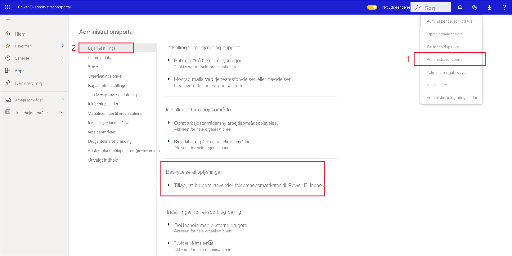

# Aktivér datafølsomhedsmærkater i Power BI

Hvis [datafølsomhedsmærkater i Microsoft Information Protection](https://docs.microsoft.com/microsoft-365/compliance/sensitivity-labels) skal bruges i Power BI, skal de være aktiveret på lejeren. Denne artikel viser Power BI-lejeradministratorer, hvordan dette skal gøres. Du kan finde en oversigt over datafølsomhedsmærkater i Power BI under [Databeskyttelse i Power BI](service-security-data-protection-overview.md). Du kan finde oplysninger om at anvende følsomhedsmærkater i Power BI under [Anvendelse af følsomhedsmærkater](../collaborate-share/service-security-apply-data-sensitivity-labels.md) 

Når følsomhedsmærkater aktiveres:

* Visse brugere og sikkerhedsgrupper i organisationen kan klassificere og [anvende følsomhedsmærkater](../collaborate-share/service-security-apply-data-sensitivity-labels.md) på deres Power BI-rapporter, dashboards, datasæt og dataflows.
* Alle medlemmer af organisationen kan se disse mærkater.

Aktivering af datafølsomhedsmærkater kræver en licens til Microsoft Azure Information Protection. Du kan finde flere oplysninger under [Licensering](service-security-data-protection-overview.md#licensing).

## Aktivér datafølsomhedsmærkater

Gå til Power BI-**administratorportal**, åbn ruden **Lejerindstillinger**, og find afsnittet **Information Protection**.

I afsnittet **Information Protection** skal du udføre følgende trin:
1. Åbn **Tillad, at brugere anvender følsomhedsmærkater til Power BI-indhold**.
1. Aktivér til/fra-funktionen.
1. Definer, hvem der kan anvende og ændre følsomhedsmærkater i Power BI-aktiver. Alle i din organisation kan som standard anvende følsomhedsmærkater. Du kan dog vælge kun at aktivere angivelse af følsomhedsmærkater for bestemte brugere eller sikkerhedsgrupper. Når du har valgt enten hele organisationen eller specifikke sikkerhedsgrupper, kan du udelade bestemte delmængder af brugere eller sikkerhedsgrupper.
   
   * Når følsomhedsmærkater er aktiveret for hele organisationen, er undtagelsen typisk sikkerhedsgrupper.
   * Når følsomhedsmærkater kun er aktiveret for bestemte brugere eller sikkerhedsgrupper, er undtagelsen normalt specifikke brugerne.  
    Denne fremgangsmåde gør det muligt at forhindre visse brugere i at anvende følsomhedsmærkater i Power BI, selvom de tilhører en gruppe, der har tilladelse til at gøre det.

1. Tryk på **Anvend**.

> [!IMPORTANT]
> Det er kun Power BI Pro-brugere, som har tilladelse til at *oprette* og *redigere* aktivet, og som er en del af den relevante sikkerhedsgruppe, der blev angivet i dette afsnit, der kan angive og redigere følsomhedsmærkaterne. Brugere, der ikke er en del af denne gruppe, kan ikke angive eller redigere mærkaten.  

## Fejlfinding

Power BI bruger følsomhedsmærkater fra Microsoft Azure Information Protection. Så hvis du får vist en fejlmeddelelse, når du forsøger at aktivere følsomhedsmærkater, kan det skyldes en af følgende årsager:

* Du har ikke en [licens](service-security-data-protection-overview.md#licensing) til Microsoft Azure Information Protection.
* Følsomhedsmærkaterne er ikke blevet migreret til den version af Microsoft Azure Information Protection, som understøttes af Power BI. Få mere at vide om [migrering af følsomhedsmærkater](https://docs.microsoft.com/azure/information-protection/configure-policy-migrate-labels).
* Der er ikke defineret nogen følsomhedsmærkater fra Microsoft Azure Information Protection i organisationen. Bemærk, at en mærkat være en del af en publiceret politik, før den kan anvendes. [Få mere at vide om følsomhedsmærkater](https://docs.microsoft.com/Office365/SecurityCompliance/sensitivity-labels), eller gå til [Microsoft Security and Compliance Center](https://sip.protection.office.com/sensitivity?flight=EnableMIPLabels) for at se, hvordan du definerer mærkater og publicerer politikker for din organisation.

## Overvejelser og begrænsninger

Følgende liste indeholder nogle begrænsninger for følsomhedsmærkater i Power BI:

**Generelt**
* Følsomhedsmærkater kan kun anvendes på dashboards, rapporter, datasæt og dataflow. De er i øjeblikket ikke tilgængelige til [sideinddelte rapporter](../paginated-reports/report-builder-power-bi.md) og projektmapper.
* Følsomhedsmærkater på Power BI-aktiver kan kun ses på listen over arbejdsområder og linjevisninger, Favoritter, Seneste og programvisninger. Mærkater er i øjeblikket ikke synlige i visningen Delt med mig. Bemærk dog, at en mærkat, som er anvendt på et Power BI-aktiv, altid bevares for data, der eksporteres til Excel-, PowerPoint- og PDF-filer, også selvom mærkaten ikke er synlig.
* Følsomhedsmærkater understøttes kun for lejere i det globale cloudmiljø (offentligt). Følsomhedsmærkater understøttes ikke for lejere i andre cloudmiljøer.
* Følsomhedsmærkater for data understøttes ikke for skabelonapps. Følsomhedsmærkater, der er angivet af opretteren af skabelonprogrammet, fjernes, når programmet udtrækkes og installeres. Følsomhedsmærkater, der føjes til artefakter i et installeret skabelonprogram af programbrugeren, mistes (nulstilles til ingenting), når programmet opdateres.
* Power BI understøtter ikke følsomhedsmærkater for beskyttelsestyperne [Videresend ikke](https://docs.microsoft.com/microsoft-365/compliance/encryption-sensitivity-labels?view=o365-worldwide#let-users-assign-permissions) og [brugerdefineret](https://docs.microsoft.com/microsoft-365/compliance/encryption-sensitivity-labels?view=o365-worldwide#let-users-assign-permissions) og [HYOK](https://docs.microsoft.com/azure/information-protection/configure-adrms-restrictions). Beskyttelsestyperne Videresend ikke og brugerdefineret henviser til de mærkater, der er defineret i [Microsoft 365 Security Center](https://security.microsoft.com/) eller [Microsoft 365 Compliance Center](https://compliance.microsoft.com/).
* Det anbefales ikke at gøre det muligt for brugerne at anvende overordnede mærkater i Power BI. Hvis der anvendes en overordnet mærkat til indhold, kan eksport af data fra dette indhold til en fil (Excel, PowerPoint og PDF) mislykkes. Se [Undermærkater (grupperingsmærkater)](https://docs.microsoft.com/microsoft-365/compliance/sensitivity-labels?view=o365-worldwide#sublabels-grouping-labels).

**Eksportér**
* Mærkat- og beskyttelseskontrolelementer gennemtvinges kun, når data eksporteres til Excel-, PowerPoint- og PDF-filer. Mærkat og beskyttelse gennemtvinges ikke, når data eksporteres til .csv- eller .pbix-filer, Analysér i Excel eller andre typer eksportstier.
* Anvendelse af et følsomhedsmærkat og beskyttelse til en eksporteret fil tilføjer ikke indholdsmarkering til filen. Men hvis mærkaten er konfigureret til at anvende indholdsmarkering, anvendes de automatisk af Azure Information Protection Unified-navngivningsklienten, når filen åbnes i Office Desktop-apps. Indholdsmærkaterne anvendes ikke automatisk, når du bruger indbygget navngivning til skrivebords-, mobil- eller webapps. Se [Når Office-apps anvender indholdsmarkering og kryptering](https://docs.microsoft.com/microsoft-365/compliance/sensitivity-labels-office-apps?view=o365-worldwide#when-office-apps-apply-content-marking-and-encryption) for at få flere oplysninger.
* En bruger, der eksporterer en fil fra Power BI, har tilladelse til at tilgå og redigere filen i henhold til indstillingerne for følsomhedsmærkaten. Den bruger, der eksporterer dataene, får ikke ejerens tilladelser til filen.
* Eksporten mislykkes, hvis en mærkat ikke kan anvendes, når der eksporteres data til en fil. Hvis du vil kontrollere, om eksporten mislykkedes, fordi mærkaten ikke kunne anvendes, skal du klikke på navnet på rapporten eller dashboardet i midten af titellinjen og se, om der står "Følsomhedsmærkat kan ikke indlæses" på den rulleliste, der åbnes. Dette kan ske, hvis den anvendte mærkat er blevet fjernet eller slettet af sikkerhedsadministratoren eller som følge af et midlertidigt systemproblem.

## Næste trin

Denne artikel indeholdt en beskrivelse af, hvordan du aktiverer datafølsomhedsmærkater i Power BI. Følgende artikler indeholder flere oplysninger om databeskyttelse i Power BI. 

* [Oversigt over databeskyttelse i Power BI](service-security-data-protection-overview.md)
* [Anvend datafølsomhedsmærkater i Power BI](../collaborate-share/service-security-apply-data-sensitivity-labels.md)
* [Brug af Microsoft Cloud App Security-kontrolelementer i Power BI](service-security-using-microsoft-cloud-app-security-controls.md)
* [Rapport over databeskyttelsesmålepunkter](service-security-data-protection-metrics-report.md)