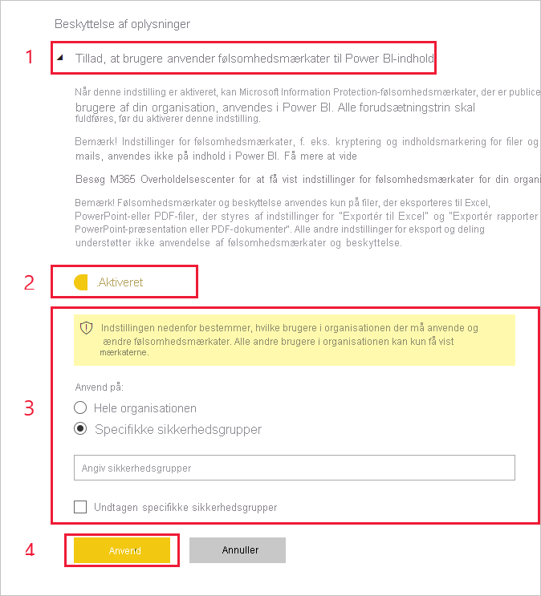

# Aktivér følsomhedsmærkater i Power BI

Hvis [følsomhedsmærkater i Microsoft Information Protection](/microsoft-365/compliance/sensitivity-labels) skal bruges i Power BI, skal de være aktiveret i lejeren. Denne artikel viser Power BI-administratorer, hvordan dette skal gøres. Du kan finde en oversigt over følsomhedsmærkater i Power BI under [Følsomhedsmærkater i Power BI](service-security-sensitivity-label-overview.md). Du kan finde oplysninger om at anvende følsomhedsmærkater i Power BI under [Anvendelse af følsomhedsmærkater](./service-security-apply-data-sensitivity-labels.md) 

Når følsomhedsmærkater aktiveres:

* Visse brugere og sikkerhedsgrupper i organisationen kan klassificere og [anvende følsomhedsmærkater](./service-security-apply-data-sensitivity-labels.md) på deres Power BI-indhold. I Power BI-tjenesten betyder det deres rapporter, dashboards, datasæt og dataflow. I Power BI Desktop betyder det deres .pbix-filer.
* I tjenesten kan alle medlemmer af organisationen se disse mærkater. I Desktop er det kun medlemmer af organisationen, hvor mærkaterne er publiceret til dem, som kan se mærkaterne.

Aktivering af følsomhedsmærkater kræver en licens til Microsoft Azure Information Protection. Se flere oplysninger i [Licenser og krav](#licensing-and-requirements).

>[!NOTE]
>I løbet af de første 48 timer, efter brugerne har tilmeldt sig prøveversionsfunktionen Information Protection, **oplever de muligvis problemer med .pbix-filer, hvor der er anvendt følsomhedsmærkater (f.eks. publicering af .pbix-filen til tjenesten, download af .pbix-filen fra tjenesten)** . Sådanne problemer er forventet og løses automatisk inden for 48 timer.

## Licenser og krav

* Der kræves en Azure Information Protection Premium P1- eller Premium P2-licens for at anvende og få vist følsomhedsmærkater fra Microsoft Azure Information Protection i Power BI. Azure Information Protection kan købes enten separat eller via en af Microsoft-licenspakkerne. Du kan finde flere oplysninger under [Priser på Microsoft Azure Information Protection](https://azure.microsoft.com/pricing/details/information-protection/).

    >[!NOTE]
    > Hvis din organisation bruger Azure Information Protection-følsomhedsmærkater, skal de overføres til Microsoft Information Protection Unified Labeling-platformen, for at kunne bruges i Power BI. [Få mere at vide om overførsel af følsomhedsmærkater](/azure/information-protection/configure-policy-migrate-labels).

* Brugeren skal have en Power BI Pro-licens foruden en af de ovenfor nævnte licenser til Azure Information Protection, for at kunne anvende mærkater på Power BI-indhold og -filer.

* Office-apps har deres egne [licenskrav til visning og anvendelse af følsomhedsmærkater]( https://docs.microsoft.com/microsoft-365/compliance/get-started-with-sensitivity-labels#subscription-and-licensing-requirements-for-sensitivity-labels ).

* Før du aktiverer følsomhedsmærkater på din lejer, skal du sørge for, at der er defineret og publiceret følsomhedsmærkater for relevante brugere og grupper. Se [Opret og konfigurer følsomhedsmærkater og deres politikker](/microsoft-365/compliance/create-sensitivity-labels) for at få flere detaljer.

* Brug af følsomhedsmærkater i Desktop kræver Desktop-versionen fra december 2020 eller nyere.

    >[!NOTE]
    > Hvis du forsøger at åbne en beskyttet .pbix-fil med en Desktop-version, der er ældre end den fra december 2020, vil den mislykkedes, og du bliver bedt om at opgradere din Desktop-version.

## Aktivér følsomhedsmærkater

Følsomhedsmærkater skal være aktiveret på lejeren, før de kan bruges både i tjenesten og i Desktop. Dette afsnit indeholder en beskrivelse af, hvordan du aktiverer dem under lejerindstillingerne. Du kan finde flere overvejelser relateret til Desktop under [Deaktivering af følsomhedsmærkater i Desktop på tværs af din organisation](#disable-sensitivity-labels-in-desktop-across-your-org) nedenfor. 

Du aktiverer følsomhedsmærkater på lejeren ved at gå til Power BI **Administration**, åbne ruden **Lejerindstillinger** og finde afsnittet **Information Protection**.

I afsnittet **Information Protection** skal du udføre følgende trin:
1. Åbn **Tillad, at brugere anvender følsomhedsmærkater til Power BI-indhold**.
1. Aktivér til/fra-funktionen.
1. Definer, hvem der kan anvende og ændre følsomhedsmærkater i Power BI-aktiver. Alle i din organisation kan som standard anvende følsomhedsmærkater. Du kan dog vælge kun at aktivere angivelse af følsomhedsmærkater for bestemte brugere eller sikkerhedsgrupper. Når du har valgt enten hele organisationen eller specifikke sikkerhedsgrupper, kan du udelade bestemte delmængder af brugere eller sikkerhedsgrupper.
   
   * Når følsomhedsmærkater er aktiveret for hele organisationen, er undtagelsen typisk sikkerhedsgrupper.
   * Når følsomhedsmærkater kun er aktiveret for bestemte brugere eller sikkerhedsgrupper, er undtagelsen normalt specifikke brugerne.  
    Denne fremgangsmåde gør det muligt at forhindre visse brugere i at anvende følsomhedsmærkater i Power BI, selvom de tilhører en gruppe, der har tilladelse til at gøre det.

1. Tryk på **Anvend**.

> [!IMPORTANT]
> Det er kun Power BI Pro-brugere, som har tilladelse til at *oprette* og *redigere* aktivet, og som er en del af den relevante sikkerhedsgruppe, der blev angivet i dette afsnit, der kan angive og redigere følsomhedsmærkaterne. Brugere, der ikke er en del af denne gruppe, kan ikke angive eller redigere mærkaten.  

## Deaktiver følsomhedsmærkater i Desktop på tværs af din organisation

For de organisationer, der gerne vil sikre, at .pbix-filer **ikke** fungerer sammen med følsomhedsmærkater, kan Power BI-administratoren oprette en gruppepolitik, der medfører, at Power BI blokerer brugere fra at klassificere og beskytte .pbix-filer eller åbne filer, hvor der allerede er anvendt beskyttelse. Sådan oprettes sådan en politik:

1. Åbn [Registreringseditor](https://support.microsoft.com/windows/how-to-open-registry-editor-in-windows-10-deab38e6-91d6-e0aa-4b7c-8878d9e07b11).

1. Find nøglen **HKEY_CURRENT_USER\SOFTWARE\Policies\Microsoft\Microsoft Power BI Desktop**.

1. Find valueName **EnableInformationProtection**, og angiv den til **false**.

I [oversigten over følsomhedsmærkater](./service-security-sensitivity-label-overview.md#limitations) kan du se yderligere begrænsninger og overvejelser relateret til brug af følsomhedsmærkater i Power BI Desktop.

## Fejlfinding

Power BI bruger følsomhedsmærkater fra Microsoft Azure Information Protection. Så hvis du får vist en fejlmeddelelse, når du forsøger at aktivere følsomhedsmærkater, kan det skyldes en af følgende årsager:

* Du har ikke en [licens](#licensing-and-requirements) til Microsoft Azure Information Protection.
* Følsomhedsmærkaterne er ikke blevet [overført](#enable-sensitivity-labels) til den version af Microsoft Azure Information Protection, som understøttes af Power BI.
* Der er ikke [defineret nogen følsomhedsmærkater fra Microsoft Azure Information Protection i organisationen](#enable-sensitivity-labels).

## Overvejelser og begrænsninger

Se [Følsomhedsmærkater i Power BI](service-security-sensitivity-label-overview.md#limitations) for at få vist en liste over begrænsninger for følsomhedsmærkater i Power BI.

## Næste trin

Denne artikel indeholdt en beskrivelse af, hvordan du aktiverer følsomhedsmærkater i Power BI. Følgende artikler indeholder flere oplysninger om databeskyttelse i Power BI. 

* [Oversigt over følsomhedsmærkater i Power BI](service-security-sensitivity-label-overview.md)
* [Sådan anvendes følsomhedsmærkater i Power BI](./service-security-apply-data-sensitivity-labels.md)
* [Brug af Microsoft Cloud App Security-kontrolelementer i Power BI](service-security-using-microsoft-cloud-app-security-controls.md)
* [Rapport over beskyttelsesmålepunkter](service-security-data-protection-metrics-report.md)