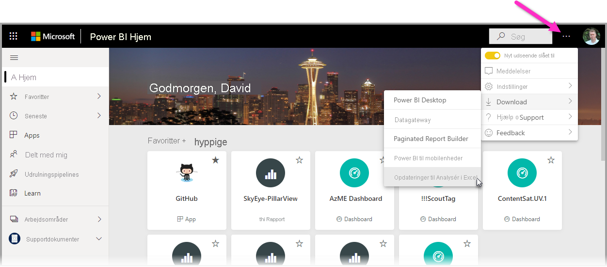
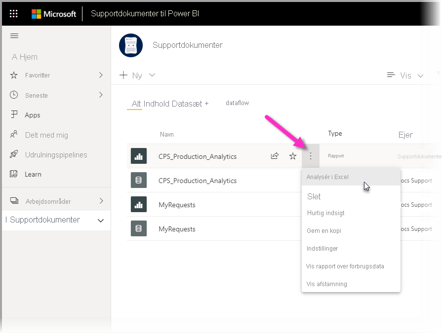
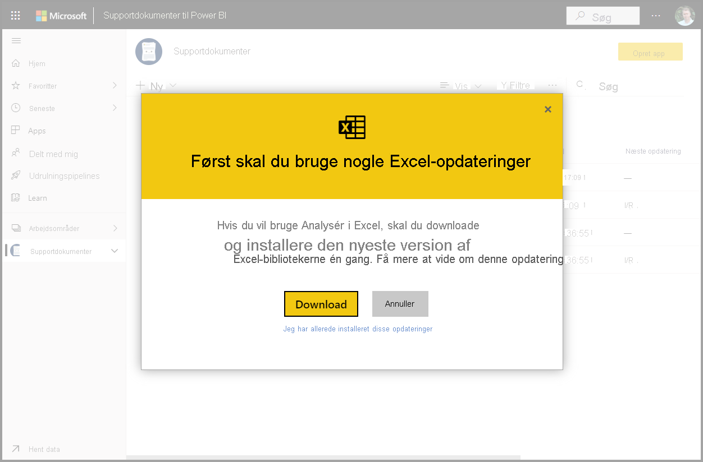
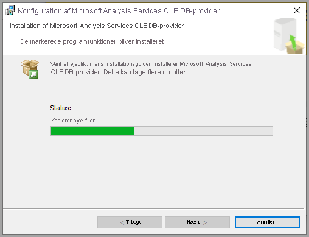
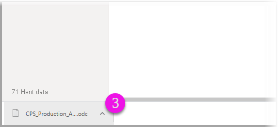
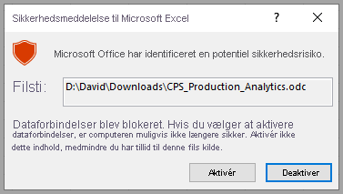
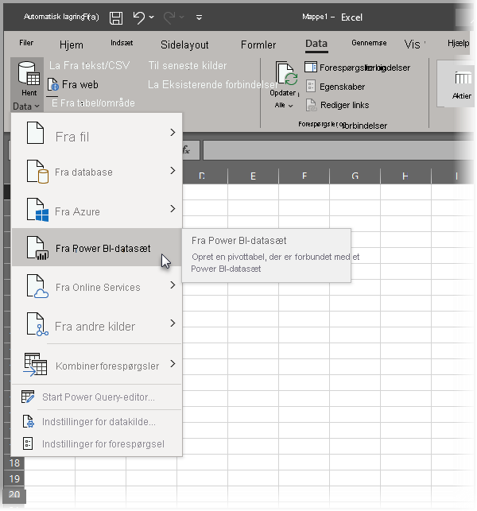

# Analysér i Excel
Med **Analysér i Excel** kan du hente Power BI-datasæt til Excel og derefter få vist og interagere med dem ved hjælp af pivottabeller, diagrammer, udsnit og andre Excel-funktioner. Hvis du vil bruge **Analysér i Excel**, skal du først downloade funktionen fra Power BI, installere den og derefter vælge et eller flere datasæt, der skal bruges i Excel. 

I denne artikel kan du se, hvordan du installerer og bruger Analysér i Excel, beskriver dens begrænsninger og giver derefter nogle af de næste trin. Her er, hvad du skal lære:

* [Installere Analysér i Excel](#install-analyze-in-excel)
* [Oprette forbindelse til Power BI-data](#connect-to-power-bi-data)
* [Analysere dataene med Excel](#use-excel-to-analyze-the-data)
* [Gemme og dele din projektmappe](#saving-and-sharing-your-new-workbook)
* [Krav](#requirements)

Lad os komme i gang og få startet installationsprocessen.

## Installere Analysér i Excel

Du skal installere **Analysér i Excel** fra links, der er angivet i Power BI-tjenesten. Power BI registrerer den version af Excel, du har på din computer, og henter automatisk den relevante version (32-bit eller 64-bit). Power BI-tjenesten kører i en browser. Du kan logge på Power BI ved hjælp af følgende link:

* [Log på Power BI](https://app.powerbi.com)

Når du er logget på, og Power BI-tjeneste kører i din browser, skal du vælge elementet **flere indstillinger** (...) i øverste højre hjørne og derefter vælge **Download > Analysér i Excel-opdateringer**. Dette menupunkt gælder for nye installationer af opdateringer til Analysér i Excel.

Du kan også navigere i Power BI-tjeneste til et datasæt, du vil analysere, og vælge elementet **Flere indstillinger** for et datasæt, en rapport eller et andet Power BI-element. I den menu, der vises, skal du vælge indstillingen **Analysér i Excel** som vist på følgende billede.

Uanset hvad registrerer Power BI, om du har installeret Analysér i Excel. Hvis ikke, bliver du bedt om at downloade. 

Når du vælger at downloade, registrerer Power BI den version af Excel, du har installeret, og downloader den rette version af installationsprogrammet til Analysér i Excel. Du kan se status nederst i din browser eller der, hvor browseren viser overførselsstatus. 

Når overførslen er fuldført, skal du køre installationsprogrammet (.msi) for at installere Analysér i Excel. Navnet på installationsprocessen er forskellig fra Analysér i Excel. Navnet vil være **Microsoft Analysis Services OLE DB-provider** som vist på følgende billede eller noget lignende.

Når det er fuldført, er du klar til at vælge en rapport i Power BI-tjenesten (eller et andet Power BI-dataelement, f.eks. et datasæt) og derefter analysere det i Excel.

## Opret forbindelse til Power BI-data

I Power BI-tjeneste skal du navigere til det datasæt eller den rapport, du vil analysere i Excel, og vælge menuen **Flere indstillinger** (...) for at finde menupunktet **Analysér i Excel**. På følgende billede kan du se, hvordan du vælger en rapport.

Overførsel af et datasæt fra Power BI-tjeneste til Excel kræver nogle få trin:

1. Vælg menuen **Flere indstillinger**.
2. Vælg **Analysér i Excel** fra de menupunkter, der vises.

    Power BI-tjenesten opretter derefter en fil af det datasæt, der er designet (og struktureret) til brug med **Analysér i Excel** med .ODC-filtypenavnet. Filen oprettes og starter derefter automatisk en overførselsproces i din browser.
    
    
    
    Filnavnet svarer til det datasæt (eller den rapport eller anden datakilde), som det er afledt af. Så hvis rapporten blev kaldt *Seneste-salg*, hedder den hentede fil **Seneste-salg.ODC**.

3. Åbn .ODC-filen

Filen er allerede knyttet til **Analysér i Excel**, så når du vælger eller starter .ODC-filen, åbnes Excel og starter automatisk indlæsningen af. ODC-filen. Der vises dog sandsynligvis en advarsel om en ekstern datakildetrussel:

Vælg **Aktivér** for at indlæse .ODC-filen til **Analysér i Excel**. Excel indlæser filen. 

## Analyser dataene med Excel

Når du har tilladt indlæsningen af .ODC-filen ved at vælge **Aktivér** fra sikkerhedsmeddelelsen, vises der en tom **pivottabel** og **feltliste** fra det Power BI-datasæt, der er klar til at blive analyseret.

. ODC-filen indeholder en MSOLAP-forbindelsesstreng, der opretter forbindelse til dit datasæt i Power BI. Når du analyserer eller arbejder med dataene, forespørger Excel på dette datasæt i Power BI og returnerer resultaterne til Excel. Hvis dette datasæt opretter forbindelse til en direkte datakilde ved hjælp af DirectQuery, forespørger Power BI på datakilden og returnerer resultatet til Excel.

Nu, hvor der er oprettet forbindelse til dataene i Power BI, kan du oprette pivottabeller og diagrammer og analysere dette datasæt på samme måde, som du ville arbejde med et lokalt datasæt i Excel.

**Analysér i Excel** er især nyttigt i forbindelse med datasæt og rapporter, der opretter forbindelse til følgende datakilder:

* Databaserne *Analysis Services Tabular* eller *Multidimensional*
* Power BI Desktop-filer eller Excel-projektmapper med datamodeller med modelmålinger, der er oprettet ved hjælp af DAX (Data Analysis Expressions).

> [!IMPORTANT]
> Brug af **Analysér i Excel** fremviser alle data på detaljeniveau for alle brugere med tilladelse til datasættet.

Der er en række ting, du skal overveje, når du begynder at bruge Analysér i Excel, hvilket kan kræve et ekstra trin eller to for at afstemme. Disse muligheder er beskrevet i de følgende afsnit. 

### Log på Power BI
Selvom du er logget på Power BI i din browser, kan du blive bedt om at logge på Power BI med din Power BI-konto, første gang du åbner en ny. ODC-fil i Excel. Dette godkender forbindelsen fra Excel til Power BI.

### Brugere med flere Power BI-konti
Nogle brugere har flere Power BI-konti. Hvis det er dig, er du muligvis logget på Power BI med én konto, men din anden konto har adgang til det datasæt, der bruges i Analysér i Excel. I dette tilfælde kan du få vist fejlen **Forbudt** eller en logonfejl, når du forsøger at få adgang til et datasæt, der bruges i en projektmappe i Analysér i Excel.

Sker dette, får du mulighed for at logge på igen, og på dette tidspunkt kan du så logge på med den Power BI-konto, der har adgang til datasættet, som Analysér i Excel skal have adgang til. Du kan også vælge dit navn på det øverste bånd i Excel, som identificerer den konto, der er logget ind på i øjeblikket. Log af, og log på igen med den anden konto.

## Gem og del din nye projektmappe

Du kan **gemme** den Excel-projektmappe, du opretter med Power BI-datasættet, som alle andre projektmapper. Du kan dog ikke publicere eller indlæse projektmappen i Power BI igen, fordi du kun kan publicere eller importere projektmapper til Power BI, som har data i tabeller, eller som har en datamodel. Da den nye projektmappe blot har forbindelse til datasættet i Power BI, vil du køre i cirkler, hvis du udgiver eller importerer den i Power BI!

Når din projektmappe er gemt, kan du dele den med andre Power BI-brugere i din organisation. 

Når en bruger, som du har delt din projektmappe med, åbner den, får vedkommende vist dine pivottabeller og data, sådan som de så ud, da projektmappen sidst blev gemt, hvilket muligvis ikke er den nyeste version af dataene. For at få de nyeste data skal brugerne bruge knappen **Opdater** på båndet **Data**. Og da projektmappen er forbundet med et datasæt i Power BI, skal brugere, der forsøger at opdatere projektmappen, logge på Power BI og installere Excel-opdateringerne, første gang de forsøger at opdatere ved hjælp af denne metode.

Da brugere får brug for at opdatere datasættet, og opdatering for eksterne forbindelser ikke understøttes i Excel Online, anbefales det, at brugere åbner projektmappen i desktop-versionen af Microsoft Excel på deres egen computer.

> [!NOTE]
> Administratorer for Power BI-lejere kan bruge *Power BI-administrationsportalen* til at deaktivere brugen af **Analysér i Excel** med datasæt i det lokale miljø, der er placeret på databaser i Analysis Services (AS). Når denne indstilling er deaktiveret, er **Analysér i Excel** deaktiveret for AS-databaser, men er fortsat tilgængelige til brug sammen med andre datasæt.

## Andre måder at få adgang til Power BI-datasættet fra Excel på
Brugere med bestemte Office-varenumre kan også oprette forbindelse til Power BI-datasæt i Excel ved hjælp af funktionen **Hent data** i Excel. Hvis dit varenummer ikke understøtter denne funktion, vises menupunktet **Hent data** ikke.

Fra menuen **Data** på båndet skal du vælge **Hent data > Fra Power BI-datasæt** som vist på følgende billede.

Der vises en rude, hvor du kan gennemse datasæt, som du har adgang til, se, om datasæt er certificerede eller promoverede, og bestemme, om der er anvendt databeskyttelsesetiketter på disse datasæt. 

Du kan finde flere oplysninger om, hvordan du henter data til Excel på denne måde, under [Opret en pivottabel ud fra Power BI-datasæt](https://support.office.com/article/31444a04-9c38-4dd7-9a45-22848c666884) i dokumentationen til Excel.

Du kan også få adgang til **udvalgte tabeller** i Excel i galleriet **Datatyper**. Hvis du vil vide mere om de udvalgte tabeller, og hvordan du får adgang til dem, kan du se [Få adgang til udvalgte Power BI-tabeller i Excel (prøveversion)](service-excel-featured-tables.md).

## Krav
Der er et par krav til brugen af **Analysér i Excel**:

* **Analysér i Excel** understøttes for Microsoft Excel 2010 SP1 og nyere.

* Pivottabeller i Excel understøtter ikke træk og slip-sammenlægning af numeriske felter. Dit datasæt i Power BI *skal have foruddefinerede målinger*. Læs om [oprettelse af målinger](../transform-model/desktop-measures.md).
* Nogle organisationer har muligvis gruppepolitikregler, der forhindrer installation af de krævede **Analysér i Excel**-opdateringer i Excel. Hvis du ikke kan installere opdateringerne, skal du kontakte din administrator.
* **Analysér i Excel** kræver, at datasættet er i Power BI Premium, eller at brugeren har en Power BI Pro-licens. Hvis du vil vide mere om forskellene i funktionaliteten mellem de forskellige Power BI-licenstyper, skal du se _Sammenligning af Power BI-funktioner_ i afsnittet [Power BI-priser](https://powerbi.microsoft.com/pricing/).
* Brugere kan oprette forbindelse til datasæt via Analysér i Excel, hvis de har læsetilladelse til det underliggende datasæt.  En bruger kan have denne tilladelse på flere måder: Brugeren kan f.eks. være medlem af det arbejdsområde, der indeholder datasættet. Der kan deles en rapport eller et dashboard, hvor datasættet bruges, med brugeren. Eller brugeren kan have tilladelse til at oprette for datasættet i enten et arbejdsområde eller i en app, der indeholder datasættet. Læs mere om [tilladelsen Opret for datasæt](../connect-data/service-datasets-build-permissions.md).
* Gæstebrugere kan ikke bruge **Analysér i Excel** til datasæt, der er sendt fra (stammer fra) en anden lejer. 
* **Analysér i Excel** er en funktion i Power BI-tjenesten og er ikke tilgængelig i Power BI-rapportserver eller Power BI Embedded. 
* **Analysér i Excel** understøttes kun på computere, der kører Microsoft Windows.

For de brugere, der har brug for at fjerne funktionen **Analysér i Excel**, kan du gøre ved hjælp af systemindstillingen **Tilføj eller fjern programmer** på din Windows-computer.

## Fejlfinding
Når du bruger Analysér i Excel, kan du i nogle tilfælde få et uventet resultat, eller funktionen fungerer måske ikke som forventet. [Denne side indeholder løsninger på almindelige problemer med brug af Analysér i Excel](desktop-troubleshooting-analyze-in-excel.md).

## Næste trin

Du vil måske også være interesseret i følgende artikler:

* [Brug tværgående detaljeadgang i rapport i Power BI Desktop](../create-reports/desktop-cross-report-drill-through.md)
* [Brug af udsnitsværktøjer i Power BI Desktop](../visuals/power-bi-visualization-slicers.md)
* [Fejlfinding af Analysér i Excel](desktop-troubleshooting-analyze-in-excel.md)
* [Få adgang til Power BI-tabeller i Excel (prøveversion)](service-excel-featured-tables.md).

