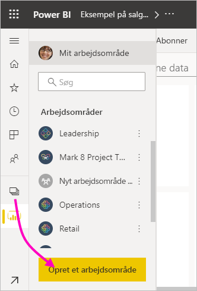
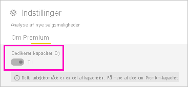
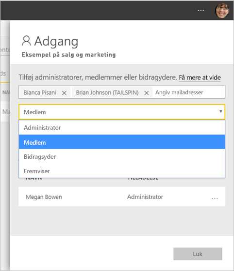
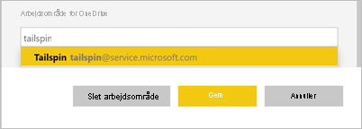
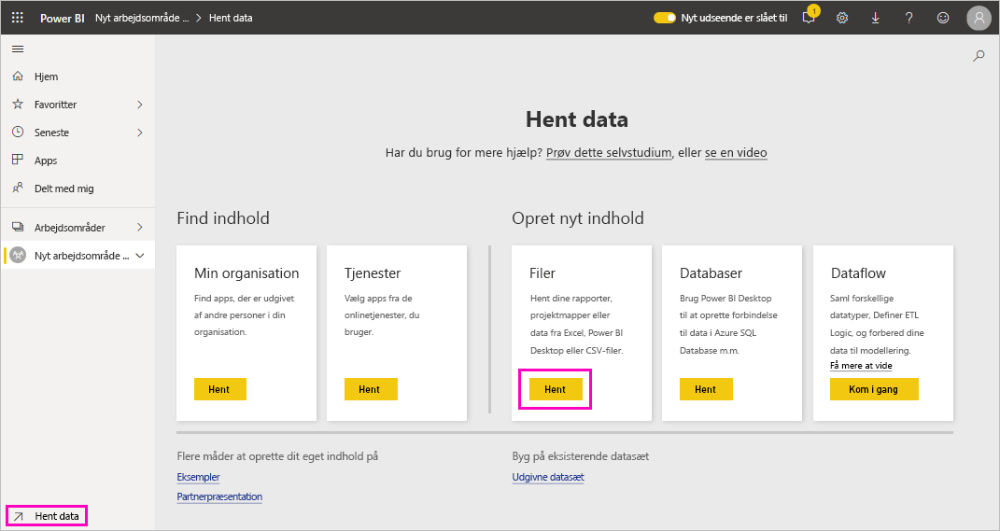
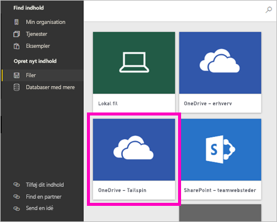
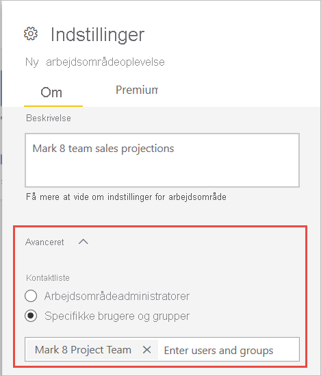

# Opret nye arbejdsområder i Power BI

I denne artikel forklares det, hvordan du opretter et af de *nye arbejdsområder* i stedet for et *klassisk* arbejdsområde. Begge typer arbejdsområder er steder, hvor du kan samarbejde med kolleger. I arbejdsområderne kan du oprette samlinger af dashboards, rapporter og sideinddelte rapporter. Hvis du vil, kan du også bundte samlingen til en *app* og distribuere den til en bredere målgruppe. Du kan få mere baggrundsviden i artiklen [nye arbejdsområder](service-new-workspaces.md).

Er du klar til at overføre dit klassiske arbejdsområde? Se [Opgrader klassiske arbejdsområder til de nye arbejdsområder i Power BI](service-upgrade-workspaces.md) for at få flere oplysninger.

> [!NOTE]
> Hvis du vil gennemtvinge sikkerhed på rækkeniveau for Power BI Pro-brugere, der gennemser indhold i et arbejdsområde, skal du tildele brugerne læseadgang. Se [Roller i de nye arbejdsområder](service-new-workspaces.md#roles-in-the-new-workspaces) for at få en forklaring på de forskellige roller.

## Opret et af de nye apparbejdsområder

1. Start med at oprette arbejdsområdet. Vælg **Arbejdsområder** > **Opret arbejdsområde**.
   
     

2. Du opretter automatisk et opgraderet arbejdsområde, medmindre du vælger at **gå tilbage til klassisk**.
   
     
     
     Hvis du vælger **Gå tilbage til klassisk**, opretter du et [klassisk arbejdsområde](service-create-workspaces.md), der er baseret på en Microsoft 365-gruppe.

2. Giv arbejdsområdet et entydigt navn. Hvis navnet ikke er tilgængeligt, skal du redigere det, så der angives et entydigt navn.
   
     Den app, du opretter fra arbejdsområdet, har det samme navn og ikon som arbejdsområdet.
   
1. Her er nogle valgfrie elementer, du kan angive for dit arbejdsområde:

    - Upload et **billede til arbejdsområdet**. Filer kan være .png- eller .jpg-format. Filstørrelsen skal være mindre end 45 KB. 
    - [Angiv et OneDrive for arbejdsområdet](#set-a-workspace-onedrive) for at bruge en fillagerplacering for en Microsoft 365-gruppe.    
    - [Tilføj en liste over kontakter](#create-a-contact-list). Administratorer af arbejdsområder er som standard kontakter. 
    - [Tillad, at bidragydere opdaterer appen](#allow-contributors-to-update-the-app) for arbejdsområdet
    - Hvis du vil tildele arbejdsområdet til en **dedikeret kapacitet**, skal du på fanen **Premium** vælge **Dedikeret kapacitet**.

        

1. Vælg **Gem**.

    Power BI opretter arbejdsområdet og åbner det. Det vises på listen over de arbejdsområder, du er medlem af. 

## Giv adgang til dit arbejdsområde

Alle, der har en administratorrolle i et arbejdsområde, kan give andre adgang til arbejdsområdet ved at føje dem til forskellige roller. Oprettere af arbejdsområder er automatisk administratorer. Se [Roller i de nye arbejdsområder](service-new-workspaces.md#roles-in-the-new-workspaces) for at få en forklaring på de roller.

1. Da du er administrator, kan du på indholdslisten for arbejdsområder se **Adgang**.

    

1. Føj sikkerhedsgrupper, distributionslister, Microsoft 365-grupper eller enkeltpersoner til disse arbejdsområder som administratorer, medlemmer, bidragydere eller læsere. 

    

9. Vælg **Tilføj** > **Luk**.

## Angiv et OneDrive for arbejdsområdet

Funktionen Arbejdsområde for OneDrive giver dig mulighed for at konfigurere en Microsoft 365-gruppe, hvis fillager for SharePoint-dokumentbibliotek er tilgængeligt til brugere af arbejdsområdet. Du opretter gruppen uden for Power BI først. 

Power BI synkroniserer ikke tilladelser for brugere eller grupper, der er konfigureret til at have adgang til arbejdsområdet med medlemskabet af Microsoft 365-gruppen. Bedste praksis er at give den samme Microsoft 365-gruppe, hvis fillager du konfigurerer i denne indstilling for Microsoft 365-gruppen, [adgang til arbejdsområdet](#give-access-to-your-workspace). Administrer derefter adgangen til arbejdsområdet ved at administrere medlemskabet af Microsoft 365-gruppen. 

1. Få adgang til den nye indstilling for **OneDrive-arbejdsområdet** på en af to måder:

    I ruden **Opret et arbejdsområde**, når du opretter det første gang.

    I navigationsruden skal du vælge pilen ud for **Arbejdsområder** og vælge **Flere indstillinger** (...) ud for navnet på arbejdsområdet > **Indstillinger for arbejdsområde**. Ruden **Indstillinger** åbnes.

    

2. Under **Avanceret** > **Arbejdsområde for OneDrive** skal du skrive navnet på den Microsoft 365-gruppe, du oprettede tidligere. Skriv blot navnet og ikke URL-adressen. Power BI registrerer automatisk OneDrive for gruppen.

    

3. Vælg **Gem**.

### Få adgang til arbejdsområdets OneDrive-placering

Når du har konfigureret placeringen af OneDrive, kommer du dertil på samme måde, som du kommer til andre datakilder i Power BI-tjenesten.

1. I navigationsruden skal du vælge **Hent data** og derefter i feltet **Filer** vælge **Hent**.

    

1.  Posten **OneDrive – Business** er dit eget personlige OneDrive for Business. Det andet OneDrive er det, du har tilføjet.

    

## Opret en kontaktliste

Du kan angive, hvilke brugere der skal modtage en meddelelse om de problemer, der opstår i arbejdsområdet. Som standard får alle brugere eller grupper, der er angivet som arbejdsområdeadministrator, besked, men du kan føje andre til *kontaktlisten*. Brugere eller grupper på listen over kontakter vises i brugergrænsefladen for at hjælpe brugerne med at få hjælp til arbejdsområdet.

1. Få adgang til den nye indstilling **Liste over kontakter** på en af to måder:

    I ruden **Opret et arbejdsområde**, når du opretter det første gang.

    I navigationsruden skal du vælge pilen ud for **Arbejdsområder** og vælge **Flere indstillinger** (...) ud for navnet på arbejdsområdet > **Indstillinger for arbejdsområde**. Ruden **Indstillinger** åbnes.

    

2. Under **Avanceret**, **Liste over kontakter** skal du acceptere standarden, **Administratorer af arbejdsområde** eller tilføje din egen liste over **Specifikke brugere eller grupper**. 

    

3. Vælg **Gem**.

## Tillad, at bidragydere opdaterer appen

**Tillad, at bidragydere opdaterer appen for dette arbejdsområde** gør det muligt for arbejdsområdeadministratorer at delegere muligheden for at opdatere appen for arbejdsområdet til de brugere, der har rollen Bidragyder. Som standard er det kun arbejdsområder og medlemmer, der kan publicere og opdatere appen for arbejdsområdet. 

1. Hvis du vil have adgang til denne indstilling, skal du i navigationsruden vælge pilen ud for **Arbejdsområder** og vælge **Flere indstillinger** (...) ud for navnet på arbejdsområdet > **Indstillinger for arbejdsområde**. Ruden **Indstillinger** åbnes.

    

2. Under **Avanceret** skal du udvide **Sikkerhedsindstillinger**. Vælg **Tillad, at bidragydere opdaterer appen for arbejdsområdet**. 

Når indstillingen er aktiveret, kan bidragydere:
* Opdatere appmetadata som navn, ikon, beskrivelse, supportwebsted og farve
* Tilføje eller fjerne elementer, der er inkluderet i appen, f. eks. tilføje rapporter eller datasæt
* Ændre appnavigationen eller det standardelementet, som appen åbnes i

Bidragydere kan dog ikke:
* Publicere appen for første gang
* Ændre, hvem der har tilladelse til appen

## Apps i de nye arbejdsområder

Du kan oprette og forbruge *apps* i de nye arbejdsområdeoplevelser i stedet for indholdspakker. Apps er samlinger af dashboards, rapporter og datasæt, der opretter forbindelse til tjenester fra tredjeparter og organisationsdata. Apps gør det nemt at hente data fra tjenesterne, f.eks. Microsoft Dynamics CRM, Salesforce og Google Analytics.

I den nye arbejdsområdeoplevelse kan du ikke oprette eller bruge organisationsindholdspakker. Bed dine interne teams om at levere apps til alle de indholdspakker, du bruger i øjeblikket. 

### Distribuer en app

Hvis du vil distribuere officielt indhold til en stor målgruppe i din organisation, kan du publicere en *app* fra dit arbejdsområde.  Når indholdet er klar, skal du vælge, hvilke dashboards og rapporter du vil publicere, og derefter skal du publicere dem som en app. Du kan oprette en app fra hvert arbejdsområde.

Læs om, hvordan du [publicerer en app fra de nye arbejdsområder](service-create-distribute-apps.md).

## Næste trin
* Læs om [organisering af arbejde i den nye arbejdsområdeoplevelse i Power BI](service-new-workspaces.md)
* [Opret klassiske arbejdsområder](service-create-workspaces.md)
* [Publicer en app fra de nye arbejdsområder i Power BI](service-create-distribute-apps.md)
* Har du spørgsmål? [Prøv at spørge Power BI-community'et](https://community.powerbi.com/)
