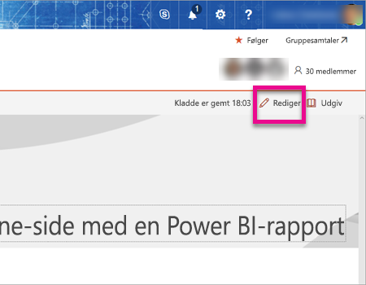
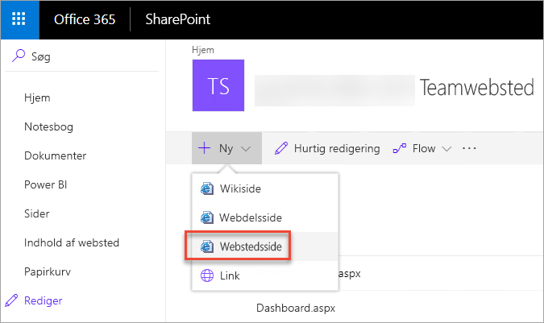
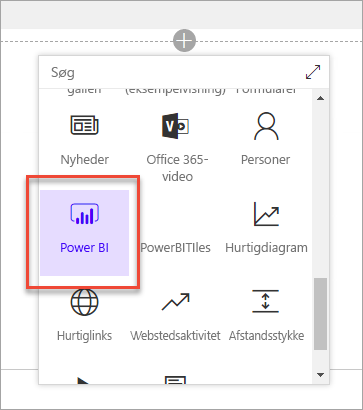
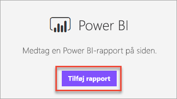
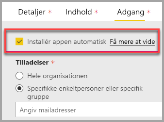
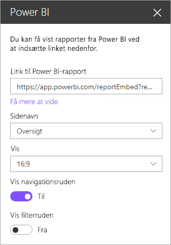
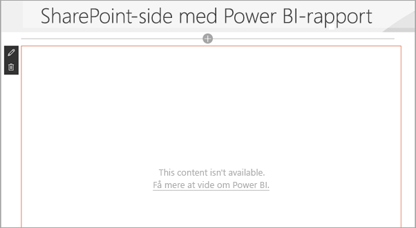

# Integrer en rapportwebdel i SharePoint Online

Med Power BI’s nye rapportwebdel til SharePoint Online kan du nemt kan integrere interaktive Power BI-rapporter på SharePoint Online-sider.

Når du bruger den nye indstilling **Integrer i SharePoint Online**, respekterer de integrerede rapporter alle elementtilladelser og al datasikkerhed via [sikkerhed på rækkeniveau](../admin/service-admin-rls.md), så du nemt kan oprette sikre interne portaler.

## Krav

Følgende kræves, før rapporter kan **integreres i SharePoint Online**:

* En Power BI Pro-licens eller en [Power BI Premium-kapacitet (EM- eller P-SKU)](../admin/service-premium-what-is.md) med en Power BI-licens.
* Power BI-webdelen til SharePoint Online kræver [moderne sider](https://support.office.com/article/Allow-or-prevent-creation-of-modern-site-pages-by-end-users-c41d9cc8-c5c0-46b4-8b87-ea66abc6e63b).
* Hvis brugerne vil bruge en integreret rapport, skal de logge på Power BI-tjenesten for at aktivere deres Power BI licens.

> [!Note]
> Organisationer, som bruger nationale Power BI-cloudmiljøer, har ikke adgang til en gratis licens. I dette miljø skal alle brugere, der ønsker at få adgang til den integrerede rapport i SharePoint, have en licens til Power BI Pro.

## Integrer din rapport
Hvis du vil integrere din rapport i SharePoint Online, skal du have URL-adressen til rapporten og bruge den sammen med Power BI-webdelen i SharePoint Online.

### Hent en URL-adresse til en rapport

1. Få vist rapporten i Power BI.

2. I rullemenuen **Flere indstillinger (...)** skal du vælge **Integrer** > **SharePoint Online**.

    

3. Kopiér URL-adressen til rapporten fra dialogboksen.

    

### Føj Power BI-rapporten til en SharePoint Online-side

1. Åbn destinationssiden i SharePoint Online, og vælg **Rediger**.

    

    Eller vælg **+ Ny** i SharePoint Online for at oprette en ny moderne webside.

    

2. Vælg rullemenuen **+** , og vælg derefter webdelen **Power BI**.

    

3. Vælg **Tilføj rapport**.

      

4. Indsæt den tidligere kopierede URL-adresse til rapporten i ruden **Link til Power BI-rapport**. Rapporten indlæses automatisk.

    

5. Vælg **Publicer** for at gøre ændringerne synlige for dine SharePoint Online-brugere.

    

## Giv adgang til rapporter

Integrering af en rapport i SharePoint Online giver ikke automatisk brugerne tilladelse til at få vist rapporten. Du skal angive visningstilladelser i Power BI.

> [!IMPORTANT]
> Sørg for at gennemse, hvem der kan få vist rapporten, i Power BI-tjenesten, og giv adgang til dem, der er ikke angivet.

Der er to måder at give adgang til rapporten i Power BI på. Hvis du bruger en Microsoft 365-gruppe til at udarbejde dit SharePoint Online-teamwebsted, er den første måde, at du skal angive brugeren som medlem af **arbejdsområdet i Power BI-tjenesten** og på **SharePoint-siden**. Hvis du vil have flere oplysninger, skal du se, hvordan du [administrerer et arbejdsområde](service-manage-app-workspace-in-power-bi-and-office-365.md).

Den anden måde er at integrere en rapport i en app og dele den direkte med brugerne:  

1. Forfatteren, som skal være Pro-bruger, opretter en rapport i et arbejdsområde. For at kunne dele med *brugere af den gratis version af Power BI* skal arbejdsområdet være angivet som et *Premium-arbejdsområde*.

2. Forfatteren publicerer appen og installerer den. Forfatteren skal installere appen, så den har adgang til den URL-adresse til rapporten, som bruges til integrering i SharePoint Online.

3. Nu skal alle slutbrugere også installere appen. Du kan også bruge funktionen **Installér appen automatisk**, som du kan aktivere på [Power BI-administrationsportalen](../admin/service-admin-portal.md) for at forudinstallere appen for slutbrugerne.

   

4. Opretteren åbner appen og går til rapporten.

5. Forfatteren kopierer URL-adressen til den integrerede rapport fra den rapport, der er installeret af appen. Brug ikke den oprindelige URL-adresse til rapporten fra arbejdsområdet.

6. Opret et nyt teamwebsted i SharePoint Online.

7. Føj den tidligere kopierede URL-adresse til rapporten til Power BI-webdelen.

8. Tilføj alle slutbrugere og/eller grupper, som skal bruge dataene på siden SharePoint Online og i den Power BI-app, du har oprettet.

    > [!NOTE]
    > **Brugerne eller grupperne skal have adgang både til siden SharePoint Online og rapporten i Power BI-appen for at få vist rapporten på SharePoint-siden.**

Nu kan slutbrugeren gå til teamwebstedet i SharePoint Online og få vist rapporterne på siden.

## Multifaktorgodkendelse

Hvis du bliver bedt om at logge på ved hjælp af multifaktorgodkendelse i dit Power BI-miljø, bliver du muligvis bedt om at logge på med en sikkerhedsenhed for at bekræfte din identitet. Dette kan ske, hvis du ikke loggede på SharePoint Online ved hjælp af multifaktorgodkendelse, men dit Power BI-miljø kræver, at en sikkerhedsenhed validerer en konto.

> [!NOTE]
> Power BI understøtter endnu ikke multifaktorgodkendelse med Azure Active Directory 2.0, og brugerne får vist en fejlmeddelelse. Hvis brugeren logger på SharePoint Online igen ved hjælp af sin sikkerhedsenhed, kan vedkommende muligvis få vist rapporten.

## Indstillinger for webdele

Nedenfor er de indstillinger, som du kan justere for Power BI-webdelen til SharePoint Online.

| Egenskab | Beskrivelse |
| --- | --- |
| Sidenavn |Angiver standardsiden for webdelen. Vælg en værdi på rullelisten. Hvis der ikke vises nogen sider, har rapporten enten kun én side, eller den URL-adresse, du har indsat, indeholder et sidenavn. Fjern rapportsektion fra URL-adressen for at vælge en bestemt side. |
| Vis |Justerer den måde, som rapporten er tilpasset SharePoint Online-siden på. |
| Vis øverste navigationsrude |Viser eller skjuler sidens navigationsrude. |
| Vis filterruden |Viser eller skjuler filterruden. |

## Rapporter, der ikke indlæses

Hvis rapporten ikke indlæses i Power BI-webdelen, kan du få vist følgende meddelelse:

Der er to almindelige årsager til denne meddelelse.

1. Du har ikke adgang til rapporten.
2. Rapporten blev slettet.

Kontakt ejeren af SharePoint Online-siden for at få hjælp til at løse problemet.

## Licensering

Brugere, der ser en rapport i SharePoint, skal enten have en **Power BI Pro-licens**, eller indholdet skal være i et arbejdsområde, der er i en **[Power BI Premium-kapacitet (EM- eller P-SKU)](../admin/service-admin-premium-purchase.md)** .

## Kendte problemer og begrænsninger

* Fejl: "Der opstod en fejl. Prøv at logge af og på igen, og besøg derefter denne side igen. Korrelations-ID: udefineret. HTTP-svarstatus: 400, serverfejlkode 10001. Meddelelse: Manglende opdateringstoken"
  
  Hvis du modtager denne fejl, kan du prøve at udføre et af fejlfindingstrinnene nedenfor.
  
  1. Log af SharePoint, og log på igen. Sørg for at lukke alle browservinduer, før du logger på igen.

  2. Hvis din brugerkonto kræver multifaktorgodkendelse, skal du logge på SharePoint ved hjælp af din enhed til multifaktorgodkendelse (telefonapp, chipkort osv.).
  
  3. Azure B2B-gæstebrugerkonti understøttes ikke. Brugerne kan se det Power BI-logo, der viser, at delen indlæses, men den viser ikke rapporten.

* Power BI understøtter ikke de samme oversatte sprog som SharePoint Online. Derfor ser du muligvis ikke den korrekte oversættelse i den integrerede rapport.

* Der kan opstå tekniske problemer, hvis du bruger Internet Explorer 10. <!--You can look at the [browsers support for Power BI](../fundamentals/power-bi-browsers.md) and for [Microsoft 365](https://products.office.com/office-system-requirements#Browsers-section). -->

* Power BI-webdelen er ikke tilgængelig til [nationale cloudmiljøer](https://powerbi.microsoft.com/clouds/).

* Den klassiske SharePoint-server understøttes ikke med denne webdel.

* [URL-filtre](service-url-filters.md) understøttes ikke med SPO-webdelen.

## Næste trin

* [Tillad eller forbyd, at slutbrugere opretter moderne webstedssider](https://support.office.com/article/Allow-or-prevent-creation-of-modern-site-pages-by-end-users-c41d9cc8-c5c0-46b4-8b87-ea66abc6e63b)  
* [Opret og distribuer en app i Power BI](service-create-distribute-apps.md)  
* [Del et dashboard med kolleger og andre](service-share-dashboards.md)  
* [Hvad er Power BI Premium?](../admin/service-premium-what-is.md)
* [Integrer en rapport på en sikker portal eller et websted](service-embed-secure.md)

Har du flere spørgsmål? [Prøv at spørge Power BI-community'et](https://community.powerbi.com/)