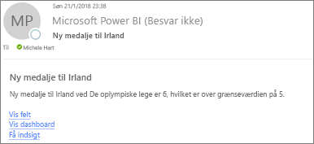
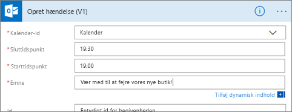

# Integrer databeskeder med Power Automate

Brug [Power Automate](/power-automate/getting-started) til at integrere Power BI med dine foretrukne programmer og tjenester. Med Power Automate opretter du automatiserede arbejdsprocesser for at få meddelelser, synkronisere filer, indsamle data og meget mere. I denne artikel beskrives det hvordan du automatiserer oprettelse af en mail fra en Power BI- databesked.

## Forudsætninger
I denne artikel vises det, hvordan du opretter to forskellige flows; ét fra en skabelon og ét fra bunden. Følg med ved at [oprette en databesked i Power BI](../create-reports/service-set-data-alerts.md) og [tilmelde dig Power Automate](https://flow.microsoft.com/#home-signup). Det er gratis!

## Opret et flow fra en skabelon
I denne opgave skal vi bruge en skabelon til at oprette et enkelt flow, der udløses af en databesked i Power BI (meddelelse).

1. Log på Power Automate (flow.microsoft.com).
2. Vælg **Skabeloner**, søg efter **Power BI** > **Send en mail til en hvilken som helst målgruppe, når en Power BI-databesked udløses**.
   
    :::image type="content" source="media/service-flow-integration/power-automate-templates.png" alt-text="Skærmbillede af Power Automate-skabelonen Send en mail til en hvilken som helst målgruppe, når en Power BI-databesked udløses":::.

### Opbyg flowet
Denne skabelon har én udløser – en Power BI-databesked – og én handling til afsendelse af en mail. Når du vælger et felt, viser Power Automate dynamisk indhold, du kan inkludere.  I dette eksempel inkluderer vi feltværdien og feltets URL-adresse i meddelelsens brødtekst.

1. Vælg **Fortsæt**.

    :::image type="content" source="media/service-flow-integration/power-automate-power-bi-mail.png" alt-text="Skærmbillede af Power Automate, Power BI til mail.":::

1. Vælg en Power BI databesked i feltet **Besked-id**. Hvis du vil vide mere om, hvordan du opretter en besked, skal du læse [Databeskeder i Power BI](../create-reports/service-set-data-alerts.md).
   
    :::image type="content" source="media/service-flow-integration/power-automate-select-alert-id.png" alt-text="Skærmbillede af Vælg en besked i feltet Besked-id.":::
2. Angiv en eller flere gyldige mailadresser.

3. Power Automate opretter automatisk et **emne** og en **brødtekst** til dig, som du kan bevare eller ændre. Brødtekst teksten bruger HTML til formatering.

    :::image type="content" source="media/service-flow-integration/power-automate-autogenerated-email.png" alt-text="Skærmbillede af mailtekst, der er genereret automatisk af Power Automate.":::

1. Når du er færdig med meddelelsen, skal du vælge **Næste trin** eller **Gem**.  Flowet er oprettet og vurderet.  Power Automate giver dig besked, hvis det finder fejl.
2. Hvis der er fundet fejl, skal du vælge **Rediger flow** for at løse dem, ellers skal du vælge **Udført** for at køre det nye flow.
   
   
5. Når databeskeden udløses, sender Power Automate en mail til de angivne adresser.  
   
   

## Opret et flow fra bunden
I denne opgave skal vi oprette et enkelt flow fra bunden, der udløses af en databesked i Power BI (meddelelse).

1. Log på Power Automate (flow.microsoft.com).
2. Vælg **Opret** > **Automatisk flow**.

    :::image type="content" source="media/service-flow-integration/power-automate-create-automated-flow.png" alt-text="Skærmbillede af Power Automate > Opret automatisk flow.":::   
3. Angiv et navn til flowet i **Opret et automatisk flow**.
1. Søg efter **Vælg dit flows udløser** i **Power BI**.
1. Vælg **Power BI – Når en datadrevet besked udløses** > **Opret**.

    :::image type="content" source="media/service-flow-integration/power-automate-build-automated-flow.png" alt-text="Skærmbillede af Opret et automatisk flow.":::

### Byg dit flow
1. Vælg navnet på den vigtige besked i feltet **Besked-id**. Hvis du vil vide mere om, hvordan du opretter en besked, skal du læse [Databeskeder i Power BI](../create-reports/service-set-data-alerts.md).

    :::image type="content" source="media/service-flow-integration/power-automate-select-alert-id-scratch.png" alt-text="Skærmbillede af Vælg navnet på den vigtige besked.":::   

2. Vælg **næste trin**.
   
3. Søg efter **Outlook** > **Opret hændelse** i **Vælg en handling**.

    :::image type="content" source="media/service-flow-integration/power-automate-choose-action-create-event.png" alt-text="Skærmbillede af Vælg en handling for > Opret en hændelse.":::   
4. Udfyld begivenhedens felter. Når du vælger et felt, viser Power Automate dynamisk indhold, du kan inkludere.
   
   
5. Vælg **Opret flow**, når du er færdig.  Power Automate gemmer og evaluerer flowet. Vælg **Udført** for at køre dette flow, hvis der ikke er nogen fejl.  Det nye flow er føjet til din side **Mine flow**.
   
   
6. Når flowet udløses af Power BI-databeskeden, modtager du en Outlook-begivenhedsmeddelelse svarende til denne.
   
    

## Næste trin
* [Kom godt i gang med Power Automate](/power-automate/getting-started/)
* [Indstil databeskeder i Power BI-tjenesten](../create-reports/service-set-data-alerts.md)
* [Indstil databeskeder på din iPhone](../consumer/mobile/mobile-set-data-alerts-in-the-mobile-apps.md)
* Har du flere spørgsmål? [Prøv at spørge Power BI-community'et](https://community.powerbi.com/)
