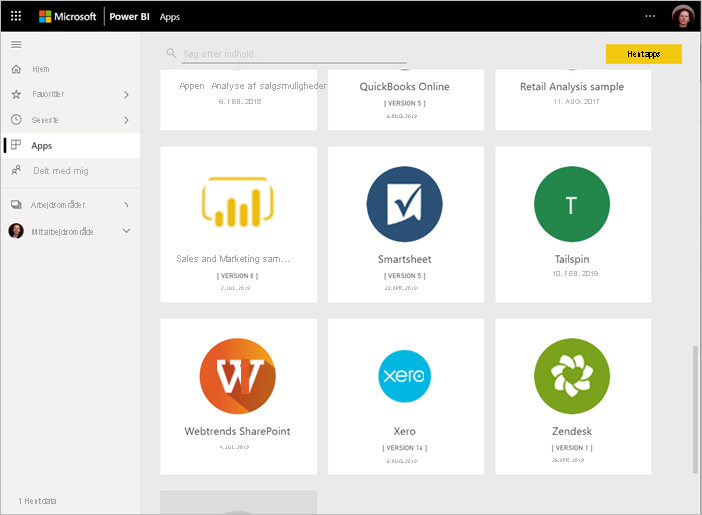
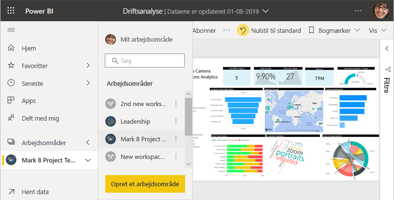
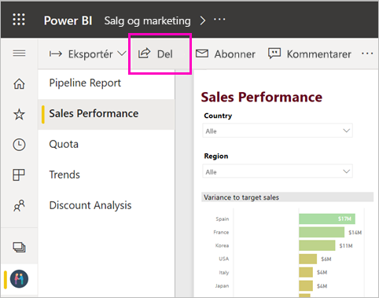
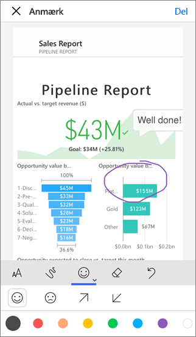
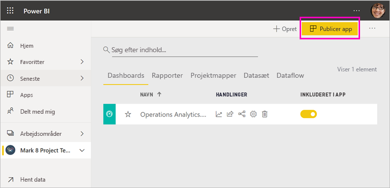
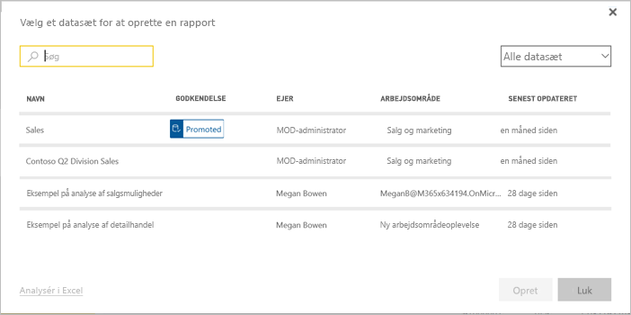

# Måder at samarbejde og dele på i Power BI

Du har oprettet dashboards og rapporter. Måske vil du samarbejde med dine kolleger om dem. Eller måske er du klar til at distribuere til en bredere målgruppe. Hvad er den bedste måde, når du skal samarbejde om dem og dele dem? I denne artikel sammenligner vi dine muligheder.

*Apps i Power BI-tjenesten*

**Samarbejd**

- [Samarbejd med kolleger i *arbejdsområder*](#collaborate-in-a-workspace) for at oprette meningsfulde rapporter og dashboards.
- [Samarbejd i *Microsoft Teams*](#collaborate-in-microsoft-teams).

**Distribuer eller del dashboards og rapporter**

- [*Del dashboards eller rapporter*](#share-dashboards-and-reports) fra Mit arbejdsområde eller et andet arbejdsområde.
- Anmærk og [del fra Power BI-*mobilapps*](#annotate-and-share-from-the-power-bi-mobile-apps).
- Gruppér dashboards og rapporter i arbejdsområder i *apps*, og [distribuer dem](#distribute-insights-in-an-app) til en større gruppe eller hele organisationen.
- [Integrer rapporter](#embed-reports-in-secure-portals-or-public-web-sites) på *sikre portaler* eller *offentlige websteder*.
- [Udskriv rapporter](#print-or-save-as-pdf-or-other-static-file).
- [Opret et *skabelonprogram*](#create-and-deploy-template-apps), som du kan distribuere til eksterne Power BI-brugere via Microsoft AppSource.
 
**Del data**

- [Opret *delte datasæt*](#share-a-dataset), som kolleger kan bruge som udgangspunkt for deres egne rapporter i deres egne arbejdsområder.
- [Opret *dataflow*](#create-dataflows) som en måde at dele en fælles datakilde på.

Uanset hvilken indstilling du vælger, skal du bruge en [Power BI Pro-licens](../fundamentals/service-features-license-type.md) for at dele dit indhold, ellers skal indholdet være i en [Premium-kapacitet](../admin/service-premium-what-is.md). Licenskrav varierer alt efter de kolleger, der får vist dine dashboards, afhængigt af den valgte indstilling. De følgende afsnit går længere ned i detaljen. 

## Samarbejde i et arbejdsområde

Når teams arbejder sammen, skal de have adgang til de samme dokumenter, så de nemmere kan samarbejde. I arbejdsområder i Power BI deler teams ejerskabet og administrationen af de dashboards, rapporter, datasæt og projektmapper, der er vigtige for dem. Nogle gange organiserer Power BI-brugere deres arbejdsområder baseret på organisationens strukturer eller opretter dem til specifikke projekter. Andre organisationer bruger stadig flere arbejdsområder til at gemme forskellige versioner af rapporter eller dashboards, de bruger. 

I arbejdsområder findes der roller, der bestemmer, hvilke tilladelser dine kolleger har. Brug disse roller til at bestemme, hvem der kan administrere arbejdsområdet, redigere eller distribuere indhold eller blot få vist indhold. Læs mere om [roller i de nye arbejdsområder](service-new-workspaces.md#roles-in-the-new-workspaces).

Arbejdsområder er mere velegnede til samarbejde end Mit arbejdsområde, da de gør det muligt at eje indhold i fællesskab. Du og hele dit team kan nemt foretage opdateringer eller give andre adgang. Mit arbejdsområde er mest velegnet til enkeltpersoner til skiftende eller personligt indhold.

Forestil dig, at du har et færdigt dashboard, du skal dele med dine kolleger. Hvordan kan du bedst give dem adgang til dashboardet? Svaret afhænger af en række faktorer. 

- Hvis kolleger skal holde dashboardet opdateret eller skal have adgang til alt indholdet i arbejdsområdet, skal du føje dem til arbejdsområdet som medlemmer eller bidragydere. 
- Hvis kolleger kun har brug for at få vist indholdet i arbejdsområdet, kan du tilføje dem som læsere.
- Hvis kolleger blot skal have vist dashboardet og ikke alt indholdet i arbejdsområdet, kan du dele dashboardet med dem direkte.
- Hvis dashboardet er en del af et dashboard- og rapportsæt, du skal distribuere til mange kolleger, er den bedste løsning sandsynligvis at publicere en *app*.

Læs om, hvordan du [opretter det nye arbejdsområde](service-create-the-new-workspaces.md). 

## Samarbejd i Microsoft Teams

Øg det databaserede samarbejde i din organisation ved at integrere dine Power BI-rapporter og sideinddelte Power BI-rapporter i Microsoft Teams. Power BI-tjenesten indeholder knappen **Chat i teams** for rapporter. Du kan tilføje separate Power BI-faner for hver enkelt rapport og give hver fane rapportens navn eller et andet navn. 

Når du føjer en Power BI-rapportfane til Microsoft Teams, opretter Teams automatisk en fanesamtale til rapporten. Alle i den pågældende Microsoft Teams-kanal kan se og diskutere rapporten i samtalen. 

:::image type="content" source="media/service-how-to-collaborate-distribute-dashboards-reports/power-bi-teams-conversation-tab.png" alt-text="Fanen Microsoft Teams-samtale":::

Læs mere om [samarbejde i Microsoft Teams med Power BI](service-collaborate-microsoft-teams.md).

## Del dashboards og rapporter

Lad os sige, at din rapport i Power BI Desktop er klar, og du gerne vil have, at andre får adgang til den. En måde at give andre adgang til den på er ved at *dele* den i Power BI-tjenesten. Du publicerer den i dit eget Mit arbejdsområde eller et andet arbejdsområde. Måske opretter du et dashboard, der følger med, og du er klar.

Du skal have en Power BI Pro-licens for at dele dit indhold. Det samme skal de personer, du deler med, eller også skal indholdet være i et arbejdsområde i en [Premium-kapacitet](../admin/service-premium-what-is.md). Når du deler et dashboard eller en rapport, kan modtagerne få elementet vist og interagere med indholdet, men de kan ikke redigere det. Hvis du giver dem tilladelse, kan de redigere elementet, oprette en kopi af det og dele det med deres kolleger. De kan se de samme data som dig i dashboardet eller rapporten. De har adgang til alle dataene i det underliggende datasæt, medmindre der er anvendt [sikkerhed på rækkeniveau (RLS)](../admin/service-admin-rls.md).

Du kan også dele med brugere uden for din organisation. De kan også få vist og interagere med dashboardet eller rapporten, men de kan ikke dele det. 

Læs om, hvordan du [deler dashboards og rapporter ](service-share-dashboards.md) fra Power BI-tjenesten. Du kan også læse om, hvordan du føjer et filter til et link og [deler en filtreret visning af din rapport](service-share-reports.md).

## Anmærk og del fra Power BI-mobilapps

Du kan i Power BI-mobilapps til iOS- og Android-enheder anmærke et felt, rapport eller visuelt element og derefter dele det med alle pr. mail.

Du er ved at dele et snapshot af feltet, rapporten eller visual'et. Dine modtagere kan se det, præcis som det var, da du sendte mailen. Mailen indeholder også et link til dashboardet eller rapporten. Hvis modtagerne har en Power BI Pro-licens, eller hvis indholdet er i [Premium-kapacitet](../admin/service-premium-what-is.md), og du allerede har delt indholdet med dem, kan de åbne det. Du kan sende snapshots af felter til alle, ikke kun til kolleger i samme maildomæne.

Læs mere om [anmærkning og deling af felter, rapporter og visuals](../consumer/mobile/mobile-annotate-and-share-a-tile-from-the-mobile-apps.md) fra iOS- og Android-mobilapps.

Du kan også [dele et snapshot af et felt](../consumer/mobile/mobile-windows-10-phone-app-get-started.md) fra Power BI-appen til Windows 10-enheder, men ikke anmærke det.

## Distribuer indsigt i en app

Lad os sige, at du gerne vil distribuere dit dashboard til en bred målgruppe i organisationen. Du og dine kolleger har oprettet et *arbejdsområde*, derefter har I oprettet og forfinet dashboards, rapporter og datasæt i arbejdsområdet. Nu skal du vælge dashboards og rapporter og publicere dem som en *app* enten i en gruppe eller i hele organisationen.

Det er nemt at finde og installere apps i Power BI-tjenesten ([https://app.powerbi.com](https://app.powerbi.com)). Du kan sende virksomhedens brugere et direkte link til appen, eller de kan søge efter den i AppSource. Hvis din Power BI-administrator giver dig tilladelser, kan du automatisk installere en app på dine kollegers Power BI-konti. Læs om, hvordan du [publicerer en app](service-create-distribute-apps.md).

Efter at de har installeret en app, kan de få den vist i deres browser eller på deres mobilenhed.

Brugerne kan kun se din app, hvis de har en Power BI Pro-licens, eller hvis appen er lagret i en Power BI Premium-kapacitet. Læs [Hvad er Power BI Premium?](../admin/service-premium-what-is.md) for at få flere oplysninger.

Du kan også publicere apps til personer uden for organisationen. De kan få vist og interagere med appindholdet, men de kan ikke dele det med andre. Du kan nu oprette *skabelonapps* og udrulle dem til Power BI-kunder.

## Integrer rapporter i sikre portaler eller på offentlige websteder

### Integrer i sikre portaler

Du kan integrere Power BI-rapporter i portaler eller på websteder, hvor dine brugere forventer at se dem.  
Med indstillingerne **Integrer i SharePoint Online** og **Integrer** i Power BI-tjenesten kan du integrere rapporter for dine interne brugere på en sikker måde. Uanset hvilken indstilling du vælger, håndhæver Power BI alle tilladelser og al datasikkerhed, før brugerne ser indhold. Den person, der får vist rapporten, skal have den rette licens.  

- **Integrer i SharePoint Online** fungerer sammen med Power BI-webdelen til SharePoint Online. Indstillingen giver en enkeltlogon-oplevelse med kontrol over, hvordan rapporten er integreret. Læs mere om [integrering i SharePoint Online](service-embed-report-spo.md).
- Indstillingen **Integrer** fungerer sammen med en hvilken som helst portal eller et hvilket som helst websted, der understøtter integrering af indhold ved hjælp af en URL-adresse eller en iFrame. Læs mere om indstillingen [Integrer](service-embed-secure.md).

### Publicer på offentlige websteder

**Publicer på internettet** giver dig mulighed for at publicere Power BI-rapporter på hele internettet ved at integrere visualiseringer i blogindlæg, på websteder, på sociale medier og andre steder til onlinekommunikation. Alle på internettet kan få vist dine rapporter, og du har ingen kontrol over, hvem der ser, hvad du har publiceret. Modtagerne skal ikke bruge en Power BI-licens. Publicering til internettet er kun tilgængeligt for rapporter, som du kan redigere. Du kan ikke publicere rapporter til internettet, hvis de er delt med dig, eller hvis de er i en app. Læs om, hvordan du [publicerer på internettet](service-publish-to-web.md).

>[!Warning]
>Brug kun [Publicer på internettet](service-publish-to-web.md), hvis du vil dele indhold offentligt, ikke til deling internt.

## Udskriv eller gem som pdf-fil eller en anden statisk fil

Fra Power BI-tjeneste kan du udskrive, gemme som PDF eller gemme som et andet statisk filformat, f. eks. et af følgende elementer:

- Et helt dashboard
- Et dashboardfelt
- En rapportside
- En sideinddelt rapport
- En visualisering fra Power BI-tjenesten. 

Du kan kun udskrive Power BI-rapporter én side ad gangen. Du kan ikke udskrive hele rapporten på én gang. Læs om, hvordan du kan [udskrive eller gemme en rapport eller et dashboard som en statisk fil](../consumer/end-user-print.md).

Sideinddelte rapporter er derimod designet til at skulle udskrives. Læs en [sammenligning af Power BI-rapporter og sideinddelte rapporter](../paginated-reports/paginated-reports-report-builder-power-bi.md#compare-power-bi-reports-and-paginated-reports) for at få flere oplysninger. 

## Opret og udrul skabelonapps

*Skabelonapps* er designet til at blive distribueret offentligt, ofte i Microsoft AppSource. Du opretter en app, og med kun lidt eller ingen kode kan du udrulle den til Power BI-kunder. Dine kunder opretter forbindelse til deres egne data og bruger deres egne konti. Læs mere om [Power BI-skabelonapps](../connect-data/service-template-apps-overview.md).

## Deling af et datasæt

Lad os indrømme det, nogle personer er bare bedre til at oprette veludformede datamodeller i høj kvalitet i deres rapporter. Måske er det dig? Hele organisationen kan drage nytte af at benytte de samme veludformede datamodeller. *Delte datasæt* udfylder denne rolle. Når du opretter en rapport med en datamodel, som alle skal bruge, kan du gemme rapporten i Power BI-tjenesten og give tilladelse til at bruge den til de rette personer. De kan derefter bygge deres rapporter på dit datasæt. På den måde baserer alle deres rapporter på de samme data og ser den samme "version af sandheden".

Læs mere om [oprettelse og brug af delte datasæt](../connect-data/service-datasets-across-workspaces.md).

## Opret dataflow

*Dataflow* er en måde, hvorpå du selv kan samle data fra forskellige kilder og forberede dem til modellering. Analytikere opretter dataflow for at indtage, transformere, integrere og forbedre big data. De opretter og administrerer dataflow i arbejdsområder i Power BI-tjenesten. Læs om [selvbetjent dataforberedelse med dataflow](../transform-model/dataflows/dataflows-introduction-self-service.md).

## Overvejelser og begrænsninger

- Du kan ikke dele rapporter fra Power BI-rapportserver. I stedet kan du oprette [abonnementer til dig selv eller andre](/sql/reporting-services/working-with-subscriptions-web-portal).

## Næste trin

- [Del dashboards med kolleger og andre](service-share-dashboards.md)
- [Opret og publicer en app i Power BI](service-create-distribute-apps.md)
- [Integrer en rapport på en sikker portal eller et websted](service-embed-secure.md)

Har du feedback? Indsend dine forslag på [webstedet for Power BI-community'et](https://community.powerbi.com/).

Har du flere spørgsmål? [Prøv at spørge Power BI-community'et](https://community.powerbi.com/)