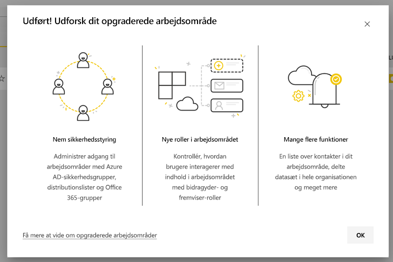
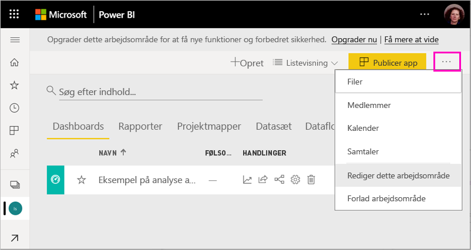
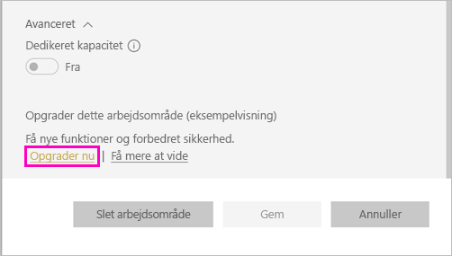
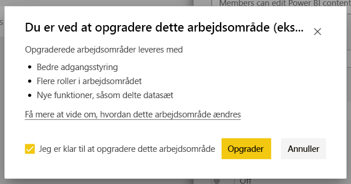
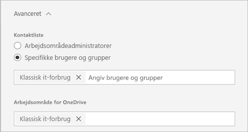
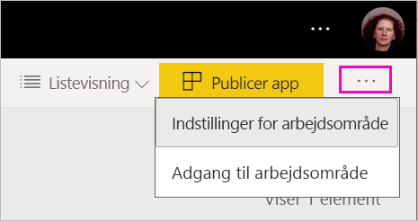
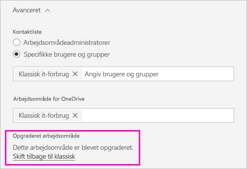
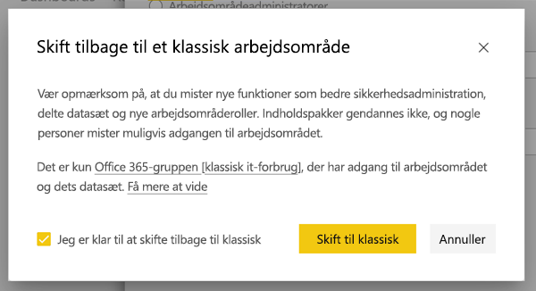
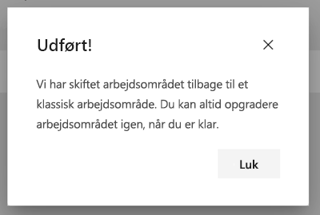

# Opgrader klassiske arbejdsområder til de nye arbejdsområder i Power BI

I denne artikel forklares det, hvordan du opgraderer eller *overfører* et klassisk arbejdsområde til den nye arbejdsområdeoplevelse. Du kan opgradere et hvilket som helst klassisk arbejdsområde. De nye arbejdsområder har mere detaljerede arbejdsområderoller, så du bedre kan administrere adgang til indhold. Du har også større fleksibilitet i forbindelse med administration af opgraderede arbejdsområder, da de er mere løst forbundet med deres oprindelige Microsoft 365-gruppe. Få mere at vide [om den nye arbejdsområdeoplevelse](service-new-workspaces.md).

>[!NOTE]
>Opgradering af et arbejdsområde er tilgængelig som en offentlig prøveversion. 

Der kan dog være ændringer i dit arbejdsområde, som du skal være opmærksom på og planlægge. Indholdspakker understøttes f.eks. ikke i den nye arbejdsområdeoplevelse. Se afsnittet [Overvejelser og begrænsninger i forbindelse med opgradering](#upgrade-considerations-and-limitations) senere i denne artikel.

## Ting, der skal planlægges før opgradering

Du skal gøre flere ting *efter* opgraderingen. Det er bedst at planlægge dem, *før* du opgraderer:
- Gennemse adgangslisten, og forstå [tilladelserne efter opgradering](#permissions-after-upgrade).
- Gennemse [listen over kontakter](#modify-the-contact-list), og sørg for, at den er angivet, som du ønsker det.
- Få mere at vide [om den nye arbejdsområdeoplevelse](service-new-workspaces.md), hvis du ikke kender den i forvejen.

## Opgrader et klassisk arbejdsområde

Enhver arbejdsområdeadministrator kan opgradere arbejdsområdet. Hvis du vil være administrator af et klassisk arbejdsområde, skal du være ejer af den underliggende Microsoft 365-gruppe. Hvis du vil opgradere et arbejdsområde, skal du følge disse trin:

1. Vælg **Flere indstillinger** ( **...** ) > **Flere indstillinger** på listen over arbejdsområder.

    

1. Udvid **Avanceret**, og vælg **Opgrader nu**.

    

1. Gennemse oplysningerne i dialogboksen. Du kan se advarsler, hvis du har publiceret eller installeret indholdspakker i arbejdsområdet. Når du er klar, skal du markere **Jeg er klar til at opgradere dette arbejdsområde** og derefter vælge **Opgrader**.

    

2. Under opgraderingen kan du se meddelelsen **Opgraderer**. Det tager normalt mindre end et minut at opgradere dit arbejdsområde.

1. Når opgraderingen er afsluttet, kan du se dialogboksen **Handling lykkedes**. Du kan se din nye arbejdsområdebruger med samme navn og indhold. Vi anbefaler, at du læser [Organiser arbejde i nye arbejdsområder i Power BI](service-new-workspaces.md), så du er bekendt med, hvordan nye arbejdsområder adskiller sig fra klassiske arbejdsområder.

### Indvirkning på andre arbejdsområdebrugere

Vi anbefaler, at du opgraderer uden for arbejdstiden, når der kun er få brugere, der aktivt får vist eller redigerer elementer i arbejdsområdet.

Brugere, der aktivt bruger arbejdsområdet, bliver bedt om at opdatere deres browser. Brugere, der redigerer en rapport, får mulighed for at gemme, før de opdaterer.

## Overvejelser og begrænsninger i forbindelse med opgradering

- Efter opgraderingen vises indholdet af det klassiske arbejdsområde i det nye arbejdsområde. Det er også angivet i **Delt med mig**.
- URL-adresserne og id'erne for dit arbejdsområde, indholdet i det og den app, der er publiceret fra arbejdsområdet, ændres ikke. Indhold fra indholdspakker, der er installeret i dit arbejdsområde, håndteres separat. Se [Indholdspakker under opgradering](#content-packs-during-upgrade) i denne artikel for at få flere oplysninger.
- Indholdspakker understøttes ikke i den nye arbejdsområdeoplevelse. Læs afsnittene om [publicerede indholdspakker](#published-content-packs) og [installerede indholdspakker](#installed-content-packs) for at få mere at vide om, hvordan de skal håndteres under opgraderingen. Vi anbefaler, at du sletter indholdspakker, der er installeret eller publiceret i arbejdsområdet, før du opgraderer.
- Microsoft 365-gruppen til dit klassiske arbejdsområde påvirkes ikke af opgraderingen af arbejdsområdet i Power BI. Alle teams, SharePoint-websteder, postkasser og andre ressourcer, der administreres af Microsoft 365, ændres ikke. De forbliver intakte, når du opgraderer dit Power BI-arbejdsområde. Microsoft 365-gruppen findes som før.
- Den måde, dit arbejdsområde sikres på efter opgraderingen, er ændret. Se afsnittet [Tilladelser efter opgradering](#permissions-after-upgrade) for at få flere oplysninger.
- Der er mulighed for at **gå tilbage til et klassisk arbejdsområde**, hvis du har brug for det. Der er dog visse aspekter af dit arbejdsområde, der ikke gendannes helt, som de var, før de blev opgraderet. Hvis du begynder at bruge funktioner, der kun fungerer i den nye arbejdsområdeoplevelse, kan du ikke gå tilbage. Muligheden for at gå tilbage er tilgængelig i 30 dage, efter at du har opgraderet.

## Tilladelser efter opgradering

Vælg **Adgang** på menulinjen øverst på listen over arbejdsområder for at gennemse tilladelser efter opgraderingen.

Alle ejere af Microsoft 365-grupper føjes individuelt til rollen Administrator for det opgraderede arbejdsområde. Selve Microsoft 365-gruppen føjes til en arbejdsområderolle. Den rolle, som den føjes til, afhænger af, om det klassiske arbejdsområde er *skrivebeskyttet* eller *i læse/skrivetilstand*:

- Når arbejdsområdet er indstillet til **Medlemmer kan redigere Power BI-indhold**, føjes Microsoft 365-gruppen til listen med arbejdsområdets adgangsliste med rollen **Medlem** efter opgraderingen.
- Når arbejdsområdet er indstillet til **Medlemmer kan kun læse Power BI-indhold**, føjes Microsoft 365-gruppen til listen med arbejdsområdets adgangsliste med rollen **Seer** efter opgraderingen.

Da Microsoft 365-gruppen har fået tildelt en rolle i arbejdsområdet, har alle brugere, der føjes til Microsoft 365-gruppen efter opgraderingen, den pågældende rolle i arbejdsområdet. Men hvis du føjer nye ejere til Microsoft 365-gruppen efter opgraderingen, har de ikke rollen Administrator i arbejdsområdet.

### Forskelle i roller før og efter opgradering

Arbejdsområderoller er forskellige i det klassiske og det nye arbejdsområde. Den nye arbejdsområdeoplevelse giver dig mulighed for at tildele arbejdsområderoller til Microsoft 365-grupper, sikkerhedsgrupper og distributionslister.

- **Medlemmer** kan dele individuelle elementer og give adgang til hele arbejdsområdet via rollerne Medlem, Bidragyder eller Seer
- **Seere** kan kun få vist indhold og kan ikke eksportere underliggende data eller analysere i Excel i forbindelse med nogen arbejdsområdedatasæt, medmindre de har tilladelsen Opret.

Alle brugere, der har adgang til elementer i arbejdsområdet via deling eller apptilladelse, har fortsat adgang til disse elementer. Alle, der har adgang til arbejdsområdet, har også adgang til den app, der er publiceret fra arbejdsområdet. Disse brugere vises ikke på appens adgangsliste.

Det anbefales, at du evaluerer, om du vil bruge den nye Bidragyder-rolle. Når du har opgraderet, kan du ændre Microsoft 365-gruppen, så den har rollen Bidragyder i ruden Adgang.

Efter opgraderingen kan du overveje at oprette en sikkerheds- eller Microsoft 365-gruppe eller en distributionsliste til arbejdsområdeadministratorer i stedet for at administrere adgang via rolletildelinger til individuelle brugere.

Læs mere om [roller i de nye arbejdsområder](service-new-workspaces.md#roles-in-the-new-workspaces).

## Licens efter opgradering

Brugere med arbejdsområderollerne Administrator, Medlem eller Bidragyder skal bruge en Power BI Pro-licens for at få adgang til arbejdsområdet.

Hvis arbejdsområdet er i den delte kapacitet, skal brugere med rollen Seer også have en Power BI Pro-licens for at få adgang til arbejdsområdet. Men hvis arbejdsområdet er i en Premium-kapacitet, behøver brugere med rollen Seer ikke en Pro-licens for at få adgang til arbejdsområdet.

## Andre nye funktioner i arbejdsområdet

Den nye arbejdsområdeoplevelse har funktioner, som de klassiske arbejdsområder ikke har. Én forskel er muligheden for at angive en liste over kontakter, der ikke er arbejdsområdeadministratorer eller -ejere. Én lighed er, at den stadig har forbindelse til Microsoft 365-gruppens SharePoint-dokumentbiblioteket.

### Modificer listen over kontakter

1. Vælg **Indstillinger** på menulinjen øverst på listen over arbejdsområder for at få adgang til arbejdsområdeindstillinger.

    

2. Under **Avanceret** er arbejdsområdet **Kontaktliste** konfigureret til at være den Microsoft 365-gruppe, som arbejdsområdet blev opgraderet fra. Du kan føje flere brugere eller grupper til listen over kontakter eller ændre den til arbejdsområdeadministratorer.

    

### OneDrive for arbejdsområdet 

Efter opgraderingen har **OneDrive** for arbejdsområdet forbindelse til SharePoint-dokumentbiblioteket for Microsoft 365-gruppen. Dette dokumentbibliotek vises som indstillingen **OneDrive** i oplevelsen **Hent data > Filer** visning. Ikke alle brugere af arbejdsområdet har tilladelse til dette dokumentbibliotek, hvis de ikke er i Microsoft 365-gruppen.

## Indholdspakker under opgradering

Den nye arbejdsområdeoplevelse understøtter ikke indholdspakker. Brug i stedet apps og delte datasæt til at distribuere indhold i arbejdsområdet. Det anbefales, at du fjerner udgivne eller installerede indholdspakker fra arbejdsområdet, før du opgraderer. Men hvis der er publiceret eller installeret indholdspakker, når du opgraderer, forsøger opgraderingsprocessen at bevare indholdet som beskrevet senere i denne artikel.  Det er ikke muligt at gendanne indholdspakken eller tilknytningen af indhold til indholdspakken, når du har opgraderet.

### Publicerede indholdspakker

Indholdspakker, der er publiceret fra arbejdsområdet, fjernes under opgraderingen. Du kan ikke publicere eller opdatere dem efter opgraderingen, selvom du vender tilbage til det klassiske arbejdsområde. Hvis andre har installeret din indholdspakke i deres eget arbejdsområde efter opgraderingen, kan de se en kopi af indholdspakkens indhold i deres arbejdsområde. Se afsnittet **Installerede indholdspakker** for at få flere oplysninger.

### Installerede indholdspakker

Når du opgraderer dit arbejdsområde, eller når det arbejdsområde, indholdspakken er publiceret fra, opgraderes, udføres der vigtige ændringer af installerede indholdspakker. Efter opgraderingen indeholder dit arbejdsområde en kopi af indholdspakkens indhold. Den har forbindelse til det oprindelige datasæt i det oprindelige arbejdsområde.

Der er dog nogle vigtige ændringer:

- Indholdet opdateres ikke længere, hvis indholdspakken opdateres.
- URL-adresserne og element-id'erne ændres og kræver, at alle bogmærker eller links, du har delt med andre, opdateres.
- Alle brugertilpasninger i den oprindelige indholdspakke fra dit arbejdsområde går tabt. Tilpasninger omfatter abonnementer, beskeder, personlige bogmærker, vedvarende filtre og favoritter.
- Nye brugere har muligvis ikke adgang til de datasæt, der fandtes i indholdspakken. Du skal samarbejde med ejeren af datasættet for at sikre, at arbejdsområdebrugerne har adgang til dataene.

## Gå tilbage til et klassisk arbejdsområde

Som en del af opgraderingsoplevelsen har du mulighed for at gå tilbage til et klassisk arbejdsområde i 30 dage efter opgraderingen. Denne egenskab gendanner tilknytningen mellem arbejdsområdeindhold og den oprindelige Microsoft 365-gruppe. Den er tilgængelig, hvis organisationen støder på store problemer under brugen af den nye arbejdsområdefunktionalitet. Der er dog begrænsninger. Læs [Overvejelser i forbindelse med at skifte tilbage til klassisk](#considerations-for-switching-back-to-classic) i denne artikel først.

Hvis du vil gå tilbage, skal du være ejer af den Microsoft 365-gruppe, arbejdsområdet var knyttet til, inden det blev opgraderet. Følg disse trin:

1. Vælg **Flere indstillinger** ( **...** ) > **Indstillinger for arbejdsområde** på listen over arbejdsområder.

    

1. Udvid **Avanceret**, og vælg **Skift tilbage til klassisk**. Hvis denne indstilling ikke er tilgængelig for dig, skal du se [Overvejelser i forbindelse med at skifte tilbage til klassisk](#considerations-for-switching-back-to-classic) i denne artikel.

    

1. Når du er klar, skal du markere afkrydsningsfeltet **Jeg er klar til at skifte tilbage til klassisk** og vælge **Skift til klassisk**. Du får muligvis vist advarsler eller blokeringer i denne dialogboks. Læs [Overvejelser i forbindelse med at skifte tilbage til klassisk](#considerations-for-switching-back-to-classic) i denne artikel, hvis du støder på disse problemer.

    

1. Når skiftet tilbage er fuldført, vises der en bekræftelsesdialogboks.

    

### Overvejelser i forbindelse med at skifte tilbage til klassisk

Du kan ikke skifte tilbage, hvis et af følgende udsagn om arbejdsområdet er sandt:

- Microsoft 365-gruppen blev slettet.
- Det er mere end 30 dage siden, du har opgraderet.
- Datasæt i arbejdsområdet bruges af rapporter eller dashboards i andre arbejdsområder. Hvordan opstår denne situation? Lad os sige, at du har udgivet en indholdspakke fra arbejdsområdet før opgraderingen, og at nogen har installeret indholdspakken i et andet arbejdsområde. Umiddelbart efter opgraderingen bruges datasættene af rapporter og dashboards i den pågældende indholdspakke.
- Arbejdsområdet er en del af en administrationspipeline for en programlivscyklus.
- Arbejdsområdet bruges til skabelonapps.
- Arbejdsområdet bruger funktionen Store modeller.
- Arbejdsområdet bruger den nye funktion Forbrugsdata.

Når du skifter tilbage til et klassisk arbejdsområde, gendanner du ikke en nøjagtig kopi af det oprindelige arbejdsområde. Følgende ændringer bliver foretaget:

- Tilladelser til arbejdsområdet angives af den Microsoft 365-gruppe, som det opgraderede arbejdsområde oprindeligt havde forbindelse til.
  - Alle administratorer af Microsoft 365-gruppen bliver administratorer af det klassiske arbejdsområde.
  - Alle medlemmer af Microsoft 365-gruppen bliver medlemmer af det klassiske arbejdsområde. Hvis det klassiske arbejdsområde er indstillet til **Medlemmer kan kun læse Power BI-indhold**. Denne indstilling gendannes.
  - Alle brugere eller brugergrupper, der er føjet til arbejdsområdet, efter at opgraderingen er fuldført (uden for Microsoft 365-gruppen), mister adgangen til arbejdsområdet. Føj dem til Microsoft 365-gruppen for at give dem adgang. Bemærk, at Microsoft 365-grupper ikke tillader indlejring af sikkerheds-eller distributionsgrupper i medlemskabet.
  - Brugere, der har fået adgang til appen for arbejdsområdet, har stadig adgang til appen.
  - Brugere, der har fået adgang til elementer i arbejdsområdet via deling, har stadig adgang til dem.
- Indholdspakker, der blev publiceret fra det klassiske arbejdsområde før opgraderingen, gendannes ikke.
- Indholdspakker, der blev installeret i det klassiske arbejdsområde før opgraderingen, gendannes ikke.
- Abonnementer, der er oprettet af brugere i arbejdsområdet efter opgradering, fjernes. Abonnementer, der fandtes før opgraderingen, fungerer fortsat som forventet.
- Databeskeder bevares ikke. De fjernes.
- Hvis du har omdøbt arbejdsområdet efter opgraderingen, gendannes navnet på arbejdsområdet, så det svarer til navnet på Microsoft 365-gruppen.
- Igangværende handlinger, f. eks. opdateringer, påvirkes ikke af opgraderingen af arbejdsområdet.

## Administrer overførsel til de nye arbejdsområder for din lejer 

Nogle organisationer ønsker at flytte mange eller alle arbejdsområder til den nye arbejdsområdeoplevelse. Værktøjet til opgradering af arbejdsområde gør det muligt for arbejdsområdeadministratorer at opgradere. For organisationer, der vil administrere denne, kan de udføre følgende trin.

1. Listen over arbejdsområder i Power BI-administrationsportalen og den tilsvarende API indeholder en liste over alle arbejdsområder i Power BI. Klassiske arbejdsområder vises som typen Gruppe på listen.
2. Du skal samarbejde med de enkelte gruppeejere eller din administrator i Microsoft 365 for at få dem til at opgradere arbejdsområdet. Hvis du vil opgradere arbejdsområdet, skal du være ejer af gruppen.

Funktionen til opgradering af arbejdsområdet indeholder ikke værktøjer til masseopgradering eller programmatisk opgradering. Derudover vises nye Microsoft 365-grupper, der er oprettet i din organisation, stadig i Power BI.
   
   
## Kendte problemer

Der er flere kendte problemer, som kan opstå efter opgraderingen:
- Du får muligvis vist advarselsdialogboksen "Modellen kunne ikke indlæses". Denne meddelelse vises fejlagtigt og kan ignoreres. 
- Nogle navne på arbejdsområder er måske anderledes end før opgraderingen. I det tilfælde er navnet på arbejdsområdet enten gendannet til et tidligere navn, eller navnet på arbejdsområdet er tomt. Du løser dette problem ved at omdøbe arbejdsområdet til det ønskede navn.
- I et arbejdsområde, hvor der var installeret en indholdspakke, få du måske vist yderligere dashboards, som ikke var synlige før opgraderingen. I det tilfælde er en indholdspakke muligvis ikke opdateret for nylig. Du kan roligt fjerne disse dashboards.

## Næste trin

* [Organiser arbejde i de nye arbejdsområdeoplevelser](service-new-workspaces.md)
* [Opret de nye arbejdsområder](service-create-the-new-workspaces.md)
* [Opret klassiske arbejdsområder](service-create-workspaces.md)
* Har du spørgsmål? [Prøv at spørge Power BI-community'et](https://community.powerbi.com/)
