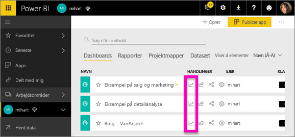
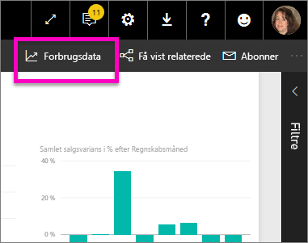
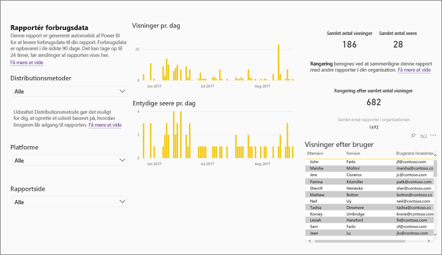
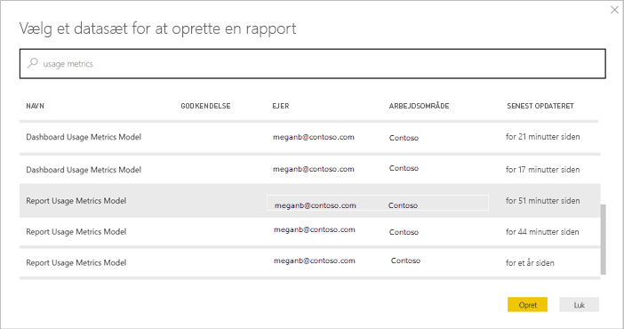
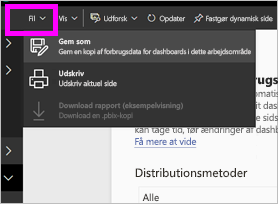
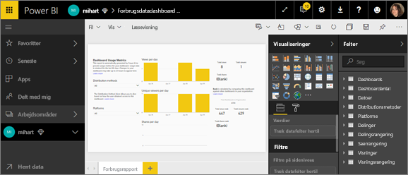
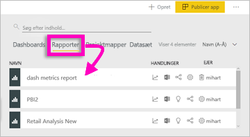
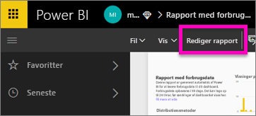

# Overvåg forbrugsdata i klassiske arbejdsområder

Forbrugsdata hjælper dig med at forestå indvirkningen af dashboards og rapporter. Når du kører enten forbrugsdata for dashboards eller rapporter, opdager du, hvordan disse dashboards og rapporter anvendes i hele organisationen: Hvem bruger dem og til hvilket formål. I denne artikel beskrives rapporter om forbrugsdata for [klassiske arbejdsområder](service-create-workspaces.md). Hvis dine rapporter er i et af de nye arbejdsområder, skal du se artiklen [Overvåg forbrugsdata i den nye arbejdsområdeoplevelse](service-modern-usage-metrics.md)  

Forbrugsdatarapporter er skrivebeskyttede. Du kan dog kopiere en forbrugsdatarapport. Når du kopierer den, oprettes en almindelig Power BI-rapport, som du kan redigere. Du kan også udarbejde dine egne rapporter i Power BI Desktop, der er baseret på det underliggende datasæt, der indeholder forbrugsdata for alle dashboards eller alle rapporter i et arbejdsområde. Som udgangspunkt viser den kopierede rapport kun forbrugsdata for det valgte dashboard eller den valgte rapport. Du kan fjerne standardfilteret og få adgang til det underliggende datasæt med alle forbrugsdata for det valgte arbejdsområde. Du kan se endda se navnene på specifikke brugere, hvis din administrator har tilladt dette.

> [!NOTE]
> Forbrugsdata sporer brugen af rapporter, som er integreret i SharePoint Online. Forbrugsdata sporer dog ikke dashboards og rapporter, der er integreret via processerne "brugerens egne legitimationsoplysninger" eller "appens egne legitimationsoplysninger". Forbrugsdata sporer heller ikke brugen af rapporter, der er integreret via [publicer på internettet](service-publish-to-web.md).

## Hvorfor er forbrugsdata vigtige?

At vide, hvordan dit indhold bruges, hjælper dig med at demonstrere din indvirkning og prioritere din indsats. Dine forbrugsdata kan vise, at en af dine rapporter bruges dagligt af en meget stor del af organisationen, og de kan vise, at et dashboard, du oprettede, slet ikke bruges. Denne type feedback er uvurderlig til styring af din arbejdsindsats.

Du kan kun køre forbrugsdatarapporter i Power BI-tjenesten. Men hvis du gemmer en rapport med forbrugsdata eller fastgør den til et dashboard, kan du åbne og interagere med denne rapport på mobilenheder.

## Forudsætninger

- Du skal have en Power BI Pro-licens for at køre og få adgang til forbrugsdata. Forbrugsdatafunktionen henter dog forbrugsoplysninger fra alle brugere, uanset hvilken licens de er tildelt.
- Hvis du vil have adgang til forbrugsdata for et bestemt dashboard eller en bestemt rapport, skal du have redigeringsadgang til det pågældende dashboard eller den pågældende rapport.
- Din Power BI-administrator skal have aktiveret forbrugsdata for oprettere af indhold. Din Power BI-administrator kan også have aktiveret indsamling af brugerspecifikke data i forbrugsdata. Få mere at vide om, hvordan du [aktiverer disse indstillinger på administrationsportalen](../admin/service-admin-portal.md#control-usage-metrics). 

## Få vist en rapport over forbrugsdata

1. Start i arbejdsområdet, der indeholder dashboardet eller rapporten.
2. Vælg ikonet for **Forbrugsdata**  på indholdslisten til arbejdsområdet eller fra selve dashboardet eller rapporten.

    

    
3. Den første gang, du gør dette, opretter Power BI rapporten med forbrugsdata og giver dig besked, når den er klar.

    
4. Vælg **Få vist forbrugsdata** for at se resultaterne.

    Forbrugsdata er en stærk partner, når du arbejder på at udrulle og vedligeholde Power BI-dashboards og -rapporter. Har du overvejet, hvilke sider af din rapport der er mest nyttige, og hvilke du bør udfase? Opret udsnit efter **Rapportside** for at finde ud af det. Har du overvejet, om du skal oprette et mobilt layout til dashboardet? Opret udsnit efter **Platforme** for at finde ud af, hvor mange brugere der tilgår dit indhold via mobilapps vs. via en webbrowser.

5. Du kan også holde markøren over en visualisering og vælge ikonet med tegnestiften for at føje visualiseringen til et dashboard. Eller du kan vælge **Fastgør dynamisk side** øverst på menulinjen for at føje hele siden til et dashboard. Fra dashboardet kan du lettere overvåge forbrugsdata eller dele dem med andre.

    > [!NOTE]
    > Hvis du fastgør et felt fra en forbrugsdatarapport til et dashboard, kan du ikke føje det pågældende dashboard til en app.

### Rapporten Dashboard Usage Metrics

### Rapporten Dashboard Usage Metrics

## Om rapporten med forbrugsdata

Når du vælger **Forbrugsdata** eller  ud for et dashboard, opretter Power BI en rapport, der allerede indeholder forbrugsdata for dette indhold for de seneste 90 dage.  Rapporten ligner de Power BI-rapporter, du allerede kender. Du kan oprette udsnit baseret på, hvordan dine slutbrugere fik adgang, om de fik adgang via internettet eller mobilapp osv. I takt med at dine dashboards og rapporter udvikler sig, gælder det også rapporten med forbrugsdata, som opdateres hver dag med nye data.  

Forbrugsdatarapporter vises ikke i **Seneste**, **Arbejdsområder**, **Favoritter** eller andre indholdslister. De kan ikke føjes til en app. Hvis du fastgør et felt fra en forbrugsdatarapport til et dashboard, kan du ikke føje det pågældende dashboard til en app.

Hvis du vil grave dybere ned i rapportdataene eller udarbejde dine egne rapporter ud fra det underliggende datasæt, har du to valgmuligheder: 

- Opret en kopi af rapporten i Power BI-tjenesten. Få mere at vide under [Gem en kopi af forbrugsdatarapporten](#save-a-copy-of-the-usage-metrics-report) senere i denne artikel.
- Opret forbindelse til datasættet fra Power BI Desktop. For hvert arbejdsområde har datasættet navnet "Rapport over model med forbrugsdata". Få mere at vide under [Opret forbindelse til et publiceret datasæt](../connect-data/desktop-report-lifecycle-datasets.md#establish-a-power-bi-service-live-connection-to-the-published-dataset).

    

## Hvilke forbrugsdata rapporteres?

| Metrikværdi | Dashboard | Rapport | Beskrivelse |
| --- | --- | --- | --- |
| Udsnit for distributionsmetode |ja |ja |Hvordan brugerne fik adgang til indholdet. Der er tre mulige metoder: Brugere kan få adgang til dashboardet eller rapporten ved at være medlem af et [arbejdsområde](../consumer/end-user-experience.md), ved at få indholdet [delt med dem](service-share-dashboards.md) eller ved at installere en indholdspakke/app.  Bemærk, at visninger via en app tælles som "indholdspakke". |
| Platformsudsnit |ja |ja |Blev dashboardet eller rapporten tilgået via Power BI-tjenesten (powerbi.com) eller en mobilenhed? Mobil omfatter alle vores iOS-, Android- og Windows-apps. |
| Udsnit for rapportside |nej |ja |Hvis rapporten indeholder mere end 1 side, skal du opdele rapporten efter de sider, der blev vist. "Tom" betyder, at en rapportside blev tilføjet for nylig (inden for 24 timer vises det faktiske navn på den nye side på listen over udsnit), eller at rapportsider er blevet slettet. "Tom" henter disse typer situationer. |
| Visninger pr. dag |ja |ja |Det samlede antal visninger pr. dag – en visning er defineret som en bruger, der indlæser en rapportside eller et dashboard. |
| Entydige seere pr. dag |ja |ja |Antallet af *forskellige* brugere, som så dashboardet eller rapporten (baseret på AAD-brugerkontoen). |
| Visninger pr. bruger |ja |ja |Antallet af visninger i de seneste 90 dage opdelt efter individuelle brugere. |
| Delinger pr. dag |ja |nej |Antallet af gange, dashboardet blev delt med en anden bruger eller gruppe. |
| Samlet antal visninger |ja |ja |Antallet af visninger i løbet af de sidste 90 dage. |
| Samlet antal seere |ja |ja |Antallet af entydige seere i løbet af de sidste 90 dage. |
| Samlet antal delinger |ja |nej |Antallet af gange, dashboardet eller rapporten blev delt i løbet af de sidste 90 dage. |
| Samlet antal i organisation |ja |ja |Antallet af alle dashboards eller rapporter i hele organisationen, som havde mindst én visning i løbet af de sidste 90 dage.  Bruges til at beregne rangering. |
| Rangering: Samlet antal visninger |ja |ja |Hvor rangeres dette dashboard eller denne rapport for samlet antal visninger af alle dashboards eller rapporter i organisationen i løbet af de seneste 90 dage. |
| Rangering: Samlet antal delinger |ja |nej |Hvor rangeres dette dashboard eller denne rapport for samlet antal delinger af alle dashboards i organisationen i løbet af de seneste 90 dage. |

## Gem en kopi af forbrugsdatarapporten

Brug **Gem som** til at konvertere forbrugsdatarapporten til en almindelig Power BI-rapport, som du kan tilpasse specifikt til dine behov. Du kan også bruge Power BI Desktop til at udarbejde tilpassede forbrugsdatarapporter, der er baseret på det underliggende datasæt. Få mere at vide under [Opret forbindelse til et publiceret datasæt](../connect-data/desktop-report-lifecycle-datasets.md#establish-a-power-bi-service-live-connection-to-the-published-dataset).

Men endnu bedre, så indeholder det underliggende datasæt forbrugsoplysninger for alle dashboards og rapporter i arbejdsområdet. Dette åbner op for flere muligheder. Du kan f.eks. oprette en rapport, der sammenligner dashboards i dit arbejdsområde baseret på forbrug. Eller du kan oprette et dashboard med forbrugsdata til din Power BI-app ved at samle forbrugsdata på tværs af alt det indhold, der er distribueret i denne app.  Se, hvordan du fjerner filteret og [får vist alle forbrugsdata for arbejdsområdet](#see-all-workspace-usage-metrics) senere i denne artikel.

### Opret en kopi af forbrugsrapporten

Når du opretter en kopi af den skrivebeskyttede, færdigbyggede forbrugsrapport, opretter Power BI en redigerbar kopi af rapporten. Umiddelbart ligner den originalen. Du kan dog nu åbne rapporten i redigeringsvisning, tilføje nye visualiseringer, filtre og sider samt redigere eller slette eksisterende visualiseringer m.m. Power BI gemmer den nye rapport i det aktuelle arbejdsområde.

1. Vælg **Filer > Gem som** fra den allerede opbyggede rapport med forbrugsdata. Power BI opretter en redigerbar Power BI-rapport, der gemmes i det aktuelle arbejdsområde.

    
2. Åbn rapporten i redigeringsvisning, og [arbejd med den som med enhver anden Power BI-rapport](../create-reports/service-interact-with-a-report-in-editing-view.md). Tilføj f.eks. nye sider, og opret nye visualiseringer, tilføj filtre, formatér skrifttyper og farver osv.

    
3. Den nye rapport gemmes under fanen **Rapporter** i det aktuelle arbejdsområde og føjes til indholdslisten **Seneste**.

    

## Se *alle* forbrugsdata for arbejdsområdet

Hvis du vil se forbrugsdataene for alle dashboards eller for alle rapporter i arbejdsområdet, skal du fjerne et filter. Som standard filtreres rapporten for at vise forbrugsdata for det specifikke dashboard eller den rapport, du brugte til at oprette den.

1. Vælg **Rediger rapport** for at åbne den nye redigerbare rapport i Redigeringsvisning.

    
2. I ruden filte, skal du finde den bucket, der kaldes **Filtre på rapporteringsniveau**, og fjerne filteret ved at vælge viskelæderet ud for **ReportGuid**.

    

    Nu viser din rapport forbrugsdata for hele arbejdsområdet.

## Kontrolelementer for forbrugsdata i Power BI-administration

Rapporter med forbrugsdata er en funktion, som den global administrator eller Power BI-administratoren kan slå til eller fra. Administratorer har detaljeret kontrol over, hvilke brugere der har adgang til forbrugsdata. De er slået **Til** som standard for alle brugere i organisationen.

> [!NOTE]
> Kun administratorer for Power BI-lejeren kan se administrationsportalen og redigere indstillingerne. 

Brugerspecifikke data er som standard aktiveret for forbrugsdata, og kontooplysninger om forbrugere af indhold indgår i rapporten med forbrugsdata. Hvis administratorer ikke vil vise disse oplysninger for nogle eller alle brugere, kan de deaktivere funktionen for angivne sikkerhedsgrupper eller for en hel organisation. Kontooplysninger vises derefter i rapporten som *Ikke-navngivet*.

Når administratorer deaktiverer forbrugsdata for hele organisationen, kan de bruge indstillingen **Slet alt eksisterende forbrugsdataindhold** til at slette alle eksisterende rapporter og dashboardfelter, der blev oprettet ved hjælp af forbrugsdatarapporter. Denne indstilling fjerner adgang til forbrugsdata for brugere i organisationen, som muligvis allerede anvender dem. Sletning af eksisterende forbrugsdataindhold kan ikke fortrydes.

Få mere at vide om disse indstillinger under [Kontrollér forbrugsdata](../admin/service-admin-portal.md#control-usage-metrics) i artiklen om administrationsportalen. 

## Forbrugsværdier i nationale cloudmiljøer

Power BI fås med forskellige nationale cloudmiljøer. Disse cloudmiljøer giver samme sikkerhedsniveau, beskyttelse af personlige oplysninger, overholdelse af angivne standarder og gennemsigtighed som den globale version af Power BI kombineret med en unik model for lokale bestemmelser om levering af tjenester, dataopbevaring, adgang og kontrol. På grund af denne unikke model til opfyldelse af lokale bestemmelser er forbrugsdata ikke tilgængelige i nationale cloudmiljøer. Du kan få flere oplysninger under [nationale cloudmiljøer](https://powerbi.microsoft.com/clouds/).

## Overvejelser og begrænsninger

### Uoverensstemmelser mellem overvågningslogge og forbrugsdata

Det er vigtigt at forstå, at der kan opstå forskelle, når du sammenligner forbrugsdata og overvågningslogge, og hvorfor de kan opstå. *Overvågningslogge* indsamles ved hjælp af data fra Power BI-tjenesten, og *forbrugsdata* indsamles på klienten. Det samlede antal aktiviteter i overvågningslogge stemmer muligvis ikke altid overens med forbrugsdata på grund af følgende forskelle:

* Forbrugsdata kan nogle gange tælle et lavere antal aktiviteter på grund af uensartede netværksforbindelser, programmer til blokering af annoncer eller andre problemer, der kan afbryde afsendelse af hændelserne fra klienten.
* Visse typer af visninger er ikke inkluderet i forbrugsdata, som det er beskrevet tidligere i denne artikel.
* Forbrugsdata kan nogle gange tælle et højere antal aktiviteter i situationer, hvor klienten opdateres, uden at der er behov for at sende en anmodning tilbage til Power BI-tjenesten.
* Deling er deaktiveret for rapporten med forbrugsmålepunkter. Hvis du vil give personer læseadgang til rapporten, skal du først give dem adgang til arbejdsområdet.

### Uoverensstemmelser mellem REST API'er og forbrugsdata

[REST API'er for rapporter](https://docs.microsoft.com/rest/api/power-bi/reports) i Power BI og [REST API'er for administratorer](https://docs.microsoft.com/rest/api/power-bi/admin) bruger også data fra Power BI-tjenesten. Af de årsager, der er beskrevet i forrige afsnit, kan antallet af rapporter fra API'erne være forskellig fra antallet af rapport i forbrugsdata. Antallet af rapporter, der udledes af API'er, påvirkes ikke af klientproblemer og kan anses for at være nøjagtige.

### Andre overvejelser

Du skal have vist indholdet af dit arbejdsområde inde fra det pågældende arbejdsområde mindst én gang. Hvis indholdet ikke vises inde fra selve arbejdsområdet mindst én gang, korreleres dataene ikke fra programvisningerne i rapporten med forbrugsdata. Hvis du vil fjerne blokeringen af databehandling for denne rapport, skal du blot have vist indholdet fra dit arbejdsområde mindst én gang.

## Ofte stillede spørgsmål

Ud over eventuelle forskelle mellem forbrugsdata og overvågningslogge kan følgende spørgsmål og svar om forbrugsdata være nyttige for brugere og administratorer:

**Spørgsmål:**    Jeg kan ikke køre forbrugsdata på et dashboard eller en rapport.

**Svar:**    Du kan kun se forbrugsdata for indhold, som du ejer eller har tilladelser til at redigere.

**Spørgsmål:**    Kan forbrugsdata hente visninger fra integrerede dashboards og rapporter?

**Svar:**    Forbrugsdata understøtter i øjeblikket ikke hentning af forbrug for integrerede dashboards og rapporter samt flowet [Publicer på internettet](service-publish-to-web.md). I de tilfælde anbefales det at bruge eksisterende webanalyseplatforme til at spore brugen for hostingappen eller -portalen.

**Spørgsmål:**    Jeg kan slet ikke køre forbrugsdata på noget indhold.

**Svar 1:**    Administratorer kan deaktivere denne funktion for deres organisation.  Kontakt administratoren for at se, om dette er tilfældet.

**Svar 2:**    Forbrugsdata er en Power BI Pro-funktion.

**Spørgsmål:**    Dataene ser ikke ud til at være opdateret. Distributionsmetoder vises f.eks. ikke, der mangler rapportsider osv.

**Svar:**    Det kan tage op til 24 timer, før dataene er opdateret.

**Spørgsmål:**    Der er fire rapporter i arbejdsområdet, men rapporten med forbrugsdata viser kun tre.

**Svar:**    Rapporten med forbrugsdata indeholder kun rapporter (eller dashboards), der har været åbnet i løbet af de sidste 90 dage.  Hvis en rapport (eller et dashboard) ikke vises, har den sandsynligvis ikke været brugt i mere end 90 dage.

## Næste trin

[Administrer Power BI på administrationsportalen](../admin/service-admin-portal.md)

Har du flere spørgsmål? [Prøv at spørge Power BI-community'et](https://community.powerbi.com/)
