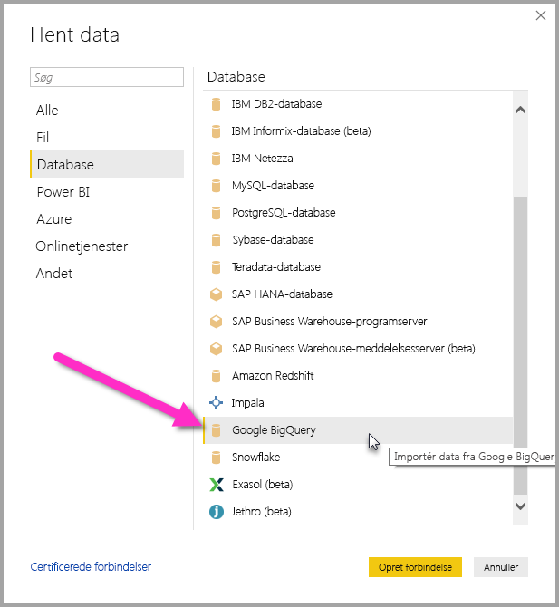
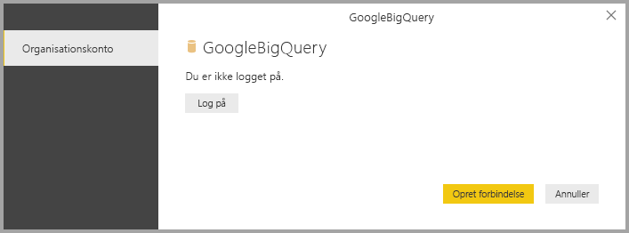
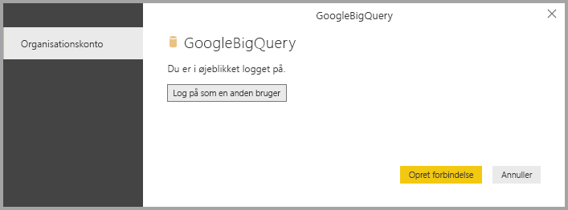
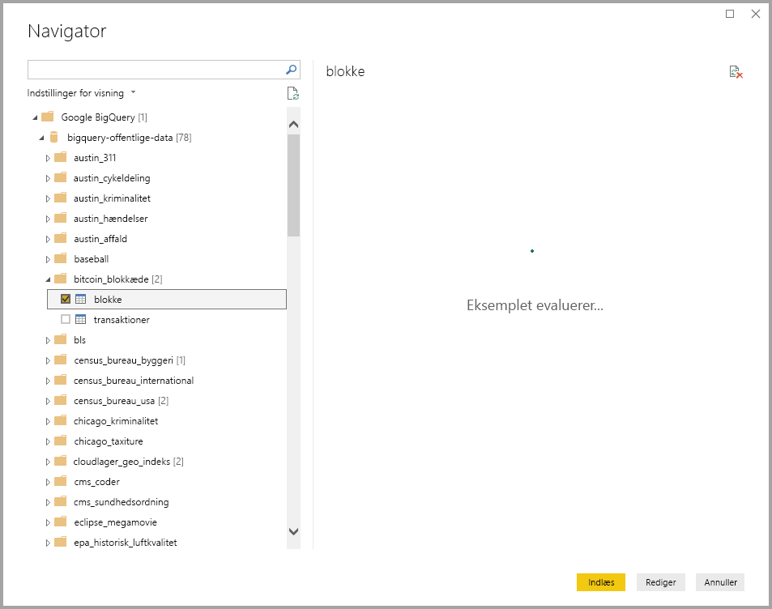

# <a name="connect-to-a-google-bigquery-database-in-power-bi-desktop"></a>Opret forbindelse til en Google BigQuery-database i Power BI Desktop
I Power BI Desktop kan du oprette forbindelse til en Google **BigQuery**-database og bruge de underliggende data på samme måde som enhver anden datakilde i Power BI Desktop.

## <a name="connect-to-google-bigquery"></a>Opret forbindelse til Google BigQuery
Hvis du vil oprette forbindelse til en Google **BigQuery**-database, skal du vælge **Hent data** på båndet **Hjem** i Power BI Desktop. Vælg **Database** blandt kategorierne til venstre, hvorefter du kan se **Impala**.



I vinduet **Google BigQuery**, der vises, skal du logge på din Google BigQuery-konto, og vælge **Opret forbindelse**.



Når du er logget på, kan du se følgende vindue, der angiver, at du er blevet godkendt. 



Når du har oprettet forbindelse, vises et vindue af typen **Navigator**, hvor de data, der er tilgængelige på serveren, vises. Her kan du vælge et eller flere elementer, der skal importeres og bruges i **Power BI Desktop**.



## <a name="considerations-and-limitations"></a>Overvejelser og begrænsninger
Der er et par begrænsninger og overvejelser, du skal være opmærksom på i forbindelse med Google **BigQuery**-forbindelsen:

* Google BigQuery-forbindelsen er tilgængelig i Power BI Desktop og Power BI-tjenesten. I Power BI-tjenesten kan du få adgang til forbindelsen ved hjælp af cloud til cloud-forbindelsen fra Power BI til Google BigQuery.

* Du kan bruge Power BI sammen med **faktureringsprojektet** i Google BigQuery. Power BI bruger som standard det første projekt på listen, som returneres til brugeren. 

  Hvis du vil tilpasse adfærden for faktureringsprojektet, når du bruger det med Power BI, skal du angive følgende indstilling i det underliggende M i kildetrinnet, som kan tilpasses ved at bruge **Power Query-editor** i Power BI Desktop:

  ```
  Source = GoogleBigQuery.Database([BillingProject="Include-Billing-Project-Id-Here"])
  ```

  Fra og med udgivelsen i september 2020 aktiverede vi support til [Google BigQuery Storage API](https://cloud.google.com/bigquery/docs/reference/storage). Denne funktion er aktiveret som standard og styres af det valgfrie booleske argument kaldet "UseStorageApi". Nogle kunder kan støde på problemer med denne funktion, hvis de bruger detaljerede tilladelser. I dette scenarie kan du se følgende fejlmeddelelse:

  `ERROR [HY000] [Microsoft][BigQuery] (131) Unable to authenticate with Google BigQuery Storage API. Check your account permissions`

  Du kan løse dette problem ved at justere brugertilladelserne for Storage API. Tildel disse Storage API-tilladelser:

  - `bigquery.readsessions.create` - Opretter en ny læsesession via BigQuery Storage API'en.
  - `bigquery.readsessions.getData` - Læser data fra en ny læsesession via BigQuery Storage API'en.
  - `bigquery.readsessions.update` - Opdaterer en læsesession via BigQuery Storage API'en.

  Disse tilladelser er typisk tilgængelige i BigQuery.User-rollen. Du kan finde flere oplysninger under [Foruddefinerede roller og tilladelser for Google BigQuery](https://cloud.google.com/bigquery/docs/access-control).
  
  Hvis problemet ikke blev løst med ovenstående trin, eller hvis du vil deaktivere understøttelse af Storage API, skal du ændre din forespørgsel til følgende:
  ```
  Source = GoogleBigQuery.Database([UseStorageApi=false])
  ```
  Eller hvis du allerede bruger et faktureringsprojekt, skal du ændre forespørgslen til følgende:
  ```
  Source = GoogleBigQuery.Database([BillingProject="Include-Billing-Project-Id-Here", UseStorageApi=false])
  ```

## <a name="next-steps"></a>Næste trin
Du kan oprette forbindelse til mange forskellige typer data ved hjælp af Power BI Desktop. Hvis du vil have mere at vide om datakilder, kan du se følgende ressourcer:

* [Hvad er Power BI Desktop?](../fundamentals/desktop-what-is-desktop.md)
* [Datakilder i Power BI Desktop](desktop-data-sources.md)
* [Udform og kombiner data med Power BI Desktop](desktop-shape-and-combine-data.md)
* [Opret forbindelse til Excel-projektmapper i Power BI Desktop](desktop-connect-excel.md)   
* [Angiv data direkte i Power BI Desktop](desktop-enter-data-directly-into-desktop.md)   
