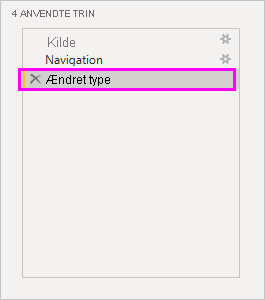
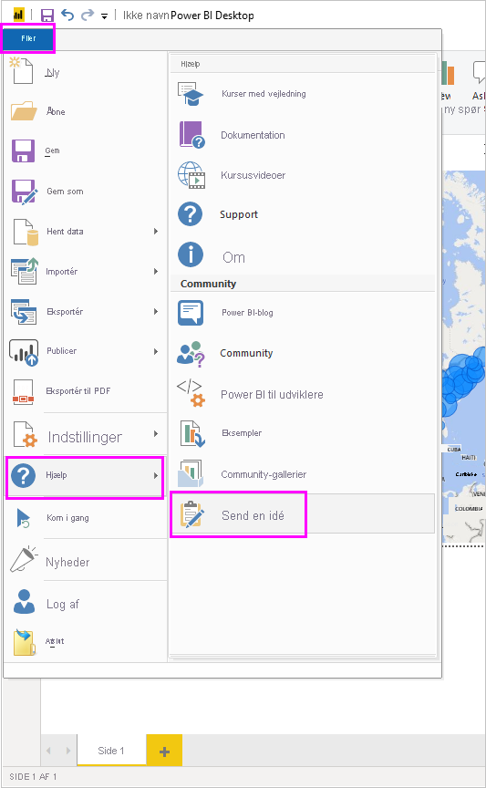

# Opret forbindelse til datakilderne i Power BI Desktop

I Power BI Desktop kan du nemt oprette forbindelse til en stadig større verden af data. Hvis du ikke har Power BI Desktop, kan du [downloade](https://go.microsoft.com/fwlink/?LinkID=521662) og installere det.

I Power BI Desktop findes der *alle mulige* forskellige datakilder. På følgende billede kan du se, hvordan du opretter forbindelse til data ved at vælge båndet **Hent data**  > **Andet** > **Web**.

## Eksempel på oprettelse af forbindelse til data

I dette eksempel opretter vi forbindelse til en datakilde af typen **Web**.

Forestil dig, at du går på pension. Du vil gerne bo et sted, hvor der er masser af solskin, bedre skatter og et godt sundhedsvæsen. Eller… du er måske dataanalytiker, og du ønsker, at oplysningerne skal hjælpe dine kunder, f.eks. hjælpe en kunde, der producerer regnfrakker, med at målrette salg, hvor det regner *meget*.

Uanset hvad, kan du finde en webressource, der indeholder interessante data om disse og andre emner:

[https://www.bankrate.com/finance/retirement/best-places-retire-how-state-ranks.aspx](https://www.bankrate.com/finance/retirement/best-places-retire-how-state-ranks.aspx)

Vælg **Hent data** > **Andet** > **Web**. I **Fra web** skal du angive adressen.

Når du vælger **OK**, begynder *forespørgsel* sfunktionen i Power BI Desktop at arbejde. Power BI Desktop kontakter webressourcen, og i **navigatorvinduet** returneres resultaterne af det, der blev fundet på den pågældende webside. I dette tilfælde blev der fundet en tabel og det generelle dokument. Vi er interesseret i tabellen, så vi vælger den på listen. I **navigatorvinduet** vises der et eksempel.

På nuværende tidspunkt kan du redigere forespørgslen, før tabellen indlæses, ved at vælge **Transformer data** nederst i vinduet, eller du kan bare indlæse tabellen.

Vælg **Transformer data** for at indlæse tabellen og starte Power-forespørgselseditor. Ruden **Forespørgselsindstillinger** vises. Hvis ikke, skal du vælge **Vis** på båndet og derefter **Forespørgselsindstillinger** for at få vist ruden **Forespørgselsindstillinger**. Sådan ser det ud.

Alle disse resultater er tekst i stedet for tal, og vi skal bruge tal. Intet problem. Du skal blot højreklikke på kolonneoverskriften og vælge **Skift type**  > **Heltal** for at ændre dem. Hvis du vil markere mere end én kolonne, skal du først markere en kolonne og derefter holde Skift nede, vælge yderligere tilstødende kolonner og derefter højreklikke på en kolonneoverskrift for at ændre alle de valgte kolonner. Brug Ctrl til at vælge de kolonner, der ikke er tilstødende.

Under **Forespørgselsindstillinger** afspejler **ANVENDTE TRIN** de ændringer, der er foretaget. Når du foretager yderligere ændringer af dataene, registrerer Power-forespørgselseditoren disse ændringer i sektionen **ANVENDTE TRIN**, som du kan tilpasse, vende tilbage til, omarrangere eller slette efter behov.

Der kan stadig foretages yderligere ændringer i tabellen, når den er indlæst, men på nuværende tidspunkt er det fint, som det er. Når du er færdig, skal du vælge **Luk og anvend** på båndet **Hjem**, og Power BI Desktop anvender ændringerne og lukker Power-forespørgselseditoren.

Mens datamodellen indlæst, kan vi i **rapportvisningen** i Power BI Desktop gå i gang med at oprette visualiseringer ved at trække felter til lærredet.

Det er selvfølgelig en simpel model med en enkelt dataforbindelse. De fleste Power BI Desktop-rapporter vil have forbindelser til forskellige datakilder, formet til dine behov, med relationer, der opretter en mere omfattende datamodel.

## De næste trin
Du kan gøre mange forskellige ting med Power BI Desktop. Du kan finde flere oplysninger om funktionerne i følgende ressourcer:

* [Hvad er Power BI Desktop?](../fundamentals/desktop-what-is-desktop.md)
* [Om brug af Forespørgselseditor i Power BI Desktop](../transform-model/desktop-query-overview.md)
* [Datakilder i Power BI Desktop](desktop-data-sources.md)
* [Udform og kombiner data i Power BI Desktop](desktop-shape-and-combine-data.md)
* [Udfør almindelige forespørgselsopgaver i Power BI Desktop](../transform-model/desktop-common-query-tasks.md)   

Vil du give os feedback? Fint. Brug menupunktet **Indsend en idé** i Power BI Desktop, eller besøg [Feedback fra community](https://community.powerbi.com/t5/Community-Feedback/bd-p/community-feedback). Vi ser frem til at høre fra dig!

