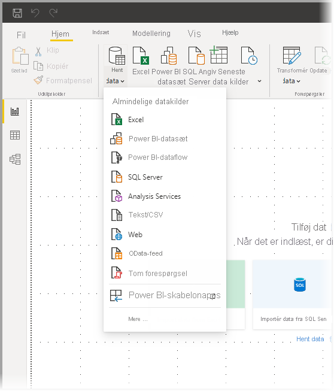
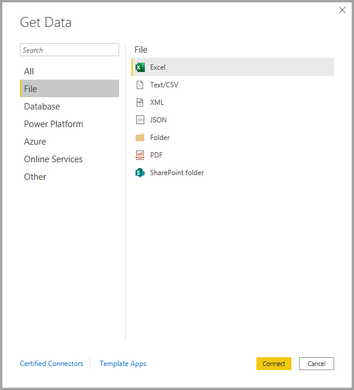
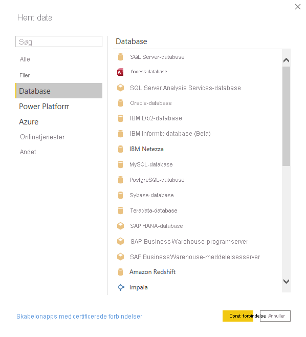
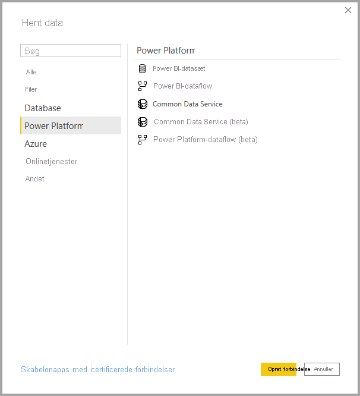
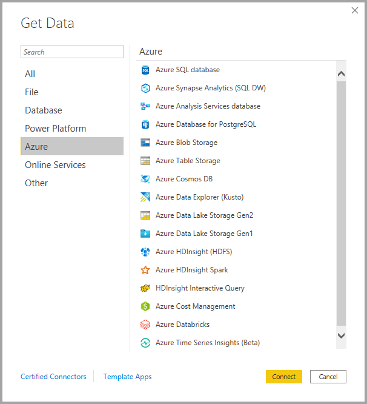
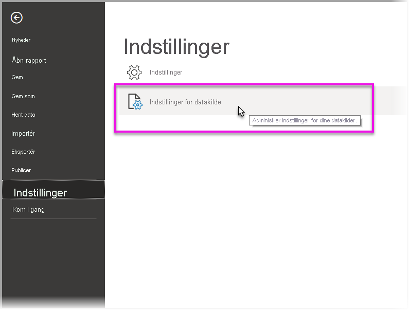
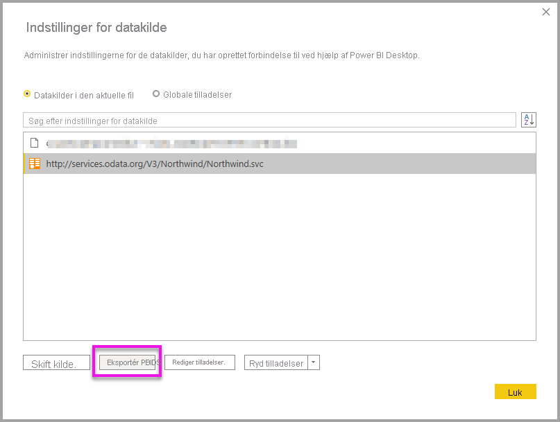

# <a name="data-sources-in-power-bi-desktop"></a>Datakilder i Power BI Desktop

Med Power BI Desktop kan du oprette forbindelse til data fra mange forskellige kilder. Du finder en komplet liste over tilgængelige datakilder i [Power BI-datakilder](power-bi-data-sources.md).

Du opretter forbindelse til data ved hjælp af båndet **Hjem**. Hvis du vil have vist menuen med de **mest almindelige** datatyper, skal du vælge knappen **Hent data** eller pil ned.



Hvis du vil gå til dialogboksen **Hent data**, skal du åbne menuen med de **mest almindelige** datatyper og vælge **Mere**. Du kan også åbne dialogboksen **Hent data** (og omgå menuen **Mest almindelige**) ved at vælge ikonet **Hent data** direkte.


> [!NOTE]
> Power BI-teamet udvider hele tiden de datakilder, der er tilgængelige for Power BI Desktop og Power BI-tjenesten. Du kan derfor ofte se tidlige versioner af igangværende datakilder markeret som **Beta** eller **Preview**. Alle datakilder, der er markeret som **beta** eller **prøveversion**, har begrænset support og funktionalitet og bør ikke bruges i produktionsmiljøer. Derudover er alle data, der er markeret som **beta** eller **prøveversion** for Power BI Desktop, muligvis ikke tilgængelige til brug i Power BI-tjenesten eller andre Microsoft-tjenester, før datakilden bliver generelt tilgængelig.

> [!NOTE]
> Der er mange dataconnectors til Power BI Desktop, der kræver Internet Explorer 10 (eller nyere) til godkendelse. 


## <a name="data-sources"></a>Datakilder

Dialogboksen **Hent data** organiserer datatyper i følgende kategorier:

* Alle
* Fil
* Database
* Power Platform
* Azure
* Onlinetjenester
* Andet

Kategorien **Alle** inkluderer alle dataforbindelsestyper fra alle kategorier.

### <a name="file-data-sources"></a>Fildatakilder

Kategorien **Fil** indeholder følgende dataforbindelser:

* Excel
* Tekst/CSV
* XML
* JSON
* Mappe
* PDF
* SharePoint-mappe

På følgende billede vises vinduet **Hent data** for **Fil**.



### <a name="database-data-sources"></a>Databasedatakilder

Kategorien **Database** indeholder følgende dataforbindelser:

* SQL Server-database
* Access-database
* SQL Server Analysis Services-database
* Oracle-database
* IBM Db2-database
* IBM Informix-database (beta)
* IBM Netezza
* MySQL-database
* PostgreSQL-database
* Sybase-database
* Teradata-database
* SAP HANA-database
* SAP Business Warehouse-programserver
* SAP Business Warehouse-meddelelsesserver
* Amazon Redshift
* Impala
* Google BigQuery
* Vertica
* Snowflake
* Essbase
* AtScale-kuber
* Data Virtuality LDW (beta)
* Denodo
* Dremio
* Exasol
* Indexima
* InterSystems IRIS (beta)
* Jethro (beta)
* Kyligence
* Linkar PICK Style/MultiValue Databases (beta)
* MariaDB (Beta)
* MarkLogic
* BI Connector
* Actian (Beta)

> [!NOTE]
> Nogle databaseforbindelser kræver, at du aktiverer dem ved at vælge **Filer > Indstillinger > Indstillinger** og derefter vælger **Funktioner til eksempelvisning** og aktiverer forbindelsen. Hvis du ikke kan se nogle af de forbindelser, der er nævnt ovenfor, og du vil bruge dem, skal du kontrollere dine indstillinger for **Funktioner til eksempelvisning**. Bemærk også, at alle datakilder, der er markeret som *Beta* eller *Preview*, har begrænset support og funktionalitet og skal ikke bruges i produktionsmiljøer.

På følgende billede vises vinduet **Hent data** for **Database**.



### <a name="power-platform-data-sources"></a>Power Platform-datakilder

Kategorien **Power Platform** indeholder følgende dataforbindelser:

* Power BI-datasæt
* Power BI-dataflow
* Microsoft Dataverse
* Power Platform-dataflow (beta)

På følgende billede vises vinduet **Hent data** for **Power Platform**.



### <a name="azure-data-sources"></a>Azure-datakilder

Kategorien **Azure** indeholder følgende dataforbindelser:

* Azure SQL Database
* Azure Synapse Analytics (SQL DW)
* Azure Analysis Services-database
* Azure Database for PostgreSQL
* Azure Blob Storage
* Azure Table Storage
* Azure Cosmos DB
* Azure Data Explorer (Kusto)
* Azure Data Lake Storage Gen2
* Azure Data Lake Storage Gen1
* Azure HDInsight (HDFS)
* Azure HDInsight Spark
* Interaktiv HDInsight-forespørgsel
* Azure Cost Management
* Azure Databricks
* Azure Time Series Insights (beta)


På følgende billede vises vinduet **Hent data** for **Azure**.



### <a name="online-services-data-sources"></a>Online Services-datakilder

Kategorien **Onlinetjenester** indeholder følgende dataforbindelser:

* SharePoint Online-liste
* Microsoft Exchange Online
* Dynamics 365 (online)
* Dynamics NAV
* Dynamics 365 Business Central
* Dynamics 365 Business Central (i det lokale miljø)
* Microsoft Azure Consumption Insights (beta)
* Azure DevOps (kun forummer)
* Azure DevOps Server (kun forummer)
* Salesforce-objekter
* Salesforce-rapporter
* Google Analytics
* Adobe Analytics
* appFigures (beta)
* Data.World – Get Dataset (beta)
* GitHub (beta)
* LinkedIn Sales Navigator (beta)
* Marketo (beta)
* Mixpanel (beta)
* Planview Enterprise One – PRM (beta)
* QuickBooks Online (beta)
* Smartsheet
* SparkPost (beta)
* SweetIQ (beta)
* Planview Enterprise One – CTM (beta)
* Twilio (beta)
* Zendesk (beta)
* Asana (beta)
* Dynamics 365 Customer Insights (beta)
* Emigo-datakilde
* Entersoft Business Suite (beta)
* FactSet-analyse
* Palantir Foundry
* Industrial App Store
* Intune Data Warehouse (beta)
* Microsoft Graph Security (beta)
* Projectplace til Power BI
* Product Insights (beta)
* Quick Base
* Spigit (Beta)
* TeamDesk (beta)
* Webtrends Analytics (beta)
* Witivio (beta)
* Workplace Analytics (beta)
* Zoho Creator (beta)
* eWay-CRM (Beta)
* Hexagon PPM Smart API


På følgende billede vises vinduet **Hent data** for **Onlinetjenester**.


### <a name="other-data-sources"></a>Andre datakilder

Kategorien **Andet** indeholder følgende dataforbindelser:

* Web
* SharePoint-liste
* OData-feed
* Active Directory
* Microsoft Exchange
* Hadoop-fil (HDFS)
* Spark
* Hive LLAP
* R-script
* Python-script
* ODBC
* OLE DB
* Acterys: Model Automation & Planning (Beta)
* Automation Anywhere (Beta)
* Solver
* Cherwell (Beta)
* Cognite Data Fusion
* FHIR
* Information Grid (beta)
* Jamf Pro (beta)
* MicroStrategy for Power BI
* Paxatas
* QubolePresto (beta)
* Roamler (beta)
* Shortcuts Business Insights (beta)
* Siteimprove
* SurveyMonkey (beta)
* Tenforce (Smart)List
* TIBCO(R) Data Virtualization (beta)
* Vena (beta)
* Vessel Insight (beta)
* Zucchetti HR Infinity (beta)
* Anaplan Connector v1.0 (Beta)
* Starburst Enterprise Presto (Beta)
* Tom forespørgsel


På følgende billede vises vinduet **Hent data** for **Andet**.


> [!NOTE]
> På nuværende tidspunkt er det ikke muligt at oprette forbindelse til brugerdefinerede datakilder, der er beskyttet via Azure Active Directory.

### <a name="template-apps"></a>Skabelonapps

Du kan finde skabelonapps til din organisation ved at vælge linket **Skabelonapps** nederst i vinduet **Hent data**. 


Tilgængelige skabelonapps kan variere afhængigt af din organisation.

## <a name="connecting-to-a-data-source"></a>Oprettelse af forbindelse til en datakilde

For at oprette forbindelse til en datakilde skal du vælge datakilden i vinduet **Hent data** og vælge **Opret forbindelse**. På følgende billede er **Web** valgt fra kategorien **Andet** for dataforbindelsen.


Der vises et forbindelsesvindue, som er specifikt for typen af dataforbindelse. Hvis der kræves legitimationsoplysninger, bliver du bedt om at angive dem. På følgende billede vises en URL-adresse, der angives for at oprette forbindelse til en webdatakilde.


Indtast forbindelsesoplysninger for URL-adressen eller ressourcen, og vælg **OK**. Power BI Desktop opretter forbindelse til datakilden og viser de tilgængelige datakilder i **Navigator**.


Du indlæser dataene ved at vælge knappen **Indlæs** nederst i ruden **Navigator**. Hvis du vil transformere eller redigere forespørgslen i Power Query-editor, før du indlæser dataene, skal du vælge knappen **Transformér data**.

Det er det eneste, du skal gøre for at oprette forbindelse til datakilder i Power BI Desktop! Prøv at oprette forbindelse til data fra vores stadig større liste over datakilder, og vend ofte tilbage – vi tilføjer hele tiden nye datakilder på denne liste.

## <a name="using-pbids-files-to-get-data"></a>Brug af PBIDS-filer til at hente data

PBIDS-filer er Power BI Desktop-filer, der har en bestemt struktur, og som har filtypenavnet PBIDS, der identificerer, at der er tale om en Power BI-datakildefil.

Du kan oprette en PBIDS-fil for at strømline **Hent data**-oplevelsen for nye eller uerfarne forfattere af rapporter i din organisation. Hvis du opretter PBIDS-filen ud fra eksisterende rapporter, er det lettere for nye rapportforfattere at oprette nye rapporter ud fra de samme data.

Når en forfatter åbner en PBIDS-fil, åbnes Power BI Desktop, og brugeren bliver bedt om at angive legitimationsoplysninger for at godkende og oprette forbindelse til den datakilde, der er angivet i filen. Dialogboksen **Navigation** vises, og brugeren skal vælge de tabeller i datakilden, der skal indlæses i modellen. Brugerne skal muligvis også vælge databasen eller databaserne og forbindelsestilstand, hvis der ikke blev angivet en i PBIDS-filen.

Fremover kan brugeren begynde at oprette visualiseringer eller vælge **Seneste kilder igen** for at indlæse et nyt sæt tabeller i modellen.

I øjeblikket understøtter PBIDS-filer kun en enkelt datakilde i én fil. Hvis du angiver mere end én datakilde, resulterer det i en fejl.


### <a name="how-to-create-a-pbids-connection-file"></a>Sådan opretter du en PBIDS-forbindelsesfil

Hvis du har en eksisterende Power BI Desktop-fil (.PBIX-fil), der allerede har forbindelse til de data, du er interesseret i, kan du blot eksportere disse forbindelsesfiler fra Power BI Desktop. Dette er den anbefalede metode, da PBIDS-filen kan genereres automatisk fra Desktop. Du kan også stadig redigere filen eller oprette den manuelt i en teksteditor. 

Hvis du vil oprette PBIDS-filen, skal du vælge **Filer > Indstillinger > Indstillinger for datakilde**:



I den dialogboks, der vises, skal du vælge den datakilde, du vil eksportere som en PBIDS, og derefter vælge **Eksportér PBIDS**.



Når du vælger knappen **Eksportér PBIDS**, opretter Power BI Desktop PBIDS-filen, som du kan omdøbe og gemme i din mappe og dele med andre. Du kan også åbne filen i en teksteditor og redigere filen yderligere, herunder angive forbindelsesmåden i selve filen, som vist på følgende billede. 


Hvis du foretrækker at oprette dine PBIDS-filer manuelt i en teksteditor, skal du angive de påkrævede input for en enkelt forbindelser og gemme filen med filtypenavnet PBIDS. Du kan også vælge at angive forbindelsestilstanden som enten DirectQuery eller Import. Hvis **tilstand** mangler/er null i filen, bliver den bruger, der åbner filen i Power BI Desktop, bedt om at vælge **DirectQuery** eller **Import**.


### <a name="pbids-file-examples"></a>Eksempler på PBIDS-filer

Dette afsnit indeholder nogle eksempler på datakilder, der ofte bruges. PBIDS-filtypen understøtter kun dataforbindelser, der også understøttes i Power BI Desktop, med følgende undtagelser: Wiki-URL-adresser, Live Connect og Tom forespørgsel.

PBIDS-filen indeholder *ikke* oplysninger om godkendelse og tabel- og skemaoplysninger.  

Følgende kodestykke viser almindelige eksempler på PBIDS-filer, men listen er ikke fuldstændig. I forbindelse med andre datakilder kan du se [DSR-formatet (Data Source Reference) for protokol- og adresseoplysninger](/azure/data-catalog/data-catalog-dsr#data-source-reference-specification).

Hvis du redigerer forbindelsesfiler eller opretter dem manuelt, er disse eksempler kun ment som en hjælp og er ikke en udtømmende liste. De omfatter heller ikke alle understøttede connectorer i DSR-format.

#### <a name="azure-as"></a>Azure AS

```json
{ 
    "version": "0.1", 
    "connections": [ 
    { 
        "details": { 
        "protocol": "analysis-services", 
        "address": { 
            "server": "server-here" 
        }, 
        } 
    } 
    ] 
}
```

#### <a name="folder"></a>Mappe

```json
{ 
  "version": "0.1", 
  "connections": [ 
    { 
      "details": { 
        "protocol": "folder", 
        "address": { 
            "path": "folder-path-here" 
        } 
      } 
    } 
  ] 
} 
```

#### <a name="odata"></a>OData

```json
{ 
  "version": "0.1", 
  "connections": [ 
    { 
      "details": { 
        "protocol": "odata", 
        "address": { 
            "url": "URL-here" 
        } 
      } 
    } 
  ] 
} 
```

#### <a name="sap-bw"></a>SAP BW

```json
{ 
  "version": "0.1", 
  "connections": [ 
    { 
      "details": { 
        "protocol": "sap-bw-olap", 
        "address": { 
          "server": "server-name-here", 
          "systemNumber": "system-number-here", 
          "clientId": "client-id-here" 
        }, 
      } 
    } 
  ] 
} 
```

#### <a name="sap-hana"></a>SAP Hana

```json
{ 
  "version": "0.1", 
  "connections": [ 
    { 
      "details": { 
        "protocol": "sap-hana-sql", 
        "address": { 
          "server": "server-name-here:port-here" 
        }, 
      } 
    } 
  ] 
} 
```

#### <a name="sharepoint-list"></a>SharePoint-liste

URL-adressen skal pege på selve SharePoint-webstedet og ikke en liste på webstedet. Brugerne får en navigator, der giver dem mulighed for at vælge en eller flere lister fra det pågældende websted, som hver især bliver en tabel i modellen.

```json
{ 
  "version": "0.1", 
  "connections": [ 
    { 
      "details": { 
        "protocol": "sharepoint-list", 
        "address": { 
          "url": "URL-here" 
        }, 
       } 
    } 
  ] 
} 
```

#### <a name="sql-server"></a>SQL Server

```json
{ 
  "version": "0.1", 
  "connections": [ 
    { 
      "details": { 
        "protocol": "tds", 
        "address": { 
          "server": "server-name-here", 
          "database": "db-name-here (optional) "
        } 
      }, 
      "options": {}, 
      "mode": "DirectQuery" 
    } 
  ] 
} 
```

#### <a name="text-file"></a>Tekstfil

```json
{ 
  "version": "0.1", 
  "connections": [ 
    { 
      "details": { 
        "protocol": "file", 
        "address": { 
            "path": "path-here" 
        } 
      } 
    } 
  ] 
} 
```

#### <a name="web"></a>Web

```json
{ 
  "version": "0.1", 
  "connections": [ 
    { 
      "details": { 
        "protocol": "http", 
        "address": { 
            "url": "URL-here" 
        } 
      } 
    } 
  ] 
} 
```

#### <a name="dataflow"></a>Dataflow

```json
{
  "version": "0.1",
  "connections": [
    {
      "details": {
        "protocol": "powerbi-dataflows",
        "address": {
          "workspace":"workspace id (Guid)",
          "dataflow":"optional dataflow id (Guid)",
          "entity":"optional entity name"
        }
       }
    }
  ]
}
```

## <a name="next-steps"></a>Næste trin

Du kan gøre mange forskellige ting med Power BI Desktop. Du kan finde flere oplysninger om funktionerne i følgende ressourcer:

* [Hvad er Power BI Desktop?](../fundamentals/desktop-what-is-desktop.md)
* [Oversigt over forespørgsler i Power BI Desktop](../transform-model/desktop-query-overview.md)
* [Datatyper i Power BI Desktop](desktop-data-types.md)
* [Udform og kombiner data med Power BI Desktop](desktop-shape-and-combine-data.md)
* [Almindelige forespørgselsopgaver i Power BI Desktop](../transform-model/desktop-common-query-tasks.md)