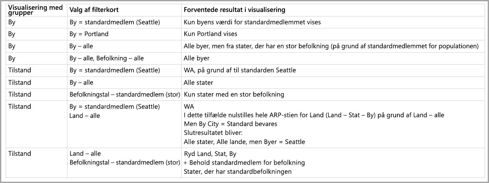

# Arbejd med flerdimensionelle modeller i Power BI

Du kan oprette forbindelse til flerdimensionelle modeller i Power BI og oprette rapporter, som visualiserer alle mulige forskellige data i modellen. Når du arbejder med flerdimensionelle modeller, anvender Power BI regler for, hvordan data behandles, ud fra hvilken kolonne der er defineret som *standardmedlemmet*. 

Når du arbejder med flerdimensionelle modeller, håndterer Power BI data fra modellen, afhængigt af hvor den kolonne, der indeholder **DefaultMember**, bruges. Attributten *DefaultMember* er angivet i CSDL (Conceptual Schema Definition Language) for en bestemt kolonne i en flerdimensionel model. Du kan få mere at vide om standardmedlemmet i [artiklen om egenskaber for attributter](/sql/analysis-services/multidimensional-models/attribute-properties-define-a-default-member?view=sql-server-2017). Når der udføres en DAX-forespørgsel, anvendes det standardmedlem, der er angivet i modellen, automatisk.

I denne artikel beskrives, hvordan Power BI fungerer under forskellige omstændigheder, når du arbejder med flerdimensionelle modeller, afhængigt af hvor *standardmedlemmet* befinder sig. 

## Arbejde med filterkort

Når du opretter et filterkort på et felt med et standardmedlem, er værdien for standardmedlemmet automatisk valgt i filterkortet. Resultatet er, at alle visuelle elementer, der påvirkes af filterkortet, bevarer deres standardmodeller i databasen. Værdierne i sådanne filterkort afspejler det pågældende standardmedlem.

Hvis standardmedlemmet fjernes, ryddes det for alle de visuelle elementer, som filterkortet gælder for, og de viste værdier afspejler ikke standardmedlemmet.

Antag for eksempel, at vi har kolonnen *Valuta*, der har et standardmedlem, der er angivet til *USD*:

* Hvis vi i dette eksempel har et kort, der viser *Samlet salg*, anvendes standardmedlemmet for den pågældende værdi, og vi ser, at salg svarer til "USD".
* Hvis vi trækker *Valuta* til filterkortruden, vælges *USD* som standardværdi. Værdien for *Samlet salg* forbliver uændret, da standardmedlemmet anvendes.
* Men hvis vi fravælger værdien *USD* fra filterkortet, ryddes standardmedlemmet for *Valuta*, og nu afspejler *Samlet salg* alle valutaer.
* Derfor, når vi vælger en anden værdi i filterkortet (lad os sige, at vi vælger *EURO*) sammen med standardmedlemmet, afspejler *Samlet salg* filteret *Currency IN {USD, EURO}* .

## Funktionsmåde for gruppering

Når du grupperer et visuelt element i en kolonne i Power BI, der har et *standardmedlem*, rydder Power BI *standardmedlemmet* for den pågældende kolonne og dens tilhørende relationssti. Dette sikrer, at det visuelle element viser alle værdier i stedet for blot standardværdierne.

## ARP'er (Attribute relationship paths – tilhørende relationsstier)

Tilhørende relationsstier (ARP'er) giver *standardmedlemmer* effektive funktioner, men medfører også en vis mængde kompleksitet. Når ARP'er opstår, følger Power BI ARP'ernes sti for at rydde yderligere standardmedlemmer for andre kolonner og på den måde levere en konsistent og præcis håndtering af data til visuelle elementer.

Lad os se på et eksempel for at præcisere funktionsmåden. Vi har følgende konfiguration af ARP'er:

Lad os forestille os, at følgende *standardmedlemmer* angives for disse kolonner:

* City > Seattle
* State > WA
* Country > US
* Population > Large

Lad os nu undersøge, hvad der sker, når hver af kolonnerne bruges i Power BI. Her er resultatet, når visuelle elementer grupperes i følgende kolonner:

* **City** – Power BI viser alle byer ved at rydde alle **standardmedlemmerne** for *City*, *State* og *Country*, men bevarer **standardmedlemmet** for *Population*. Power BI ryddede hele ARP'en for *City*.
    > [!NOTE]
    > *Population* er ikke i ARP-stien for *City*, det er kun relateret til *State* og ryddes derfor ikke af Power BI.
* **State** – Power BI viser alle *States* ved at rydde alle **standardmedlemmer** for *City*, *State*, *Country* og *Population*.
* **Country** – Power BI viser alle lande ved at rydde alle **standardmedlemmer** for *City*, *State* og *Country*, men bevarer **standardmedlemmet** for *Population*.
* **City og State** – Power BI rydder alle **standardmedlemmer** for alle kolonner.

Grupper, der vises i visualiseringen, får hele deres ARP-sti ryddet. 

Hvis en gruppe ikke vises i visualiseringen, men er en del af ARP-stien for en anden grupperet kolonne, gælder følgende:

* Ikke alle ARP-stiens forgreninger ryddes automatisk.
* Denne gruppe filtreres stadig efter det ikke-ryddede **standardmedlem**.

### Udsnitsværktøjer og filterkort

Når du arbejder med udsnitsværktøjer eller filterkort, sker der følgende:

* Når et udsnitsværktøj eller et filterkort får indlæst data, grupperer Power BI kolonnen i visualiseringen, så den viste funktionsmåde er det samme som beskrevet i forrige afsnit.

Eftersom udsnitsværktøjer og filterkort ofte bruges til at interagere med andre visuelle elementer, indtræffer logikken for rydning af **standardmedlemmer** for de berørte visuelle elementer som beskrevet i følgende tabel. 

Vi bruger de samme eksempeldata, der er brugt tidligere i denne artikel, til denne tabel:

Følgende regler gælder for, hvordan Power BI fungerer under disse omstændigheder.

Power BI rydder et **standardmedlem** for en given kolonne, hvis:

* Power BI grupperer efter den pågældende kolonne
* Power BI grupperer efter en kolonne, der er relateret til den pågældende kolonne (hvor som helst i ARP'en, op eller ned)
* Power BI filtrerer efter en kolonne, der er i ARP'en (op eller ned)
* Kolonnen har et filterkort med tilstanden *ALL*
* Kolonnen har et filterkort med en hvilken som helst værdi (Power BI modtager et filter for kolonnen)

Power BI rydder ikke et **standardmedlem** for en given kolonne, hvis:

* Kolonnen har et filterkort med standardtilstanden, og Power BI grupperer efter en kolonne i sin ARP.
* Kolonnen er oven over en anden kolonne i ARP'en, og Power BI har et filterkort for den pågældende kolonne i standardtilstand.

## De næste trin

I denne artikel beskrives funktionsmåden for Power BI, når du arbejder med standardmedlemmer i flerdimensionelle modeller. Du vil måske også være interesseret i følgende artikler: 

* [Vis elementer uden data i Power BI](../create-reports/desktop-show-items-no-data.md)
* [Datakilder i Power BI Desktop](desktop-data-sources.md)