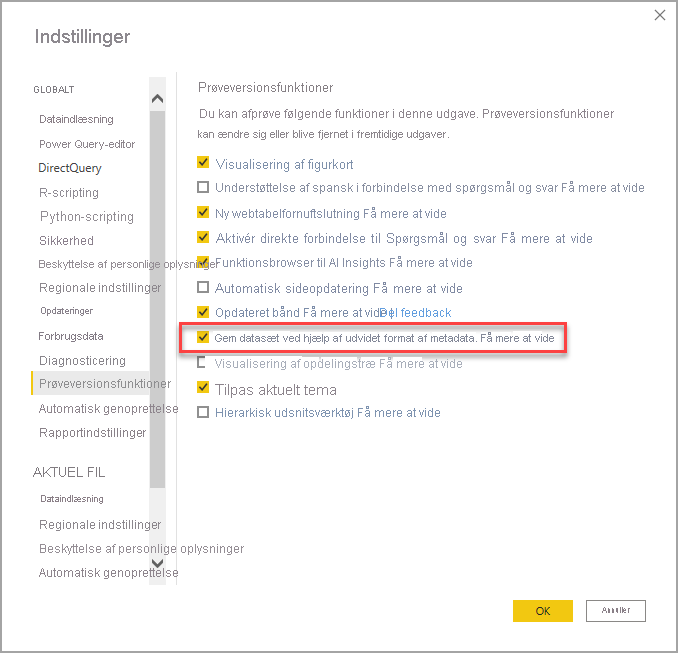

# <a name="using-enhanced-dataset-metadata-preview"></a>Brug af forbedrede metadata for datasæt (prøveversion)

Når der oprettes rapporter i Power BI Desktop, oprettes der også metadata for datasæt i de tilsvarende PBIX- og PBIT-filer. Tidligere blev metadataene lagret i et format, der var specifikt for Power BI Desktop. Der blev brugt base-64-kodede M-udtryk og -datakilder, og der blev opstillet forudsætninger for, hvordan disse metadata blev lagret.

Med udgivelsen af funktionen til **forbedrede metadata for datasæt** er mange af disse begrænsninger fjernet. Når funktionen til **forbedrede metadata for datasæt** er aktiveret, bruger metadata, der er oprettet af Power BI Desktop, et format, der ligner det, der bruges til tabellariske Analysis Services-modeller, baseret på den [tabellariske objektmodel](/analysis-services/tom/introduction-to-the-tabular-object-model-tom-in-analysis-services-amo).


Funktionen til **forbedrede metadata for datasæt** er strategisk og grundlæggende, da den fremtidige Power BI-funktionalitet bygges på dens metadata. Nogle yderligere funktioner, der kan drage fordel af forbedrede metadata for datasæt, omfatter [XMLA-læsning/-skrivning](https://docs.microsoft.com/power-platform-release-plan/2019wave2/business-intelligence/xmla-readwrite) til administration af Power BI-datasæt og migreringen af Analysis Services-arbejdsbelastninger til Power BI, der kan drage fordel af den næste generation af funktioner.


## <a name="enable-enhanced-dataset-metadata"></a>Aktiver forbedrede metadata for datasæt

Funktionen til **forbedrede metadata for datasæt** er i øjeblikket tilgængelig som prøveversion. Hvis du vil aktivere forbedrede metadata for datasæt, skal du i Power BI Desktop vælge **Filer > Indstillinger > Indstillinger > Funktioner i prøveversionen**og derefter markere afkrydsningsfeltet **Gem datasæt ved hjælp af forbedret metadataformat** som vist på følgende billede. 



Du bliver spurgt, om du vil genstarte Power BI Desktop.


Når prøveversionsfunktionen er aktiveret, forsøger Power BI Desktop at opgradere PBIX- og PBIT-filer, der bruger det tidligere metadataformat. 

> [!IMPORTANT]
> Aktivering af funktionen **Forbedrede metadata for datasæt** medfører en uigenkaldelig opgradering af rapporter. Alle Power BI rapporter, der er indlæst eller oprettet med Power BI Desktop, konverteres uigenkaldeligt til det udvidede format for metadata for datasæt, når **Forbedrede metadata for datasæt** er aktiveret.

## <a name="report-backup-files"></a>Rapportsikkerhedskopifiler

Opdatering af en rapport til brug af funktionen **udvidede metadata for et datasæt** kan ikke fortrydes. Der oprettes dog en sikkerhedskopifil til rapporter I forbindelse med opdateringen, så du kan gemme en version af rapporten i det oprindelige format (før opdatering). Sikkerhedskopifilen slettes efter 30 dage. 

Benyt følgende fremgangsmåde for at finde filen til sikkerhedskopirapporten:

1. Gå til følgende placering: ```C:\Users\<user>\AppData\Local\Microsoft\Power BI Desktop\TempSaves\Backup```. Hvis du bruger Microsoft Store-versionen af Power BI Desktop, skal du bruge følgende placering: ```C:\Users\<user>\Microsoft\Power BI Desktop Store App\TempSaves\Backups``` 

2. Find en kopi af rapporten her med navnet og tidsstemplet på den oprindelige fil.

3. Kopiér filen til en placering, du foretrækker, for at bevare den.

4. Hvis du vælger at åbne eller bruge den oprindelige fil, skal du sørge for, at prøveversionsfunktionen **Udvidet metadataformat** er deaktiveret i Power BI Desktop. 

Sikkerhedskopifilen oprettes, når rapporten er opgraderet, så eventuelle ændringer foretaget efter opgraderingen er ikke inkluderet. Nye rapporter, der oprettes, når funktionen **Udvidet metadataformat** er aktiveret, har ikke en sikkerhedskopifil.


## <a name="considerations-and-limitations"></a>Overvejelser og begrænsninger

I prøveversionen gælder følgende begrænsninger, når prøveversionsfunktionen er aktiveret.

### <a name="unsupported-features-and-connectors"></a>Funktioner og forbindelser, der ikke understøttes

Følgende begrænsninger gælder:

Når du åbner en eksisterende PBIX- eller PBIT-fil, der ikke er blevet opgraderet, mislykkes opgraderingen, hvis datasættet indeholder en af følgende funktioner eller connectors. Hvis denne fejl opstår, påvirker det normalt ikke brugeroplevelsen med det samme, og Power BI Desktop fortsætter med at bruge det tidligere metadataformat.

* Alle brugerdefinerede connectors (begrænsning i versionen fra maj 2020)
* Python-scripts
* Azure DevOps Server
* BI Connector
* Denodo
* Dremio
* Exasol
* Indexima
* IRIS
* Jethro ODBC
* Kyligence Enterprise
* MarkLogic ODBC
* Qubole Presto
* Team Desk
* M-udtryk, der indeholder visse tegnkombinationer, f. eks. "\\n", i kolonnenavne
* Når du bruger datasæt med funktionen til **forbedrede metadata for datasæt** aktiveret, kan der ikke konfigureres enkeltlogondatakilder (SSO) i Power BI-tjenesten

Hvis du bruger Power BI Desktop-versionen fra **juni 2020** (eller nyere), *understøttes* alle brugerdefinerede connectors og alle indbyggede connectors for Power BI Desktop og Power BI-tjenesten. Hvis gatewayen støder på problemer under publiceringsprocessen, når versionen fra 2020 eller nyere bruges, publiceres datasættet, men brugerne skal publicere rapporten igen for at opdatere dataene. Dialogboksen **Indstillinger for datakilde** er den eneste indikator for, at der opstod problemer med publiceringsprocessen.

Rapporter, der bruger ikke-understøttede connectorer eller funktioner, opgraderes ikke til det nye format. Rapporter, der allerede er opgraderet, eller som er oprettet efter aktivering af denne nye funktion, understøtter ikke tilføjelse af de angivne ikke-understøttede funktioner eller connectorer. 

Forespørgsler med dynamiske datakilder understøttes ikke. Rapporter, der har dynamiske datakilder, opgraderes ikke til det nye format, og de rapporter, der allerede er blevet opgraderet eller er oprettet for nylig med funktionen aktiveret, understøtter ikke tilføjelse af dynamiske datakilder. En forespørgsel har en dynamisk datakilde, hvis kilden ændres afhængigt af en parameter, funktionsinput eller midlertidig funktion. 

Forespørgsler med fejl i upstream-trin eller -forgreninger understøttes ikke. 

Derudover kan PBIX- og PBIT-filer, der allerede er blevet opgraderet til at bruge **forbedrede metadata for datasæt**, *ikke* bruge ovenstående funktioner (eller ikke-understøttede connectors).

### <a name="lineage-view"></a>Dataafstamningsvisning
Datasæt, der bruger det nye metadataformat, viser i øjeblikket ikke links til dataflow i afstamningsvisningen i Power BI-tjenesten.

## <a name="next-steps"></a>Næste trin

Du kan gøre mange forskellige ting med Power BI Desktop. Du kan finde flere oplysninger om funktionerne i følgende ressourcer:

* [Hvad er Power BI Desktop?](../fundamentals/desktop-what-is-desktop.md)
* [Nyheder i Power BI Desktop](../fundamentals/desktop-latest-update.md)
* [Oversigt over forespørgsler i Power BI Desktop](../transform-model/desktop-query-overview.md)
* [Datatyper i Power BI Desktop](desktop-data-types.md)
* [Udform og kombiner data med Power BI Desktop](desktop-shape-and-combine-data.md)
* [Almindelige forespørgselsopgaver i Power BI Desktop](../transform-model/desktop-common-query-tasks.md)
