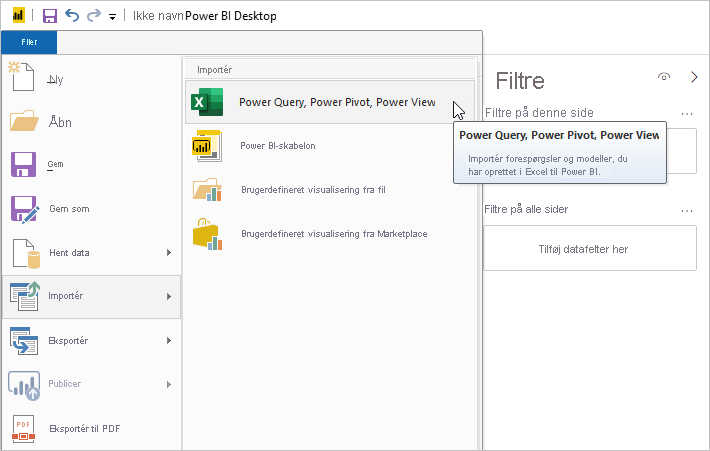
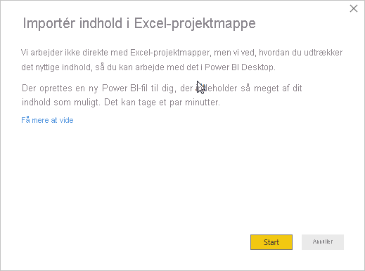
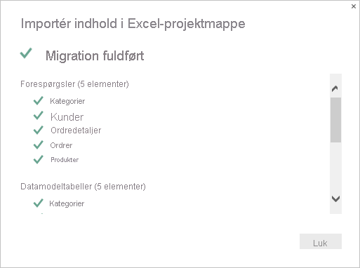
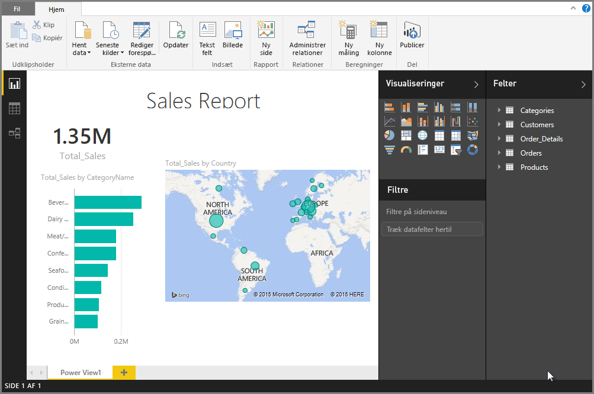

# Importér Excel-projektmapper til Power BI Desktop
Med Power BI Desktop kan du nemt importere Excel-projektmapper, der indeholder forespørgsler fra Power-forespørgsel, Power Pivot-modeller og regneark fra Power-visning, til Power BI Desktop. Power BI Desktop opretter automatisk rapporter og visualiseringer, der er baseret på Excel-projektmappen. Når de er importeret, kan du fortsætte med at forbedre og tilpasse rapporterne i Power BI Desktop ved hjælp af de eksisterende funktioner og de nye funktioner, der udgives sammen med de månedlige opdateringer af Power BI Desktop.

## Hvordan importerer jeg en Excel-projektmappe?
1. Du importerer en Excel-projektmappe til Power BI Desktop ved at vælge **Fil** > **Importér** > **Power-forespørgsel, Power Pivot, Power-visning**.

   

2. I vinduet **Åbn** skal du vælge en Excel-projektmappe, der skal importeres. 

   Selvom der i øjeblikket ikke er nogen begrænsninger på størrelsen eller antallet af objekter i projektmappen, tager det længere tid for Power BI Desktop at analysere og importere store projektmapper.

   > [!NOTE]
   > Hvis du vil indlæse eller importere Excel-filer fra delte OneDrive for Business-mapper eller fra Microsoft 365-gruppemapper, skal du bruge URL-adressen til Excel-filen og angive den i datakilden Web i Power BI Desktop. Der er et par trin, du skal udføre for at formatere URL-adressen til OneDrive for Business korrekt. Gå til [Brug OneDrive for Business-links i Power BI Desktop](desktop-use-onedrive-business-links.md) for at få flere oplysninger og de korrekte trin.
   > 
   > 

3. Vælg **Start** i den importdialogboks, der vises.

   

   Projektmappen analyseres i Power BI Desktop, og den konverteres til en Power BI Desktop-fil (PBIX). Denne handling skal kun udføres én gang. Når Power BI Desktop-filen er oprettet ved hjælp af disse trin, er Power BI Desktop-filen ikke afhængig af den oprindelige Excel-projektmappe og kan redigeres, gemmes og deles, uden at det påvirker den oprindelige projektmappe.

   Når importen er fuldført, vises der en oversigtsside, som beskriver de elementer, der er konverteret, og en liste over elementer, der ikke kunne importeres.

   

4. Vælg **Luk**. 

   Power BI Desktop importerer Excel-projektmappen og indlæser en rapport, der er baseret på indholdet i projektmappen.

   

Når projektmappen er importeret, kan du fortsætte med at arbejde på rapporten. Du kan oprette nye visualiseringer, tilføje data eller oprette nye rapportsider ved at bruge funktionerne i Power BI Desktop.

## Hvilke elementer i projektmappen importeres?
Power BI Desktop kan importere følgende elementer, der kaldes også *objekter*, i Excel.

| Objekt i Excel-projektmappe | Det endelige resultat i Power BI Desktop-fil |
| --- | --- |
| Forespørgsler i Power-forespørgsel |Alle forespørgsler i Power-forespørgsel fra Excel konverteres til forespørgsler i Power BI Desktop. Hvis der var defineret forespørgselsgrupper i Excel-projektmappen, replikeres samme organisering i Power BI Desktop. Alle forespørgsler indlæses, medmindre de er indstillet til **Opret kun forbindelse** i dialogboksen **Importér data** i Excel. Funktionsmåden for indlæsning kan tilpasses i dialogboksen **Egenskaber** under fanen **Hjem** i Power-forespørgselseditoren i Power BI Desktop. |
| Eksterne dataforbindelser i Power Pivot |Alle eksterne dataforbindelser i Power Pivot konverteres til forespørgsler i Power BI Desktop. |
| Sammenkædede tabeller eller aktuelle projektmappetabeller |Hvis der er en regnearkstabel i Excel, der er knyttet til datamodellen eller knyttet til en forespørgsel (ved hjælp af *tabellen From* eller funktionen *Excel.CurrentWorkbook()* i M), vises følgende indstillinger: <ol><li><b>Importér tabellen til Power BI Desktop-filen</b>. Denne tabel er et engangsøjebliksbillede af dataene, og herefter er dataene skrivebeskyttede i tabellen i Power BI Desktop. Der er en størrelsesbegrænsning på 1 million tegn (i alt, med alle kolonneoverskrifter og celler) for tabeller, der er oprettet ved hjælp af denne indstilling.</li><li><b>Bevar forbindelsen til den oprindelige projektmappe</b>. Du kan også bevare forbindelsen til den oprindelige Excel-projektmappe, så henter Power BI Desktop det seneste indhold i denne tabel, hver gang den opdateres, på samme måde som enhver anden forespørgsel, der oprettes i forhold til en Excel-projektmappe i Power BI Desktop.</li></ul> |
| Beregnede kolonner, målinger, KPI'er, datakategorier og datarelationer for datamodeller |Disse objekter for datamodeller konverteres til de tilsvarende objekter i Power BI Desktop. Bemærk, at visse datakategorier ikke er tilgængelige i Power BI Desktop, f.eks. Billede. I disse tilfælde nulstilles oplysningerne om datakategorien for de pågældende kolonner. |
| Regneark i Power-visning |Der oprettes en ny rapportside for alle regneark i Power-visning i Excel. Navnet på og rækkefølgen af disse rapportsider stemmer overens med den oprindelige Excel-projektmappe. |

## Er der ingen begrænsninger for import af en projektmappe?
Der er et par begrænsninger for import af en projektmappe i Power BI Desktop:

* **Eksterne forbindelser til SQL Server Analysis Services-tabelmodeller:** I Excel 2013 er det muligt at oprette forbindelse til SQL Server Analysis Services-tabelmodeller og oprette rapporter i Power-visning ud fra disse modeller uden at skulle importere dataene. Denne type forbindelse understøttes i øjeblikket ikke i forbindelse med import af Excel-projektmapper til Power BI Desktop. Det kan du løse ved at genskabe disse eksterne forbindelser i Power BI Desktop.
* **Hierarkier:** Denne type datamodelobjekt understøttes i øjeblikket ikke i Power BI Desktop. Derfor springes hierarkier over i forbindelse med import af en Excel-projektmappe til Power BI Desktop.
* **Binære datakolonner:** Denne type datamodelkolonne understøttes i øjeblikket ikke i Power BI Desktop. Binære datakolonner fjernes fra den tabel, der oprettes i Power BI Desktop.
* **Ikke-understøttede elementer i Power-visning:** Der er nogle funktioner i Power-visning, som ikke er tilgængelige i Power BI Desktop, f.eks. temaer eller visse visualiseringstyper (punktdiagram med afspilningsakse, funktionsmåder for detailudledning osv.). Disse ikke-understøttede visualiseringer medfører meddelelser om *ikke-understøttet visualisering* på deres tilsvarende placeringer i Power BI Desktop-rapporten, som du kan slette eller omkonfigurere efter behov.
* **Navngivne områder, der bruger** ***tabellen Fra*** **i Power-forespørgsel, eller som bruger** ***Excel.CurrentWorkbook*** **i M:** Import af disse navngivne områdedata i Power BI Desktop understøttes i øjeblikket ikke, men er planlagt som en opdatering. Disse navngivne områder indlæses i øjeblikket i Power BI Desktop som en forbindelse til den eksterne Excel-projektmappe.
* **PowerPivot til SSRS:** Eksterne PowerPivot-forbindelser til SSRS (SQL Server Reporting Services) understøttes ikke i øjeblikket, da datakilden i øjeblikket ikke er tilgængelig i Power BI Desktop.

