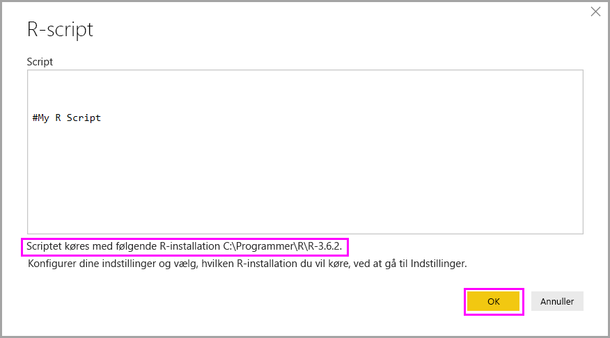
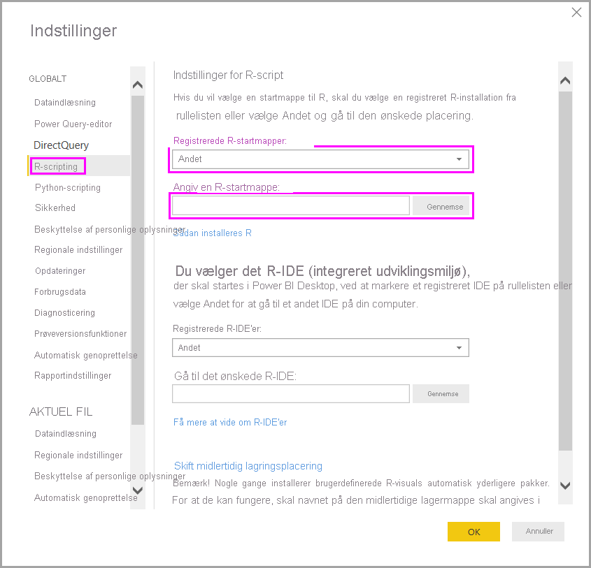

# Kør R-scripts i Power BI Desktop

Du kan køre R-scripts direkte i Power BI Desktop og importere de resulterende datasæt i en datamodel i Power BI Desktop.

## Installér R

Hvis du vil køre R-scripts i Power BI Desktop, skal du installere R på din lokale maskine. Du kan downloade og installere R gratis fra mange forskellige steder, herunder [Microsoft R Application Network](https://mran.revolutionanalytics.com/download/) og [CRAN Repository](https://cran.r-project.org/bin/windows/base/). Den aktuelle version understøtter Unicode-tegn og mellemrum (tomme tegn) i installationsstien.

## Kør R-scripts

Ved hjælp af nogle få trin i Power BI Desktop kan du køre R-scripts og oprette en datamodel. Fra denne datamodel kan du oprette rapporter og dele dem på Power BI-tjenesten. R-script i Power BI Desktop understøtter nu talformater, der indeholder decimaler (.) og kommaer (,).

### Klargør et R-script

Hvis du vil køre et R-script i Power BI Desktop, skal du oprette scriptet i dit lokale R-udviklingsmiljø og sørge for, at det kører korrekt.

Hvis du vil køre scriptet i Power BI Desktop, skal du kontrollere, at scriptet kører korrekt i et nyt og uændret arbejdsområde. Denne forudsætning betyder, at alle pakker og afhængigheder udtrykkeligt skal være indlæst og køre. Du kan bruge `source()` til at køre afhængige scripts.

Når du forbereder og kører et R-script i Power BI Desktop, er der et par begrænsninger:

* Det er kun datarammer, der importeres, derfor skal du huske at repræsentere de data, du vil importere til Power BI, i en dataramme.
* Kolonner, der skrives som Kompleks og Vektor, importeres ikke, og de erstattes af fejlværdier i den oprettede tabel.
* Værdier, der er `N/A`, oversættes til `NULL`-værdier i Power BI Desktop.
* Hvis et R-script kører i mere end 30 minutter, opstår der timeout.
* Interaktive kald i R-scriptet, f.eks. afventer brugerinput, stopper kørslen af scriptet.
* Når arbejdsmappen angives i R-scriptet, *skal* du definere en fuld sti til arbejdsmappen i stedet for en relativ sti.

### Kør R-scriptet, og importér data

Nu kan du køre dit R-script for at importere data til Power BI Desktop:

1. I Power BI Desktop skal du vælge **Hent data**, vælge **Andet** > **R-script** og derefter vælge **Opret forbindelse**:

    

2. Hvis R er installeret på din lokale maskine, skal du blot kopiere dit script til scriptvinduet og vælge **OK**. Den senest installerede version vises som R-programmet.

    

3. Vælg **OK** for at køre R-scriptet. Når scriptet køres, kan du vælge de resulterende datarammer, der skal føjes til Power BI-modellen.

Du kan styre, hvilken R-installation der skal bruges til at køre dit script. Du angiver indstillingerne for R-installationen ved at vælge **Fil** > **Indstillinger** > **Indstillinger** og derefter vælge **R-script**. Under **R-scriptindstillinger** vises de aktuelle valg for R-installationen på rullelisten **Registrerede R-startmapper**. Hvis den ønskede R-installation ikke er angivet, skal du vælge **Andet**og derefter gå til eller angive din foretrukne R-installationsmappe i **Angiv en startmappe for R**.

### Refresh

Du kan opdatere et R-script i Power BI Desktop. Når du opdaterer et R-script, køres R-scriptet i Power BI Desktop igen i Power BI Desktop-miljøet.

## De næste trin

Du kan finde flere oplysninger om R i Power BI i følgende artikler.

* [Opret visuelle Power BI-elementer ved hjælp af R](../create-reports/desktop-r-visuals.md)
* [Brug en ekstern R-IDE med Power BI](desktop-r-ide.md)
