# <a name="tutorial-shape-and-combine-data-in-power-bi-desktop"></a>Selvstudium: Form og kombiner data i Power BI Desktop

Med Power BI Desktop kan du oprette forbindelse til mange forskellige typer datakilder og derefter forme dataene, så de passer til dine behov, hvilket giver dig mulighed for at oprette visuelle rapporter, som du kan dele med andre. At *forme* data betyder, at dataene transformeres: kolonner eller tabeller omdøbes, tekst ændres til tal, rækker fjernes, den første række angives som overskrifter osv. At *kombinere* data betyder, at der oprettes forbindelse til to eller flere datakilder, at dataene formes efter behov, og at de derefter konsolideres i en nyttig forespørgsel.

I dette selvstudium lærer du, hvordan du:

* Former data ved hjælp af Forespørgselseditor.
* Opretter forbindelse til forskellige datakilder.
* Kombinerer disse datakilder og oprette en datamodel, der kan bruges i rapporter.

I dette selvstudium kan du se, hvordan en forespørgsel formes ved hjælp af Power BI Desktop med fokus på nogle af de mest almindelige opgaver. Den forespørgsel, der bruges her, er beskrevet mere detaljeret under [Introduktion til Power BI Desktop](../fundamentals/desktop-getting-started.md), hvor du også kan se, hvordan de opretter forespørgslen fra bunden.

Der gøres udførlig brug af genvejsmenuer og båndet **Transformér** i Forespørgselseditor i Power BI Desktop. Det meste af det, du kan vælge på båndet, er også tilgængeligt, hvis du højreklikker på et element, f.eks. en kolonne, og vælger fra den viste menu.

## <a name="shape-data"></a>Form data
Når du former data i Forespørgselseditor, angiver du en trinvis vejledning, som udføres for dig i Forespørgselseditor for at tilpasse dataene, i takt med at de indlæses og præsenteres. Den oprindelige datakilde påvirkes ikke. Det er kun denne bestemte visning af dataene, der tilpasses eller *formes*.

De angivne trin (f.eks. omdøb en tabel, transformér en datatype, eller slet en kolonne) registreres af Forespørgselseditor. Hver gang denne forespørgsel opretter forbindelse til datakilden, udføres disse trin i Forespørgselseditor, så dataene altid formes på den måde, du angiver. Denne proces foregår, hver gang du bruger Forespørgselseditor, eller hvis andre bruger din delte forespørgsel, for eksempel i Power BI-tjenesten. Disse trin er hentet, i rækkefølge, i ruden **Forespørgselsindstillinger** under **Anvendte trin**. Vi gennemgår hvert af disse trin i de næste par afsnit.


Hvis vi bruger de pensionsdata fra [Introduktion til Power BI Desktop](../fundamentals/desktop-getting-started.md), som vi hentede ved at oprette forbindelse til en webdatakilde, kan vi forme dataene, så de passer til vores behov. Vi tilføjer en brugerdefineret kolonne for at beregne rangering, baseret på at alle data er ligeværdige faktorer, og sammenligner denne kolonne med den eksisterende kolonne **Rangering**.  

1. På båndet **Tilføj kolonne** skal du vælge **Brugerdefineret kolonne**, som giver dig mulighed for at tilføje en brugerdefineret kolonne.

    

1. I vinduet **Brugerdefineret kolonne** under **Nyt kolonnenavn** skal du angive _Ny rangering_. Angiv følgende data i **Formel for brugerdefineret kolonne**:

    ```
    ([Cost of living] + [Weather] + [Health care quality] + [Crime] + [Tax] + [Culture] + [Senior] + [#"Well-being"]) / 8
    ```
 
1. Kontrollér, at der står *Der er ikke registreret nogen syntaksfejl* i statusmeddelelsen, og vælg **OK**.

    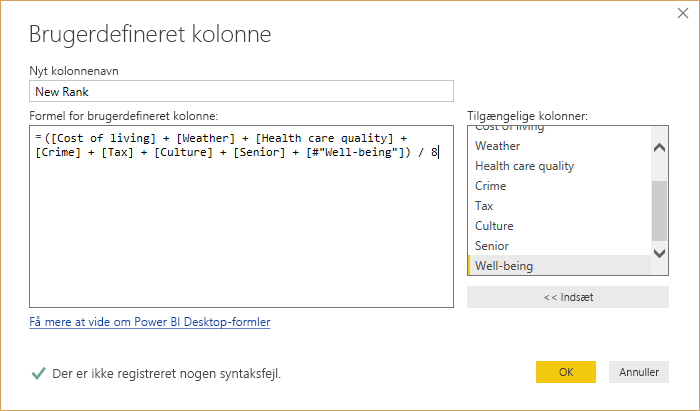

1. Transformér de nye kolonneværdier til heltal for at sikre, at kolonnedataene er ensartet. Du ændrer dem ved at højreklikke på kolonneoverskriften og vælge **Skift type \> Heltal**. 

    Hvis du har brug for at vælge mere end én kolonne, skal du markere en kolonne, holde **Skift** nede, markere yderligere tilstødende kolonner og derefter højreklikke på en kolonneoverskrift. Du kan også holde **Ctrl** nede for at vælge kolonner, der ikke støder op til hinanden.

    

1. Hvis du vil *transformere* kolonnedatatyper, hvori du transformerer den aktuelle datatype til en anden, skal du vælge **Tekst for datatype** på båndet **Transformér**. 

   

1. I ruden **Forespørgselsindstillinger** afspejler **Anvendte trin** de trin til formning, der er anvendt på dataene. Du fjerner et trin fra processen til formning ved at vælge **X** til venstre for trinnet. 

    På følgende billede afspejler **Anvendte trin** de trin, der er tilføjet indtil videre: 
     - **Kilde**: Oprettelse af forbindelse til webstedet.
     - **Navigation**: Valg af tabellen. 
     - **Ændret type**: Ændring af tekstbaserede nummerkolonner fra *Tekst* til *Heltal*. 
     - **Tilføjet brugerdefineret**: Tilføjelse af en brugerdefineret kolonne.
     - **Ændret type1**: Det sidste anvendte trin.

       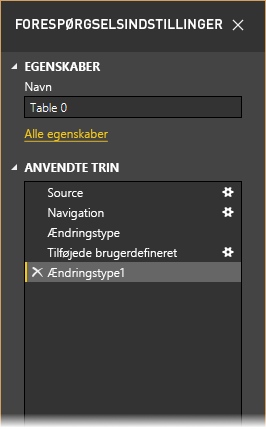

## <a name="adjust-data"></a>Tilpas data

Inden vi kan arbejde med denne forespørgsel, skal vi foretage nogle få ændringer for at tilpasse dataene:

   - Tilpas rangeringerne ved at fjerne en kolonne.

       Vi har besluttet, at **Leveomkostninger** ikke er en faktor i vores resultater. Efter vi har fjernet denne kolonne, opdager vi, at dataene forbliver uændret. 

   - Ret nogle få fejl.

       Fordi vi har fjernet en kolonne, skal vi tilpasse vores beregninger igen i kolonnen **Ny rangering**, hvilket omfatter en ændring af formlen.

   - Sortér dataene.

       Sortér dataene ud fra kolonnerne **Ny rangering** og **Rangering**.
 
   - Erstat dataene.

       Vi fremhæver, hvordan man erstatter en bestemt værdi og behovet for at indsætte et **Anvendt trin**.

   - Skift navnet på tabellen. 

       Da **Tabel 0** ikke er en nyttig beskrivelse af tabellen, ændrer vi navnet.

1. Du fjerner kolonnen **Leveomkostninger** ved at markere kolonnen, vælge fanen **Start** på båndet og derefter vælge **Fjern kolonner**.

    

   Bemærk, at værdierne i **Ny rangering** ikke er blevet ændret pga. rækkefølgen af trinnene. Da Forespørgselseditor registrerer trinnene sekventielt, men stadig uafhængigt af hinanden, kan du flytte hvert **Anvendte trin** op eller ned i sekvensen. 

1. Højreklik på et trin. Forespørgselseditor indeholder en menu, der giver dig mulighed for at udføre følgende opgaver: 
   - **Omdøb**: Omdøb trinnet.
   - **Slet**: Slet trinnet.
   - **Slet** **indtil slutning**: Fjern det aktuelle trin og alle efterfølgende trin.
   - **Flyt op**: Flyt trinnet op på listen.
   - **Flyt ned**: Flyt trinnet ned på listen.

1. Flyt det sidste trin **Fjernede kolonner** op til lige over trinnet **Tilføjet brugerdefineret**.

   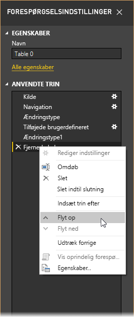

1. Vælg trinnet **Tilføjet brugerdefineret**. 

   Bemærk, at der nu vises _Fejl_ for dataene, hvilket vi skal håndtere.

   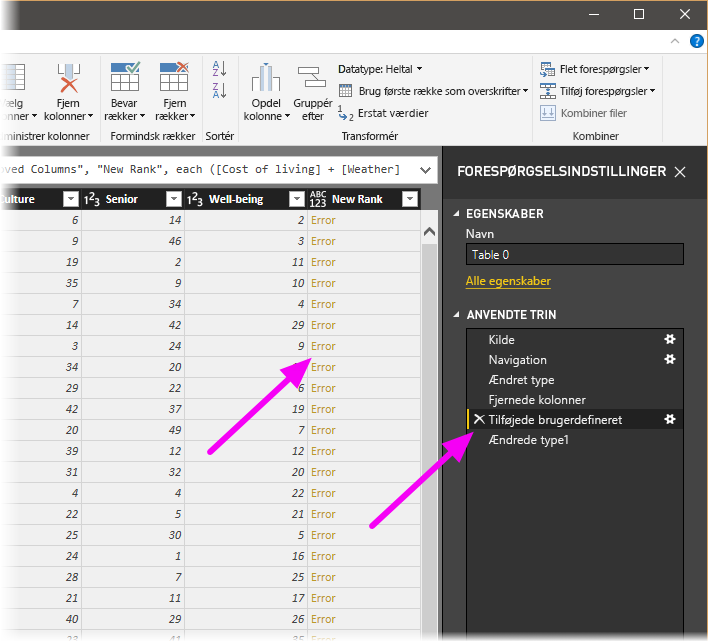

   Der findes et par metoder til at få vist flere oplysninger om hver enkelt fejl. Hvis du markerer cellen uden at klikke på ordet *Fejl*, vises fejloplysningerne nederst i vinduet i Forespørgselseditor.

   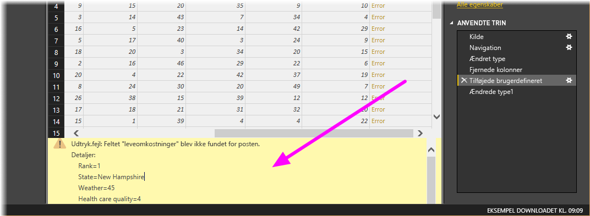

   Hvis du markerer ordet *Fejl* direkte, oprettes der et **Anvendt trin** i Forespørgselseditor i ruden **Forespørgselsindstillinger**, og der vises oplysninger om fejlen. 

1. Da vi ikke behøver at vise oplysninger om fejlene, skal du vælge **Annuller**.

1. For at rette fejlene skal du markere kolonnen **Ny rangering** og derefter få vist kolonnens dataformel ved at markere afkrydsningsfeltet **Formellinje** under fanen **Vis**. 

   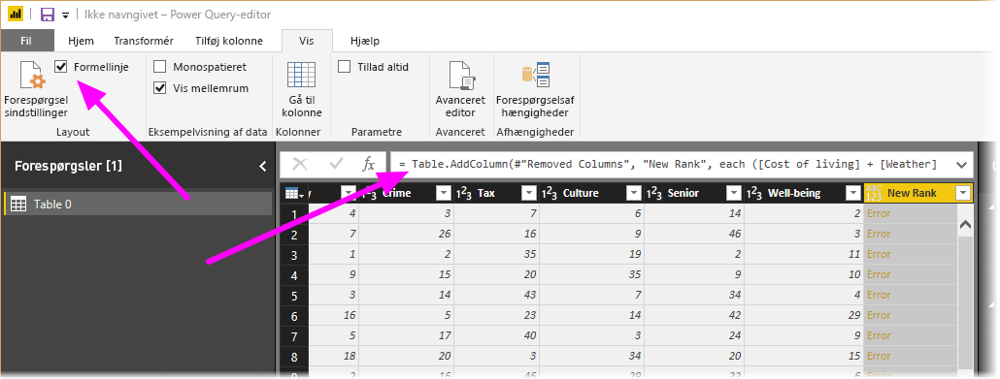

1. Fjern parameteren _Leveomkostninger_, og formindsk divisoren ved at ændre formlen på følgende måde: 
   ```
    Table.AddColumn(#"Removed Columns", "New Rank", each ([Weather] + [Health care quality] + [Crime] + [Tax] + [Culture] + [Senior] + [#"Well-being"]) / 7)
   ```

1. Markér det grønne flueben til venstre for formelfeltet, eller tryk på **Enter**.

  Dataene erstattes med de reviderede værdier i Forespørgselseditor, og trinnet **Tilføjet brugerdefineret** fuldføres uden fejl.

   > [!NOTE]
   > Du kan også markere **Fjern fejl** ved hjælp af båndet eller genvejsmenuen, hvilket fjerner alle rækker, der indeholder fejl. Det vil vi dog ikke gøre i dette selvstudium, da vi gerne vil bevare dataene i tabellen.

1. Sortér dataene ud fra kolonnen **Ny rangering**. Vælg først det sidste anvendte trin, **Ændret type1**, for at få vist de nyeste data. Vælg derefter rullemenuen ved siden af kolonneoverskriften **Ny rangering**, og vælg **Sortér stigende**.

   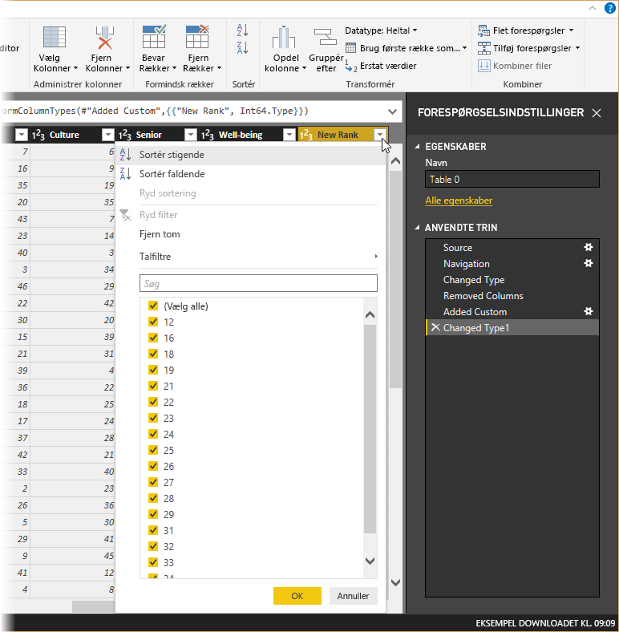

   Dataene sorteres nu i henhold til **Ny rangering**. Men hvis du kigger i kolonnen **Rangering**, kan du se, at dataene ikke er sorteret korrekt i de tilfælde, hvor værdien **Ny rangering** er lig med Rangering. Vi løser dette i det næste trin.

1. Du løser problemet med sortering af data ved at markere kolonnen **Ny rangering** og ændre formlen i **Formellinjen** til følgende formel:

   ```
    = Table.Sort(#"Changed Type1",{{"New Rank", Order.Ascending},{"Rank", Order.Ascending}})
   ```

1. Markér det grønne flueben til venstre for formelfeltet, eller tryk på **Enter**. 

   Rækkerne sorteres nu i henhold til både **Ny rangering** og **Rangering**. Du kan desuden vælge et vilkårligt trin på listen **Anvendte trin** og fortsætte med at forme dataene på det trin i sekvensen. Der indsættes automatisk et nyt trin direkte efter det aktuelt markerede **Anvendte trin** i Forespørgselseditor. 

1. Under **Anvendt trin** skal du vælge det trin, der kommer før den brugerdefinerede kolonne, hvilket er trinnet **Fjernede kolonner**. Her erstatter vi værdien af rangeringen **Vejr** i Arizona. Højreklik på den relevante celle, der indeholder rangeringen **Vejr** for Arizona, og vælg derefter **Erstat værdier**. Bemærk, hvilket **Anvendte trin** der er valgt i øjeblikket.

   

1. Vælg **Indsæt**.

    Da vi indsætter et trin, vises der en advarsel om faren ved at gøre dette i Forespørgselseditor, da efterfølgende trin kan medføre, at forespørgslen ikke fungerer som ventet. 

    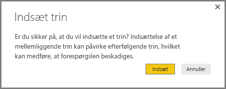

1. Skift dataværdien til _51_. 

   Dataene for Arizona erstattes i Forespørgselseditor. Når du opretter et nyt **Anvendt trin**, navngives det på baggrund af handlingen i Forespørgselseditor. I dette tilfælde **Erstattet værdi**. Hvis du har mere end ét trin med samme navn i din forespørgsel, føjes der et tal (i rækkefølge) til hvert efterfølgende **Anvendte trin** i Forespørgselseditor for at skelne mellem dem.

1. Markér det sidste **Anvendte trin**, **Sorterede rækker**. 

   Bemærk, at dataene har ændret sig i forhold til Arizonas nye rangering. Denne ændring skyldes, at vi indsatte trinnet **Erstattet værdi** det rigtige sted, før trinnet **Tilføjet brugerdefineret**.

1. Til sidst vil jeg ændre navnet på tabellen til noget mere beskrivende. I ruden **Forespørgselsindstillinger** under **Egenskaber** skal du angive det nye navn på tabellen og derefter vælge **Enter**. Navngiv denne tabel *Pensionsstatistik*.

   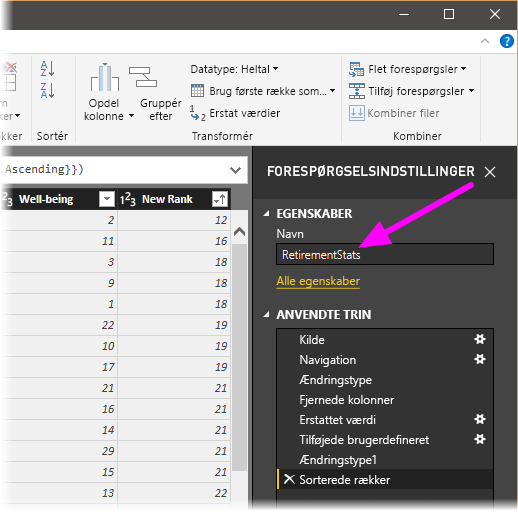

   Når vi begynder at oprette rapporter, er det især praktisk at have beskrivende tabelnavne, når vi opretter forbindelse til flere datakilder, som vises i ruden **Felter** i **Rapportvisning**.

   Vi har nu formet dataene i det omfang, vi har brug for. Lad os derefter oprette forbindelse til en anden datakilde og kombinere dataene.

## <a name="combine-data"></a>Kombiner data
Dataene for de forskellige stater er interessante og nyttige til at skabe yderligere analyser og forespørgsler. Men der er et problem: De fleste data anvender forkortelser på to bogstaver for statskoder og ikke statens fulde navn. Vi skal bruge en måde at knytte navnene på staterne til deres forkortelser.

Vi er heldige. Der er en anden offentlig datakilde, som gør lige præcis dette, men den skal formes en del, før vi kan knytte den til vores pensionstabel. Hvis du vil forme dataene, skal du følge disse trin:

1. På båndet **Start** i Forespørgselseditor skal du vælge **Ny kilde \> Web**. 

2. Angiv adressen på webstedet for at finde forkortelser på stater, *https://en.wikipedia.org/wiki/List_of_U.S._state_abbreviations* , og vælg derefter **Opret forbindelse**.

   Indholdet af webstedet vises i navigatoren.

    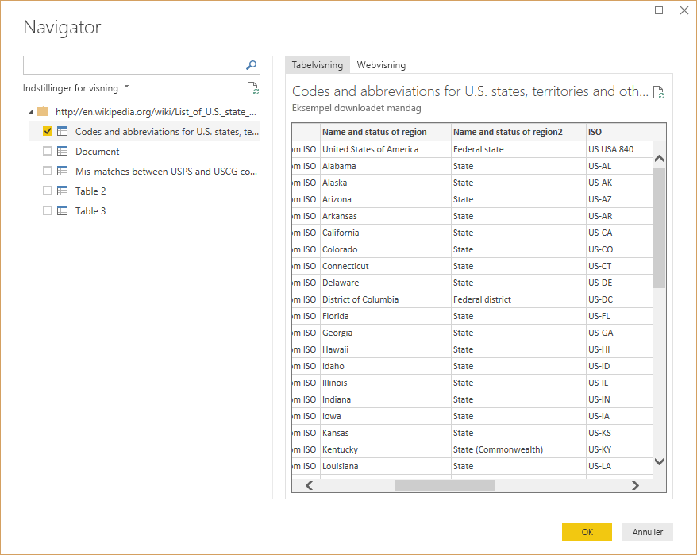

1. Vælg **Koder og forkortelser**. 

   > [!TIP]
   > Der kræves en del formning for at få de data, vi vil have, i tabellen. Er der en hurtigere eller nemmere måde at udføre disse trin på? Ja, vi kunne oprette en *relation* mellem de to tabeller og forme dataene baseret på relationen. Nedenstående trin er stadig nyttige at lære, da de bruges, når man arbejder med tabeller. Relationer kan dog hjælpe dig med at bruge data fra flere tabeller hurtigt.
> 
> 

Følg disse trin for at forme dataene:

1. Fjern den øverste række. Da den er et resultat af den måde, som websidens tabel er oprettet på, har vi ikke brug for den. Vælg **Formindsk rækker \> Fjern rækker \> Fjern de øverste rækker** under fanen **Home** .

    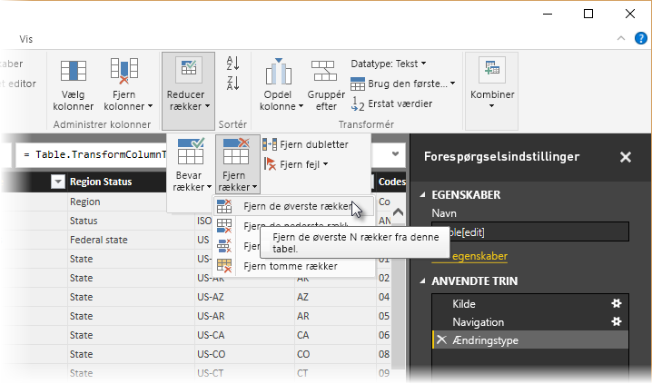

    Vinduet **Fjern de øverste rækker** åbnes, og du kan angive, hvor mange rækker du vil fjerne.

    > [!NOTE]
    > Hvis Power BI tilfældigvis importerer tabeloverskrifterne som en række i din datatabel, kan du vælge **Brug første række som overskrift** på båndet **Hjem** eller på fanen **Transformér** på båndet for at løse problemet i tabellen.

1. Fjern de nederste 26 rækker. Disse rækker er amerikanske områder, som vi ikke behøver at inkludere. Vælg **Formindsk rækker \> Fjern rækker \> Fjern de nederste rækker** under fanen **Hjem** .

    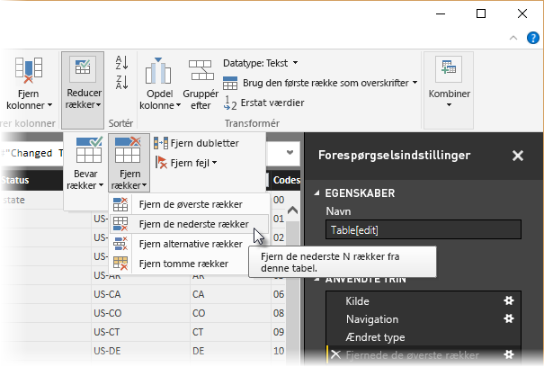

1. Da tabellen Pensionsstatistik ikke indeholder oplysninger om Washington D.C., har vi brug for at bortfiltrere den fra vores liste. Vælg rullelisten **Områdestatus**, og fjern derefter markeringen i afkrydsningsfeltet ud for **Føderalt distrikt**.

    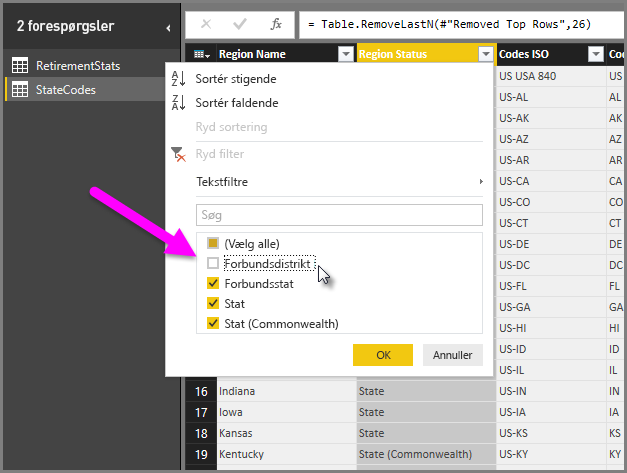

1. Fjern nogle få unødvendige kolonner. Da vi kun har brug for tilknytningen af hver stat til den officielle forkortelse på to bogstaver, kan vi fjerne følgende kolonner: **Kolonne1**, **Kolonne3**, **Kolonne4** og **Kolonne6** til **Kolonne11**. Markér først **Kolonne1**, hold derefter **Ctrl**-tasten nede, og markér hver af de andre kolonner, som skal fjernes. På fanen **Start** på båndet skal du vælge **Fjern kolonner \> Fjern kolonner**.

   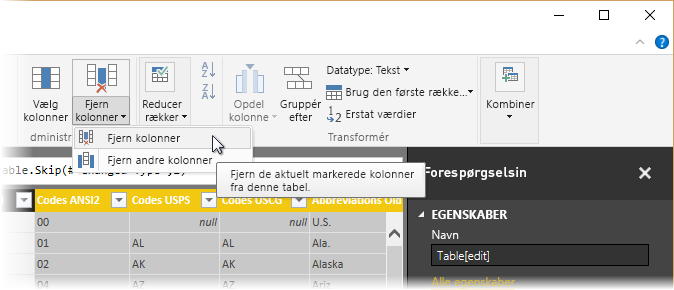

   > [!NOTE]
   > Dette er et godt tidspunkt at påpege, at *rækkefølgen* af de anvendte trin i Forespørgselseditor er vigtig, og den kan påvirke, hvordan datatypen formes. Det er også vigtigt at overveje, hvordan ét trin kan påvirke efterfølgende trin. Hvis du fjerner et trin fra Anvendte trin, fungerer de efterfølgende trin muligvis ikke som oprindeligt tiltænkt, på grund af effekten af rækkefølgen af trin i forespørgslen.

   > [!NOTE]
   > Hvis du gør vinduet med Forespørgselseditor smallere, vil nogle af elementerne på båndet bliver gjort mindre, så den synlige plads kan udnyttes bedre. Hvis du gør vinduet med Forespørgselseditor bredere, udvides elementerne på båndet, så det større område udnyttes bedst muligt.

1. Omdøb kolonnerne og tabellen. Der er et par måder at omdøbe en kolonne på: Først skal du markere kolonnen og derefter enten vælge **Omdøb** under fanen **Transformér** på båndet eller højreklikke og vælge **Omdøb**. I det følgende billede vises pile til begge muligheder. Du skal kun vælge den ene mulighed.

   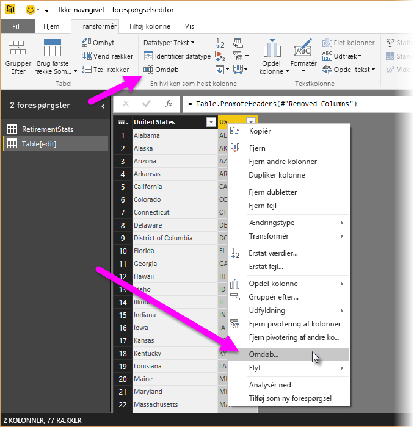

1. Omdøb kolonnerne til *Statsnavn* og *Statskode*. Du omdøber tabellen ved at angive **Navn** i ruden **Forespørgselsindstillinger**. Navngiv tabellen *Statskoder*.

## <a name="combine-queries"></a>Kombiner forespørgsler

Nu, hvor vi har formet tabellen Statskoder, som vi ønsker, kan vi kombinere disse to tabeller eller forespørgsler til én. Da de tabeller, vi har nu, er et resultat af de forespørgsler, vi anvendte på dataene, kaldes de ofte for *forespørgsler*.

Der er to primære måder at kombinere forespørgsler på: *fletning* og *tilføjelse*.

- Når du har en eller flere kolonner, som du vil føje til en anden forespørgsel, skal du *flette* forespørgslerne. 
- Når du har flere rækker med data, som du vil føje til en eksisterende forespørgsel, skal du *tilføje* forespørgslen.

I dette tilfælde vil vi flette forespørgslerne. Det gør du ved at gennemgå disse trin:
 
1. I ruden til venstre i Forespørgselseditor skal du vælge den forespørgsel, som du vil flette den anden forespørgsel *til*. I dette tilfælde er det **Pensionsstatistik**. 

1. Vælg **Kombiner \> Flet forespørgsler** under fanen **Start** på båndet.

   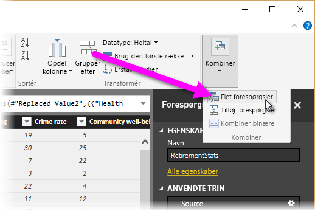

   Du bliver måske bedt om at angive niveau for beskyttelse af personlige oplysninger for at sikre, at dataene kombineres uden at inkludere eller overføre data, du ikke vil have overført.

   Vinduet **Flet** åbnes. I vinduet bliver du bedt om at vælge, hvilken tabel du vil have flettet med den valgte tabel og de tilsvarende kolonner, der skal bruges til fletningen. 

1. Vælg **Stat** i tabellen Pensionsstatistik, og vælg derefter forespørgslen **Statskoder**. 

   Når du vælger de korrekte tilsvarende kolonner, aktiveres knappen **OK**.

   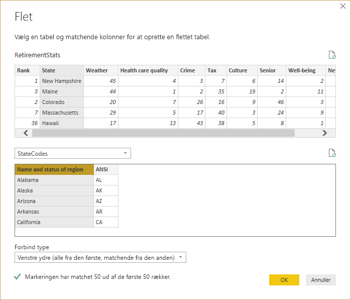

1. Vælg **OK**.

   Kolonnen **Ny kolonne** oprettes i slutningen af forespørgslen i Forespørgselseditor med indholdet af den tabel (forespørgsel), der blev flettet med den eksisterende forespørgsel. Alle kolonner fra den flettede forespørgsel komprimeres i kolonnen **Ny kolonne**, men du kan **udvide** tabellen og inkludere alle de kolonner, du vil.

   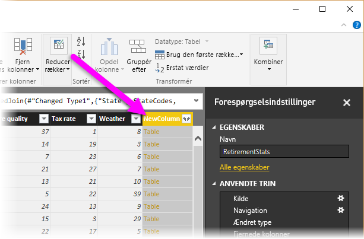

1. Hvis du vil udvide den flettede tabel og vælge, hvilke kolonner der skal inkluderes, skal du vælge ikonet for udvidelse (). 

   Vinduet **Udvid** vises.

   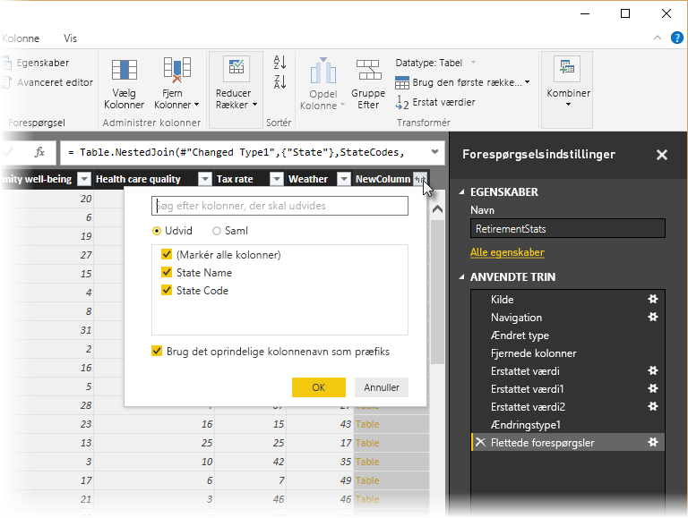

1. I dette tilfælde vil vi kun have kolonnen **Statskode**. Vælg denne kolonne, fjern markeringen i **Brug oprindeligt kolonnenavn som præfiks**, og vælg derefter **OK**.

   Hvis vi havde beholdt markeringen i afkrydsningsfeltet for **Brug oprindeligt kolonnenavn som præfiks**, ville den flettede kolonne blive navngivet **Ny kolonne.Statskode**.

   > [!NOTE]
   > Vil du gerne udforske, hvordan du inkluderer tabellen Ny kolonne? Du kan eksperimentere lidt, og hvis du ikke kan lide resultatet, skal du bare slette dette trin på listen **Anvendte trin** i ruden **Forespørgselsindstillinger**. Din forespørgsel vender tilbage til tilstanden før trinnet **Udvid** blev anvendt. Du kan gøre dette, så mange gange du vil, indtil udvidelsesprocessen ser ud, som den skal.

   Vi har nu en enkelt forespørgsel (tabel), hvor to datakilder er kombineret, som hver især er blevet formet efter vores behov. Denne forespørgsel kan fungere som udgangspunkt for mange yderligere og interessante dataforbindelser, f.eks. statistikker for boligomkostninger, demografi eller jobmuligheder i en vilkårlig stat.

1. Vælg **Luk og anvend** under fanen **Start** på båndet for at anvende ændringerne og lukke Forespørgselseditor. 

   Det transformerede datasæt vises i Power BI Desktop, hvor du nu kan bruge det til at oprette rapporter.

   

## <a name="next-steps"></a>Næste trin
Du kan finde flere oplysninger om Power BI Desktop og dets egenskaber i følgende ressourcer:

* [Hvad er Power BI Desktop?](../fundamentals/desktop-what-is-desktop.md)
* [Oversigt over forespørgsler i Power BI Desktop](../transform-model/desktop-query-overview.md)
* [Datakilder i Power BI Desktop](desktop-data-sources.md)
* [Opret forbindelse til data i Power BI Desktop](desktop-connect-to-data.md)
* [Almindelige forespørgselsopgaver i Power BI Desktop](../transform-model/desktop-common-query-tasks.md)   
