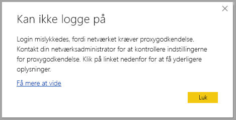
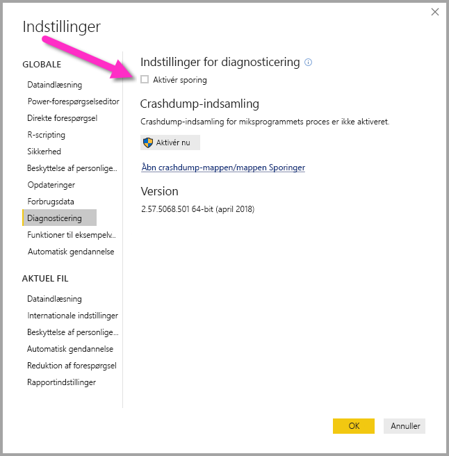

# Fejlfinding af logonproblemer i Power BI Desktop
Der kan være situationer, hvor du forsøger at logge på **Power BI Desktop**, men støder på fejl. Der er to primære årsager til logonproblemer: **Proxy-godkendelsesfejl** og **fejl ved omdirigering til URL-adresser, der ikke er HTTPS**. 

Hvis du vil finde ud af, hvad der forårsager dit logonproblem, skal du først kontakte administratoren og levere diagnosticeringsoplysninger, så administratoren kan finde årsagen til problemet. Ved at spore problemer, der er knyttet til logonproblemet, kan administratorer afgøre, hvilke af følgende fejl der er skyld i dit problem. 

Lad os se på disse problemer hver for sig. I slutningen af denne artikel kan du se en beskrivelse af, hvordan du henter *sporingsoplysninger* i Power BI Desktop, som kan hjælpe dig med at spore fejlfindingsproblemer.

## Fejlen Proxygodkendelse kræves

På følgende skærm vises et eksempel på fejlen *Proxygodkendelse kræves*.

Følgende undtagelser i *Power BI Desktop*-sporingsfiler er knyttet til denne fejl:

* *Microsoft.PowerBI.Client.Windows.Services.PowerBIWebException*
* *HttpStatusCode: ProxyAuthenticationRequired*

Når denne fejl opstår, skyldes det højst sandsynligt, at en proxyserver til godkendelse på netværket blokerer webanmodninger, der er udstedt af **Power BI Desktop**. 

Hvis dit netværk bruger en proxyserver til godkendelse, kan din administrator løse problemet ved at føje følgende domæner på proxyserveren til hvidlisten:

* app.powerbi.com
* api.powerbi.com
* domæner i navneområdet *.analysis.windows.net

For kunder, der er en del af en cloudløsning til offentlige myndigheder, kan dette problem løses ved at føje følgende domæner til en hvidliste på proxyserveren for godkendelse:

* app.powerbigov.us
* api.powerbigov.us
* domæner i navneområdet *.analysis.usgovcloudapi.net

## Der opstod en fejl under omdirigering til URL-adresse, der ikke er HTTPS

Aktuelle versioner af **Power BI Desktop** bruger den aktuelle version af ADAL (Active Directory Authentication Library), der ikke tillader omdirigering til ikke-sikrede (ikke-HTTPS) URL-adresser. 

Følgende undtagelser i *Power BI Desktop*-sporingsfiler er knyttet til denne fejl:

* *Microsoft.IdentityModel.Clients.ActiveDirectory.AdalServiceException: Omdirigering til URL-adresser, der ikke er HTTPS, understøttes ikke i webvisning*
* *ErrorCode: non_https_redirect_failed*

Hvis fejlen *ErrorCode: non_https_redirect_failed* opstår, betyder det, at en eller flere omdirigeringssider eller providere i rækken af omdirigeringer ikke er et HTTPS-beskyttet slutpunkt, eller at en certifikatudsteder af en eller flere omdirigeringer ikke er blandt de rodnøgler, enheden har tillid til. Alle providere i rækken af logonomdirigeringer skal bruge en HTTPS-sikret URL-adresse. Du kan få løst dette problem ved at kontakte administratoren og anmode om, at sikrede URL-adresser bruges til deres godkendelseswebsteder. 

## Sådan indhenter du sporingsoplysninger i Power BI Desktop

Hvis du vil indhente sporingsoplysninger i **Power BI Desktop**, skal du udføre disse trin:

1. Aktivér sporing i **Power BI Desktop** ved at gå til **Filer > Indstillinger > Indstillinger** og derefter vælge **Diagnosticering** i indstillingerne i venstre rude. I den rude, der vises, skal du markere afkrydsningsfeltet ud for **Aktivér sporing** som vist på følgende billede. Du skal muligvis genstarte **Power BI Desktop**.
   
   

2. Udfør derefter de trin, der genskaber fejlen. Når det sker, føjer **Power BI Desktop** hændelser til sporingsloggen, som er gemt på den lokale computer.

3. Gå til mappen Sporinger på din lokale computer. Du kan finde denne mappe ved at vælge linket i den **diagnosticering**, hvor sporing er aktiveret, der vises som *mappen Åben crashdump/Sporinger* på forrige billede. Den findes ofte på den lokale computer på følgende placering:

    `C:\Users/<user name>/AppData/Local/Microsoft/Power BI Desktop/Traces`

Der kan være mange sporingsfiler i denne mappe. Sørg for kun at sende de seneste filer til din administrator, så det er lettere at identificere fejlen hurtigt. 

## Brug af systemets standardlegitimationsoplysninger for webproxy

Webanmodninger, der er udstedt af Power BI Desktop, bruger ikke webproxy-legitimationsoplysninger. I netværk, der bruger en proxyserver, er Power BI Desktop muligvis ikke i stand til at oprette webanmodninger. 

Fra og med Power BI Desktop-udgivelsen i marts 2020 kan system- og netværksadministratorer gøre det muligt at bruge systemets standardlegitimationsoplysninger til godkendelse af webproxyer. Administratorer kan oprette en registreringsdatabasepost med navnet **UseDefaultCredentialsForProxy** og angive værdien til én (1) for at aktivere brugen af systemets standardlegitimationsoplysninger til godkendelse af webproxyer.

Posten i registreringsdatabasen kan placeres på en af følgende placeringer:

`[HKEY_LOCAL_MACHINE\SOFTWARE\WOW6432Node\Microsoft\Microsoft Power BI Desktop]`
`[HKEY_LOCAL_MACHINE\SOFTWARE\Microsoft\Microsoft Power BI Desktop]`

Det er ikke nødvendigt at have posten i registreringsdatabasen på begge placeringer.

Når posten i registreringsdatabasen er oprettet (det kan være nødvendigt at genstarte), bruges de proxyindstillinger, der er defineret i Internet Explorer, når Power BI Desktop foretager webanmodninger. 

Som det er tilfældet med eventuelle ændringer af proxyindstillinger eller indstillinger for legitimationsoplysninger, er der sikkerhedshensyn at tage ved oprettelse af denne post i registreringsdatabasen, så administratorer skal sikre, at de har konfigureret proxyerne til Internet Explorer korrekt, før de aktiverer denne funktion.         

### Begrænsninger og overvejelser ved brug af systemets standardlegitimationsoplysninger

Der er en række sikkerhedshensyn, som administratorer bør overveje, inden de aktiverer denne funktion. 

Følgende anbefalinger skal følges, når denne funktion aktiveres for klienter:

* Brug kun **Forhandling** som godkendelsesskemaet for proxyserveren for at sikre, at det kun er de proxyservere, der har joinforbindelse til Active Directory-netværket, der bruges af klienten. 
* Brug ikke **NTLM-fallback** på klienter, der bruger denne funktion.
* Hvis brugerne ikke er på et netværk med en proxy, når denne funktion er aktiveret og konfigureret som anbefalet i dette afsnit, anvendes den proces, hvor det forsøges at kontakte proxyserveren og bruge systemets standardlegitimationsoplysninger, ikke.

[Brug af systemets standardlegitimationsoplysninger til webproxy](#using-default-system-credentials-for-web-proxy)

