# Selvstudium: Analysér data på en webside ved hjælp af Power BI Desktop

Som inkarneret fodboldfan vil du oprette en rapport med vinderne af europamesterskaberne gennem årene. Med Power BI Desktop kan du importere disse data fra en webside til en rapport og oprette visualiseringer, der viser dataene. I dette selvstudium får du mere at vide om, hvordan du kan bruge Power BI Desktop til at:

- Oprette forbindelse til en webdatakilde og navigere på tværs af de tilgængelige tabeller.
- Forme og transformere data i Power Query-editor.
- Navngive en forespørgsel og importere den til en rapport i Power BI Desktop.
- Oprette og tilpasse en visualisering på et kort og et cirkeldiagram.

## Opret forbindelse til en webdatakilde

Du kan få data om europamestrene fra resultattabellen på siden UEFA European Football Championship på Wikipedia på https://en.wikipedia.org/wiki/UEFA_European_Football_Championship. 

Webforbindelserne oprettes kun ved hjælp af grundlæggende godkendelse. De websteder, der kræver godkendelse, virker muligvis ikke korrekt med webconnectoren.

Sådan importerer du dataene:

1. I Power BI Desktop skal du gå til båndet **Hjem**, trykke på pil ned ud for **Hent data** og derefter vælge **Web**.

   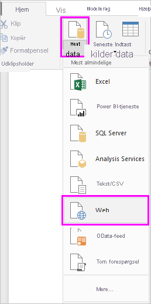 

   >[!NOTE]
   >Du kan også vælge menupunktet **Hent data** eller vælge **Hent data** fra dialogboksen Introduktion i Power BI Desktop og derefter vælge **Web** fra afsnittet **Alle** eller **Andre** i dialogboksen **Hent data** og derefter vælge **Opret forbindelse**.

1. I dialogboksen **Fra web** skal du indsætte URL-adressen `https://en.wikipedia.org/wiki/UEFA_European_Football_Championship` i tekstfeltet **URL-adresse** og derefter vælge **OK**.

    

   Når du har oprettet forbindelse til websiden Wikipedia, viser dialogboksen **Navigator** en liste over tabeller, der er tilgængelige på siden. Du kan vælge et af tabelnavnene for at få vist dataene. Tabellen **Results[edit]** indeholder de ønskede data, men de har ikke helt det ønskede format. Du skal omforme og rydde op i dataene, før du indlæser dem i din rapport.

   

   >[!NOTE]
   >I ruden **Eksempel** vises den seneste tabel, der er valgt, men alle de valgte tabeller indlæses i Power Query-editor, når du vælger **Transformér data** eller **Indlæs**.

1. Vælg tabellen **Results[edit]** på listen **Navigator**, og vælg derefter **Transformér data**.

   Der åbnes et eksempel på tabellen i **Power Query-editor**, hvor du kan anvende transformationer for at rydde op i dataene.

   

## Form data i Power-Forespørgselseditor

Du vil gøre det lettere at få et hurtigt overblik ved kun at vise år, og hvilke lande der har vundet. Du kan bruge Power Query-editor til at forme og rydde op i disse data.

Først skal du fjerne alle kolonner undtagen to i tabellen. Omdøb disse kolonner til *Year* og *Country* senere i processen.

1. Vælg kolonnerne i gitteret **Power Query-editor**. Vælg Ctrl for at vælge flere elementer.

1. Højreklik på og vælg **Fjern andre kolonner**, eller vælg **Fjern kolonner** > **Fjern andre kolonner** i gruppen **Administrer kolonner** på båndet **Hjem** for at fjerne alle andre kolonner fra tabellen.

   

   eller

   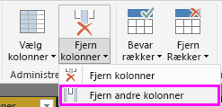

Derefter skal du fjerne det ekstra ord *Details* fra de første celler i kolonnen.

1. Vælg den første kolonne.

1. Højreklik, og vælg **Erstat værdier**, eller vælg **Erstat værdier** fra gruppen **Transformér** under fanen **Hjem** på båndet. Denne indstilling findes også i gruppen **En hvilken som helst kolonne** under fanen **Transformér**.

   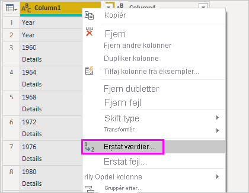 

   eller

   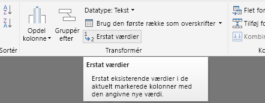

1. I dialogboksen **Erstat værdier** skal du skrive **Details** i tekstfeltet **Værdi, der skal søges efter**, undlade at udfylde tekstfeltet **Erstat med** og derefter vælge **OK** for at slette ordet *Details* i kolonnen.

   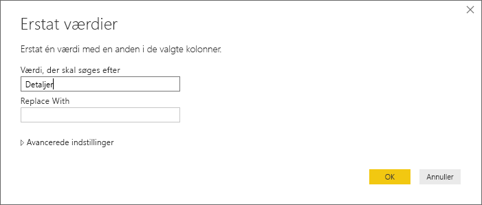

Nogle af cellerne indeholder kun ordet "Year" i stedet for værdier for år. Du kan filtrere kolonnen for kun at få vist rækker, der ikke indeholder ordet "Year".

1. Vælg pil ned på rullelisten til filtrering i kolonnen.

1. I rullemenuen skal du rulle ned og fjerne markeringen i afkrydsningsfeltet ud for indstillingen **Year** og derefter vælge **OK**.

   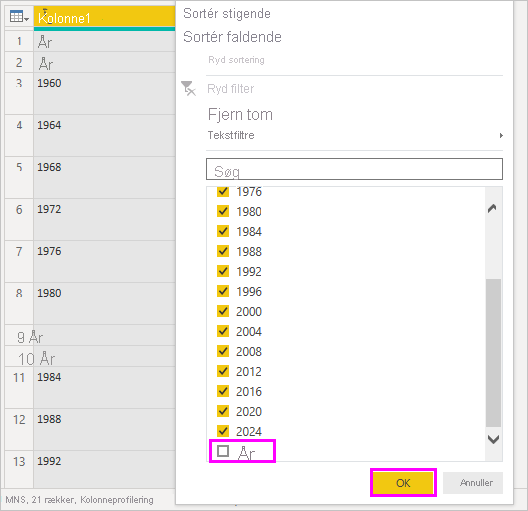

Da du kun ser på listen over finalevindere, kan du omdøbe den anden kolonne til **Country**. Sådan omdøber du kolonnen:

1. Dobbeltklik eller tryk og hold nede på den anden kolonneoverskrift.
   - Højreklik på kolonneoverskriften, og vælg **Omdøb**.
   - Vælg kolonnen *, og vælg **Omdøb** i gruppen **En hvilken som helst kolonne** på fanen **Transformér** på båndet.

   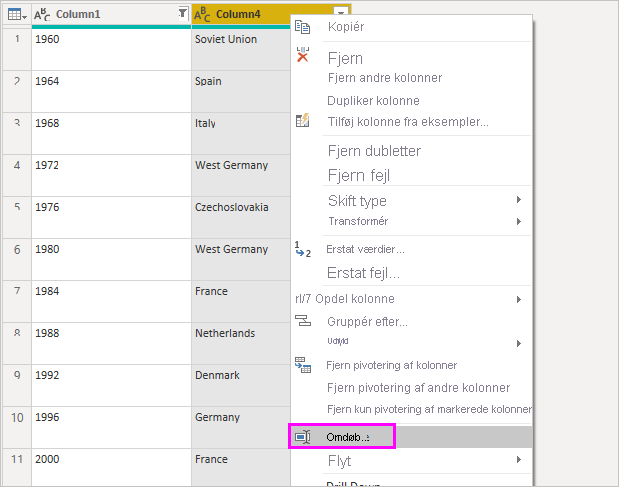 
  
   eller

   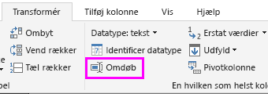

1. Skriv **Country** i overskriften, og tryk på **Enter** for at omdøbe kolonnen.

Du vil også filtrere rækker, f.eks. "2020", der indeholder null-værdier i kolonnen **Country**. Du kan bruge filtermenuen, som du gjorde med værdierne for **Year**, eller du kan:

1. Højreklikke på cellen **Country** på rækken **2020**, som indeholder værdien *null*.

1. Vælge **Tekstfiltre** > **Forskellig fra** i genvejsmenuen for at fjerne rækker, der indeholder værdien i den pågældende celle.

   

## Importér forespørgslen til rapportvisning

Nu, hvor du har formet dataene, som du ønsker det, er du klar til at navngive forespørgslen "Europamestre" og importere den til din rapport.

1. Skriv **Vindere af Euro Cup** i tekstfeltet **Navn** i ruden **Forespørgselsindstillinger**.

   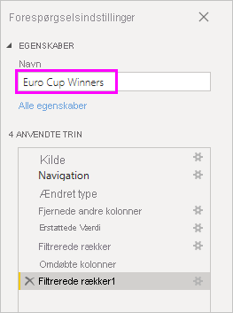

1. Vælg **Luk og anvend** > **Luk og anvend** under fanen **Hjem** på båndet.

   

Forespørgslen indlæses i *rapportvisningen* i Power BI Desktop, hvor du kan se den i ruden **Felter**.

   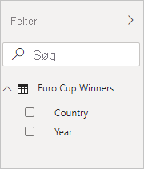

>[!TIP]
>Du kan altid vende tilbage til Power Query-editor for at redigere og tilpasse forespørgslen ved at:
>- Vælge ellipsen ( **...** ) for **flere indstillinger** ud for **Europamestre** i ruden **Felter** og vælge **Rediger forespørgsel** eller
>- Vælge **Rediger forespørgsler** > **Rediger forespørgsler** i gruppen **Eksterne data** under fanen **Hjem** på båndet i rapportvisning. 

## Opret en visualisering

Sådan opretter du en visualisering ud fra dine data:

1. Vælg feltet **Land** i ruden **Felter**, eller træk det til rapportlærredet. Power BI Desktop genkender dataene som landenavne og opretter automatisk en visualisering af typen **kort**.

   

1. Du kan udvide kortet ved at trække i håndtagene i hjørnerne, så navnene på alle vinderlandene bliver synlige.  

   

1. Kortet viser identiske datapunkter for de lande, der har vundet europamesterskaberne. Du kan få størrelsen på de enkelte datapunkter til at afspejle, hvor mange gange landet har vundet, ved at trække feltet **Year** til **Træk datafelter hertil** under **Størrelse** i den nederste del af ruden **Visualiseringer**. Feltet ændres automatisk til en måling med **antal år**, og kortvisualiseringen viser nu større datapunkter for lande, der har vundet flere turneringer.

   

## Tilpas visualiseringen

Som du kan se, er det meget nemt at oprette visualiseringer baseret på dine data. Det er også nemt at tilpasse dine visualiseringer, så du bedre kan vise dataene på de måder, du ønsker det.

### Formatér kortet

Du kan ændre udseendet af en visualisering ved at markere den og derefter vælge ikonet **Format** (malerrulle) i ruden **Visualiseringer**. Datapunktet eller -punkterne for "Tyskland" i din visualisering kunne f.eks. være vildledende, fordi Vesttyskland har vundet to gange, og Tyskland har vundet én gang, og på kortet lægges to punkter oven på hinanden i stedet for at adskille eller lægge dem sammen. Du kan farvelægge disse to punkter forskelligt for at fremhæve dette. Du kan også give kortet en mere beskrivende og spændende titel.

1. Mens visualiseringen er markeret, skal du vælge ikonet **Format** og derefter vælge **Datafarver** for at udvide indstillingerne for datafarver.

   

1. Slå **Vis alle** **til**, vælg rullelisten ud for **Vesttyskland**, og vælg derefter en gul farve.

   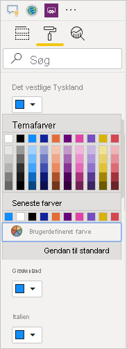

1. Vælg **Titel** for at udvide indstillingerne for titel, og skriv **Europamestre** i feltet **Titeltekst** i stedet for den aktuelle titel.

1. Skift **Skriftfarve** til rød, **Tekststørrelse** til **12** og **Skrifttypefamilie** til **Segoe (Bold)** .

   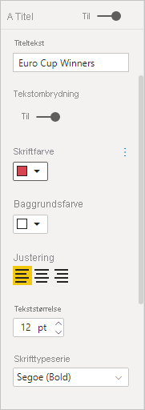

Din kortvisualisering ser nu ud som følger:

### Ret visualiseringstypen

Du kan ændre typen af visualisering ved at markere den og derefter vælge et andet ikon øverst i ruden **Visualiseringer**. Din kortvisualisering mangler f.eks. data for Sovjetunionen og Tjekkoslovakiet, fordi disse lande ikke længere findes på verdenskortet. En anden type visualisering, f.eks. en træstruktur eller et cirkeldiagram, kan være mere nøjagtig, fordi den viser alle værdier.

Hvis du vil ændre kortet til et cirkeldiagram, skal du markere kortet og derefter vælge ikonet **Cirkeldiagram** i ruden **Visualiseringer**.

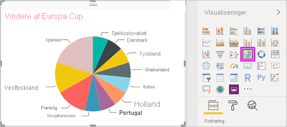

>[!TIP]
>- Du kan bruge formateringsindstillingerne for **Datafarver** til at give "Tyskland" og "Vesttyskland" samme farve. 
>- Hvis du vil gruppere lande, der har vundet flest gange, sammen i cirkeldiagrammet, skal du vælge ellipsen ( **...** ) øverst til højre i visualiseringen og derefter vælge **Sortér efter antal år**.

Med Power BI Desktop er det nemt at hente data fra en lang række forskellige datakilder og forme dem til dine analysebehov for at kunne visualisere disse data på omfattende og interaktive måder. Når din rapport er færdig, kan du [uploade den til Power BI](../create-reports/desktop-upload-desktop-files.md) og oprette dashboards ud fra den, som du derefter kan dele med andre Power BI-brugere.

## Se også

* [Microsoft Learn til Power BI](/learn/powerplatform/power-bi?WT.mc_id=powerbi_landingpage-docs-link)
* [Se videoer om Power BI Desktop](../fundamentals/desktop-videos.md)
* [Besøg Power BI-forummet](https://go.microsoft.com/fwlink/?LinkID=519326)
* [Læs Power BI-bloggen](https://go.microsoft.com/fwlink/?LinkID=519327)