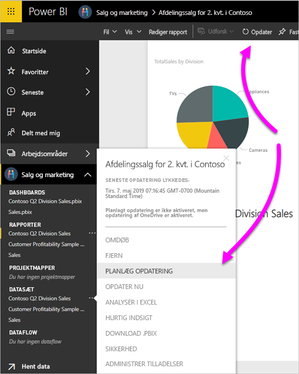
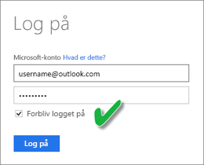

# Opdater et datasæt, der er gemt på OneDrive eller SharePoint Online
Hvis du importerer filer fra OneDrive eller SharePoint Online til Power BI-tjenesten, kan du nemt sikre, at dit arbejde i Power BI Desktop altid er synkroniseret med Power BI-tjenesten.

## Fordele ved at gemme en Power BI Desktop-fil på OneDrive eller SharePoint Online
Når du gemmer en Power BI Desktop-fil på OneDrive eller SharePoint Online, bliver de data, du har indlæst i filens model, importeret til datasættet. Alle rapporter, du har oprettet i filen, indlæses i **rapporter** i Power BI-tjenesten. Lad os sige, at du foretager ændringer i din fil på OneDrive eller SharePoint Online. Disse ændringer kan omfatte tilføjelse af nye målinger, ændring af kolonnenavne eller redigering af visualiseringer. Når du gemmer filen, synkroniseres Power BI-tjenesten også med disse ændringer, som regel inden for cirka en time.

Du kan udføre en manuel engangsopdatering direkte i Power BI Desktop ved at vælge **Opdater** på båndet **Hjem**. Når du vælger **Opdater**, opdaterer du filens model med de opdaterede data fra den oprindelige datakilde. Denne form for opdatering sker udelukkende inde fra selve Power BI Desktop-programmet. Den adskiller sig fra en manuel eller planlagt opdatering i Power BI, og det er vigtigt at forstå forskellen.

Når du importerer din Power BI Desktop-fil fra OneDrive eller SharePoint Online, indlæser du data og modeloplysninger i et datasæt i Power BI. Du skal opdatere datasættet i Power BI-tjenesten, fordi det er det, dine rapporter er baseret på. Da datakilderne er eksterne, kan du manuelt opdatere datasættet vha. **Opdater nu**, eller du kan oprette en tidsplan for opdatering vha. **Planlæg opdatering**. 

Når du opdaterer datasættet, oprettes der ikke forbindelse til filen på OneDrive eller SharePoint Online for at forespørge om opdaterede data. Oplysningerne i datasættet bruges til at oprette direkte forbindelse til datakilderne for at hente opdaterede data. Derefter indlæses disse data i datasættet. De opdaterede data i datasættet synkroniseres ikke tilbage til filen på OneDrive eller SharePoint Online.

## Hvad understøttes?
Power BI understøtter **Opdater** og **Planlæg opdatering** for de datasæt, der er oprettet via Power BI Desktop-filer, som er importeret fra et lokalt drev, hvor du bruger **Hent data** eller **Forespørgselseditor** til at oprette forbindelse til og indlæse data fra en af følgende datakilder.

> [!NOTE]
> Onedrive-opdatering af datasæt med direkte forbindelse understøttes. Ændring af datasættet med direkte forbindelse fra ét datasæt til et andet i en rapport, der allerede er udgivet, understøttes dog ikke i scenariet OneDrive-opdatering.

### Power BI Gateway – Personlig
* Alle onlinedatakilder, der vises i **Hent data** og **Forespørgselseditor** i Power BI Desktop.
* Alle datakilder i det lokale miljø, der vises i **Hent data** og **Forespørgselseditor** i Power BI Desktop, undtagen Hadoop-fil (HDFS) og Microsoft Exchange.

<!-- Refresh Data sources-->
[!INCLUDE [refresh-datasources](../includes/refresh-datasources.md)]

> [!NOTE]
> Der skal være installeret og køre en gateway, for at Power BI kan oprette forbindelse til datakilder i det lokale miljø og opdatere datasættet.
> 
> 

## OneDrive eller OneDrive for Business. Hvad er forskellen?
Hvis du både har en personlig version af OneDrive og OneDrive for Business, skal du opbevare alle filer, som du vil importere til Power BI, i OneDrive for Business. Årsag: Du bruger sandsynligvis to forskellige konti til at logge på dem.

Det er nemt at oprette forbindelse til OneDrive for Business i Power BI, fordi din Power BI-konto ofte er den samme konto som din OneDrive for Business-konto. Med et personligt OneDrive logger du som regel på med en anden [Microsoft-konto](https://account.microsoft.com).

Når du logger på med din Microsoft-konto, skal du vælge **Forbliv logget på**. Power BI kan derefter synkronisere eventuelle opdateringer, som du foretager i filen i Power BI Desktop, med datasæt i Power BI.

Hvis du har ændret dine legitimationsoplysninger til Microsoft, kan du ikke synkronisere ændringer mellem din fil på OneDrive og datasættet i Power BI. Du skal oprette forbindelse til og importere filen fra OneDrive igen.

## Hvordan kan jeg planlægge en opdatering?
Når du konfigurerer en tidsplan for opdatering, opretter Power BI direkte forbindelse til datakilderne. Power BI bruger forbindelsesoplysningerne og legitimationsoplysningerne i datasættet til at bede om opdaterede data. Derefter indlæser Power BI de opdaterede data i datasættet. Og derefter opdateres alle visualiseringer i rapporter og dashboards, der er baseret på dette datasæt, i Power BI-tjenesten.

Du kan finde oplysninger om, hvordan du konfigurerer en tidsplan for opdatering, under [Konfigurer tidsplan for opdatering](refresh-scheduled-refresh.md).

## Når det går galt
Når noget går galt, skyldes det som regel, at Power BI ikke kan logge på datakilder. Det kan også gå galt, hvis datasættet forsøger at oprette forbindelse til en datakilde i det lokale miljø, mens gatewayen er offline. Du kan undgå disse problemer ved at kontrollere, at Power BI kan logge på datakilderne. Prøv at logge på datakilderne i **Legitimationsoplysninger for datakilde**. Nogle gange ændres den adgangskode, du bruger til at logge på en datakilde, eller Power BI bliver logget af en datakilde.

Når du gemmer dine ændringer i Power BI Desktop-filen på OneDrive, og du ikke kan se ændringerne i Power BI inden for ca. en time, kan det skyldes, at Power BI ikke kan oprette forbindelse til OneDrive. Prøv at oprette forbindelse til filen på OneDrive igen. Hvis du bliver bedt om at logge på, skal du vælge **Forbliv logget på**. Da Power BI ikke kunne oprette forbindelse til OneDrive for at synkronisere med filen, skal du importere filen igen.

Sørg for, at indstillingen **Send mig en mail med meddelelse om opdateringsfejl** er markeret. Du vil have det at vide med det samme, hvis en planlagt opdatering mislykkes.

## Fejlfinding
Nogle gange går opdateringen af data muligvis ikke som forventet. Du støder typisk på problemer med at opdatere data, når du har forbindelse til en gateway. Se artiklerne om fejlfinding af gatewayen for at få oplysninger om værktøjer og kendte problemer.

[Fejlfinding af datagatewayen i det lokale miljø](service-gateway-onprem-tshoot.md)

[Fejlfinding af Power BI Gateway – Personlig](service-admin-troubleshooting-power-bi-personal-gateway.md)

Har du flere spørgsmål? Prøv at spørge [Power BI-community'et](https://community.powerbi.com/).
