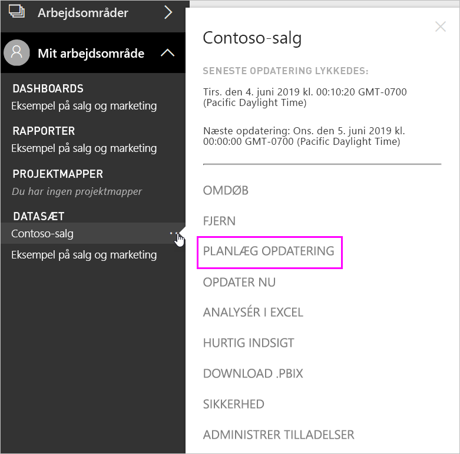
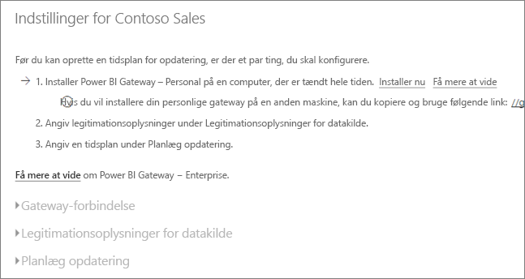
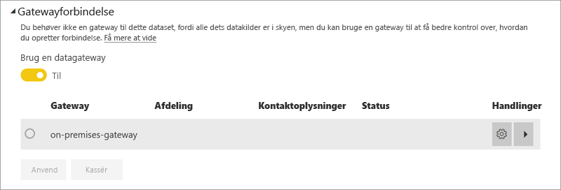
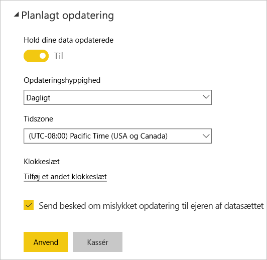

# Konfigurer planlagt opdatering

>[!NOTE]
>Efter to måneders inaktivitet bliver planlagt opdatering af dine datasæt midlertidigt afbrudt. Du kan finde flere oplysninger under [*Planlagt opdatering*](#scheduled-refresh) senere i denne artikel.

I denne artikel beskrives de tilgængelige indstillinger for planlagt opdatering af [Datagateway i det lokale miljø (personlig tilstand)](service-gateway-personal-mode.md) og [Datagateway i det lokale miljø](service-gateway-onprem.md). Du kan angive opdateringsindstillinger i følgende områder af Power BI-tjenesten: **Gatewayforbindelse**, **Legitimationsoplysninger for datakilde** og **Planlagt opdatering**. Vi kigger vi på dem hver især efter tur. Du kan finde flere oplysninger om opdatering af data, herunder begrænsninger for opdatering af tidsplaner, under [Dataopdatering](refresh-data.md#data-refresh).

Sådan får du vist skærmbilledet **Planlagt opdatering**:

1. Vælg **Flere indstillinger (...)** ud for et datasæt under **Datasæt** i navigationsruden.
2. Vælg **Planlæg opdatering**.

    

## Gatewayforbindelse

Her kan du se forskellige valgmuligheder, afhængigt af om du har en personlig gateway eller en virksomhedsgateway, der er online og tilgængelig.

Hvis ingen gateway er tilgængelig, kan du se, at **Gatewayforbindelse** er deaktiveret. Du kan også se en besked om, hvordan du kan installere en personlig gateway.

Hvis du har konfigureret en personlig gateway, og den er online, kan den vælges. Den vises som offline, hvis den ikke er tilgængelig.

Du kan også vælge en virksomhedsgateway, hvis en sådan er tilgængelig for dig. Du kan kun se en tilgængelig virksomhedsgateway, hvis din konto er angivet på fanen **Brugere** i den datakilde, der er konfigureret for den pågældende gateway.

## Legitimationsoplysninger for datakilde

### Power BI Gateway – Personlig

Hvis du bruger den personlige gateway til at opdatere data, skal du angive legitimationsoplysningerne for at oprette forbindelse til backend-datakilden. Hvis du har oprettet forbindelse til en indholdspakke fra en onlinetjeneste, føres de legitimationsoplysninger, du angav for at oprette forbindelse, videre til planlagte opdateringer.

Du skal kun logge på en datakilde, første gang du opdaterer det pågældende datasæt. Når de er indtastet, gemmes disse legitimationsoplysninger sammen med datasættet.

> [!NOTE]
> I forbindelse med visse godkendelsesmetoder skal du også ændre adgangskoden for datakilden i **Legitimationsoplysninger til datakilde**, hvis den adgangskode, du brugte til at logge på en datakilde, udløber eller ændres.

Hvis noget går galt, har problemet som regel enten noget at gøre med, at gatewayen er offline, fordi den ikke kunne logge på Windows og starte tjenesten, eller at Power BI ikke kunne logge på datakilderne for at anmode om opdaterede data. Hvis opdateringen mislykkes, skal du tjekke datasættets indstillinger. Hvis gatewaytjenesten er offline, kan du se fejlen under **Status**. Hvis Power BI ikke kan logge på datakilderne, kan du se fejlen under Legitimationsoplysninger til datakilde.

### Datagateway i det lokale miljø

Hvis du bruger datagatewayen i det lokale miljø til at opdatere data, skal du ikke angive legitimationsoplysninger, da de defineres for datakilden af gatewayadministratoren.

> [!NOTE]
> Når du opretter forbindelse til SharePoint i det lokale miljø for at udføre en dataopdatering, understøtter Power BI kun godkendelsesmekanismerne: *Anonym*, *Basis* og *Windows (NTLM/Kerberos)* . Power BI understøtter ikke *ADFS* eller nogen form for *formularbaserede godkendelsesmekanismer* til dataopdatering af SharePoint-datakilder i lokale miljøer. 

## Planlagt opdatering

I afsnittet **Planlagt opdatering** angiver du frekvensen og tidspunktet for opdatering af datasæt. Nogle datakilder kræver ikke, at en gateway skal kunne konfigureres til opdatering, og andre datakilder kræver en gateway.

Du skal indstille skyderen **Hold dine data opdateret** til **Ja** for at konfigurere indstillingerne.

> [!NOTE]
> Målet er at starte opdateringen inden for 15 minutter fra det planlagte tidspunkt, men der kan opstå en forsinkelse på op til én time, hvis tjenesten ikke kan tildele de påkrævede ressourcer hurtigere.

> [!NOTE]
> Efter to måneders inaktivitet bliver planlagt opdatering af dine datasæt midlertidigt afbrudt. Et datasæt anses for at være inaktivt, når ingen brugere har besøgt et dashboard eller en rapport, der er baseret på datasættet. På det tidspunkt får datasættets ejer tilsendt en mail, der angiver, at den planlagte opdatering er midlertidigt afbrudt. Tidsplanen for opdatering af datasættet vises derefter som **deaktiveret**. For at fortsætte med planlagte opdateringer skal du ganske enkelt besøge et vilkårligt dashboard eller en vilkårlig rapport, der er baseret på datasættet.

## Hvad understøttes?

> [!NOTE]
> Den planlagte opdatering deaktiveres også automatisk efter fire på hinanden følgende fejl.

Visse datasæt understøttes i forhold til forskellige gateways til planlagte opdateringer. Her er en forklaring på, hvad der er tilgængeligt.

### Power BI Gateway – Personlig

**Power BI Desktop**

* Alle onlinedatakilder, der vises i **Hent data** og Query-editor i Power BI Desktop.
* Alle datakilder i det lokale miljø, der vises i **Hent data** og Query-editor i Power BI Desktop, undtagen Hadoop-fil (HDFS) og Microsoft Exchange.

**Excel**

* Alle onlinedatakilder, der vises i Power Query.
* Alle datakilder i det lokale miljø, der vises i Power Query, undtagen Hadoop-fil (HDFS) og Microsoft Exchange.
* Alle onlinedatakilder, der vises i Power Pivot.
* Alle datakilder i det lokale miljø, der vises i Power Pivot, undtagen Hadoop-fil (HDFS) og Microsoft Exchange.

> [!NOTE]
> I Excel 2016 og nyere udgaver angives Power-forespørgsel nu i afsnittet **Data** på båndet under **Hent og omdan data**.

### Power BI Gateway

Du kan finde oplysninger om understøttede datakilder i [Power BI-datakilder](power-bi-data-sources.md).

## Fejlfinding
Nogle gange går opdateringen af data muligvis ikke som forventet. Dette skyldes som regel et problem i forbindelse med en gateway. Se artiklerne om fejlfinding af gatewayen for at få oplysninger om værktøjer og kendte problemer.

- [Fejlfinding af datagatewayen i det lokale miljø](service-gateway-onprem-tshoot.md)
- [Fejlfinding af Power BI Gateway – Personlig](service-admin-troubleshooting-power-bi-personal-gateway.md)

## Næste trin

- [Opdatering af data i Power BI](refresh-data.md)  
- [Power BI Gateway – Personal](service-gateway-personal-mode.md)  
- [Datagateway i det lokale miljø (personlig tilstand)](service-gateway-onprem.md)  
- [Fejlfinding af datagatewayen i det lokale miljø](service-gateway-onprem-tshoot.md)  
- [Fejlfinding af Power BI Gateway – Personlig](service-admin-troubleshooting-power-bi-personal-gateway.md)  

Har du flere spørgsmål? [Prøv at spørge Power BI-community'et](https://community.powerbi.com/)