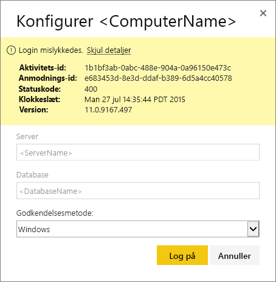
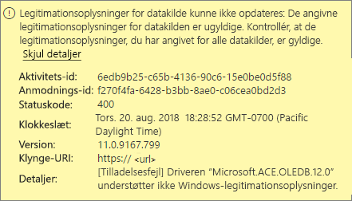
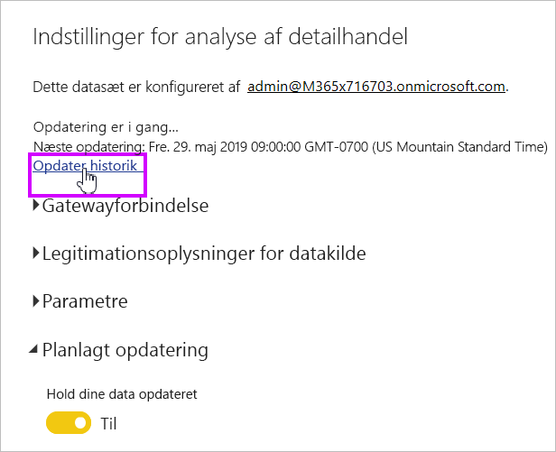
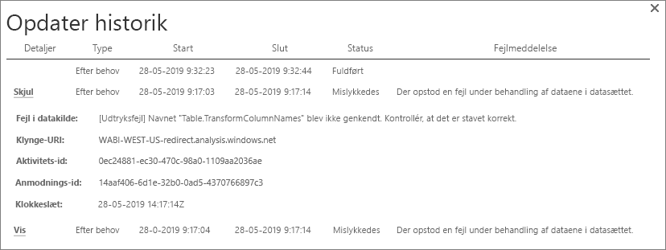
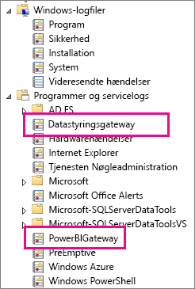
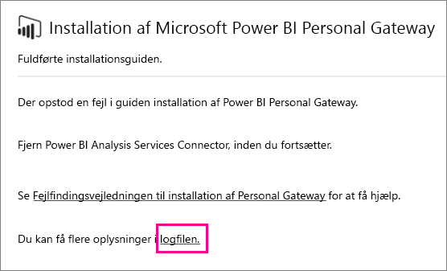
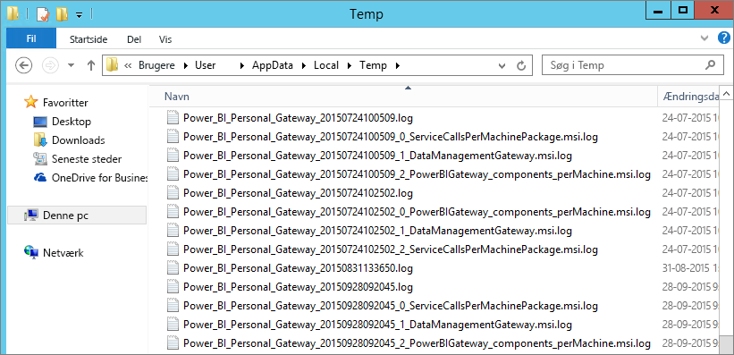

# Fejlfinding af Power BI-gateway (personlig tilstand)

[!INCLUDE [gateway-rewrite](../includes/gateway-rewrite.md)]

I nedenstående afsnit gennemgås nogle almindelige problemer, der kan opstå, når du bruger Power BI-datagatewayen i det lokale miljø (personlig tilstand).

## Opdater til den nyeste version

Den aktuelle version af gatewayen til personlig brug er datagatewayen i det lokale miljø (personlig tilstand). Opdater din installation, hvis du vil bruge denne version.

Der kan opstå mange problemer, hvis gatewayversionen er forældet. Det er generelt en god idé at sikre, at du anvender den nyeste version. Hvis du ikke har opdateret gatewayen i en måned eller mere, bør du overveje at installere den nyeste version af gatewayen. Se derefter, om du kan genskabe problemet.

## Installation
**Gatewayen (personlig tilstand) fungerer på 64-bit versioner:** Hvis din computer er en 32-bit version, kan du ikke installere gatewayen (personlig tilstand). Operativsystemet skal være en 64-bit version. Installér en 64-bit version af Windows, eller installér gatewayen (personlig tilstand) på en 64-bit computer.

**Gatewayen (personlig tilstand) kan ikke installeres som en tjeneste, selvom du er lokal administrator for computeren:** Installationen kan mislykkes, hvis brugeren findes i computerens lokale administratorgruppe, men gruppepolitikken ikke tillader, at brugernavnet logger på som en tjeneste. Sørg for, at gruppepolitikken lader brugeren logge på som en tjeneste. Vi arbejder på at finde en rettelse på problemet. Du kan finde flere oplysninger under [Tilføj tjenesten Log på som en tjeneste direkte på en konto](/previous-versions/windows/it-pro/windows-server-2003/cc739424(v=ws.10)).

**Der opstod timeout for handlingen:** Denne meddelelse forekommer tit, hvis den computer (fysisk maskine eller VM), du installerer gatewayen (personlig tilstand) på, har en processor med en enkelt kerne. Luk alle programmer, afbryd alle processer, der ikke er essentielle, og prøv at installere igen.

**Dataadministrationsgatewayen eller Analysis Services-connectoren kan ikke installeres på samme computer som gatewayen (personlig tilstand):** Hvis du allerede har en Analysis Services-connector eller en dataadministrationsgateway installeret, skal du først fjerne connectoren eller gatewayen. Prøv derefter at installere gatewayen (personlig tilstand).

> [!NOTE]
> Hvis du støder på et problem under installationen, kan du muligvis få oplysninger om, hvordan du udbedrer problemet i installationslogfilerne. Se [Installationslogfiler](#SetupLogs) for at få flere oplysninger.
> 
> 

 **Proxykonfiguration:** Du oplever måske problemer med at konfigurere gatewayen (personlig tilstand), hvis dit miljø kræver, at du bruger en proxy. Hvis du vil vide mere om, hvordan du konfigurerer proxyoplysninger, skal du se [Konfigurer proxyindstillinger til datagatewayen i det lokale miljø](/data-integration/gateway/service-gateway-proxy).

## Planlæg opdatering
**Fejl: De cloudlagrede legitimationsoplysninger mangler.**

Du kan få vist denne fejl under indstillinger for \<dataset\>, hvis du har en planlagt opdatering og derefter fjernet og geninstalleret gatewayen (personlig tilstand). Når du fjerner en gateway (personlig tilstand), så fjernes datakildens legitimationsoplysninger for et datasæt, som er konfigureret til opdatering, fra Power BI-tjenesten.

**Løsning:** I Power BI skal du gå til opdateringsindstillingerne for et datasæt. Under **Administrer datakilder** skal du vælge **Rediger legitimationsoplysninger** for en hvilken som helst datakilde med fejl. Log derefter på datakilden igen.

**Fejl: De angivne legitimationsoplysninger for datasættet er ugyldige. Opdater legitimationsoplysningerne ved at opdatere eller vælge at fortsætte på dialogskærmen Indstillinger for datakilde.**

**Løsning:** Hvis du får vist en meddelelse om legitimationsoplysninger, skal du muligvis:

* Brugernavnene og adgangskoderne, som du brugte til at logge på med, er ikke opdaterede. I Power BI skal du gå til opdateringsindstillingerne for datasættet. Under **Administrer datakilder** skal du vælge **Rediger legitimationsoplysninger** for at opdatere legitimationsoplysningerne for datakilden.
* Miks af en cloudbaseret kilde og en kilde i det lokale miljø i en enkelt forespørgsel kan ikke opdateres i gatewayen (personlig tilstand), hvis en af kilderne bruger OAuth til godkendelse. Et eksempel på denne fejl er et miks af CRM Online og en forekomst af lokal SQL Server. Dette miks mislykkes, fordi CRM Online kræver OAuth.
  
  Dette er en kendt fejl, som der kigges på. Du kan løse problemet ved at have en separat forespørgsel for cloudkilden og kilden i det lokale miljø. Brug derefter en Flet eller tilføj-forespørgsel for at kombinere dem.

**Fejl: Datakilde understøttes ikke.**

**Løsning:** Hvis du får en meddelelse om, at datakilden ikke understøttes, i indstillingerne for **Planlæg opdatering**, kan det betyde følgende: 

* Datakilden understøttes i øjeblikket ikke mht. opdatering i Power BI. 
* Excel-projektmappen indeholder ikke en datamodel, men kun regnearksdata. Power BI understøtter i øjeblikket kun opdatering, hvis den uploadede Excel-projektmappe indeholder en datamodel. Når du importerer data ved hjælp af Power Query i Excel, skal du vælge indstillingen **Indlæs** for at indlæse data i en datamodel. Denne indstilling sikrer, at data importeres i en datamodel. 

**Fejl: [Dataene kan ikke kombineres] &lt;forespørgselsdel&gt;/&lt;... &gt;/&lt;...&gt; får adgang til datakilder med niveauer for beskyttelse af personlige oplysninger, der ikke kan bruges sammen. Byg denne datakombination igen.**

**Løsning:** Denne fejl opstår på grund af begrænsninger for niveauet for beskyttelse af personlige oplysninger og de typer datakilder, du bruger.

**Fejl: Fejl i datakilde: Vi kan ikke konvertere værdien "\[Tabel\]" til typen Tabel.**

**Løsning:** Denne fejl opstår på grund af begrænsninger for niveauet for beskyttelse af personlige oplysninger og de typer datakilder, du bruger.

**Fejl: Der er ikke tilstrækkelig plads til denne række.**

**Løsning:** Denne fejl opstår, hvis du har en enkelt række, der er større end 4 MB. Find rækken fra din datakilde, og forsøg at filtrere den ud eller mindske den pågældende rækkes størrelse.

## Datakilder
**Manglende dataprovider:** Gatewayen (personlig tilstand) fungerer kun på 64-bit versioner. Der skal være installeret en 64-bit version af dataproviderne på den samme computer, hvor gatewayen (personlig tilstand) er installeret. Hvis datakilden i datasættet f.eks. er Microsoft Access, skal du installere 64-bit ACE-provideren på den samme computer, hvor du installerede gatewayen (personlig tilstand). 

>[!NOTE]
>Hvis du har en 32-bit version af Excel, kan du ikke installere en 64-bit version af ACE-provideren på den samme computer.

**Windows-godkendelse understøttes ikke af Access-databasen:** Power BI understøtter i øjeblikket kun anonym godkendelse for Access-databasen.

**Fejl: Der opstod en fejl under logon, når du angiver legitimationsoplysninger for en datakilde:** Hvis du får vist en fejl som denne, når du angiver Windows-legitimationsoplysninger for en datakilde: 

  

Du bruger måske stadig en ældre version af gatewayen (personlig tilstand). 

**Løsning:** Du kan finde flere oplysninger i [Installér den nyeste version af Power BI-gatewayen (personlig tilstand)](https://powerbi.microsoft.com/gateway/).

**Fejl: Logonfejl, når du vælger Windows-godkendelse til en datakilde, der bruger ACE OLEDB:** Hvis du får vist følgende fejl, når du angiver legitimationsoplysninger en for datakilde, der bruger en ACE OLEDB-provider:

Power BI understøtter i øjeblikket ikke Windows-godkendelse for en datakilde, der bruger en ACE OLEDB-provider.

**Løsning:** Du omgår fejlen ved at vælge **Anonym godkendelse**. For en ældre ACE OLEDB-provider svarer anonyme legitimationsoplysninger til Windows-legitimationsoplysninger.

## Opdatering af felter
Hvis du får vist en fejl, når dashboardfelterne opdateres, skal du se [Fejlfinding af feltfejl](refresh-troubleshooting-tile-errors.md).

## Værktøjer til fejlfinding
### Opdater historik
Med **Opdater historik** kan du se, hvilke fejl der er opstået, og finde nyttige data, hvis du har brug for at oprette en supportanmodning. Du kan få vist både planlagte opdateringer og opdateringer efter behov. Sådan kommer du til **Opdater historik**.

1. Vælg et datasæt i **Datasæt** i Power BI-navigationsruden. Åbn menuen, og vælg **Planlæg opdatering**.

   
1. Under **Indstillinger for...** skal du vælge **Opdater historik**. 

   
   
   

### Hændelseslogge
Adskillelige hændelseslogge kan levere oplysninger. De første to, **Dataadministrationsgateway** og **PowerBIGateway**, vises, hvis du er administrator på computeren. Hvis du ikke er administrator, og du bruger datagatewayen (personlig tilstand), kan du se logposterne i **programloggen**.

Loggene **Datastyringsgateway** og **PowerBIGateway** findes under **Program- og tjenestelogfiler**.

### Fiddler-sporing
[Fiddler](https://www.telerik.com/fiddler) er et gratis værktøj fra Telerik, der overvåger HTTP-trafik. Du kan se kommunikationen vha. Power BI-tjenesten fra klientcomputeren. Denne kommunikation kan vise fejl og andre relaterede oplysninger.

### Installationslogge
Hvis gatewayen (personlig tilstand) ikke kan installeres, får du vist et link til installationsloggen. Du kan finde oplysninger om fejlen i installationsloggen. Disse logge er Windows-installationslogge, også kaldet MSI-logge. De kan være ret komplekse og svære at læse. Den resulterende fejl vises typisk i bunden, men det er ikke let at finde årsagen til fejlen. Det kan skyldes fejl i en anden log. Det kan også skyldes en fejl højere oppe i loggen.

Du kan også gå til Temp-mappen (%temp%) og søge efter filer, der starter med *Power\_BI\_* .

> [!NOTE]
> Når du går til %temp%, kan du blive ført til en undermappe i Temp. *Power\_BI\_* -filerne ligger i roden af Temp-mappen. Du skal muligvis gå et niveau eller to op.
> 
> 

## Næste trin
- [Konfigurer proxyindstillinger for datagatewayen i det lokale miljø](/data-integration/gateway/service-gateway-proxy)- [Opdater data](refresh-data.md)  
- [Power BI-gateway – Personlig](service-gateway-personal-mode.md)  
- [Fejlfinding af feltfejl](refresh-troubleshooting-tile-errors.md)  
- [Fejlfinding af datagateway i det lokale miljø](service-gateway-onprem-tshoot.md) 
 
Har du flere spørgsmål? Prøv at spørge [Power BI-community'et](https://community.powerbi.com/).