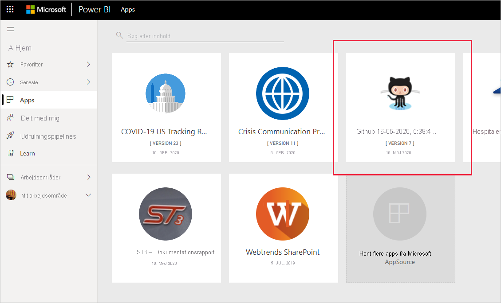
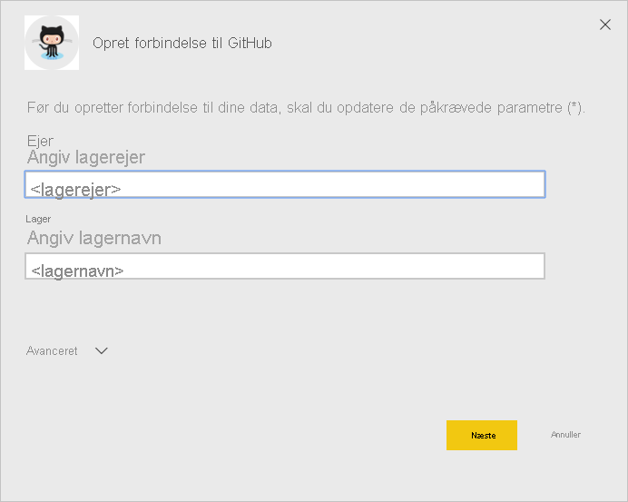
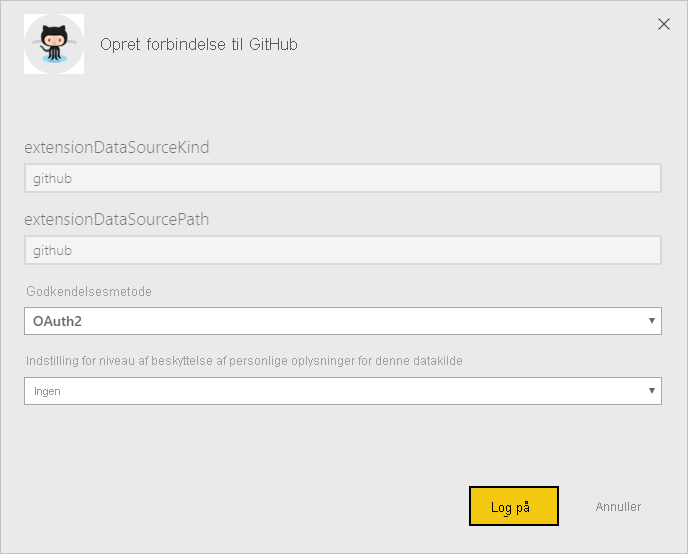
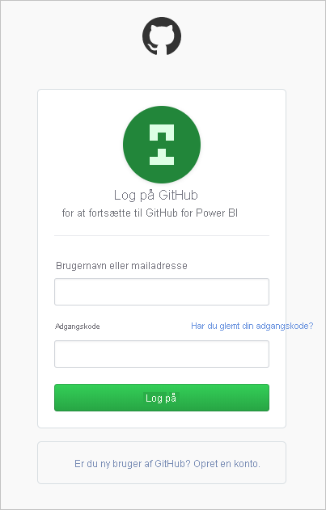

# <a name="connect-to-github-with-power-bi"></a>Opret forbindelse til GitHub med Power BI
I denne artikel gennemgår vi, hvordan du trækker data fra din GitHub-konto med en skabelonapp i Power BI. Med skabelonappen oprettes et arbejdsområde med et dashboard, et sæt rapporter og et datasæt, der giver dig mulighed for at udforske dine GitHub-data. Med GitHub-appen til Power BI kan du få indsigt i dit GitHub-lager med data om bidrag, problemer, pullanmodninger og aktive brugere.


Når du har installeret skabelonappen, kan du ændre dashboardet og rapporten. Du kan derefter distribuere den som en app til kolleger i organisationen.

Opret forbindelse til [GitHub-skabelonappen](https://app.powerbi.com/groups/me/getapps/services/pbi-contentpacks.pbiapps-github), eller læs mere om [GitHub-integrationen](https://powerbi.microsoft.com/integrations/github) med Power BI.

Du kan også prøve [GitHub-selvstudiet](service-tutorial-connect-to-github.md). Her installeres rigtige GitHub-data om det offentlige lager til Power BI-dokumentationen.

>[!NOTE]
>Denne skabelonap kræver, at GitHub-kontoen har adgang til lageret. Flere oplysninger om kravene nedenfor.
>
>Denne skabelonapp understøtter ikke GitHub Enterprise.

## <a name="install-the-app"></a>Installér programmet

1. Klik på følgende link for at få adgang til appen: [GitHub-skabelonapp](https://app.powerbi.com/groups/me/getapps/services/pbi-contentpacks.pbiapps-github)

1. Vælg [**Hent den nu**](https://app.powerbi.com/groups/me/getapps/services/pbi-contentpacks.pbiapps-github) på AppSource-siden for appen.

    [](https://app.powerbi.com/groups/me/getapps/services/pbi-contentpacks.pbiapps-github)

1. Vælg **Installér**. 

    

    Når appen er installeret, kan du se den på siden med dine apps.

   

## <a name="connect-to-data-sources"></a>Opret forbindelse til datakilder

1. Vælg ikonet på siden med apps for at åbne appen.

1. På velkomstskærmen skal du vælge **Udforsk app**.

   

   Appen åbnes, og der vises eksempeldata.

1. Vælg linket **Opret forbindelse til dine data** på banneret øverst på siden.

   

1. Angiv navnet på og ejeren af lageret i den dialogboks, der vises. Herunder kan du se detaljer om, hvordan du [finder de pågældende parametre](#FindingParams). Klik på **Næste**, når du er færdig.

   

1. I den næste dialogboks, der vises, skal du kontrollere, at godkendelsesmetoden er angivet til **OAuth2**. Du behøver ikke at foretage dig andet med indstillingen for beskyttelse af personlige oplysninger. Når du er klar, skal du klikke på **Log på**.

   

1. Angiv dine GitHub-legitimationsoplysninger, og følg GitHub-godkendelsesprocessen. Dette trin kan springes over, hvis du allerede er logget på med din browser.

   


Når du har logget på, opretter rapporten forbindelse til datakilderne og udfyldes med opdaterede data. Aktivitetsovervågningen aktiveres i dette tidsrum.


Dine rapportdata opdateres automatisk én gang om dagen, medmindre du deaktiverede dette under logonprocessen. Du kan også [konfigurere din egen opdateringsplan](./refresh-scheduled-refresh.md) for at holde rapportdataene opdateret, hvis du vil.

## <a name="customize-and-share"></a>Tilpas og del

Du tilpasser og deler din app ved at vælge blyantikonet i øverste højre hjørne af siden.


Du kan finde oplysninger om redigering af artefakter i arbejdsområdet under
* [Præsentation af rapporteditoren i Power BI](../create-reports/service-the-report-editor-take-a-tour.md)
* [Grundlæggende begreber for designere i Power BI-tjenesten](../fundamentals/service-basic-concepts.md)

Når du er færdig med at foretage ændringer af artefakterne i arbejdsområdet, er du klar til at publicere og dele appen. Se [Publicer din app](../collaborate-share/service-create-distribute-apps.md#publish-your-app) for at få mere at vide om, hvordan du gør det.

## <a name="whats-included-in-the-app"></a>Dette er inkluderet i prøveversionen
Følgende data er tilgængelige fra GitHub i Power BI:     

| Tabelnavn | Beskrivelse |
| --- | --- |
| Bidrag |Tabellen Bidrag indeholder de samlede tilføjelser, sletninger og bekræftelser, der er oprettet af bidragyderen, sammenlagt pr. uge. De 100 største bidragsydere er inkluderet. |
| Problemer |Angiver alle problemer i det valgte lager. Det indeholder beregninger som samlet og gennemsnitlig tid til at lukke et problem, samlet antal åbne problemer, samlet antal lukkede problemer. Denne tabel er tom, når der ikke er nogen problemer i lageret. |
| Pull-anmodninger |Denne tabel indeholder alle Pull-anmodningerne for lageret, og hvem der oprettede anmodningen. Den indeholder også beregninger om, hvor mange åbne, lukkede og samlede pullanmodninger der er, hvor lang tid det tog at udføre pullanmodningerne, og hvor lang tid den gennemsnitlige pullanmodning tog. Denne tabel er tom, når der ikke er nogen pull-anmodninger i lageret. |
| Brugere |Denne tabel indeholder en liste over GitHub-brugere eller -bidragsydere, der har bidraget, arkiveret problemer eller løst pullanmodninger for det valgte lager. |
| Milepæle |Den har alle milepæle for det valgte lager. |
| DateTable |Denne tabel indeholder datoer fra i dag og fra tidligere år, der gør det muligt for dig at analysere dine GitHub-data efter dato. |
| ContributionPunchCard |Denne tabel kan bruges som et bidragshulkort for det valgte lager. Den viser anvendelser efter ugedag og klokkeslæt. Denne tabel er ikke forbundet til andre tabeller i modellen. |
| RepoDetails |Denne tabel indeholder oplysninger om det valgte lager. |

## <a name="system-requirements"></a>Systemkrav
* Den GitHub-konto, der har adgang til lageret.  
* Tilladelse givet til Power BI til GitHub-appen under det første logon. Se flere oplysninger herunder om tilbagekaldelse af adgang.  
* Tilstrækkelige API-kald til at hente og opdatere dataene.
>[!NOTE]
>Denne skabelonapp understøtter ikke GitHub Enterprise.

### <a name="de-authorize-power-bi"></a>Annuller godkendelsen af Power BI
Hvis du vil annullere godkendelsen af forbindelsen mellem Power BI og dit GitHub-lager, kan du tilbagekalde adgangen i GitHub. Du kan finde flere oplysninger under dette emne i [GitHub Hjælp](https://help.github.com/articles/keeping-your-ssh-keys-and-application-access-tokens-safe/#reviewing-your-authorized-applications-oauth).

<a name="FindingParams"></a>
## <a name="finding-parameters"></a>Søgning efter parametre
Du kan finde ejeren og lageret ved at kigge på lageret i selve GitHub:


Den første del, "Azure", er ejeren, og den anden del, "azure-sdk-for-php", er selve lageret.  Du kan se disse samme to elementer i lagerets URL-adresse:

```console
<https://github.com/Azure/azure-sdk-for-php> .
```

## <a name="troubleshooting"></a>Fejlfinding
Hvis det er nødvendigt, kan du kontrollere dine GitHub-legitimationsoplysninger.  

1. Gå til GitHub-webstedet i et andet browservindue, og log på GitHub. Du kan se, at du er logget på, i øverste højre hjørne af GitHub-webstedet.    
2. I GitHub skal du navigere til URL-adressen på det lager, du vil have adgang til i Power BI. For eksempel: https://github.com/dotnet/corefx.  
3. Når du er tilbage i Power BI, kan du prøve at oprette forbindelse til GitHub. Brug navnene på lageret og lagerejeren af det samme lager i dialogboksen Konfigurer GitHub.  

## <a name="next-steps"></a>Næste trin

* [Selvstudium: Opret forbindelse til et GitHub-lager med Power BI](service-tutorial-connect-to-github.md)
* [Opret nye arbejdsområder i Power BI](../collaborate-share/service-create-the-new-workspaces.md)
* [Installér og brug apps i Power BI](../consumer/end-user-apps.md)
* [Opret forbindelse til Power BI-apps til eksterne tjenester](service-connect-to-services.md)
* Har du spørgsmål? [Prøv at spørge Power BI-community'et](https://community.powerbi.com/)
