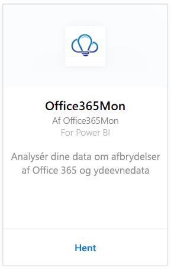
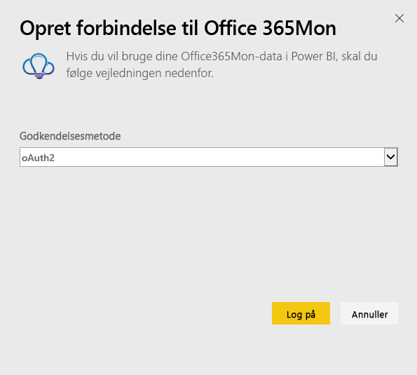
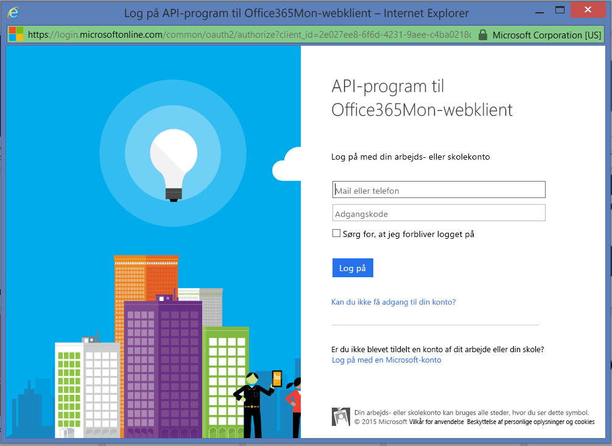
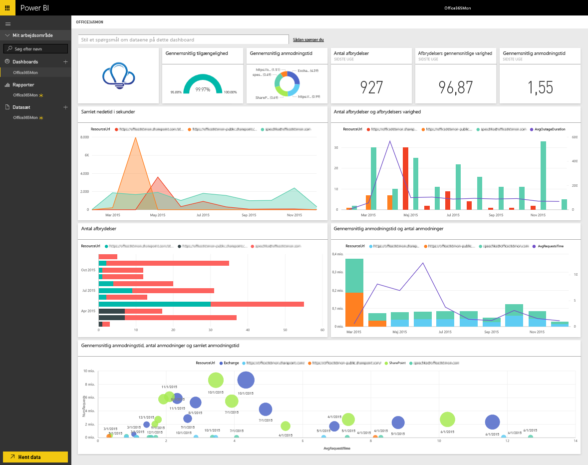

# Opret forbindelse til Office365Mon med Power BI
Du kan nemt analysere nedetid i Office 365 og ydeevnedata med Power BI og Office365Mon-skabelonappen. Power BI henter dine data, herunder om nedetid og fra tilstandsundersøgelser, og opretter derefter et færdigt dashboard og rapporter ud fra de pågældende data.

Opret forbindelse til [Office365Mon-skabelonappen](https://msit.powerbi.com/groups/me/getapps/services/office365mon.office365mon_powerbi_v3) til Power BI.

>[!NOTE]
>Det er nødvendigt med en Office365Mon-administratorkonto for at oprette forbindelse til og indlæse Power BI-skabelonappen.

## Sådan opretter du forbindelse
1. Vælg **Hent data** nederst i navigationsruden.
   
   
2. Markér **Hent** i feltet **Tjenester**.
   
    
3. Vælg **Office365Mon** \> **Hent**.
   
   
4. Som godkendelsesmetode skal du vælge **oAuth2** \> **Log på**.
   
   Når du bliver spurgt, skal du angive dine legitimationsoplysninger til din Office365Mon-administratorkonto og følge godkendelsesprocessen.
   
   
   
   
5. Når Power BI har importeret dataene, vises der et nyt dashboard, en ny rapport og et nyt datasæt i navigationsruden. Nye elementer er markeret med en gul stjerne \*, vælg posten Office365Mon.
   
   

**Hvad nu?**

* Prøv [at stille et spørgsmål i feltet Spørgsmål og svar](../consumer/end-user-q-and-a.md) øverst i dashboard'et
* [Rediger felterne](../create-reports/service-dashboard-edit-tile.md) i dashboard'et.
* [Vælg et felt](../consumer/end-user-tiles.md) for at åbne den underliggende rapport.
* Selvom dit datasæt opdateres dagligt, kan du ændre tidsplanen for opdatering eller prøve at opdatere det efter behov ved hjælp af **Opdater nu**

## Fejlfinding
Hvis du får fejlmeddelelsen **"Kunne ikke logge på"** , når du har brugt dine legitimationsoplysninger til Office365Mon-abonnementet for at logge på, skyldes det, at den konto, du bruger, ikke har tilladelse til at hente Office365Mon-data fra din konto. Kontrollér, at det er en administratorkonto, og prøv igen.

## Næste trin
[Hvad er Power BI?](../fundamentals/power-bi-overview.md)

[Hent data til Power BI](service-get-data.md)
