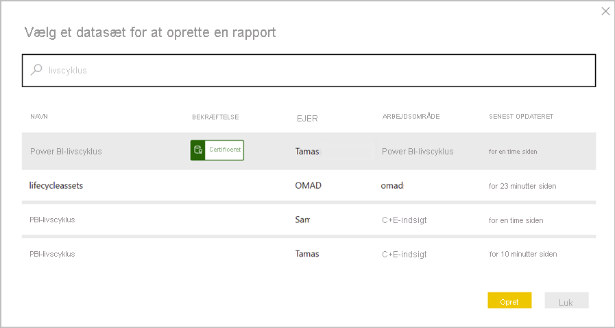

# Introduktion til datasæt på tværs af arbejdsområder

Business intelligence er en aktivitet baseret på samarbejde. Det er vigtigt at oprette standardiserede datasæt, der fungerer som fælles udgangspunkt. Derefter er registrering og genbrug af disse standardiserede datasæt helt centralt. Når eksperter inden for datamodellering i din organisation opretter og deler optimerede datasæt, kan oprettere af rapporter bruge disse datasæt som udgangspunkt for at oprette præcise rapporter. Din organisation har derefter ensartede data, når der skal træffes beslutninger, samt en sund datakultur.

I Power BI kan forfattere af datasæt styre, hvem der har adgang til deres data, ved hjælp af [tilladelsen Opret](service-datasets-build-permissions.md). Forfatterne af datasæt kan også *certificere* eller *fremhæve* datasæt, så andre kan finde dem. På denne måde ved forfattere af rapporter, hvilke datasæt der er i høj kvalitet og officielle, og de kan bruge disse datasæt, uanset hvor de er forfattere i Power BI. Lejeradministratorer har en ny lejerindstilling til at [styre brugen af datasæt på tværs af arbejdsområder](service-datasets-admin-across-workspaces.md).

## Deling af datasæt og den nye arbejdsområdeoplevelse

Oprettelse af rapporter baseret på datasæt i forskellige arbejdsområder og kopiering af rapporter til forskellige arbejdsområder er tæt forbundet med den [nye arbejdsområdeoplevelse](../collaborate-share/service-create-the-new-workspaces.md):

- Når du åbner datasætkataloget fra en ny arbejdsområdeoplevelse i tjenesten, viser datasætkataloget datasæt, der findes i Mit arbejdsområde og i andre nye arbejdsområdeoplevelser. 
- Når du åbner datasætkataloget fra et klassisk arbejdsområde, kan du kun se datasættene i det pågældende arbejdsområde, ikke datasættene i andre arbejdsområder.
- I Power BI Desktop kan du publicere Live Connect-rapporter i forskellige arbejdsområder, så længe deres datasæt befinder sig i arbejdsområder med den nye oplevelse.
- Når du kopierer rapporter på tværs af arbejdsområder, skal destinationsarbejdsområdet være et arbejdsområde med den nye oplevelse.

## Opdag datasæt

Når du opretter en rapport oven på et eksisterende datasæt, skal du som det første oprette forbindelse til datasættet enten i Power BI-tjenesten eller i Power BI Desktop. Læs om [registrering af datasæt fra forskellige arbejdsområder](service-datasets-discover-across-workspaces.md)

## Kopiér en rapport

Når du finder en rapport, du vil bruge i et arbejdsområde eller en app, kan du lave en kopi af den og derefter redigere den, så det passer til dine behov. Du behøver ikke at oprette datamodellen. Den er allerede oprettet for dig. Og det er meget nemmere at redigere en eksisterende rapport end at starte forfra. Læs mere om [kopiering af rapporter](service-datasets-copy-reports.md).

## Tilladelsen Opret for datasæt

Hvis du er forfatteren af et datasæt, kan du med tilladelsen Opret bestemme, hvem i din organisation der kan oprette nyt indhold i dine datasæt. Personer med tilladelsen Opret kan også oprette nyt indhold i datasæt uden for Power BI, f.eks. Excel-ark via Analysér i Excel, XMLA og eksportér. Læs mere om [tilladelsen Opret](service-datasets-build-permissions.md).

## Fremhævning og certificering

Hvis du opretter datasæt, som andre kan få glæde af, kan du gøre det nemmere for dem at finde det ved at [fremhæve dit datasæt](service-datasets-promote.md). Du kan også anmode om, at eksperter i din organisation [certificerer dit datasæt](service-datasets-certify.md).

## Licensering

De specifikke funktioner og oplevelser, der er baseret på funktioner for delte datasæt, er givet i licens i henhold til deres eksisterende scenarier. Eksempel:

- Generelt kan alle finde og oprette forbindelse til delte datasæt – det er ikke funktion, som er begrænset til Premium.
- Brugere uden en Pro-licens kan kun bruge datasæt på tværs af arbejdsområder til oprettelse af rapporter, hvis disse datasæt er placeret i brugerens personlige Mit arbejdsområde eller i et Premium-understøttet arbejdsområde. Den samme licensbegrænsning gælder, uanset om de opretter rapporter i Power BI Desktop eller i Power BI-tjenesten.
- Det kræver en Pro-licens at kopiere rapporter mellem arbejdsområder.
- Hvis du vil kopiere rapporter fra en app, skal du have en Pro-licens, som er påkrævet for organisationsindholdspakker.
- Det kræver en Pro-licens at fremhæve og certificere datasæt.

## Overvejelser og begrænsninger

- Som appudgiver skal du være sikker på, at din målgruppe har adgang til datasæt uden for arbejdsområdet. Ellers vil brugerne opleve problemer, når de interagerer med din app: Rapporter åbnes ikke uden adgang til datasættet, og dashboardfelter vises som låste. Brugerne kan heller ikke åbne appen, hvis det første element i navigationen er en rapport, uden at have adgang til datasættet.
- Hvis du vil oprette en rapport oven på et datasæt i et andet arbejdsområde, kræver det, at den nye arbejdsområdeoplevelse er begge steder: Rapporten skal være i en ny arbejdsområdeoplevelse og datasættet skal være i en ny arbejdsområdeoplevelse. Du kan kun kopiere rapporter i et nyt arbejdsområde til et andet arbejdsområde og ikke til klassiske arbejdsområder eller til Mit arbejdsområde. 
- I et klassisk arbejdsområde viser datasæts registreringsoplevelse kun datasættene i det pågældende arbejdsområde.
- "Publicer på internettet" er designet til ikke at virke for en rapport, der er baseret på et delt datasæt.
- Hvis to personer er medlem af et arbejdsområde, der åbner et delt datasæt, er det er muligt, at kun én af dem kan se det relaterede datasæt i arbejdsområdet. Det er kun personer, der som minimum har læseadgang til datasættet, som kan se det delte datasæt. 

## Næste trin

- [Fremhæv datasæt](service-datasets-promote.md)
- [Certificer datasæt](service-datasets-certify.md)
- [Styr brugen af datasæt på tværs af arbejdsområder](service-datasets-admin-across-workspaces.md)
- Har du spørgsmål? [Prøv at spørge Power BI-community'et](https://community.powerbi.com/)
