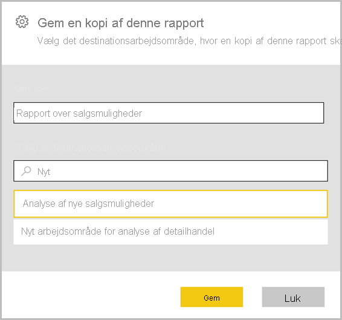
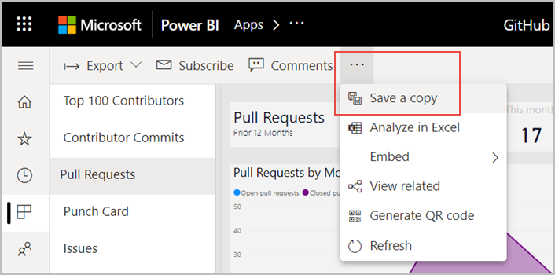
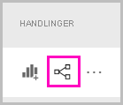
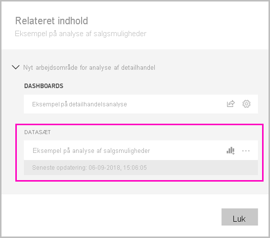

# Kopiér rapporter fra andre arbejdsområder

Når du finder en rapport, du vil bruge i et arbejdsområde eller en app, kan du lave en kopi af den og gemme den i et andet arbejdsområde. Du kan derefter ændre din kopi af rapporten og tilføje eller slette visualiseringer og andre elementer. Du behøver ikke at oprette datamodellen. Den er allerede oprettet for dig. Og det er meget nemmere at redigere en eksisterende rapport end at starte forfra. Når du opretter en app fra dit arbejdsområde, kan du dog nogle gange ikke publicere din kopi af rapporten i appen. Se yderligere oplysninger under [Overvejelser og begrænsninger i artiklen "Brug datasæt på tværs af arbejdsområder"](service-datasets-across-workspaces.md#considerations-and-limitations).

## Forudsætninger

- Hvis du vil kopiere en rapport, skal du have en Pro-licens, selvom den oprindelige rapport er i et arbejdsområde i en Premium-kapacitet.
- Hvis du vil kopiere en rapport eller oprette en rapport i et andet arbejdsområde, der er baseret på et datasæt i et andet arbejdsområde, skal du have tilladelsen Opret for datasættet. Personer med rolle som administrator, medlem eller bidragyder får automatisk Build-tilladelse til datasæt i det oprindelige arbejdsområde gennem deres rolle i arbejdsområdet. Se [Roller i de nye arbejdsområder](../collaborate-share/service-new-workspaces.md#roles-in-the-new-workspaces) for at få flere oplysninger.

## Gem en kopi af en rapport i et arbejdsområde

1. Gå til listevisningen Rapporter i et arbejdsområde.

    

1. Under **Handlinger** skal du vælge **Gem en kopi**.

    

    Du kan kun se ikonet **Gem en kopi** , hvis rapporten er i et arbejdsområde med den nye oplevelse, og du har [tilladelsen Opret](service-datasets-build-permissions.md). Selvom du har adgang til arbejdsområdet, skal du have tilladelsen Opret for datasættet.

3. Navngiv rapporten, og vælg destinationsarbejdsområdet under **Gem en kopi af denne rapport**.

    

    Du kan gemme rapporten i det aktuelle arbejdsområde eller et andet i Power BI-tjenesten. Du kan kun se arbejdsområder, som er arbejdsområder med den nye oplevelse, hvor du er medlem. 
  
4. Vælg **Gem**.

    Power BI opretter automatisk en kopi af rapporten og en post på listen over datasæt, hvis rapporten er baseret på et datasæt uden for arbejdsområdet. Ikonet for dette datasæt er forskellig fra ikonet for datasæt i arbejdsområdet: 
    
    På denne måde kan medlemmer af arbejdsområdet se, hvilke rapporter og dashboards der bruger datasæt, som er uden for arbejdsområdet. Posten viser oplysninger om datasættet og nogle få udvalgte handlinger.

    

    Se [din kopi af rapporten](#your-copy-of-the-report) i denne artikel for at få mere at vide om rapporten og det relaterede datasæt.

## Kopiér en rapport i en app

1. Åbn den rapport, du vil kopiere, i en app.
2. Vælg **Flere indstillinger** ( **...** ) > **Gem en kopi** i menulinjen.

    

    Du kan kun se indstillingen **Gem en kopi** , hvis rapporten er i et arbejdsområde med den nye oplevelse, og du har [tilladelsen Opret](service-datasets-build-permissions.md).

3. Giv din rapport et navn > **Gem**.

    

    Din kopi gemmes automatisk i mit arbejdsområde.

4. Vælg **Gå til rapport** for at åbne din kopi.

## Din kopi af rapporten

Når du gemmer en kopi af rapporten, opretter du en direkte forbindelse til datasættet, og du kan åbne oplevelsen for oprettelse af rapporten, hvor hele datasættet er tilgængeligt. 

Du har ikke lavet en kopi af datasættet. Datasættet befinder sig stadig på den oprindelige placering. Du kan bruge alle tabeller og målinger i datasættet i din egen rapport. Begrænsninger for sikkerhed på rækkeniveau på datasættet er i kraft, så du kan kun se data, du har tilladelse til at se, på baggrund af din rolle for sikkerhed på rækkeniveau.

## Få vist relaterede datasæt

Når du har en rapport i et arbejdsområde, der er baseret på et datasæt i et andet arbejdsområde, kan du få mere at vide om det datasæt, det er baseret på.

1. Vælg **Få vist relaterede** i listevisningen Rapporter.

    

1. I dialogboksen **Relateret indhold** vises alle relaterede elementer. På denne liste ligner datasættet ethvert andet. Du kan ikke se, at den befinder sig i et andet arbejdsområde. Dette er et kendt problem.
 
    

## Slet en rapport og dens delte datasæt

Du kan beslutte, du ikke længere vil have rapporten og dens tilknyttede delte datasæt i arbejdsområdet.

1. Slet rapporten. På listen over rapporter i arbejdsområdet, skal du vælge ikonet **Slet**.

    

2. På listen over datasæt kan du se, at de delte datasæt ikke har ikonet **Slet**. Opdater siden, eller gå til en anden side og vend tilbage igen. Datasættet vil nu være væk. Hvis dette ikke er tilfældet, skal du markere **Få vist relaterede**. Det kan være relateret til en anden tabel i dit arbejdsområde.

    

    > [!NOTE]
    > Hvis du sletter det delte datasæt i dette arbejdsområde, slette datasættet ikke. Der er kun referencen til det, der slettes.

## Næste trin

- [Brug datasæt på tværs af arbejdsområder](service-datasets-across-workspaces.md)
- Har du spørgsmål? [Prøv at spørge Power BI-community'et](https://community.powerbi.com/)
