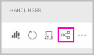
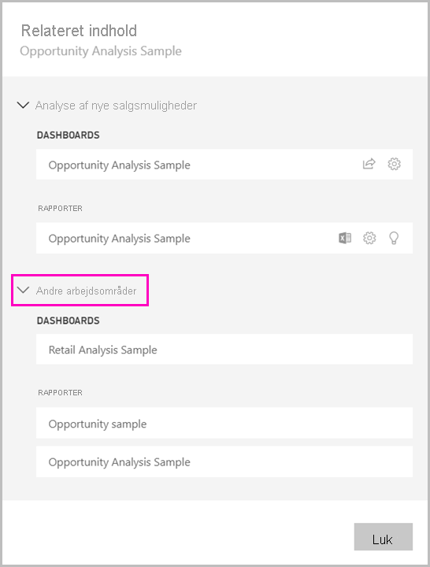

# Deling af et datasæt

Som forfatter af *datamodeller* i Power BI Desktop opretter du *datasæt*, som du kan distribuere i Power BI-tjenesten. Derefter kan andre rapportforfattere bruge dine datasæt som udgangspunkt for deres egne rapporter. I denne artikel får du mere at vide om, hvordan du deler dine datasæt. Hvis du vil vide mere om, hvordan du får og fjerner adgangen til dine delte datasæt, kan du læse om [tilladelsen Opret](service-datasets-build-permissions.md).

## Trin til at dele dit datasæt

1. Du starter ved at oprette en .pbix-fil med en datamodel i Power BI Desktop. Hvis du planlægger at tilbyde dette datasæt, så andre kan oprette rapporter, designer du muligvis slet ikke en rapport i .pbix-filen.

    Det er bedste praksis at gemme .pbix-filen i en Microsoft 365-gruppe.

1. Publicer .pbix-filen i en [ny arbejdsområdeoplevelse](../collaborate-share/service-create-the-new-workspaces.md) i Power BI-tjenesten.
    
    Andre medlemmer af dette arbejdsområde kan allerede oprette rapporter i andre arbejdsområder baseret på dette datasæt. Brug indstillingen Administrer tilladelser på datasættet på arbejdsområdets indholdsliste for at give flere brugere adgang til datasættet. 

1. Du kan også [publicere en app](../collaborate-share/service-create-distribute-apps.md) fra dette arbejdsområde. Når du gør det, skal du på siden **Tilladelser** angive, hvem der har tilladelser, og hvad de kan gøre.

    > [!NOTE]
    > Hvis du vælger **Hele organisationen**, har ingen i organisationen tilladelsen Opret. Dette er et kendt problem. Angiv i stedet mailadresser under **Bestemte personer eller grupper**.  Hvis hele organisationen skal have tilladelsen Opret, skal du angive mailaliasser for hele organisationen.

    

1. Vælg **Publicer app**, eller **Opdater app**, hvis den ikke allerede er publiceret.

## Spor forbruget af dit datasæt

Når du har et delt datasæt i dit arbejdsområde, vil du måske gerne vide, hvilke rapporter i andre arbejdsområder der er baseret på den.

1. Vælg **Få vist relaterede** i listevisningen Datasæt.

    

1. I dialogboksen **Relateret indhold** vises alle relaterede elementer. På denne liste kan du se relaterede elementer i dette arbejdsområde og **andre arbejdsområder**.
 
    

## Begrænsninger og overvejelser
Ting, du skal være opmærksom på angående deling af datasæt:

* Når du deler et datasæt ved at administrere tilladelser, ved at dele rapporter eller dashboards eller ved at udgive en app, giver du adgang til hele datasættet, medmindre [sikkerhed på rækkeniveau (RLS)](../admin/service-admin-rls.md) begrænser deres adgang. Rapportforfattere kan bruge funktioner, der tilpasser brugeroplevelser, når de får vist eller interagerer med rapporter, f.eks. at skjule kolonner, begrænse handlinger på visualiseringer og andet. Disse brugerdefinerede brugeroplevelser begrænser ikke, hvilke data brugere kan få adgang til i datasættet. Brug [sikkerhed på rækkeniveau (RLS)](../admin/service-admin-rls.md) i datasættet, så hver enkelt brugers legitimationsoplysninger bestemmer, hvilke data de kan få adgang til.

## Næste trin

- [Brug datasæt på tværs af arbejdsområder](service-datasets-across-workspaces.md)
- Har du spørgsmål? [Prøv at spørge Power BI-community'et](https://community.powerbi.com/)
