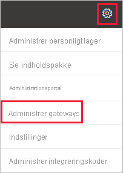
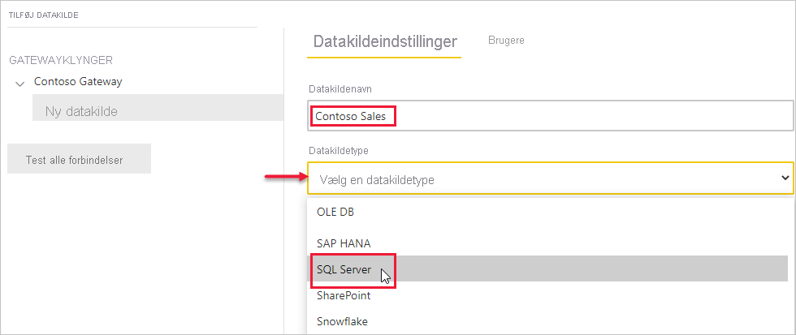
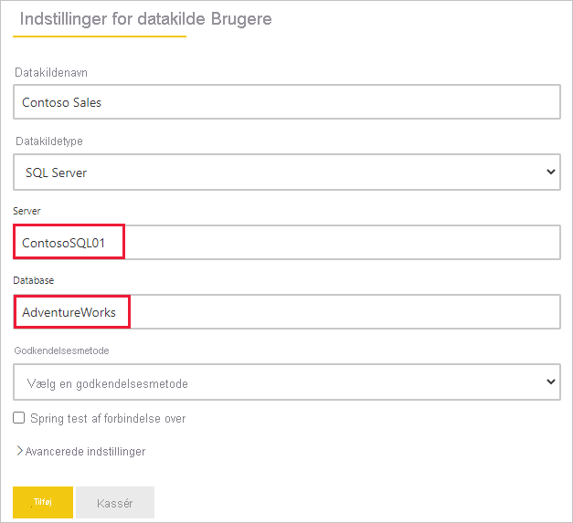
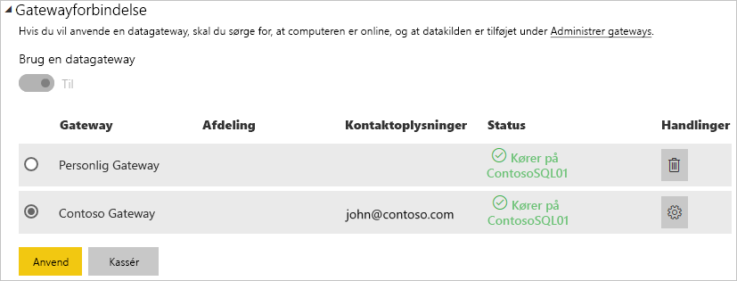
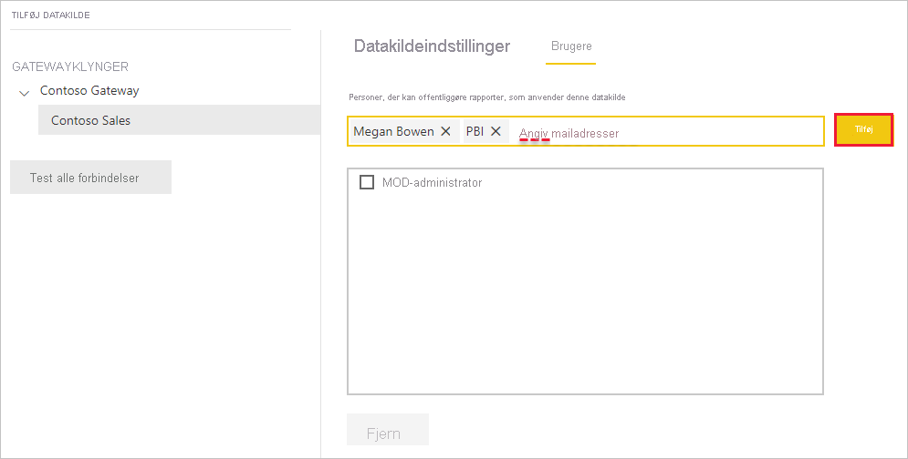
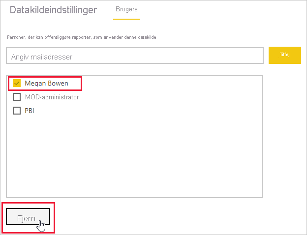

# Tilføj eller fjern en gatewaydatakilde

[!INCLUDE [gateway-rewrite](../includes/gateway-rewrite.md)]

Power BI understøtter mange [datakilder i det lokale miljø](power-bi-data-sources.md), som hver især har sine egne krav. En gateway kan bruges til en enkelt datakilde eller flere datakilder. I dette eksempel viser vi dig, hvordan du tilføjer SQL Server som en datakilde. Trinnene svarer til trinnene for andre datakilder.

De fleste handlinger til administration af datakilder kan også udføres vha. API'er. Du kan finde flere oplysninger i [REST API'er (gateways)](/rest/api/power-bi/gateways).

Hvis du endnu ikke har en gateway installeret, kan du se [Installér en datagateway i det lokale miljø](/data-integration/gateway/service-gateway-install) for at komme i gang.

## Tilføj en datakilde

1. Vælg **Indstillinger**  > **Administrer gateways** fra sidehovedet i Power BI-tjenesten.

    

2. Vælg en gateway, og vælg derefter **Tilføj datakilde**. Du kan vælge overskriftsteksten **TILFØJ DATAKILDE** eller placere markøren ud for gatewayposten for at få vist menuen Flere indstillinger.

    

3. Tildel et navn til din datakilde, og vælg derefter **Datakildetype**. I dette eksempel vælger vi SQL Server.

    

4. Angiv oplysninger om datakilden. Angiv **server** og **database** for SQL Server.

    

5. Vælg den **godkendelsesmetode**, der skal bruges, når der oprettes forbindelse til datakilden. Vælg **Windows** eller **Basic** (SQL-godkendelse) for SQL Server. Angive legitimationsoplysningerne for datakilden.

   :::image type="content" source="media/service-gateway-data-sources/basic-auth.png" alt-text="Indstillinger for basisgodkendelse.":::

    > [!NOTE]
    > Hvis den valgte godkendelsesmetode er OAuth, vil forespørgsler, der kører længere end politikken for udløb af OAuth-tokenet, muligvis mislykkes.

6. Du kan konfigurere **Enkeltlogon (SSO)** for din datakilde under [Avancerede indstillinger](service-gateway-sso-overview.md). 

    

    Du kan enten konfigurere **Brug SSO via Kerberos til DirectQuery-forespørgsler** eller **Brug SSO via Kerberos til DirectQuery- og importforespørgsler** for DirectQuery-baserede rapporter og **Brug SSO via Kerberos til DirectQuery- og importforespørgsler** for opdateringsbaserede rapporter.

    Hvis du bruger **Brug SSO via Kerberos til DirectQuery-forespørgsler** og bruger denne datakilde til en DirectQuery-baseret rapport, benyttes legitimationsoplysningerne for den bruger, der logger på Power BI-tjenesten. I forbindelse med en opdateret rapport vil den bruge de legitimationsoplysninger, du angiver i felterne **Brugernavn** og **Adgangskode**.

    Hvis du bruger **Brug SSO via Kerberos til DirectQuery- og importforespørgsler**, behøver du ikke at angive legitimationsoplysninger. Hvis denne datakilde bruges til en DirectQuery-baseret rapport, benyttes den bruger, der er knyttet til den (Azure) Active Directory-bruger, der logger på Power BI-tjenesten.  I forbindelse med en opdateret rapport bruges sikkerhedskonteksten for datasættets ejer

    > [!NOTE]
    >SSO til importforespørgsler er kun tilgængelig for listen over SSO-datakilder, der bruger [Kerberos-begrænset delegering](service-gateway-sso-kerberos.md).

7. Under **Avancerede indstillinger** kan du eventuelt konfigurere [niveauet for beskyttelse af personlige oplysninger](https://support.office.com/article/Privacy-levels-Power-Query-CC3EDE4D-359E-4B28-BC72-9BEE7900B540) for din datakilde (gælder ikke for [DirectQuery](desktop-directquery-about.md)).

    :::image type="content" source="media/service-gateway-data-sources/privacy-level.png" alt-text="Valg af niveau for beskyttelse af personlige oplysninger.":::

8. Vælg **Tilføj** Du får vist *Forbindelsen er oprettet*, hvis processen lykkes.

    

Du kan nu bruge denne datakilde til at inkludere data fra SQL Server i dine Power BI-dashboards og -rapporter.

## Fjern en datakilde

Du kan fjerne en datakilde, hvis du ikke længere bruger den. Hvis du fjerner en datakilde, ødelægger det alle dashboards og rapporter, der anvender den pågældende datakilde.

Hvis du vil fjerne en datakilde, skal du gå til datakilden og derefter vælge **Fjern** i menuen Flere indstillinger. Menuen Flere indstillinger vises, når du holder markøren over navnet på datakilden.

## Brug af datakilden til planlagt opdatering eller DirectQuery

Når du opretter datakilden, er den tilgængelig til brug med enten DirectQuery-forbindelser eller via en planlagt opdatering. Du kan få mere at vide om, hvordan du konfigurerer planlagt opdatering i [Konfigurer planlagt opdatering](refresh-scheduled-refresh.md).

> [!NOTE]
>Server- og databasenavne skal matche mellem Power BI Desktop og den datakilde, der føjes til datagatewayen i det lokale miljø.

Linket mellem dit datasæt og datakilden i gatewayen er baseret på dit servernavn og databasenavn. Disse navne skal være ens. Hvis du f.eks. angiver en IP-adresse for servernavnet i Power BI Desktop, skal du bruge IP-adressen til datakilden i konfigurationen af gatewayen. Hvis du bruger *SERVER\INSTANCE* i Power BI Desktop, skal du bruge det samme i den datakilde, der er konfigureret for gatewayen.

Hvis du er angivet under fanen **Brugere** i den datakilde, der er konfigureret i gatewayen, og server- og databasenavnet stemmer overens, får du vist gatewayen som en mulighed, der kan bruges sammen med en planlagt opdatering.

> [!WARNING]
> Hvis dit datasæt indeholder flere datakilder, skal hver enkelt datakilde føjes til gatewayen. Hvis en eller flere datakilder ikke er føjet til gatewayen, kan du ikke se gatewayen som tilgængelig i forbindelse med en planlagt opdatering.

### Begrænsninger

OAuth er kun en understøttet godkendelsesplan for brugerdefinerede connectors med datagatewayen i det lokale miljø. Du kan ikke tilføje andre datakilder, der kræver OAuth. Hvis dit datasæt har en datakilde, der kræver OAuth, og denne datakilde ikke er en brugerdefineret connector, kan du ikke bruge gatewayen til planlagt opdatering.

## Administrer brugere

Når du har føjet en datakilde til en gateway, giver du brugere og mailaktiverede sikkerhedsgrupper adgang til den specifikke datakilde (ikke hele gatewayen). Adgangslisten for datakilden styrer kun, hvem der har tilladelse til at udgive rapporter, der indeholder data fra datakilden. Rapporternes ejere kan oprette dashboards, indholdspakker og apps og derefter dele disse med andre brugere.

Du kan også give brugere og sikkerhedsgrupper administrativ adgang til gatewayen.

> [!NOTE]
> Brugere med adgang til datakilden kan associere datasæt med datakilden, og oprette forbindelse, baseret på sikkerhedsoplysningerne (enten de gemte legitimationsoplysninger eller enkeltlogon), som blev valgt under oprettelse af en datakilde.

### Føj brugere til en datakilde

1. Vælg **Indstillinger**  > **Administrer gateways** fra sidehovedet i Power BI-tjenesten.

2. Vælg den datakilde, hvor du vil tilføje brugere.

3. Vælg **Brugere**, og angiv de brugere og mailaktiverede sikkerhedsgrupper fra din organisation, der skal have adgang til den valgte datakilde. Vælg **Tilføj**, hvorefter det tilføjede medlems navn føjes til listen over personer, der kan publicere rapporter, som bruger denne datakilde.

    

Husk, at du skal føje brugere til hver enkelt datakilde, som du vil give adgang til. Hver datakilde har en separat liste over brugere. Føj brugere separat til hver enkelt datakilde.

### Fjern brugere fra en datakilde

Under fanen **Brugere** for datakilden kan du fjerne brugere og sikkerhedsgrupper, som bruger denne datakilde.

## Lagring af krypterede legitimationsoplysninger i clouden

Når du føjer en datakilde til gatewayen, skal du angive legitimationsoplysninger for den pågældende datakilde. Alle forespørgsler til datakilden kører ved hjælp af disse legitimationsoplysninger. Legitimationsoplysningerne er krypteret på en sikker måde. De anvender symmetrisk kryptering, så de ikke kan dekrypteres i cloudmiljøet, før de er gemt i cloudmiljøet. Legitimationsoplysningerne sendes til den maskine, der kører gateway'en, i det lokale miljø, hvor de dekrypteres, når datakilderne tilgås.

## Liste over tilgængelige datakildetyper

Du kan finde oplysninger om, hvilke datakilder datagatewayen i det lokale miljø understøtter, i [Power BI-datakilder](power-bi-data-sources.md).

## Næste trin

* [Administrer din datakilde – Analysis Services](service-gateway-enterprise-manage-ssas.md)
* [Administrer din datakilde – SAP HANA](service-gateway-enterprise-manage-sap.md)
* [Administrer din datakilde – SQL Server](service-gateway-enterprise-manage-sql.md)
* [Administrer din datakilde – Oracle](service-gateway-onprem-manage-oracle.md)
* [Administrer din datakilde – Import/planlagt opdatering](service-gateway-enterprise-manage-scheduled-refresh.md)
* [Vejledning til installation af en datagateway](service-gateway-deployment-guidance.md)

Har du flere spørgsmål? Prøv at spørge [Power BI-community'et](https://community.powerbi.com/).
