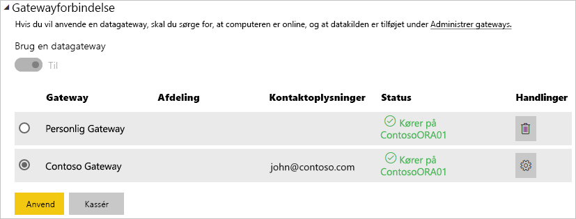

# Administrer din datakilde – Import/planlagt opdatering

[!INCLUDE [gateway-rewrite](../includes/gateway-rewrite.md)]

Når du har [installeret datagatewayen i det lokale miljø](/data-integration/gateway/service-gateway-install), skal du [tilføje datakilder](service-gateway-data-sources.md#add-a-data-source), der kan bruges sammen med gateway'en. Denne artikel indeholder oplysninger om, hvordan du arbejder med gateways og datakilder, der bruges til planlagte opdateringer, i modsætning til DirectQuery eller direkte forbindelser.

## Tilføj en datakilde

Du kan finde flere oplysninger om, hvordan du tilføjer en datakilde i [Tilføj en datakilde](service-gateway-data-sources.md#add-a-data-source). Vælg en datakildetype.

Alle datakildetyper, der er angivet på listen, kan bruges til planlagte opdateringer med datagatewayen i det lokale miljø. Analysis Services, SQL Server og SAP HANA kan bruges til enten planlagte opdateringer eller DirectQuery/direkte forbindelser.

Derefter skal du udfylde oplysninger om datakilden, herunder kildeoplysninger og legitimationsoplysninger, som bruges til at få adgang til datakilden.

> [!NOTE]
> Alle forespørgsler til datakilden kører ved hjælp af disse legitimationsoplysninger. Hvis du vil have mere at vide om, hvor legitimationsoplysningerne gemmes, skal du se [Lagring af krypterede legitimationsoplysninger i cloudmiljøet](service-gateway-data-sources.md#store-encrypted-credentials-in-the-cloud).

Du kan få vist en liste over datakildetyper, der kan bruges til planlagte opdateringer, i [Liste over tilgængelige datakildetyper](service-gateway-data-sources.md#list-of-available-data-source-types).

Når du har udfyldt alt, skal du vælge **Tilføj**. Du kan nu bruge denne datakilde til planlagt opdatering med dine data i det lokale miljø. Du får vist *Forbindelsen blev oprettet*, hvis det lykkes.

### Avancerede indstillinger

Du kan eventuelt konfigurere niveauet for beskyttelse af personlige oplysninger for datakilden. Denne indstilling styrer, hvordan data kan kombineres. Det bruges kun for planlagte opdateringer. Hvis du vil vide mere om niveauer for beskyttelse af personlige oplysninger, skal du se [Niveauer for beskyttelse af personlige oplysninger (Power-forespørgsel)](https://support.office.com/article/Privacy-levels-Power-Query-CC3EDE4D-359E-4B28-BC72-9BEE7900B540).

## Brug datakilden med planlagt opdatering

Når du opretter datakilden, er den tilgængelig til brug med enten DirectQuery-forbindelser eller via en planlagt opdatering.

> [!NOTE]
> Server- og databasenavne skal matche mellem Power BI Desktop og datakilden i datagatewayen i det lokale miljø.

Forbindelsen mellem dit datasæt og datakilden i gatewayen er baseret på dit servernavn og databasenavn. Disse navne skal være ens. Hvis du f.eks. angiver en IP-adresse for servernavnet i Power BI Desktop, skal du bruge IP-adressen for datakilden i konfigurationen af gatewayen. Hvis du bruger *SERVER\INSTANCE* i Power BI Desktop, skal du også bruge det i den datakilde, der er konfigureret for gateway'en.

Hvis du er angivet under fanen **Brugere** i den datakilde, der er konfigureret i gatewayen, og servernavnet og databasenavnet stemmer overens, får du vist gatewayen som en mulighed, der kan bruges sammen med en planlagt opdatering.

> [!IMPORTANT]
> Efter genpublicering skal ejeren af datasættet knytte datasættet til en gatweay og den tilsvarende datakilde igen. Den forrige tilknytning vedligeholdes ikke ved genpublicering. 

> [!WARNING]
> Hvis dit datasæt indeholder flere datakilder, skal hver enkelt datakilde tilføjes i gatewayen. Hvis en eller flere datakilder ikke er føjet til gatewayen, kan du ikke se gatewayen som tilgængelig i forbindelse med en planlagt opdatering.

## Næste trin

* [Fejlfinding af datagateway i lokalt miljø](/data-integration/gateway/service-gateway-tshoot)
* [Foretag fejlfinding af gateways – Power BI](service-gateway-onprem-tshoot.md)

Har du flere spørgsmål? Prøv at spørge [Power BI-community'et](https://community.powerbi.com/).
