# <a name="refresh-data-from-an-on-premises-sql-server-database"></a>Opdater data fra en lokal SQL Server-database

I dette selvstudium kan udforske, hvordan du opdaterer et Power BI-datasæt fra en relationsdatabase, der findes i det lokale miljø på dit lokale netværk. Dette selvstudium bruger et specifikt eksempel på en SQL Server-database, som Power BI skal have adgang til via en datagateway i det lokale miljø.

I dette selvstudium kan du udføre følgende trin:

> [!div class="checklist"]
> * Opret og publicer en Power BI Desktop-fil (.pbix), der importerer data fra en lokal SQL Server-database.
> * Konfigurer indstillinger for datakilde og datasæt i Power BI til SQL Server-forbindelsen via en datagateway.
> * Konfigurer en tidsplan for opdatering at sikre, at dit datasæt i Power BI har de nyeste data.
> * Udfør en opdatering efter behov af datasættet.
> * Gennemse opdateringshistorikken for at analysere resultaterne af tidligere opdateringscyklusser.
> * Fjern ressourcer ved at slette de artefakter, der er oprettet i dette selvstudium.

## <a name="prerequisites"></a>Forudsætninger

- Hvis du ikke allerede har en [gratis prøveversion af Power BI](https://app.powerbi.com/signupredirect?pbi_source=web), skal du tilmelde dig for at få en, før du begynder.
- [Installér Power BI Desktop](https://powerbi.microsoft.com/desktop/) på en lokal computer.
- [Installér SQL Server](/sql/database-engine/install-windows/install-sql-server) på en lokal computer, og gendan [eksempeldatabasen fra en sikkerhedskopi](https://github.com/Microsoft/sql-server-samples/releases/download/adventureworks/AdventureWorksDW2017.bak). Du kan finde flere oplysninger om AdventureWorks under [Installation og konfiguration af AdventureWorks](/sql/samples/adventureworks-install-configure).
- [Installér en datagateway i det lokale miljø](service-gateway-onprem.md) på den samme lokale computer som SQL Server (i produktionsmiljøet vil det typisk være en anden computer).

> [!NOTE]
> Hvis du er ikke gatewayadministrator, og du ikke selv vil installere en gateway, skal du kontakte en gatewayadministrator i din organisation. De kan oprette den påkrævede datakildedefinition til at forbinde dit datasæt med din SQL Server-database.

## <a name="create-and-publish-a-power-bi-desktop-file"></a>Opret og udgiv en Power BI Desktop-fil

Benyt følgende procedure til at oprette en grundlæggende Power BI-rapport ved hjælp af AdventureWorksDW-eksempeldatabasen. Udgiv rapporten til Power BI-tjenesten, så du får et datasæt i Power BI, som du derefter kan konfigurere og opdatere i de efterfølgende trin.

1. I Power BI Desktop på fanen **Start** skal du vælge **Hent data** \> **SQL Server**.

2. I dialogboksen **SQL Server-database** skal du angive navnet på din **Server** og **Database (valgfrit)** . Sørg for, at **Dataforbindelsestilstand** er **Import**, og vælg derefter **OK**.

    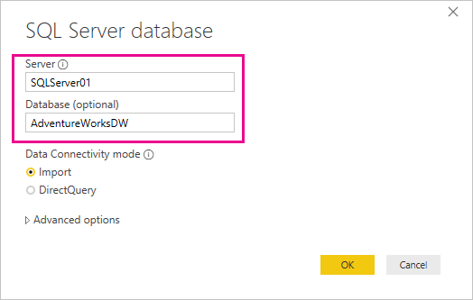

    Vi bruger ikke **Avancerede indstillinger** i dette selvstudium, men bemærk, at du kan angive en SQL-sætning og angive andre indstillinger, f.eks. brug af [SQL Server Failover](/sql/database-engine/availability-groups/windows/failover-clustering-and-always-on-availability-groups-sql-server).

    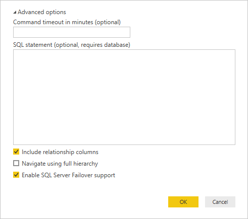

3. Kontrollér dine **legitimationsoplysninger**, og vælg derefter **Opret forbindelse**.

    > [!NOTE]
    > Hvis du ikke kan opnå godkendelse, skal du sikre dig, at du vælger den korrekte godkendelsesmetode og bruger en konto med databaseadgang. I testmiljøer kan du bruge Databasegodkendelse med eksplicit brugernavn og adgangskode. I produktionsmiljøer bruger du typisk Windows-godkendelse. Se [Fejlfinding i forbindelse med opdatering](refresh-troubleshooting-refresh-scenarios.md), og kontakt databaseadministratoren for at få yderligere hjælp.

1. Hvis dialogboksen **Understøttelse af kryptering** vises, skal du vælge **OK**.

2. I dialogboksen **Navigator** skal du vælge tabellen **DimProduct** og derefter vælge **Indlæs**.

    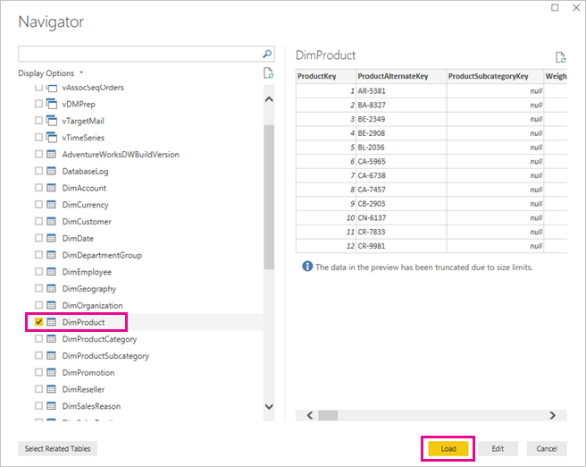

3. I ruden **Visualiseringer** i Power BI Desktop-visningen **Rapport** skal du vælge **Stablet søjlediagram**.

    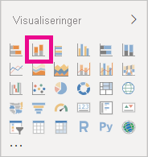

4. Mens søjlediagrammet er markeret på rapportlærredet, skal du vælge felterne **EnglishProductName** og **ListPrice** i ruden **Felter**.

    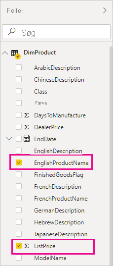

5. Træk **EndDate** til **Filtre på rapportniveau**, og markér kun afkrydsningsfeltet for **(Tom)** under **Grundlæggende filtrering**.

    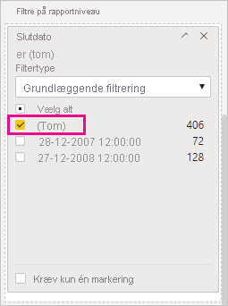

    Diagrammet bør nu se ud som i det følgende.

    

    Bemærk, at de fem **Road-250**-produkter er angivet med den højeste listepris. Dette ændrer sig, når du opdaterer dataene og opdaterer rapporten senere i dette selvstudium.

6. Gem rapporten med navnet "AdventureWorksProducts.pbix".

7. På fanen **Start** skal du vælge **Publicer** \> **Mit arbejdsområde** \> **Vælg**. Log på Power BI-tjenesten, hvis du bliver bedt om det.

8. På skærmen **Udført** skal du vælge **Åbn 'AdventureWorksProducts.pbix' i Power BI**.

    [Publicer i Power BI](./media/service-gateway-sql-tutorial/publish-to-power-bi.png)

## <a name="connect-a-dataset-to-a-sql-server-database"></a>Forbind et datasæt til en SQL Server-database

Du har oprettet forbindelse direkte til din lokale SQL Server-database i Power BI Desktop, men Power BI-tjenesten kræver en datagateway for at kunne fungere som bro mellem cloudmiljøet og dit netværk i det lokale miljø. Følg disse trin for at tilføje din lokale SQL Server-database som datakilde til en gateway og derefter forbinde dit datasæt til denne datakilde.

1. Log på Power BI. Vælg tandhjulsikonet i øverste højre hjørne, og vælg derefter **Indstillinger**.

    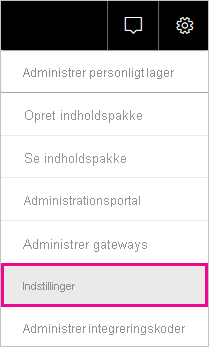

2. På fanen **Datasæt** skal du vælge datasættet **AdventureWorksProducts**, så du kan oprette forbindelse til din SQL Server-database i det lokale miljø via en datagateway.

3. Udvid **Gatewayforbindelse**, og bekræft, at der er angivet mindst én gateway. Hvis du ikke har en gateway, kan du gå tilbage til afsnittet [Forudsætninger](#prerequisites) tidligere i dette selvstudium for at få et link til produktdokumentationen, der beskriver, hvordan du installerer og konfigurerer en gateway.

    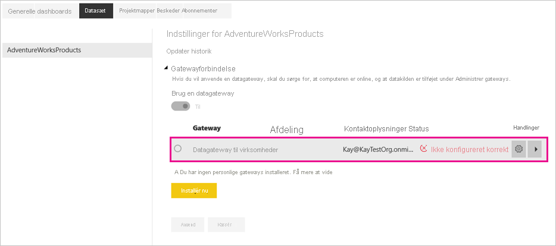

4. Under **Handlinger** skal du udvide til/fra-knappen for at få vist datakilderne og derefter vælge linket **Føj til gateway**.

    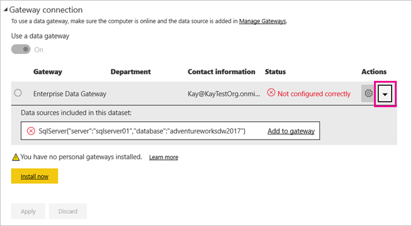

    > [!NOTE]
    > Hvis du er ikke gatewayadministrator, og du ikke selv vil installere en gateway, skal du kontakte en gatewayadministrator i din organisation. De kan oprette den påkrævede datakildedefinition til at forbinde dit datasæt med din SQL Server-database.

5. På administrationssiden **Gateways** på fanen **Indstillinger for datakilde** skal du angive og kontrollere følgende oplysninger og vælge **Tilføj**.

    | Indstilling | Værdi |
    | --- | --- |
    | Navn på datakilde | AdventureWorksProducts |
    | Datakildetype | SQL Server |
    | Server | Navnet på din SQL Server-forekomst, f.eks. SQLServer01 (det skal være identisk med det, du har angivet i Power BI Desktop). |
    | Database | Navnet på din SQL Server-database, f.eks. AdventureWorksDW (det skal være identisk med det, du har angivet i Power BI Desktop). |
    | Godkendelsesmetode | Windows eller Basic (typisk Windows). |
    | Brugernavn | Den brugerkonto, du bruger til at oprette forbindelse til SQL Server. |
    | Adgangskode | Adgangskoden til den konto, du bruger til at oprette forbindelse til SQL Server. |

    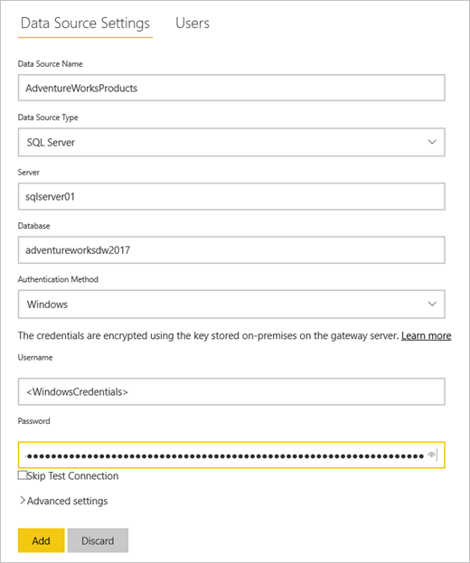

6. På fanen **Datasæt** skal du udvide sektionen **Gatewayforbindelse** igen. Vælg den datagateway, du har konfigureret, og som viser en **Status**, om at den kører på den maskine, hvor du har installeret den, og vælg **Anvend**.

    

## <a name="configure-a-refresh-schedule"></a>Konfigurer tidsplan for opdatering

Nu, hvor du har forbundet dit datasæt i Power BI til din SQL Server-database i det lokale miljø via en datagateway, skal du følge disse trin for at konfigurere en tidsplan for opdatering. Opdatering af datasættet efter en tidsplan hjælper med at sikre, at dine rapporter og dashboards indeholder de nyeste data.

1. I navigationsruden til venstre skal du vælge **Mit arbejdsområde** \> **Datasæt**. Vælg ellipsen ( **. . .** ) for datasættet **AdventureWorksProducts**, og vælg derefter **Planlæg opdatering**.

    > [!NOTE]
    > Sørg for at vælge ellipsen for datasættet **AdventureWorksProducts** og ikke ellipsen for rapporten med det samme navn. Genvejsmenuen for rapporten **AdventureWorksProducts** indeholder ikke indstillingen **Planlæg opdatering**.

2. I sektionen **Planlagt opdatering** under **Hold dine data opdateret** skal du slå opdateringen **Til**.

3. Vælg en passende **Opdateringshyppighed**, ( **Dagligt** i dette eksempel), og derefter under **Klokkeslæt** skal du vælge **Tilføj et andet tidspunkt** for at angive det ønskede opdateringstidspunkt (6:30 AM og PM i dette eksempel).

    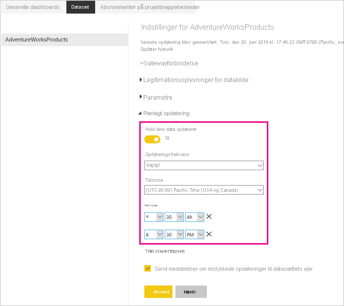

    > [!NOTE]
    > Du kan konfigurere op til 8 daglige tidspunkter, hvis dit datasæt befinder sig på en delt kapacitet, eller 48 tidspunkter med Power BI Premium.

4. Lad afkrydsningsfeltet **Send meddelelse om mislykket opdatering via mail til mig** forblive markeret, og vælg **Anvend**.

## <a name="perform-an-on-demand-refresh"></a>Udfør en opdatering efter behov

Nu, hvor du har konfigureret en tidsplan for opdatering, opdaterer Power BI dit datasæt på det næste planlagte tidspunkt inden for en margen på 15 minutter. Hvis du vil opdatere dataene hurtigere, f.eks. for at teste din gateway og konfigurationen af din datakilde, kan du udføre en opdatering efter behov ved hjælp af indstillingen **Opdater nu** i menuen for datasæt i navigationsruden. Opdateringer efter behov påvirker ikke det næste planlagte opdateringstidspunkt, men de tæller i forhold til grænsen for antal daglige opdateringer, som er nævnt i foregående sektion.

Du kan simulere en ændring af eksempeldataene for at illustrere dette ved at opdatere tabellen DimProduct i databasen AdventureWorksDW ved hjælp af SSMS (SQL Server Management Studio).

```sql

UPDATE [AdventureWorksDW].[dbo].[DimProduct]
SET ListPrice = 5000
WHERE EnglishProductName ='Road-250 Red, 58'

```

Følg nu disse trin, så de opdaterede data kan bevæge sig gennem gatewayforbindelsen til datasættet og ind i rapporterne i Power BI.

1. Vælg og udvid **Mit arbejdsområde** i navigationsruden i Power BI-tjenesten.

2. Under **Datasæt** skal du vælge ellipsen ( **. . .** ) for datasættet **AdventureWorksProducts** og derefter vælge **Opdater nu**.

    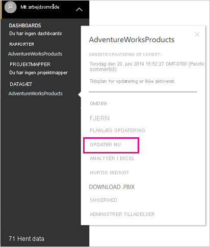

    Bemærk, at i øverste højre hjørne kan du se, at Power BI forbereder sig til at udføre den anmodede opdatering.

3. Vælg **Mit arbejdsområde \> Rapporter \> AdventureWorksProducts**. Se, hvordan de opdaterede data har bevæget sig gennem systemet, så produktet med den højeste listepris nu er **Road-250 Red, 58**.

    

## <a name="review-the-refresh-history"></a>Gennemgå opdateringshistorikken

Det er en god idé at kontrollere resultaterne af tidligere opdateringscyklusser med jævne mellemrum i opdateringshistorikken. Måske var databasens legitimationsoplysninger udløbet, eller den valgte gateway var offline på tidspunktet for den planlagte opdatering. Følg disse trin for at se opdateringshistorikken og undersøge, om der er problemer.

1. Vælg tandhjulsikonet i øverste højre hjørne af Power BI-grænsefladen, og vælg derefter **Indstillinger**.

2. Skift til **Datasæt**, og vælg det datasæt, du vil undersøge, f.eks **AdventureWorksProducts**.

3. Vælg linket **Opdateringshistorik** for at åbne dialogboksen **Opdateringshistorik**.

    

4. På fanen **Planlagt** kan du se tidligere planlagte opdateringer og opdateringer efter behov, der vises med klokkeslæt for **Start** og **Slut**, og en **Status** som **Fuldført**, hvilket angiver, at Power BI kunne fuldføre opdateringen uden problemer. Hvis en opdatering mislykkedes, kan du se en fejlmeddelelse og undersøge de nærmere oplysninger om fejlen.

    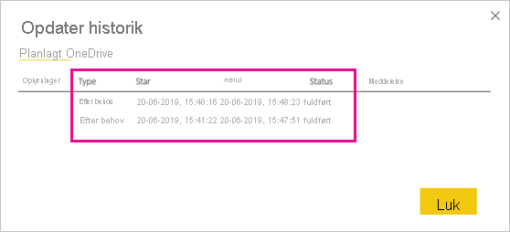

    > [!NOTE]
    > Fanen OneDrive er kun relevant for datasæt, der er forbundet til Power BI Desktop-filer, Excel-projektmapper eller CSV-filer på OneDrive eller SharePoint Online, hvilket er forklaret mere detaljeret i [Opdatering af Data i Power BI](refresh-data.md).

## <a name="clean-up-resources"></a>Fjern ressourcer

Hvis du ikke længere vil bruge eksempeldataene, kan du slippe databasen i SSMS (SQL Server Management Studio). Hvis du ikke vil bruge SQL Server-datakilden, kan du fjerne datakilden fra din datagateway. Overvej også at fjerne datagatewayen, hvis du kun har installeret den med henblik på at udføre dette selvstudium. Du bør også slette AdventureWorksProducts-datasættet og AdventureWorksProducts-rapporten, som Power BI oprettede, da du uploadede filen AdventureWorksProducts.pbix.

## <a name="next-steps"></a>De næste trin

I dette selvstudium har du undersøgt, hvordan du importerer data fra en lokal SQL Server-database til et Power BI-datasæt, og hvordan du opdaterer dette datasæt efter en planlagt tidsplan og efter behov, så du kan holde rapporter og dashboards, der bruger datasættet, opdateret i Power BI. Nu kan du lære mere om at administrere datagateways og datakilder i Power BI. Det kan også være en god idé at læse den konceptuelle artikel om Opdatering af data i Power BI.

- [Administrer en datagateway i det lokale miljø](/data-integration/gateway/service-gateway-manage)
- [Administrer din datakilde – Import/Planlagt opdatering](service-gateway-enterprise-manage-scheduled-refresh.md)
- [Opdatering af data i Power BI](refresh-data.md)
