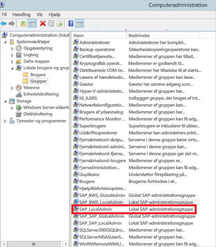
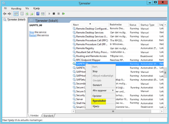
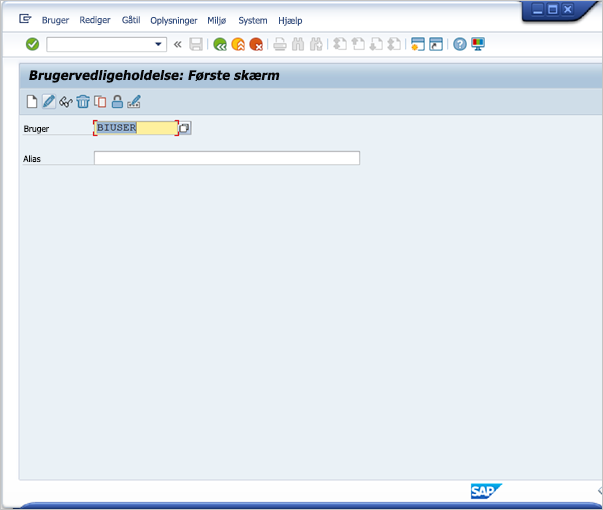
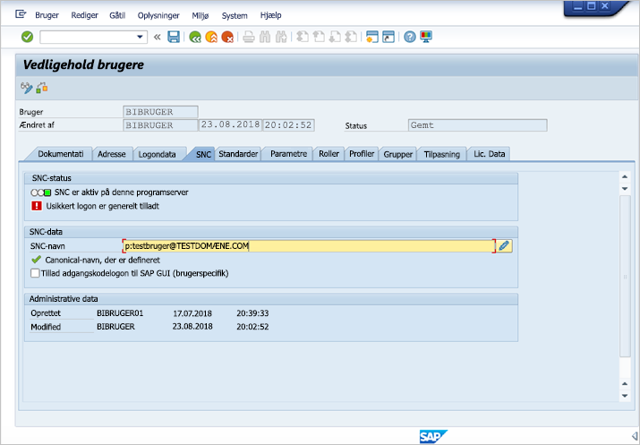
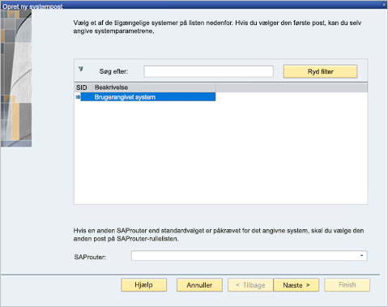
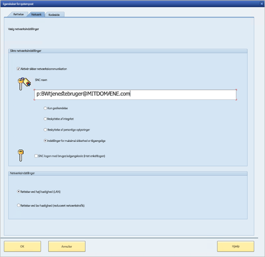

# <a name="use-kerberos-for-single-sign-on-sso-to-sap-bw-using-gx64krb5"></a>Brug Kerberos til enkeltlogon (SSO) i forbindelse med SAP BW ved hjælp af gx64krb5

Denne artikel indeholder en beskrivelse af, hvordan du konfigurerer din SAP BW-datakilde for at aktivere SSO fra Power BI-tjenesten ved hjælp af gx64krb5.

> [!NOTE]
> Du kan fuldføre trinnene i denne artikel foruden trinnene i [Konfigurer SSO i Kerberos](service-gateway-sso-kerberos.md) for at aktivere SSO-baseret opdatering af rapporter, der er baseret på SAP BW-programserver, i Power BI-tjenesten. Microsoft anbefaler dog brug af CommonCryptoLib og ikke gx64krb5 som dit SNC-bibliotek. SAP understøtter ikke længere gx64krb5, og de trin, der kræves for at konfigurere det til gatewayen, er væsentligt mere komplekse sammenlignet med CommonCryptoLib. Du kan finde oplysninger om, hvordan du konfigurerer SSO ved hjælp af CommonCryptoLib i [Konfigurer SAP BW til SSO ved hjælp af CommonCryptoLib](service-gateway-sso-kerberos-sap-bw-commoncryptolib.md). Du bør bruge CommonCryptoLib _eller_ gx64krb5 som dit SNC-bibliotek. Fuldfør ikke konfigurationstrinnene for begge biblioteker.

Denne vejledning er omfattende. Hvis du allerede har fuldført nogle af de nævnte trin, kan du springe dem over. Du kan f.eks. allerede have konfigureret SAP BW-serveren for SSO ved hjælp af gx64krb5.

## <a name="set-up-gx64krb5-on-the-gateway-machine-and-the-sap-bw-server"></a>Konfigurer gx64krb5 på gatewaycomputeren og SAP BW-serveren

> [!NOTE]
> gx64krb5-biblioteket understøttes ikke længere af SAP. Du kan finde flere oplysninger under [SAP Note 352295](https://launchpad.support.sap.com/#/notes/352295). Bemærk, at gx64krb5 ikke tillader SSO-forbindelser fra datagatewayen til SAP BW-meddelelsesservere. Det er kun forbindelser til SAP BW-programservere, der er mulige. Denne begrænsning findes ikke, hvis du bruger [CommonCryptoLib](service-gateway-sso-kerberos-sap-bw-commoncryptolib.md) som SNC-bibliotek. Selvom andre SNC-biblioteker også kan fungere til SSO i BW, understøttes de ikke officielt af Microsoft.

gx64krb5-biblioteket skal bruges af både klienten og serveren, før en SSO-forbindelse via gatewayen kan fuldføres. Det vil sige, at både klienten og serveren skal bruge det samme SNC-bibliotek.

1. Download gx64krb5.dll fra [SAP Note 2115486](https://launchpad.support.sap.com/) (s-bruger til SAP er påkrævet). Sørg for, at du har mindst version 1.0.11.x. Download også gsskrb5.dll (32-bit versionen af biblioteket), hvis du vil teste SSO-forbindelsen i SAP GUI, før du forsøger at oprette SSO-forbindelse via gatewayen (anbefales). 32-bit versionen kræves for at teste med SAP GUI, da SAP GUI kun er tilgængelig i 32-bit.

1. Placer gx64krb5.dll et sted på gatewaycomputeren, der er tilgængelig for brugeren af gatewaytjenesten. Hvis du vil teste SSO-forbindelsen ved hjælp af SAP GUI, skal du også placere en kopi af gsskrb5.dll på computeren og angive miljøvariablen **SNC_LIB** til at pege på den. Både brugeren af gatewaytjenesten og de brugere af Active Directory (AD), som tjenestebrugeren repræsenterer, skal have læse- og udførelsestilladelser til kopien af gx64krb5.dll. Det anbefales, at du tildeler gruppen Godkendte brugere tilladelser til .dll. Med henblik på test kan du også eksplicit tildele disse tilladelser til både den bruger af gatewaytjenesten og den bruger af Active Directory, som du bruger til testen.

1. Hvis din BW-server ikke allerede er konfigureret til SSO ved hjælp af gx64krb5, skal du placere en anden kopi af .dll på din SAP BW-servercomputer et sted, der er tilgængeligt for SAP BW-serveren. 

    Du kan finde flere oplysninger om konfiguration af gx64krb5.dll til brug sammen med en SAP BW-server, i [SAP-dokumentationen](https://launchpad.support.sap.com/#/notes/2115486) (s-bruger til SAP er påkrævet).

1. Angiv miljøvariablerne **SNC_LIB** og **SNC_LIB_64** på klient- og servercomputerne: 
    - Hvis du bruger gsskrb5.dll, skal du angive variablen **SNC_LIB** til den absolutte sti. 
    - Hvis du bruger gx64krb5.dll, skal du angive variablen **SNC_LIB_64** til den absolutte sti.

## <a name="configure-an-sap-bw-service-user-and-enable-snc-communication-on-the-bw-server"></a>Konfigurer en SAP BW-tjenestebruger, og aktivér SNC-kommunikation på BW-serveren

Fuldfør dette afsnit, hvis du ikke allerede har konfigureret din SAP BW-server til SNC-kommunikation (f.eks. SSO) ved hjælp af gx64krb5.

> [!NOTE]
> I dette afsnit antages det, at du allerede har oprettet en tjenestebruger til BW og bundet et egnet SPN til den (dvs. et navn, der starter med *SAP/* ).

1. Giv tjenestebrugeren adgang til SAP BW-programserveren:

    1. På SAP BW-servercomputeren skal du føje tjenestebrugeren til gruppen Lokal administrator. Åbn programmet **Computeradministration**, og find gruppen Lokal administrator for din server. 

        

    1. Dobbeltklik på gruppen Lokal administrator, og vælg derefter **Tilføj** for at føje tjenestebrugeren til gruppen. 

    1. Vælg **Kontrollér navne** for at sikre, at du har angivet navnet korrekt, og vælg derefter **OK**.

1. Angiv tjenestebrugeren for SAP BW-serveren som den bruger, der starter SAP BW-servertjenesten på SAP BW-servercomputeren:

    1. Åbn **Kør**, og angiv derefter **Services.msc**. 

    1. Find den tjeneste, der svarer til instansen af din SAP BW-programserver, højreklik på den, og vælg derefter **Egenskaber**.

        

    1. Skift til fanen **Log på**, og skift brugeren til din SAP BW-tjenestebruger. 

    1. Angiv brugerens adgangskode, og vælg derefter **OK**.

1. Log på din server i SAP Logon, og angiv følgende profilparametre ved hjælp af RZ10-transaktionen:

    1. Angiv profilparameteren **snc/identity/as** til *p:&lt;den SAP BW-tjenestebruger, du har oprettet&gt;* . Det kan f.eks. være *p:BWtjenestebruger\@MITDOMÆNE.COM*. Bemærk, at *p:* kommer før tjenestebrugerens UPN i modsætning til *p:CN=* , der kommer før UPN, når du bruger CommonCryptoLib som SNC-bibliotek.

    1. Angiv profilparameteren **snc/gssapi\_lib** til *&lt;stien til gx64krb5.dll på BW-serveren&gt;* . Placer biblioteket et sted, som SAP BW-programserveren har adgang til.

    1. Angiv følgende profilparametre, og ret værdierne efter behov, så de passer til dine behov. De sidste fem indstillinger gør det muligt for klienter at oprette forbindelse til SAP BW-serveren ved hjælp af SAP Logon, uden at SNC er konfigureret.

        | **Indstilling** | **Værdi** |
        | --- | --- |
        | snc/data\_protection/max | 3 |
        | snc/data\_protection/min | 1 |
        | snc/data\_protection/use | 9 |
        | snc/accept\_insecure\_cpic | 1 |
        | snc/accept\_insecure\_gui | 1 |
        | snc/accept\_insecure\_r3int\_rfc | 1 |
        | snc/accept\_insecure\_rfc | 1 |
        | snc/permit\_insecure\_start | 1 |

    1. Angiv egenskaben **snc/enable** til 1.

1. Når du har angivet disse profilparametre, skal du åbne SAP-administrationskonsollen på servercomputeren og genstarte SAP BW-instansen. 

   Hvis serveren ikke vil starte, skal du kontrollere, at du har angivet profilparametrene korrekt. Du kan finde flere oplysninger om indstillinger af profilparametre i [SAP-dokumentationen](https://help.sap.com/saphelp_nw70ehp1/helpdata/en/e6/56f466e99a11d1a5b00000e835363f/frameset.htm). Du kan også se afsnittet [Fejlfinding](#troubleshooting) i denne artikel.

## <a name="map-an-sap-bw-user-to-an-active-directory-user"></a>Knyt en SAP BW-bruger til en Active Directory-bruger

Hvis du ikke allerede har gjort det, skal du knytte en Active Directory-bruger til en bruger af SAP BW-programserveren og teste SSO-forbindelsen i SAP Logon.

1. Log på din SAP BW-server ved hjælp af SAP Logon. Kør transaktionen SU01.

1. I **Bruger** skal du angive den SAP BW-bruger, som du vil aktivere SSO-forbindelse for. Vælg ikonet **Rediger** (blyantikonet) øverst til venstre i SAP Logon-vinduet.

    

1. Vælg fanen **SNC**. Angiv *p:&lt;din Active Directory-bruger&gt;@&lt;dit domæne&gt;* i tekstfeltet SNC-navn. I forbindelse med SNC-navnet skal *p:* komme før Active Directory-brugerens UPN. Bemærk, at UPN skelner mellem store og små bogstaver.

   Den Active Directory-bruger, du angiver, skal tilhøre den person eller organisation, som du vil aktivere SSO-adgang til SAP BW-programserveren for. Hvis du f.eks. vil aktivere SSO-adgang for brugeren testbruger\@TESTDOMÆNE.COM, skal du angive *p:testbruger\@TESTDOMÆNE.COM*.

    

1. Vælg ikonet **Gem** (billedet af en diskette) øverst til venstre på skærmen.

## <a name="test-sign-in-via-sso"></a>Test logon via SSO

Bekræft, at du kan logge på serveren ved hjælp af SAP Logon via SSO som den Active Directory-bruger, du har aktiveret SSO-adgang for:

1. Log på en computer i dit domæne, hvor SAP Logon er installeret, som den Active Directory-bruger, du lige har aktiveret SSO-adgang for. Start SAP Logon, og opret en ny forbindelse.

1. Kopiér den gsskrb5.dll-fil, som du downloadede tidligere, til en placering på den computer, du er logget på. Angiv miljøvariablen **SNC_LIB** til den absolutte sti til denne placering.

1. Start SAP Logon, og opret en ny forbindelse.

1. På skærmen **Opret ny systempost** skal du vælge **Brugerangivet system** og derefter vælge **Næste**.

    

1. Udfyld de relevante oplysninger på den næste skærm, herunder programserver, instansnummer og system-id. Vælg derefter **Udfør**.

1. Højreklik på den nye forbindelse, vælg **Egenskaber**, og vælg derefter fanen **Netværk**. 

1. I feltet **SNC-navn** skal du angive *p:&lt;SAP BW-tjenestebrugerens UPN&gt;* . Det kan f.eks. være *p:BWtjenestebruger\@MITDOMÆNE.COM*. Vælg **OK**.

    

1. Dobbeltklik på den forbindelse, du lige har oprettet, for at forsøge at oprette en SSO-forbindelse til SAP BW-serveren. 

   Hvis denne forbindelse lykkes, kan du fortsætte til næste afsnit. Ellers skal du gennemse de tidligere trin i dette dokument for at sikre, at de er blevet fuldført korrekt, eller gennemse afsnittet [Fejlfinding](#troubleshooting). Hvis du ikke kan oprette forbindelse til SAP BW-serveren via SSO i denne kontekst, så kan du ikke oprette forbindelse til SAP BW-serveren ved hjælp af SSO i gatewaykonteksten.

## <a name="add-registry-entries-to-the-gateway-machine"></a>Føj registreringsdatabaseposter til gatewaycomputeren

Føj krævede poster i registreringsdatabasen til registreringsdatabasen på den maskine, som gatewayen er installeret på, og til maskiner, der er beregnet til at oprette forbindelse fra Power BI Desktop. Kør følgende kommandoer for at tilføje disse poster i registreringsdatabasen:

- ```REG ADD HKLM\SOFTWARE\Wow6432Node\SAP\gsskrb5 /v ForceIniCredOK /t REG_DWORD /d 1 /f```

- ```REG ADD HKLM\SOFTWARE\SAP\gsskrb5 /v ForceIniCredOK /t REG_DWORD /d 1 /f```

## <a name="add-a-new-sap-bw-application-server-data-source-to-the-power-bi-service-or-edit-an-existing-one"></a>Føj en ny datakilde for SAP BW-programserveren til Power BI-tjenesten, eller rediger en eksisterende

1. I vinduet til konfiguration af datakilde skal du angive SAP BW-programserverens **værtsnavn**, **systemnummer** og **klient-id**, på samme måde som du ville, når du logger på din SAP BW-server fra Power BI Desktop.

1. I feltet **SNC-partnernavn** skal du indtaste *p:&lt;det SPN, du knyttede til din SAP BW-tjenestebruger&gt;* . Hvis SPN f.eks. er SAP/BWtjenestebruger\@MITDOMÆNE.COM, skal du angive *p:SAP/BWtjenestebruger\@MITDOMÆNE.COM* i feltet **SNC-partnernavn**.

1. For SNC-biblioteket skal du vælge **SNC\_LIB** eller **SNC\_LIB\_64**. Sørg for, at **SNC\_LIB\_64** på gatewaycomputeren peger på gx64krb5.dll. Alternativt kan du vælge indstillingen **Brugerdefineret** og angive den absolutte sti til gx64krb5.dll på gatewaycomputeren.

1. Vælg **Brug SSO via Kerberos til DirectQuery-forespørgsler**, og vælg derefter **Anvend**. Hvis testen af forbindelsen ikke fuldføres, skal du kontrollere, at de forrige trin til installation og konfiguration blev udført korrekt.

1. [Kør en Power BI-rapport](service-gateway-sso-kerberos.md#run-a-power-bi-report)

## <a name="troubleshooting"></a>Fejlfinding

### <a name="troubleshoot-gx64krb5-configuration"></a>Foretag fejlfinding af konfigurationen af gx64krb5

Hvis du oplever nogle af følgende problemer, skal du følge disse trin for at foretage fejlfinding af installationen af gx64krb5 og SSO-forbindelser:

* Du oplever fejl, efter du har fuldført trinnene til installation af gx64krb5. SAP BW-serveren vil f.eks. ikke starte, efter du har ændret profilparametrene. Få vist serverloggene (…work\dev\_w0 på servercomputeren) for at foretage fejlfinding af disse fejl. 

* Du kan ikke starte SAP BW-tjenesten pga. logonfejl. Du har muligvis angivet den forkerte adgangskode, da du angav *start som*-bruger i SAP BW. Bekræft adgangskoden ved at logge på som SAP BW-tjenestebrugeren på en computer i dit Active Directory-miljø.

* Hvis du får vist fejl om underliggende legitimationsoplysninger til datakilder (f.eks. SQL Server), der forhindrer serveren i at starte, skal du bekræfte, at du har givet tjenestebrugeren adgang til SAP BW-databasen.

* Du får vist følgende meddelelse: *(GSS-API) Den angivne destination er ukendt eller kan ikke nås*. Denne fejl betyder normalt, at du har angivet det forkerte SNC-navn. Sørg for kun at bruge *p:* og ikke *p:CN=* før tjenestebrugerens UPN i klientprogrammet.

* Du får vist følgende meddelelse: *(GSS-API) Der blev angivet et ugyldigt navn*. Sørg for, at *p:* er værdien for serverens profilparameter for SNC-identitet.

* Du får vist følgende meddelelse: *(SNC-fejl) Det angivne modul blev ikke fundet*. Denne fejl skyldes ofte, at gx64krb5.dll er placeret et sted, der kræver administratorrettigheder for at få adgang.

### <a name="troubleshoot-gateway-connectivity-issues"></a>Fejlfinding af problemer med gatewayforbindelse

1. Se loggene til gatewayen. Åbn programmet til konfiguration af gatewayen, vælg **Diagnosticering** og derefter **Eksportér logge**. De nyeste fejl vises nederst i de logfiler, du undersøger.

    

1. Slå SAP BW-sporing til, og gennemse de genererede logfiler. Der findes flere forskellige typer SAP BW-sporing (f.eks. CPIC-sporing):

   a. Indstil to miljøvariabler for at aktivere sporing af CPIC: **CPIC\_TRACE** og **CPIC\_TRACE\_DIR**.

      Den første variabel angiver sporingsniveauet, og den anden variabel angiver mappen med sporingsfilen. Mappen skal være en placering, som medlemmerne af gruppen Godkendte brugere kan skrive til. 
 
    b. Angiv **CPIC\_TRACE** til *3* og **CPIC\_TRACE\_DIR** til lige præcis den mappe, du vil have skrevet sporingsfilerne til. Eksempel:

      

    c. Genskab problemet, og kontrollér, at **CPIC\_TRACE\_DIR** indeholder sporingsfilerne. 
    
    d. Undersøg indholdet af sporingsfilerne for at fastslå, hvad blokeringsproblemet er. Det kan f.eks. være, at gx64krb5.dll ikke blev indlæst korrekt, eller at en anden Active Directory-bruger end den, du havde forventet, igangsatte SSO-forbindelsesforsøget.

## <a name="next-steps"></a>Næste trin

Du kan finde flere oplysninger om datagatewayen i det lokale miljø og DirectQuery i følgende ressourcer:

* [Hvad er en datagateway i det lokale miljø?](/data-integration/gateway/service-gateway-onprem)
* [DirectQuery i Power BI](desktop-directquery-about.md)
* [Datakilder, der understøttes af DirectQuery](power-bi-data-sources.md)
* [DirectQuery og SAP BW](desktop-directquery-sap-bw.md)
* [DirectQuery og SAP HANA](desktop-directquery-sap-hana.md)
