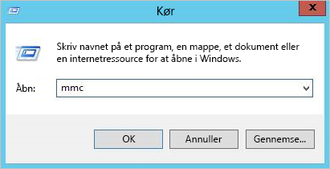
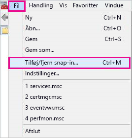

# <a name="use-security-assertion-markup-language-saml-for-sso-from-power-bi-to-on-premises-data-sources"></a>Brug SAML (Security Assertion Markup Language) til SSO fra Power BI til datakilder i det lokale miljø

Aktivering af SSO gør det nemt for Power BI-rapporter og -dashboards at opdatere data fra kilder i det lokale miljø, samtidig med at de tilladelser på brugerniveau, der er konfigureret for disse kilder, overholdes. Brug [SAML (Security Assertion Markup Language)](https://www.onelogin.com/pages/saml) til at aktivere problemfri forbindelse via enkeltlogon. 

## <a name="supported-data-sources"></a>Understøttede datakilder

Vi understøtter i øjeblikket SAP HANA med SAML. Få flere oplysninger om konfiguration af enkeltlogon til SAP HANA ved hjælp af SAML i [SAML SSO på BI-platformen til HANA](https://blogs.sap.com/2020/03/22/sap-bi-platform-saml-sso-to-hana-database/).

Vi understøtter flere datakilder med [Kerberos](service-gateway-sso-kerberos.md) (herunder SAP HANA).

I forbindelse SAP HANA anbefales det, at du aktiverer kryptering, før du etablerer en SAML SSO-forbindelse. Du aktiverer kryptering ved at konfigurere HANA-serveren til at acceptere krypterede forbindelser og ved at konfigurere gatewayen til at bruge kryptering til at kommunikere med din HANA-server. Da HANA ODBC-driveren ikke krypterer SAML-udsagn som standard, sendes det signerede SAML-udsagn fra gatewayen til HANA-serveren som *godkendt* og er sårbar over for opfangelse og genbrug af tredjeparter.

> [!IMPORTANT]
> Da [SAP ikke længere understøtter OpenSSL](https://help.sap.com/viewer/b3ee5778bc2e4a089d3299b82ec762a7/2.0.05/en-US/de15ffb1bb5710148386ffdfd857482a.html), er Microsoft også ophørt med at understøtte det. Eksisterende forbindelser vil fortsat fungere, men du kan ikke oprette nye forbindelser fra og med februar 2021. Fremadrettet skal du bruge CommonCryptoLib i stedet.

## <a name="configuring-the-gateway-and-data-source"></a>Konfiguration af gatewayen og datakilden

Hvis du vil bruge SAML, skal du etablere et tillidsforhold mellem de HANA-servere, du vil aktivere SSO for, og gatewayen. I dette scenarie fungerer gatewayen som SAML-identitetsudbyder (IdP). Der er forskellige måder at etablere denne relation på. Det anbefales af SAP, at du bruger Kryptografisk SAP-bibliotek (også kendt som CommonCryptoLib eller sapcrypto) til at fuldføre konfigurationstrinnene, hvori tillidsforholdet etableres. Du finder flere oplysninger i den officielle dokumentation til SAP.

Følgende trin indeholder en beskrivelse af, hvordan du etablerer et tillidsforhold mellem en HANA-server og gatewayens IdP ved at signere x509-certifikatet for gatewayens IdP ved hjælp af et rodnøglecenter, som HANA-serveren har tillid til. 

### <a name="create-the-certificates"></a>Opret certifikaterne

Udfør følgende trin for at oprette certifikaterne:

1. Opret en tom mappe på den enhed, der kører SAP HANA, for at gemme dine certifikater, og naviger derefter til denne mappe.
2. Opret rodcertifikaterne ved at køre følgende kommando:

   ```
   openssl req -new -x509 -newkey rsa:2048 -days 3650 -sha256 -keyout CA_Key.pem -out CA_Cert.pem -extensions v3_ca'''
   ```

    Du skal huske adgangsudtrykket for at kunne bruge dette certifikat til at signere andre certifikater.
    Du bør se, at *CA_Cert.pem* og *CA_Key.pem* bliver oprettet.

   
3. Opret IdP-certifikaterne ved at køre følgende kommando:
 
    ```
    openssl req -newkey rsa:2048 -days 365 -sha256 -keyout IdP_Key.pem -out IdP_Req.pem -nodes
    ```
    Du bør se, at *IdP_Key.pem* og *IdP_Req.pem* bliver oprettet.

4. Signer IdP-certifikaterne med rodcertifikaterne:

    ```
    openssl x509 -req -days 365 -in IdP_Req.pem -sha256 -extensions usr_cert -CA CA_Cert.pem -CAkey CA_Key.pem -CAcreateserial -out IdP_Cert.pem
    ```
    Du bør se, at *CA_Cert.srl* og *IdP_Cert.pem* bliver oprettet.
    Følgende omhandler kun *IdP_Cert.pem*.    

### <a name="create-saml-identity-provider-certificate-mapping"></a>Opret tilknytning af certifikat for SAML-identitetsudbyder

Opret tilknytning af certifikat for SAML-identitetsudbyder ved hjælp af følgende trin.

1. I **SAP HANA Studio** skal du højreklikke på navnet på din SAP HANA-server og derefter navigere til **Sikkerhed > Åbn sikkerhedskonsol > SAML-identitetsudbyder**.
2. Hvis Kryptografisk SAP-bibliotek ikke er valgt, skal du vælge det. Brug *ikke* Kryptografisk OpenSSL-bibliotek (valget til venstre på følgende billede). Det frarådes af SAP.

    

3. Importér det signerede *IdP_Cert.pem* ved at klikke på den blå importknap, som vist på følgende billede.

    

Husk at give din *identitetsudbyder* et navn.

### <a name="import-and-create-the-signed-certificates-in-hana"></a>Importér og opret de signerede certifikater i HANA

Derefter skal du importere og oprette de signerede certifikater i HANA. Følg disse trin:

1. Kør følgende forespørgsel i **HANA Studio**:

    ```
    CREATE CERTIFICATE FROM '<idp_cert_pem_certificate_content>'
    ```
    
    Her er et eksempel:

    ```
    CREATE CERTIFICATE FROM
    '-----BEGIN CERTIFICATE-----
    MIIDyDCCArCgA...veryLongString...0WkC5deeawTyMje6
    -----END CERTIFICATE-----
    '
    ```

2. Hvis der ikke er nogen PSE med SAML Purpose, skal du oprette en ved at køre følgende forespørgsel i **HANA Studio**:
    
    ```
    CREATE PSE SAMLCOLLECTION;<br>set pse SAMLCOLLECTION purpose SAML;<br>
    ```

3. Føj det netop oprettede signerede certifikat til PSE ved hjælp af følgende kommando:

    ```
    alter pse SAMLCOLLECTION add CERTIFICATE <certificate_id>;
    ```

    Eksempel:
    ```
    alter pse SAMLCOLLECTION add CERTIFICATE 1978320;
    ```

    Du kan kontrollere listen over oprettede certifikater ved hjælp af følgende forespørgsel:
    ```
    select * from PUBLIC"."CERTIFICATES"
    ```

    Certifikatet er nu installeret korrekt. Du kan køre følgende forespørgsel for at bekræfte:
    ```
    select * from "PUBLIC"."PSE_CERTIFICATES"
    ```

### <a name="map-the-user"></a>Tilknyt brugeren

Følg disse trin for at tilknytte brugeren:

1. I **SAP HANA Studio** skal du vælge mappen **Sikkerhed**:

    

2. Udvid **Brugere**, og vælg derefter den bruger, du vil knytte din Power BI-bruger til.

3. Markér afkrydsningsfeltet **SAML**, og vælg derefter **Konfigurer**, der vises fremhævet på følgende billede.

    

4. Vælg den identitetsudbyder, du oprettede under afsnittet [Opret tilknytning af certifikat for SAML-identitetsudbyder](#create-saml-identity-provider-certificate-mapping) tidligere i denne artikel. Angiv Power BI-brugerens UPN (typisk den mailadresse, som brugeren logger på Power BI med) som Ekstern identitet, og vælg derefter **Tilføj**.  På følgende billede vises disse indstillinger og valg.

    

    Hvis du har konfigureret din gateway til at bruge konfigurationsindstillingen *ADUserNameReplacementProperty*, skal du angive den værdi, der skal erstatte Power BI-brugerens oprindelige UPN. Hvis du f.eks. angiver *ADUserNameReplacementProperty* til *SAMAccountName*, skal du angive brugerens *SAMAccountName*.

### <a name="configure-the-gateway"></a>Konfigurer gatewayen

Nu, hvor du har konfigureret certifikatet og identiteten for gatewayen, skal du konvertere certifikatet til et pfx-format og konfigurere gatewayen til at bruge certifikatet ved hjælp af følgende trin.

1. Konvertér certifikatet til pfx-formatet ved at køre følgende kommando. Med denne kommando navngives den resulterende .pfx-fil samlcert.pfx og angiver adgangskoden til *root*:

    ```
    openssl pkcs12 -export -out samltest.pfx -in IdP_Cert.pem -inkey IdP_Key.pem -passin pass:root -passout pass:root
    ```

2. Kopiér pfx-filen til gatewaycomputeren:

    1. Dobbeltklik på *samltest.pfx*, og vælg derefter **Lokal maskine** > **Næste**.

    2. Angiv adgangskoden, og vælg derefter **Næste**.

    3. Vælg **Placer alle certifikater i følgende lager,** og vælg derefter **Gennemse** > **Personlig** > **OK**.

    4. Vælg **Næste** og derefter **Udfør**.

       

3. Giv kontoen for gatewaytjenesten adgang til den private nøgle for certifikatet ved hjælp af følgende trin:

    1. Kør Microsoft Management Console (MMC) på gatewaycomputeren.

        

    2. Under **Filer** skal du vælge **Tilføj/fjern snap-in**.

        

    3. Vælg **Certifikater** > **Tilføj**, og vælg derefter **Computerkonto** > **Næste**.

    4. Vælg **Lokal computer** > **Afslut** > **OK**.

    5. Udvid **Certifikater** > **Personlig** > **Certifikater**, og find certifikatet.

    6. Højreklik på certifikatet, og naviger til **Alle opgaver** &gt; **Administrer private nøgler**.

        

    1. Føj kontoen for gatewaytjenesten til listen. Kontoen er som standard **NT SERVICE\PBIEgwService**. Du kan finde ud af, hvilken konto der kører gatewaytjenesten ved at køre **services.msc** og finde **Datagatewaytjeneste i det lokale miljø**.

        

Følg til sidst disse trin for at føje certifikataftrykket til konfigurationen af gatewayen:

1. Kør følgende PowerShell-kommando for at angive certifikaterne på din computer:

    ```powershell
    Get-ChildItem -path cert:\LocalMachine\My
    ```

2. Kopiér aftrykket for det certifikat, du har oprettet.

3. Naviger til gatewaymappen, der som standard ligger her *C:\Program Files\On-premises data gateway*.

4. Åbn *PowerBI.DataMovement.Pipeline.GatewayCore.dll.config*, og find afsnittet *SapHanaSAMLCertThumbprint*. Indsæt det aftryk, du har kopieret.

5. Genstart gatewaytjenesten.

## <a name="running-a-power-bi-report"></a>Kørsel af en Power BI-rapport

Nu kan du bruge siden **Administrer gateway** i Power BI til at konfigurere SAP HANA-datakilden. Aktivér SSO via SAML under **Avancerede indstillinger**. Når du gør det, kan du publicere rapporter og datasæt med binding til den pågældende datakilde.

   

## <a name="troubleshooting"></a>Fejlfinding

Når du har konfigureret SAML-baseret SSO, får du muligvis vist følgende fejl på Power BI-portalen: *De angivne legitimationsoplysninger kan ikke bruges til SapHana-kilden.* Denne fejl tyder på, at SAML legitimationsoplysningerne blev afvist af SAP HANA.

Godkendelsessporinger på serversiden indeholder detaljerede oplysninger om fejlfinding af problemer med legitimationsoplysninger på SAP HANA. Følg disse trin for at konfigurere sporing for din SAP HANA-server:

1. Slå godkendelsessporing til på SAP HANA-serveren ved at køre følgende forespørgsel:

    ```
    ALTER SYSTEM ALTER CONFIGURATION ('indexserver.ini', 'SYSTEM') set ('trace', 'authentication') = 'debug' with reconfigure 
    ```

1. Genskab problemet.

1. Åbn administrationskonsollen i HANA Studio, og vælg fanen **Diagnosticeringsfiler**.

1. Åbn den nyeste indeksserversporing, og søg efter *SAMLAuthenticator.cpp*.

    Du bør finde en detaljeret fejlmeddelelse, der angiver rodårsagen, f.eks.:

    ```
    [3957]{-1}[-1/-1] 2018-09-11 21:40:23.815797 d Authentication   SAMLAuthenticator.cpp(00091) : Element '{urn:oasis:names:tc:SAML:2.0:assertion}Assertion', attribute 'ID': '123123123123123' is not a valid value of the atomic type 'xs:ID'.
    [3957]{-1}[-1/-1] 2018-09-11 21:40:23.815914 i Authentication   SAMLAuthenticator.cpp(00403) : No valid SAML Assertion or SAML Protocol detected
    ```

1. Når fejlfindingen er fuldført, kan du slå godkendelsessporingen fra ved at køre følgende forespørgsel:

    ```
    ALTER SYSTEM ALTER CONFIGURATION ('indexserver.ini', 'SYSTEM') UNSET ('trace', 'authentication');
    ```

## <a name="next-steps"></a>Næste trin

Du kan finde flere oplysninger om datagatewayen i det lokale miljø og DirectQuery i følgende ressourcer:

* [Hvad er en datagateway i det lokale miljø?](/data-integration/gateway/service-gateway-onprem)
* [DirectQuery i Power BI](desktop-directquery-about.md)
* [Datakilder, der understøttes af DirectQuery](power-bi-data-sources.md)
* [DirectQuery og SAP BW](desktop-directquery-sap-bw.md)
* [DirectQuery og SAP HANA](desktop-directquery-sap-hana.md)
