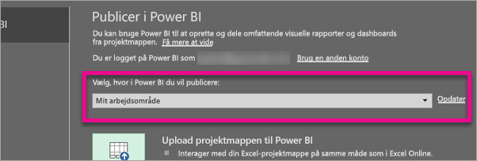
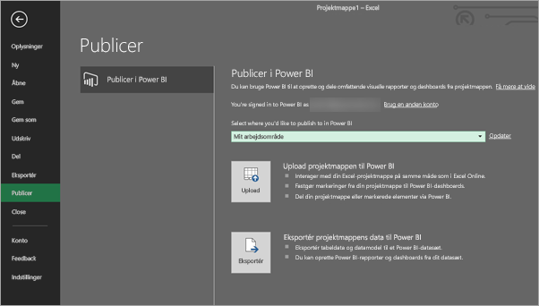
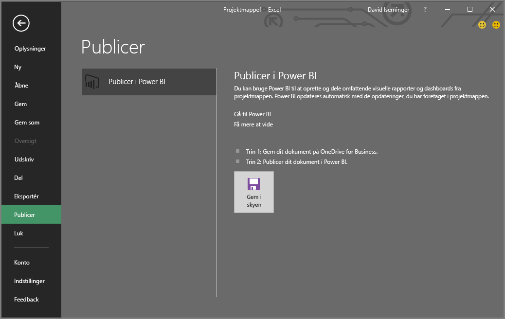

# Publicer i Power BI fra Microsoft Excel
Med Microsoft Excel 2016 og nyere kan du publicere dine Excel-projektmapper direkte i dit [Power BI](https://powerbi.microsoft.com)-arbejdsområde, hvor du kan oprette meget interaktive rapporter og dashboards, der er baseret på data i din projektmappe. Derefter kan du dele din indsigt med andre i organisationen.

Når du publicerer en projektmappe til Power BI, er der et par ting, du skal overveje:

* Den konto, du bruger til at logge på Office, OneDrive for Business (hvis du bruger projektmapper, som er gemt der) og Power BI, skal være den samme.
* Du kan ikke publicere en tom projektmappe eller en projektmappe, som ikke har noget indhold, der understøttes af Power BI.
* Du kan ikke publicere krypterede eller adgangskodebeskyttede projektmapper eller projektmapper med Information Protection Management.
* Publicering på Power BI kræver, at moderne godkendelse er aktiveret (standard). Hvis den er deaktiveret, er indstillingen Publicer ikke tilgængelig i menuen Filer.

## Publicer din Excel-projektmappe
Hvis du vil publicere din Excel-projektmappe, skal du i Excel vælge **Filre** > **Publicer** og vælge enten **Overfør** eller **Eksportér**.

Hvis du vælger **Overfør** for at overføre din projektmappe til Power BI, kan du interagere med projektmappen på samme måde, som du interagerer med Excel Online. Du kan også fastgøre valg fra din projektmappe til Power BI-dashboards og dele projektmappen eller udvalgte elementer via Power BI.

Hvis du vælger **Eksportér**, kan du eksportere tabeldata og dens datamodel til et Power BI-datasæt, som du derefter kan bruge til at oprette Power BI-rapporter og -dashboards.

### Publicering af lokale filer
Excel understøtter publicering af lokale Excel-filer. De behøver ikke at blive gemt på OneDrive for Business eller SharePoint Online.

> [!IMPORTANT]
> Du kan kun publicere lokale filer, hvis du bruger Excel 2016 (eller nyere) sammen med et Microsoft 365-abonnement. Separate Excel 2016-installationer kan publiceres til Power BI, men kun når projektmappen gemmes i OneDrive for Business eller SharePoint Online.
> 

Når du vælger **Publicer**, kan du vælge det arbejdsområde, du vil publicere til. Hvis din Excel-fil er placeret på OneDrive for Business, kan du kun publicere til dit *Mit arbejdsområde*. Hvis din Excel-fil er placeret på et lokalt drev, kan du publicere til *Mit arbejdsområde* eller et delt arbejdsområde, som du har adgang til.

To muligheder for at få din projektmappe ind i Power BI.

Når det er publiceret, importeres det projektmappeindhold, du publicerer, i Power BI, adskilt fra den lokale fil. Hvis du vil opdatere filen i Power BI, skal du publicere den opdaterede version igen, eller du kan opdatere dataene ved at konfigurere en planlagt opdatering i projektmappen eller i datasættet i Power BI.

### Udgivelse fra en separat Excel-installation
Når du udgiver fra en separat Excel-installation, skal projektmappen gemmes i OneDrive for Business. Vælg **Gem i skyen**, og vælg en placering i OneDrive for Business.

Når projektmappen er gemt på OneDrive for Business, har du to muligheder for at få din projektmappe ind i Power BI, **Upload** eller **Eksportér**, når du vælger **Publicer**:

#### Upload projektmappen til Power BI
Når du vælger **Overfør**, vises din projektmappe i Power BI på samme måde, som den ville blive vist i Excel Online. Men i modsætning til Excel Online får du mulighed for at fastgøre elementer fra dine regneark i dine dashboards.

Du kan ikke redigere din projektmappe i Power BI. Men hvis du har brug at foretage ændringer, kan du klikke på **Rediger** og derefter redigere din projektmappe i Excel Online eller åbne den i Excel på din computer. Alle ændringer, du foretager, gemmes i projektmappen på OneDrive for Business.

Der oprettes ingen datasæt i Power BI, når du vælger **Overfør**. Din projektmappe vises i Rapporter i arbejdsområdets navigationsrude. Projektmapper, der er uploadet til Power BI, har et særligt Excel-ikon, der identificerer dem som Excel-projektmapper, som er blevet uploadet.

Vælg indstilling **Overfør**, hvis du kun har data i regneark, eller hvis du har pivottabeller og diagrammer, du vil se i Power BI.

At bruge Overfør fra Publicer i Power BI i Excel er næsten det samme som at bruge **Hent data > Filer > OneDrive for Business > Opret forbindelse til, administrer og se Excel-data i Power BI** fra Power BI i din browser.

#### Eksportér projektmappens data til Power BI
Når du vælger **Eksporter**, eksporteres alle understøttede data i tabeller og/eller en datamodel til et nyt datasæt i Power BI. Eventuelle Power View-ark i projektmappe, oprettes igen i Power BI som rapporter.

Du kan fortsætte med at redigere din projektmappe. Når dine ændringer er gemt, synkroniseres de med datasættet i Power BI, som regel inden for cirka en time. Hvis du har brug for flere øjeblikkelige opdateringer, kan du vælge **Publicer** igen fra Excel, og dine ændringer eksporteres øjeblikkeligt. Eventuelle visualiseringer i rapporter og dashboards opdateres også.

Vælg indstillingen **Publicer**, hvis du har brugt Hent og transformér data eller Power Pivot-funktioner til at indlæse data i en datamodel, eller hvis din projektmappe indeholder Power View-ark med visualiseringer, som du vil have vist i Power BI.

At bruge **Eksportér** fra Publicer i Power BI i Excel er næsten det samme som at bruge **Hent data > Filer > OneDrive for Business > Eksportér Excel-data til Power BI** fra Power BI i din browser.

## Publicering
Når du vælger en af indstillingerne, logger Excel på Power BI med din nuværende konto og publicerer derefter din projektmappe i dit Power BI-arbejdsområde. Du kan overvåge statuslinjen i Excel for at se, hvordan publiceringsprocessen skrider frem.

Når du er færdig, kan du gå til Power BI direkte fra Excel.

## Næste trin
[Excel-data i Power BI](service-excel-workbook-files.md)  
Har du flere spørgsmål? [Prøv at spørge Power BI-community'et](https://community.powerbi.com/)

