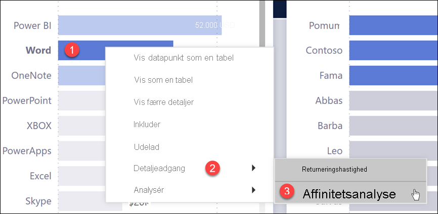
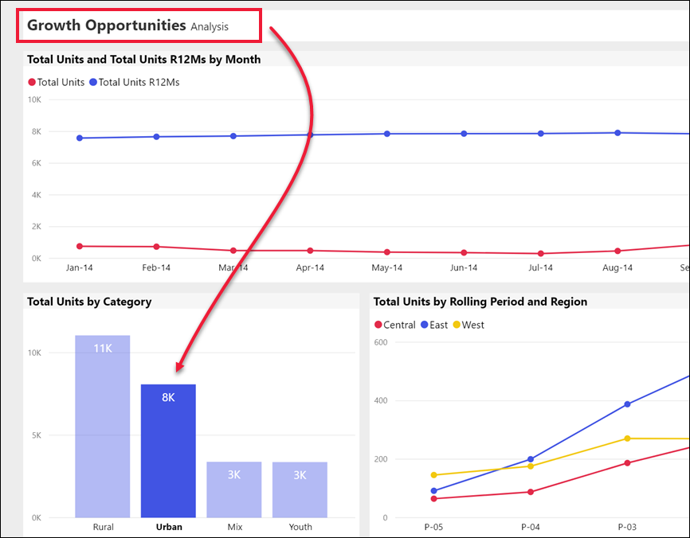
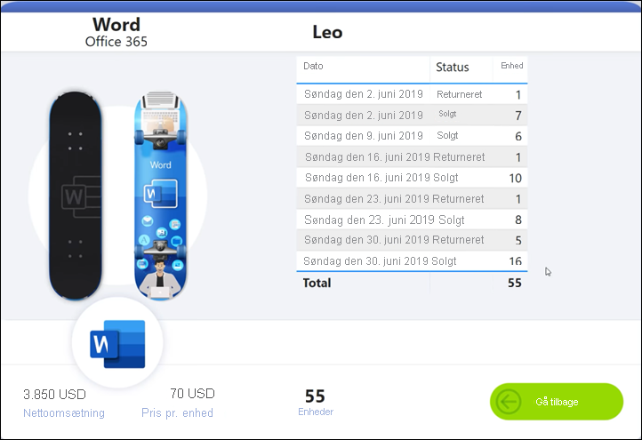
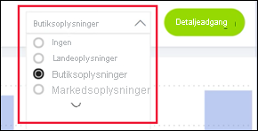
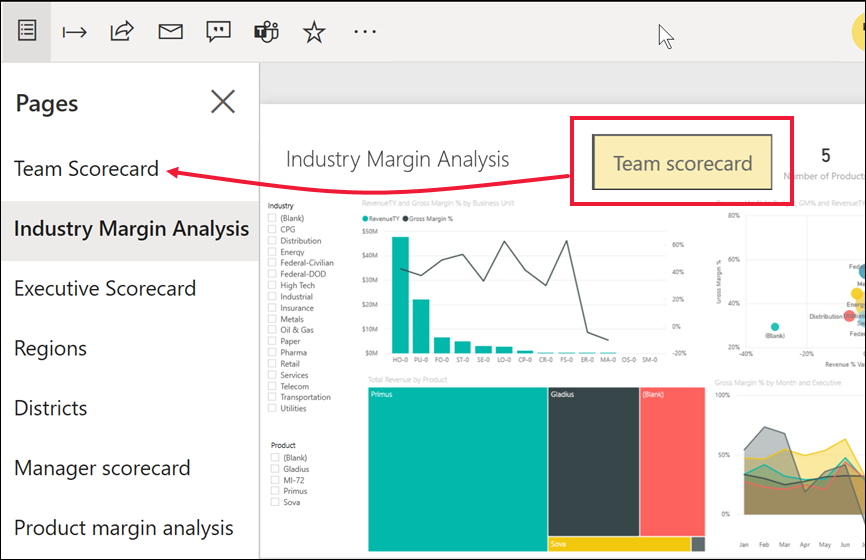

# Knapper i Power BI-tjenesten
I de rapporter, du modtager fra kolleger, har du måske lagt mærke til knapperne og spekuleret på, hvordan du bruger dem. Nogle har ord, nogle har pile, andre har grafik og nogle har endda rullemenuer. I denne artikel gennemgår vi, hvordan du genkender en knap og finder ud af, hvad du kan foretage dig med den.

## Sådan genkender du en knap
Knapper kan minde om figurer, billeder eller ikoner på en rapportside. Men hvis der opstår en handling, når du vælger (klikker) på den, er det sandsynligvis en knap.

## Knaptyper
Rapportforfattere føjer knapper til rapporter, så du kan få hjælp til navigation og udforskning. Kun nogle af knaptyperne er: tilbage, bogmærke, pile, Spørgsmål og svar, hjælp og tom. 

### Tilbage-knapper 
En tilbage-knap kan have et pileikon, og når du vælger den, tager Power BI dig tilbage til den forrige side.  Tilbage-knapper bruges ofte sammen med detaljeadgang. Her er et eksempel på en tilbage-knap, der bruges til detaljeadgang.

1. Brugeren har valgt **Word** i liggende søjlediagram, og der foretages detailudledning til  **Affinitetsanalyse**.

    

2. Når du vælger **Affinitetsanalyse**, åbner Power BI rapportsiden *Affinitetsanalyse* og bruger de valg, der er foretaget på kildesiden, til at filtrere det, der vises på destinationssiden.

    

    Du er nu på rapportsiden **Affinitetsanalyse**, der er filtreret for **Word**. Vælg tilbage-knappen med navnet **Gå tilbage** for at vende tilbage til den forrige side. 

## Bogmærkeknapper
*Rapportdesignere* medtager ofte bogmærker i deres rapporter. Du kan få vist listen over rapportbogmærker ved at vælge **Bogmærker** i øverste højre hjørne. Når en rapportdesigner tilføjer en *bogmærkeknap*, er det blot en anden måde at navigere til den bestemte rapportside, der er knyttet til bogmærket. På siden vises de anvendte filtre og indstillinger, der er hentet af bogmærket. [Få mere at vide om bogmærker i Power BI](end-user-bookmarks.md). 

I dette eksempel har knappen et bogmærkeikon og navnet på bogmærket, *Urban*. 

Når du vælger bogmærkeknappen, kommer du til den placering og de indstillinger, der er defineret for det pågældende bogmærke i Power BI.  I dette tilfælde er bogmærket på rapportsiden *Vækstmuligheder*, og denne side krydsfiltreres efter **Urban**.

## Detaljeadgangsknapper
Der er to måder at få vist detailudledning på i Power BI-tjenesten. Detaljeadgang fører dig til en anden rapportside, og dataene på denne destinationsside præsenteres i henhold til de filtre og valg, du har angivet på kildesiden.

En måde at bruge detaljeadgang i en rapport på er ved at højreklikke på et datapunkt i en visualisering, vælge **Detaljeadgang** og vælge destinationen. Denne metode er beskrevet ovenfor i afsnittet **Tilbage-knappen**. Nogle gange bruger rapportdesignere dog en *detaljeadgangsknap* for at gøre handlingen tydeligere og henlede opmærksomheden på vigtig indsigt.  

Detaljeadgangsknapper kan have mere end én forudsætning. Medmindre du opfylder alle forudsætningerne, fungerer knappen ikke. Lad os tage et kig på et eksempel.

Her er en detaljeadgangsknap, der vil tage os til siden *Butiksoplysninger*. Hvis du holder markøren over knappen, vises et værktøjstip, der gør det muligt at finde ud af, om du skal vælge både en butik og et produkt. Knappen forbliver inaktiv, indtil vi har valgt en af mulighederne.

Nu, hvor vi har valgt et produkt (**Word**) og en butik (**Leo**), skifter knappen farven for at fortælle os, at den nu er aktiv.

Når du vælger detaljeadgangsknappen, kommer du til rapportsiden *Butik*. Siden *Butik* er filtreret efter vores valg af **Word** og **Leo**.

Detaljeadgangsknapper kan også have rullemenuer, der giver dig mulighed for at vælge mellem destinationer. Når du har foretaget dine valg på kilderapportsiden, skal du vælge destinationsrapportsiden for detaljeadgangen. I eksemplet nedenfor ændrer vi vores valg for at få detaljeadgang til rapportsiden *Markedsdetaljer*. 

## Sidenavigation

Sidenavigationsknapper fører dig til en anden side i den samme rapport. Rapportdesignere opretter ofte navigationsknapper for at fortælle en historie eller vejlede dig gennem rapportindsigten. I eksemplet nedenfor har rapportdesigneren tilføjet en knap på hver rapportside, der fører dig tilbage til den første side, oversigtssiden på øverste niveau, i rapporten. Denne sidenavigationsknap er nyttig, fordi der er mange sider i rapporten.

## Spørgsmål og svar-knapper 
Når du vælger en Spørgsmål og svar-knap, åbnes Spørgsmål og svar-stifindervinduet i Power BI. Vinduet Spørgsmål og svar vises øverst på rapportsiden og kan lukkes ved at vælge X. [Få mere at vide om Spørgsmål og svar](end-user-q-and-a.md)

## URL-adresse til websted
Webadresseknapper åbner et nyt browservindue. Rapportdesignere kan tilføje denne type knap som en referencekilde, til at oprette et link til virksomhedens websted eller en hjælpeside eller endda som et link til en anden rapport eller et andet dashboard. I eksemplet nedenfor kan du bruge webadresseknappen til at downloade kildefilen til rapporten. 

Eftersom siden åbnes i et separat vindue, skal du lukke vinduet eller vælge Power BI-fanen for at vende tilbage til Power BI-rapporten.

## Næste trin
[Bogmærker](end-user-bookmarks.md)    
[Zoom ind på detaljeniveauet, zoom ud fra detaljeniveauet](end-user-drill.md)
