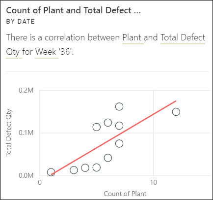
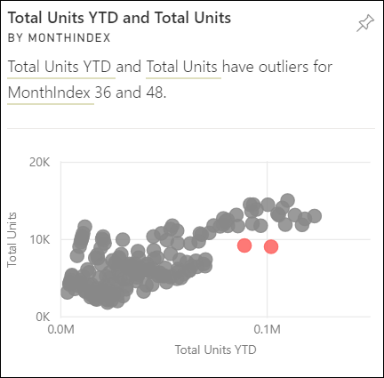
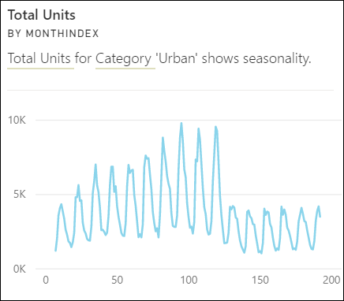
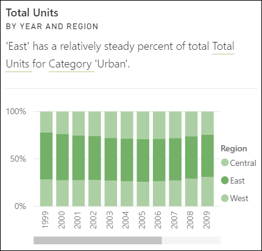

# Indsigtstyper, der understøttes af Power BI

[!INCLUDE[consumer-appliesto-yyny](../includes/consumer-appliesto-yyny.md)]

Du kan bede Power BI om at se nærmere på dine data og finde interessante tendenser og mønstre. Disse tendenser og mønstre præsenteres i form af visualiseringer, der kaldes *indsigter*. 

Se [Power BI-indsigt](end-user-insights.md) for at få mere at vide om, hvordan du bruger indsigter

## Hvordan fungerer indsigter?
Power BI søger hurtigt i forskellige undersæt af dit datasæt. I takt med at Power BI søger, anvendes et sæt avancerede algoritmer for at finde indsigt, der kan være interessant. Power BI- *virksomhedsbrugere* kan køre indsigter på dashboardfelter.

## Terminologi
Power BI bruger statistiske algoritmer til at afdække indsigt. Algoritmerne er angivet og beskrevet i næste afsnit i denne artikel. Før vi går videre med algoritmerne, er der her nogle definitioner for nogle af de ord, som du muligvis ikke kender. 

* **Måling** – en måling er et kvantitativt (numerisk) felt, der kan bruges til at foretage beregninger. Almindelige beregninger er sum, gennemsnit og minimum. Hvis vores virksomhed f.eks. fremstiller og sælger skateboards, kan vores målinger være antallet af skateboards, der er solgt, og den gennemsnitlige indtjening pr. år.  
* **Dimension** – dimensioner er kategoriske data (tekst). En dimension beskriver en person, et objekt, et element, produkter, en placering og et klokkeslæt. I et datasæt er dimensioner en metode til at gruppere *målinger* i nyttige kategorier. For vores skateboard-virksomhed kan nogle dimensioner inkludere at se på salg (en måling) efter model, farve, land eller markedsføringskampagne.   
* **Korrelation** – en korrelation fortæller os, hvordan funktionsmåden for ting er relateret til hinanden.  Hvis deres mønstre for stigning og fald er det samme, er de positivt korreleret. Og hvis deres mønstre er modsatte, er de negativt korreleret. Hvis f.eks. salg af vores røde skateboard stiger, hver gang vi kører en tv-marketingkampagne, er salg af det røde skateboard og tv-kampagnen positivt korreleret.
* **Tidsserie** – en tidsserie er den måde, hvorpå du kan få vist klokkeslæt som efterfølgende datapunkter. Disse datapunkter kan være trinvise, f.eks. sekunder, timer, måneder eller år.  
* **Fortløbende variabel** – en fortløbende variabel kan være en hvilken som helst værdi mellem minimum- og maksimumgrænserne, ellers er den en diskret variabel. Eksempler er temperatur, vægt, alder og tid. Fortløbende variabler kan indeholde brøker eller dele af værdien. Det samlede antal blå skateboards, der er solgt, er en diskret variabel, da vi ikke kan sælge halvdelen af et skateboard.  

## Hvilke typer indsigt kan vi finde?
Dette er de algoritmer, Power BI bruger. 

### Kategori med udenforliggende værdier (top/bund)
Fremhæver tilfælde, hvor en eller to kategorier har meget større værdier end andre kategorier.  

### Skift punkter i en tidsserie
Fremhæver, når der er betydelige ændringer i tendenser i en tidsserie af data.

### Korrelation
Registrerer de tilfælde, hvor flere målinger viser et lignende mønster eller en lignende tendens, når de afbildes i forhold til en kategori eller værdi i datasættet.

### Lav varians
Registrerer de tilfælde, hvor datapunkter for en dimension ikke er langt fra middelværdien, så "variansen" er lav. Lad os antage, at du har målet "salg" og en dimension "område". Når du ser på tværs af områder, kan du se, at der er meget lidt forskel mellem datapunkterne og middelværdien (for datapunkterne). Indsigten udløses, når variansen af salg på tværs af alle områder er lavere end en tærskel. Det vil sige, at når salget er forholdsvis ens på tværs af alle områder.

### Majoritet (overordnede faktorer)
Finder tilfælde, hvor en majoritet af en samlet værdi kan tilskrives en enkelt faktor, når den opdeles på en anden dimension.  

### Udenforliggende værdier
Denne type indsigt bruger en klyngemodel til at finde udenforliggende værdier i ikke-tidsseriedata. Udenforliggende værdier registrerer, når der er bestemte kategorier med værdier, der er væsentligt forskellige fra de andre kategorier.

### Samlede tendenser i tidsserie
Registrerer op- eller nedadgående tendenser i tidsseriedata.

### Sæsonudsving i tidsserie
Finder periodiske mønstre i tidsseriedata, f.eks. ugentlige, månedlige eller årlige sæsonudsving.

### Konstant deling
Fremhæver tilfælde, hvor der er en overordnet-underordnet-korrelation mellem andelen af en underordnet værdi i forhold til den samlede værdi af den overordnede på tværs af en kontinuerlig variabel. Indsigten med den konstante deling gælder for konteksten af en måling, en dimension og en anden dato-/klokkeslætsdimension. Denne indsigt udløses, når en bestemt dimensionsværdi, f.eks. "det østlige område", har en konstant procentdel af det samlede salg på tværs af denne dato-/klokkeslætsdimension.

Indsigten med den konstante deling ligner den lave varians, da de begge relaterer til den manglende varians for en værdi på tværs af tiden. Indsigten med den konstante deling måler dog den manglende varians for **den overordnede procentdel** på tværs af tiden, mens indsigten med lav varians måler den manglende varians for de absolutte målingsværdier på tværs af en dimension.

### Tidsserier med udenforliggende værdier
Registrerer for data på tværs af en tidsserie, når der er specifikke datoer og klokkeslæt med værdier, som er væsentligt anderledes end de andre dato-/klokkeslætsværdier.

## De næste trin
[Power BI-indsigter](end-user-insights.md)

Har du flere spørgsmål? [Prøv at spørge Power BI-community'et](https://community.powerbi.com/)

