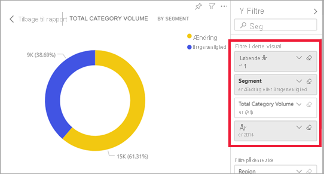

# Sådan krydsfiltrerer visualiseringer hinanden i en Power BI-rapport

[!INCLUDE[consumer-appliesto-yyny](../includes/consumer-appliesto-yyny.md)]

En af de fantastiske funktioner i Power BI er den måde, som alle visualiseringer på rapportside er forbundet på. Hvis du vælger et datapunkt i en af visualiseringerne, ændres alle andre visualiseringer med disse data på siden på baggrund af dette valg. 

## Sådan interagerer visualiseringer med hinanden

Hvis du vælger et datapunkt i én visualisering på en rapportside, udføres der som standard tværgående filtrering og fremhævning af de andre visualiseringer på siden. Lige præcis hvordan visualiseringerne på en side interagerer på, angives af *designeren* af rapporten. *Designere* har mulighed for at slå interaktion mellem visualiseringer til og fra og ændre standardfunktionsmåden for tværgående filtrering, tværgående fremhævning og [analysering](end-user-drill.md). 

Hvis du ikke er stødt på hierarkier eller detailudledning endnu, kan du få mere at vide om disse funktioner ved at læse [detailudledning i Power BI](end-user-drill.md). 

### Krydsfiltrering og krydsfremhævning

Tværgående filtrering og fremhævning kan være nyttigt for at identificere, hvordan en værdi i dine data bidrager til en anden. Begreberne *tværgående filter* og *tværgående fremhævning* bruges til at skelne mellem den funktionsmåde, der er beskrevet her, og hvad der sker, når du bruger ruden **Filtre** til at filtrere og fremhæve visualiseringer.  

Lad os definere disser begreber, i takt med at vi kigger på rapportsiderne nedenfor. Kransediagrammet "Samlet kategorivolumen efter segment" har to værdier: "Moderation" og "Bekvemmelighed". 

1. Lad os se, hvad der sker, når vi vælger **Moderation**.

    

2. Med **krydsfiltrering** fjernes data, der ikke er gældende. Hvis du vælger **Moderation** i kransediagrammet, så krydsfiltreres kurvediagrammet. Der vises nu kun datapunkter for segmentet Moderation i kurvediagrammet. 

3. Med **krydsfremhævning** bevares alle oprindelige datapunkter, men den del, der ikke gælder for dit valg, nedtones. Hvis du vælger **Moderation** i kransediagrammet, så krydsfremhæves søjlediagrammet. Alle data, der gælder for segmentet Bekvemmelighed, nedtones i søjlediagrammet, og alle data, der gælder for segmentet Moderation, fremhæves. 

## Overvejelser og fejlfinding
- Hvis din rapport har en visualisering, der understøtter [detailudledning](end-user-drill.md), har det som standard ingen indvirkning på andre visualiseringer på rapportsiden, hvis du foretager detailudledning i én visualisering. Men *rapportdesigneren* kan ændre denne funktionsmåde, så kontrollér de visualiseringer, der kan zoomes i, for at se, **om zooming filtrerer andre visualiseringer** er blevet aktiveret af *rapportdesigneren*.
    
- Filtre på visualiseringsniveau bevares, når andre visualiseringer på rapportsiden krydsfiltreres og krydsfremhæves. Så hvis du eller rapportdesigneren har anvendt filtre på visualiseringsniveau i Visualisering A, og du bruger Visualisering A til at interagere med Visualisering B, så anvendes filtrene på visualiseringsniveau fra Visualisering A på Visualisering B.

    

## Næste trin
[Sådan bruger du rapportfiltre](../consumer/end-user-report-filter.md)

[Om filtrering og fremhævning](end-user-report-filter.md).
