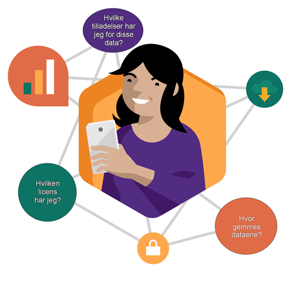
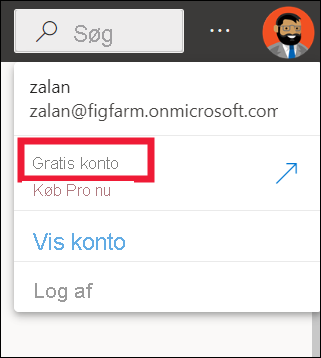
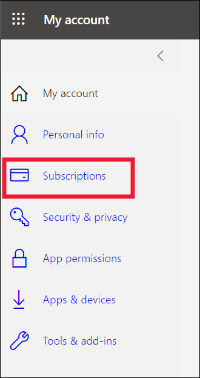
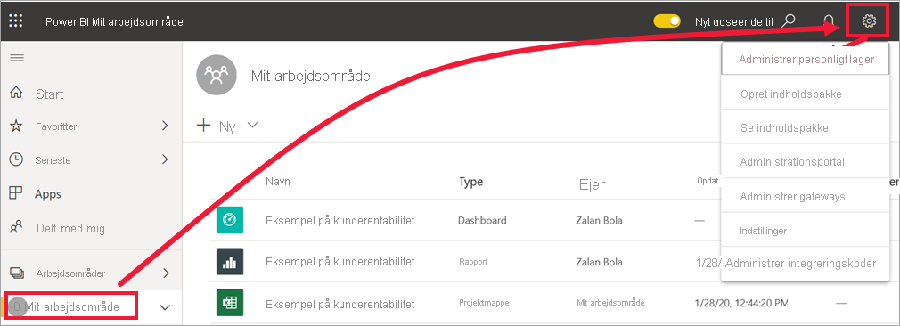
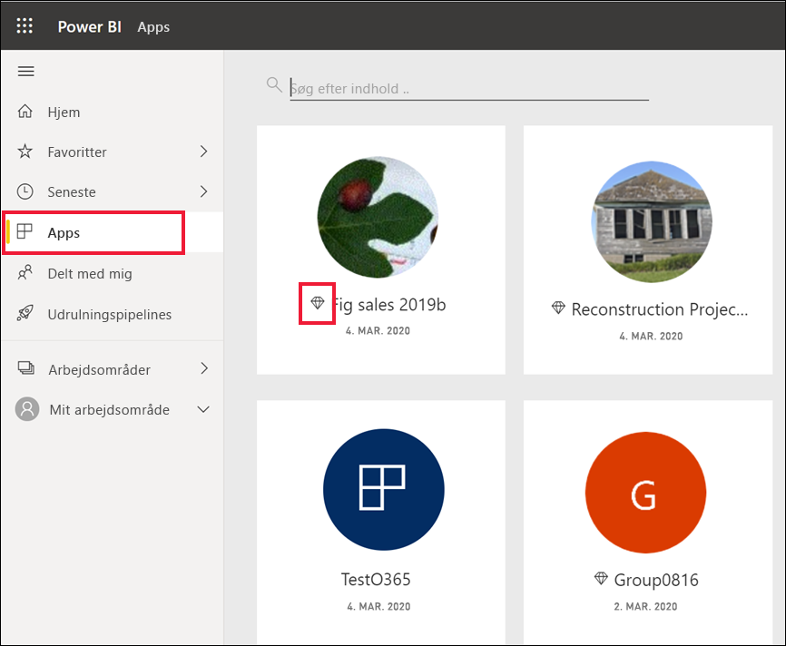

# Licenser og abonnementer til *forretningsbrugere*

[!INCLUDE[consumer-appliesto-ynnn](../includes/consumer-appliesto-ynnn.md)]

Som [*forretningsbruger*](end-user-consumer.md) kan du bruge Power BI-tjenesten til at udforske rapporter og dashboards, så du kan træffe forretningsbeslutninger baseret på data. Hvis du har brugt Power BI i et stykke tid eller har chattet med dine *designerkolleger*, har du sandsynligvis opdaget, at nogle funktioner kun fungerer, hvis du har en bestemt licens- eller abonnementstype eller bestemte tilladelser.

Dét, du kan udføre i Power BI-tjenesten, afhænger af tre ting:
-    den licens- og abonnementstype, du bruger,
-    hvor indholdet gemmes, og
-    de roller og tilladelser, du har fået tildelt.

Denne artikel indeholder en beskrivelse af funktionerne for hver licenstype, og hvordan det sted, *hvor indholdet gemmes*, kan påvirke, *hvad du kan udføre med det*. Du får også mere at vide om, hvordan du kan slå din licens og dit abonnement op og finde ud af, hvor dit indhold er gemt. Du kan finde flere oplysninger om roller og tilladelser under [roller i arbejdsområder](end-user-workspaces.md).

## Licenser

Hver bruger af Power BI-tjeneste har enten en *gratis* licens, en *Pro* -licens, en Premium licenser pr. *bruger *-* licens. Hvis du er *erhvervsbruger* i Power BI, bruger du sandsynligvis en gratis licens, der administreres af din Power BI-administrator.

Det er muligt at have mere end én licens på samme tid.  Tjenesten giver dig altid den funktionalitet, der svarer til licensen med flest tilladelser, som du har i øjeblikket.

## Power BI Premium kapacitets abonnement

Premium er et organisations *abonnement* , der giver dig en anden måde at gemme indhold på – i en virtuel beholder, der kaldes en *kapacitet*. Med Premium-kapacitet kan alle, der har tilladelser, uanset om de er i eller uden for din organisation, få vist indhold, der er gemt i denne Premium-kapacitet, uden at købe individuelle Power BI Pro eller Premium licenser pr. bruger. 

Premium-kapacitet giver mulighed for omfattende distribution af indhold via professionelle brugere uden krav om Pro-licenser til de modtagere, der får vist indholdet. Den person, der opretter indholdet i Premium-kapaciteten, bruger en Pro-licens til at oprette forbindelse til datakilder, modeldata og oprette rapporter og dashboards, der gemmes i et arbejdsområde i Premium-kapacitet. Brugere uden en Pro-licens kan stadig få adgang til et arbejdsområde, der er i en Power BI Premium-kapacitet, så længe de har en [rolle i det pågældende arbejdsområde](end-user-workspaces.md). Hvis arbejdsområdets ejer opretter en app, der er baseret på indhold i det pågældende arbejdsområde, kan brugere uden en Pro-licens stadig få vist den pågældende app i Premium-kapacitet, så længe de har fået tilladelser til den pågældende app. 

I disse arbejdsområder tildeler designere roller, f.eks. **Seer**, **Bidragyder**, **Medlem** og **Administrator**. Disse roller bestemmer, i hvor høj grad kollegaer kan interagere med indholdet. Du kan finde flere oplysninger under [tilladelser og roller i arbejdsområder](end-user-workspaces.md). 

Når en designer opretter og udgiver en app, giver de adgang til hele organisationer eller enkeltpersoner. Det afhænger af, hvilket omfang du kan interagere med appens indhold, afhængigt af de specifikke adgangstilladelser, der gives til dig. Du kan f. eks. få adgang til at få vist appen, oprette forbindelse til de underliggende datasæt, oprette kopier af rapporter eller dele indholdet.

Du kan finde flere oplysninger om Premium-kapacitet under [Hvad er Microsoft Power BI Premium?](../admin/service-premium-what-is.md)

## Find ud af, hvilke licenser du har
Vælg dit profilbillede for at få vist kontooplysninger. Zalan bruger en gratis licens. Andre typer licenser er: **Pro** og **Premium pr. bruger**. 

Hvis du vil have vist flere oplysninger om din konto, skal du vælge **Vis konto**. 

<!-- [Your Microsoft **My account** page](https://portal.office.com/account) opens in a new browser tab.  To see what licenses are assigned to you.  Select the tab for  **Subscriptions**.

This first user, Pradtanna, has Office 365 E5, which includes a Power BI Pro license.

This second user, Zalan, has a Power BI free license. 

 

## Find out if you have access to Premium capacity

Next, check to see if you're part of an organization that has Premium capacity. Either of the users above, Pro or free, could belong to an organization that has Premium capacity.  Let's check for our second user, Zalan.  

We can determine whether Zalan's organization has Premium capacity by looking up the amount of storage available. 

- In the Power BI service, select **My workspace** and then select the cog icon from the upper right corner. Choose **Manage personal storage**.

    

    If you see more than 10 GB, then you're a member of an organization that has a Premium subscription. The image below shows that Zalan's organization has up to 100 GB of storage. Zalan, personally, doesn't own 100GB as indicated by the heading **Owned by us**.  

    

    Notice that a Pro user has already shared a workspace with Zalan. The diamond icon shows that this workspace is stored in Premium capacity. 

    If you see any amount of storage, the words **Pro user** next to your name, and the heading **Owned by me**, then you have a Premium per-user license.  

    -->

## Identificer indhold, der hostes i en Premium-kapacitet

Der er et par måder til at identificere indhold, der er gemt i Premium-kapacitet. På en måde kan du søge efter apps og app-arbejdsområder med et diamant ikon. Romben indikerer, at indholder er gemt i en Premium-kapacitet. 

På billedet nedenfor er tre af disse apps gemt i en Premium-kapacitet.

Så længe *designeren* placerer arbejdsområdet i en Premium-kapacitet, kan du som bruger med en gratis licens få vist delt indhold, samarbejde med kolleger, arbejde med appdashboards og -rapporter og meget mere **i dette arbejdsområde**. Omfanget af dine tilladelser angives af din Power BI-administrator og af indholdsdesigneren.

## Samling af det hele

Der er mange forskellige måder, hvorpå organisationer kan organisere deres Power BI abonnementer og licenser. Fra et *erhvervsbruger* perspektiv er et af de mest almindelige scenarier, når en organisation køber et Premium-abonnement. administratoren tildeler Pro-licenser til en lille gruppe af brugere, og alle andre brugere arbejder med gratis licenser. Normalt tildeler administratoren Pro-licenserne til de medarbejdere, der vil oprette og dele indhold. Pro-brugerne opretter [arbejdsområder](end-user-workspaces.md) og føjer indhold (dashboards, rapporter, datasæt, apps) til disse arbejdsområder. Hvis du vil give gratis brugere mulighed for at samarbejde i disse arbejdsområder, tildeler administrator-eller Pro-brugeren derefter arbejdsområderne til en *Premium-kapacitet*.  

|Licenstype  |Ikke i Premium-kapacitet | Premium-kapacitet  |
|---------|---------|---------|
|**Gratis**     |  Brug som personlig Sandbox, hvor du selv opretter indhold og interagerer med dette indhold. En gratislicens er en god måde at prøve Power BI-tjenesten på. Du kan ikke bruge indhold fra andre eller dele dit indhold med andre 1     |   Mulighed for at interagere med indhold, der er tildelt en Premium-kapacitet og delt med dig. Gratis, Premium pr. bruger og Pro-brugere kan samarbejde uden at kræve, at de gratis brugere har Pro-konti.      |
|**Pro**     |  Samarbejd med Premium-brugere pr. bruger og Pro ved at oprette og dele indhold.        |  Samarbejd med gratis, Premium pr. bruger og Pro-brugere ved at oprette og dele indhold.       |

1 Se [Overvejelser og fejlfinding](#considerations-and-troubleshooting).

I diagrammet nedenfor repræsenterer venstre side de Pro-brugere, der opretter og deler indhold i apparbejdsområder.

- Der blev ikke oprettet **et arbejdsområde** i en Premium-kapacitet.

- **Arbejdsområdet B** blev oprettet og gemt i Premium-kapacitet. Dette arbejdsområde har et rombeikon.  

    

Power BI Pro-*designeren* kan dele og samarbejde med andre Pro-brugere i et hvilket som helst af arbejdsområderne. Men den eneste måde, at Power BI Pro-brugeren kan dele og samarbejde med brugere af den gratis version på, er ved hjælp af Arbejdsområde B, som er i en Premium-kapacitet.  I arbejdsområdet tildeler designeren roller til samarbejdspartnerne. Din rolle bestemmer, hvilke handlinger du kan udføre i arbejdsområdet. *Forretningsbrugere* i Power BI får som regel tildelt rollen *Læser*. Du kan finde flere oplysninger om roller i [Arbejdsområder til Power BI-forretningsbrugere](end-user-workspaces.md).

## Overvejelser og fejlfinding

- Det er muligt at have mere end én Power BI-licens. Power BI-tjenesten giver dig altid den funktionalitet, der svarer til den bedste licens, som du har i øjeblikket. Hvis du f.eks. både har en Pro-licens og en gratis licens, bruger Power BI-tjenesten Pro-licensen.

- Hvis du vil oprette og dele indhold (dashboards, rapporter, apps) eller åbne indhold, som en anden har delt med dig, skal du have en Pro-brugerlicens eller Premium pr. brugerlicens. Du kan tilmelde dig en gratis 60-dages individuel prøveversion af Power BI Pro. Vælg den opgraderingsdialogboks, der vises i Power BI-tjenesten, når du forsøger at bruge en Pro-funktion.

    

  Når den 60-dages prøveversion udløber, ændres din licens tilbage til en gratis Power BI-licens. Når din licens udløber, har du ikke længere adgang til funktioner, der kræver en Power BI Pro-licens. Hvis du vil fortsætte med en Pro-licens, skal du kontakte din administrator eller it-helpdesk for at købe en Power BI Pro-licens. Hvis du ikke har en administrator eller it-helpdesk, kan du besøge [siden Power BI-priser](https://powerbi.microsoft.com/pricing/).

- Hvis du selv har tilmeldt dig en gratis licens ved at vælge en *Prøv det gratis*-knap, udløber den aldrig. Så hvis du opgraderer til en Pro-prøveversion, eller din organisation giver dig en Pro-licens, og prøveversionen udløber, eller din organisation fjerner din Pro-licens, har du stadig den gratis licens, medmindre du annullerer licensen.

- 1 En gratis brugerlicens til Power BI-tjenesten er perfekt til dem, der vil udforske tjenesten eller bruge den til personlige dataanalyser og visualiseringer ved hjælp af **Mit arbejdsområde**. En separat bruger af den gratis version bruger ikke Power BI til at samarbejde med kolleger. Separate brugere med gratis licenser kan ikke få vist indhold, der deles med andre, eller dele deres eget indhold med andre Power BI-brugere.

## Næste trin

- [Er jeg en *forretningsbruger* i Power BI?](end-user-consumer.md)    
- [Få mere at vide om arbejdsområder](end-user-workspaces.md)    
- [Få vist Power BI-forretningsbrugerfunktioner efter licenstype](end-user-features.md)
