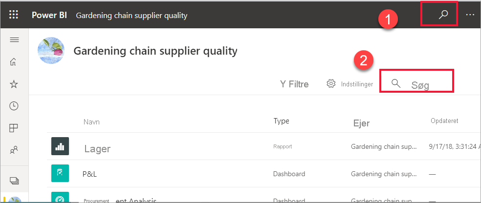
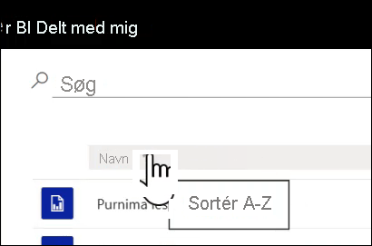

# Navigation for Power BI-virksomhedsbrugere: global søgning

[!INCLUDE[consumer-appliesto-yyny](../includes/consumer-appliesto-yyny.md)]

[!INCLUDE [power-bi-service-new-look-include](../includes/power-bi-service-new-look-include.md)]

Når du er ny bruger af Power BI-tjenesten, har du kun lidt indhold (dashboards, rapporter og apps). Men når kollegaer begynder at dele indhold med dig, og du begynder at downloade apps, kan du få en lang liste med indhold. Det er i den situation, at søgning og sortering er meget praktisk.

## Søgning efter indhold
 Søgefunktionen er tilgængelig næsten overalt i Power BI-tjenesten. Kig blot efter søgefeltet eller søgeikonet .

 Skriv hele eller en del af navnet på et dashboard, en rapport, en projektmappe, et arbejdsområde, en app eller en ejer i feltet Søg. Power BI søger i hele dit indhold. 

  

 I nogle områder af Power BI, f. eks. arbejdsområder, kan du finde to forskellige søgefelter. Søgefeltet på menulinjen søger i hele dit indhold, mens søgefeltet på lærredet for arbejdsområdet kun søger i det pågældende arbejdsområde.

  

## Sortering af indholdslister

Hvis du kun har begrænset indhold, er det muligvis ikke nødvendigt at sortere.  Men når du har lange lister over dashboards og rapporter, kan du bruge sortering til at finde det, du har brug for. Denne indholdsliste af typen **Delt med mig** indeholder f.eks. 70 elementer. 

I øjeblikket sorteres denne indholdsliste alfabetisk efter navn fra Å til A. Hvis du vil ændre sorteringskriterierne, skal du vælge pilen til højre for **Navn (A-Å)** .

Sortering er også tilgængelig i arbejdsområder. I dette eksempel sorteres indholdet efter datoen for **Opdateret**. Hvis du vil angive sorteringskriterier for arbejdsområder, skal du vælge kolonneoverskrifter og vælge igen for at ændre sorteringsretningen. 

Ikke alle kolonner kan sorteres. Hold over kolonneoverskrifterne for at finde ud af, hvilke der kan sorteres.

## Filtrering af indholdslister
En anden måde at finde indhold hurtigt på er ved at bruge indholdslisten **Filtre**. Få vist filtrene ved ar vælge **Filtre** i øverste højre hjørne. De tilgængelige filtre afhænger af din placering i Power BI-tjenesten.  Nedenstående eksempel er fra en indholdsliste af typen **seneste**.  Det giver dig mulighed for at filtrere listen efter indholdstype.  På en indholdsliste af typen **Delt med mig** omfatter de tilgængelige **Filtre** Ejer samt indholdstype.

## Næste trin
[Sorter visualiseringer i rapporter](end-user-change-sort.md)

[Sortering af data i visualiseringer](end-user-change-sort.md)

Har du flere spørgsmål? [Prøv at spørge Power BI-community'et](https://community.powerbi.com/)
