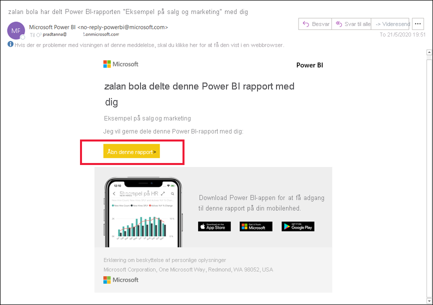
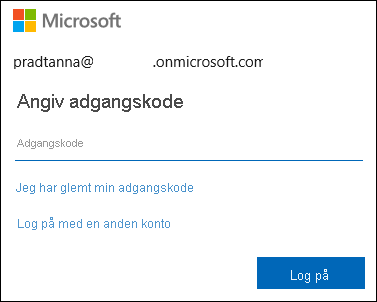
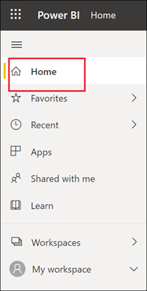
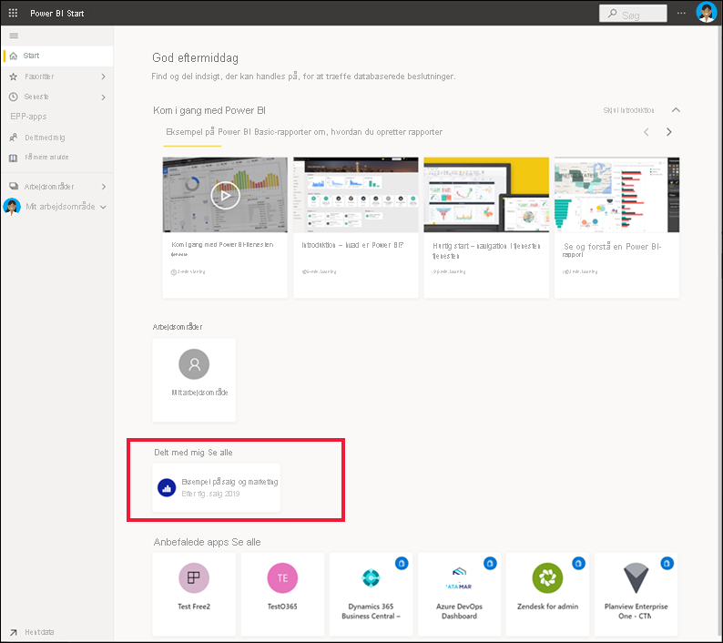
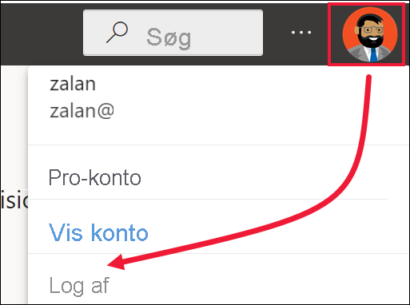

# Log på Power BI-tjenesten

[!INCLUDE[consumer-appliesto-yynn](../includes/consumer-appliesto-yynn.md)]

## Power BI-konti
Du skal have en konto, før du kan logge på Power BI. Du kan få en Power BI-konto på to måder. Den første er, når din organisation køber Power BI-licenser til sine medarbejdere. Den anden er, når [enkeltpersoner tilmelder sig gratis prøveversioner eller personlige licenser](../fundamentals/service-self-service-signup-for-power-bi.md). Denne artikel omhandler det første scenarie.

## Log på for første gang

### Trin 1: Åbn Power BI-tjenesten
Power BI-tjenesten kører i en browser. 

- Hvis du har modtaget en mail fra en kollega med et link til et dashboard eller en rapport, skal du vælge linket for at **åbne denne rapport** eller **åbne dette dashboard**.

        

- Alternativt kan du åbne din foretrukne browser og skrive **app.powerbi.com**.

        

### Trin 2: Skriv din mailadresse
Første gang du logger på, kontrollerer Microsoft, om du allerede har en Microsoft 365-konto. I eksemplet nedenfor har Pradtanna allerede en licens til andre Microsoft-tjenester. 

Angiv din adgangskode. Dette er adgangskoden til din Microsoft 365-konto. Det er den samme mailadresse og adgangskode, du bruger til andre Microsoft-produkter, f.eks. Outlook og Office.  Afhængigt af hvordan din konto er konfigureret, kan du også blive bedt om at angive en kode, der er sendt til din mail eller mobilenhed.   

Nogle gange kan din globale administrator tildele dig en licens og sende dig en mail med disse oplysninger. Se efter en velkomstmail i din indbakke, og følg instruktionerne for at logge på første gang. Brug den samme mailkonto til at logge på. 
 
### Trin 3: Gennemse vilkår og betingelser
Gennemse vilkårene og betingelserne. Hvis du accepterer, skal du markere afkrydsningsfeltet og vælge **Start**.

### Trin 4: Gennemse landingssiden Hjem
Power BI åbner landingssiden **Hjem**, første gang du logger på. Hvis **Hjem** ikke åbnes, skal du vælge den i navigationsruden. 

Du kan se alt det indhold, du har tilladelse til at bruge, på siden Hjem. I første omgang er der måske ikke så meget indhold, men bare rolig, det ændres, i takt med at du begynder at bruge Power BI sammen med dine kolleger. Kan du huske den rapport, som din kollega delte med dig via mail? Den ligger på din startside under overskriften **Delt med mig**.

Hvis du ikke vil have Power BI til at åbne siden Hjem, kan du [angive et **udvalgt** dashboard eller en udvalgt rapport](end-user-featured.md), der åbnes i stedet. 

## Sikker interaktion med indhold
Som **_virksomhedsbruger_ *_ vil andre dele indhold med dig, og du interagerer med dette indhold for at udforske dataene og træffe forretningsbeslutninger.  Du behøver ikke bekymre dig, når du filtrerer, laver udsnit, abonnerer, eksporter og tilpasser størrelsen – dit arbejde påvirker ikke det underliggende datasæt eller det oprindelige delte indhold (dashboards og rapporter). Power BI er et sikkert område til at udforske og eksperimentere. Det betyder ikke, at du ikke kan gemme dine ændringer. Det kan du. Men disse ændringer påvirker kun _* din** visning af indholdet. Og det er lige så let som at klikke på en knap at vende tilbage til den oprindelige standardvisning.

## Log af Power BI-tjenesten
Når du lukker eller logger af Power BI-tjenesten, gemmes dine ændringer, så du kan fortsætte, hvor du slap.

Du lukker Power BI ved blot at lukke den browserfane, du arbejder under. 

 

Hvis du deler en computer, anbefaler vi, at du logger af, hver gang du lukker Power BI.  Hvis du vil logge af, skal du vælge dit profilbillede i øverste højre hjørne og vælge **Log af**.  

 

## Fejlfinding og overvejelser
- Hvis du har tilmeldt dig Power BI som enkeltperson, skal du logge på med den mailadresse, du brugte til tilmeldingen.

- Nogle personer bruger Power BI med mere end én konto. Hvis det er tilfældet, bliver du bedt om at vælge en konto på listen, når du logger på. 

## Næste trin
[Få vist en Power BI-app](end-user-app-view.md)
