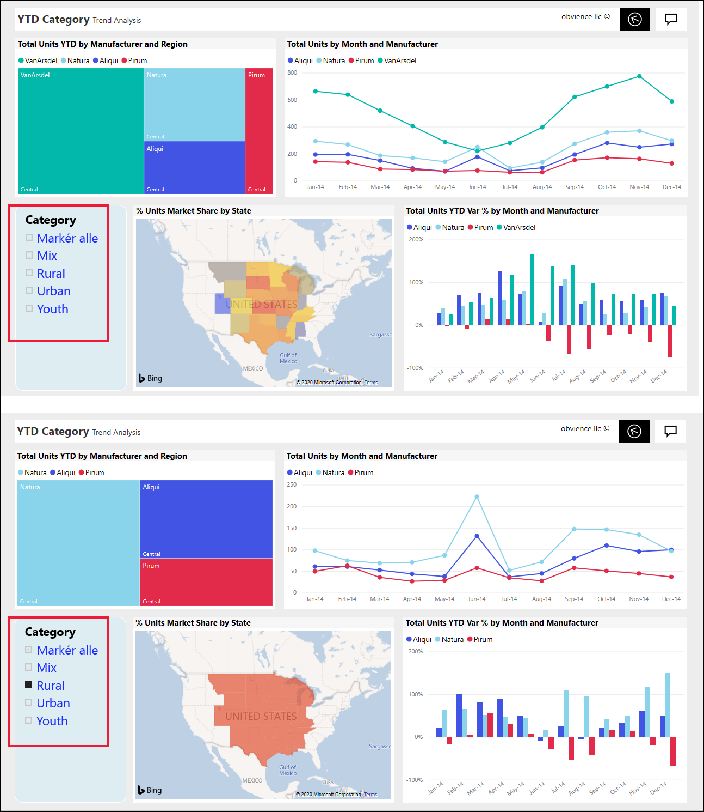
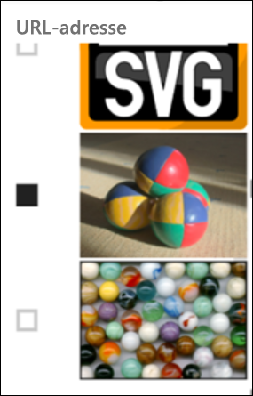
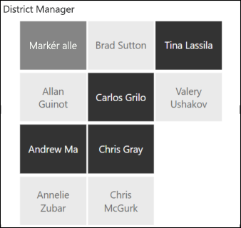
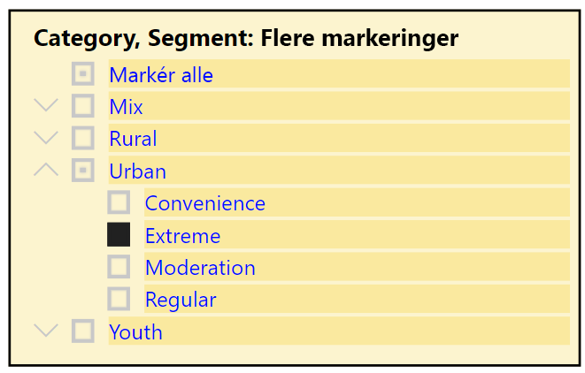
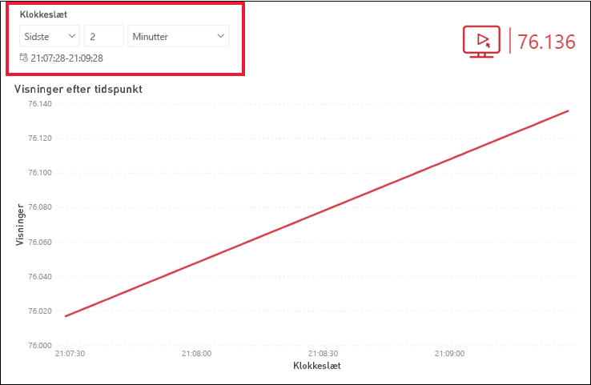
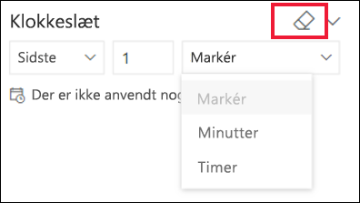

# Udsnitsværktøjer i Power BI-tjenesten

[!INCLUDE[consumer-appliesto-ynnn](../includes/consumer-appliesto-yynn.md)]

Et udsnit er en type visualisering, der filtrerer de andre visualiseringer på en rapportside. Når du bruger Power BI-rapporter, kan du se mange forskellige udsnitsværktøjer. Billedet ovenfor viser det samme udsnitsværktøj, men med forskellige valgmuligheder. Læg mærke til, hvordan de enkelte valg filtrerer de andre visuelle elementer på siden.  

## Sådan bruger du udsnitsværktøjer
Når *designere* opretter rapporter, tilføjer de udsnitsværktøjer for at fortælle en historie og give dig værktøjer til at udforske dine data.

### Udsnitsværktøj til numerisk område
 Udsnitsværktøjet til numeriske områder hjælper dig med at udforske kvantitative data som f.eks. det samlede salg efter: geografi, enheder på lager og ordredato. Brug håndtagene til at vælge et interval. 

### Grundlæggende lodret udsnitsværktøj med afkrydsningsfelter

I et grundlæggende udsnitsværktøj med afkrydsningsfelter kan du vælge et eller flere afkrydsningsfelter for at se virkningen på de andre visualiseringer på siden. Tryk på CTRL + vælg for at vælge mere end ét. Nogle gange angiver *rapportdesigneren* udsnitsværktøjet, så du kun kan vælge én værdi ad gangen. 

### Udsnitsværktøjer til billeder og figurer
Når indstillingerne i udsnitsværktøjet er billeder eller figurer, fungerer det på samme måde som med afkrydsningsfelter, når du foretager dine valg. Du kan vælge et eller flere billeder eller figurer for at anvende udsnitsværktøjet på de andre visualiseringer på siden. 

    

    

### Hierarkiudsnit

Brug vinklerne i et udsnit med et hierarki til at udvide og skjule hierarkiet. Overskriften opdateres for at vise dine valg.

### Relativt tidsudsnit
I forbindelse med scenarier med hurtige opdateringer, kan filtrering til et mindre tidsrum være meget nyttigt.
Ved hjælp af det relative tidsudsnit kan du anvende tidsbaserede filtre for alle dato- og klokkeslætsdata i din rapport. Du kan f.eks. bruge det relative tidsudsnit til kun at vise videovisninger inden for de seneste 2 dage, timer eller endda minutter. 

## Deaktiver et udsnit
Hvis du vil deaktivere et udsnit, skal du vælge viskelæderikonet.

## De næste trin
Du kan få flere oplysninger i følgende artikler:

[Typer af visualiseringer i Power BI](end-user-visualizations.md)

