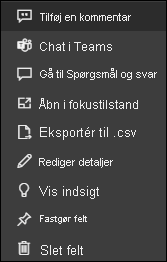

# Dashboard-felter i Power BI

[!INCLUDE[consumer-appliesto-yyny](../includes/consumer-appliesto-ynny.md)]

Et felt er et snapshot af dine data, der er fastgjort til et dashboard af en *designer*. *Designere* kan oprette felter ud fra en rapport, et datasæt, et dashboard, feltet Spørgsmål og svar, Excel og SQL Server Reporting Services (SSRS) med flere.  Dette skærmbillede viser mange forskellige felter, der er fastgjort til et dashboard.

Udover felter, der er fastgjort fra rapporter, kan *designere* føje separate felter direkte til dashboardet ved hjælp af **Tilføj felt**. Separate felter omfatter: tekstfelter, billeder, videoer, streamingdata og webindhold.

Har brug for hjælp til at forstå de komponenter, der udgør Power BI?  Se [Power BI – Grundlæggende begreber](end-user-basic-concepts.md).

## Interager med felter på et dashboard

1. Peg på feltet for at vise ellipsen.
   
    
2. Vælg ellipsen for at åbne menuen med felthandlinger. De tilgængelige indstillinger varierer afhængigt af dine tilladelser, visualiseringstypen og den metode, der bruges til at oprette feltet. De menuelementer, der er tilgængelige for felter, der er fastgjort fra Spørgsmål og svar, er f.eks. forskellige fra de felter, der er fastgjort fra en rapport. Her er en handlingsmenu for et felt, der er oprettet ved hjælp af Spørgsmål og svar.

   
    

   
    Nogle af de handlinger, der er tilgængelige i disse menuer, er:
   
   * [Åbn den rapport, der blev brugt til at oprette feltet ](end-user-reports.md)   
   
   * [Åbn det spørgsmål i Spørgsmål og svar, der blev brugt til at oprette det felt ](end-user-reports.md)   
   

   * [Åbn den projektmappe, der blev brugt til at oprette feltet ](end-user-reports.md)   
   * [Få vist feltet i fokustilstand ](end-user-focus.md)   
   * [Vis indsigt](end-user-insights.md) 
   * [Tilføj en kommentar, og start en diskussion](end-user-comment.md) 
   * [Administrer vigtige beskeder, der er angivet på et dashboardfelt](end-user-alerts.md) 
   * [Åbn dataene i Excel](end-user-export.md) 

3. Vælg et tomt område på canvasset for at lukke handlingsmenuen.

### Vælg (klik på) et felt
Når du vælger et felt, afhænger næste handling af, hvordan feltet blev oprettet, og om det har et [brugerdefineret link](../create-reports/service-dashboard-edit-tile.md). Hvis det har et brugerdefineret link, føres du til linket ved at vælge feltet. Ellers føres du til rapporten, Excel Online-projektmappen, SSRS-rapporten, der er i det lokale miljø, eller spørgsmål i Spørgsmål og svar, der blev brugt til at oprette feltet.

> [!NOTE]
> Undtagelsen til dette er videofelter, der er føjet til dashboards af *designere*. Hvis du vælger et videofelt (der blev oprettet på denne måde), afspilles videoen direkte på dashboardet.   
> 
> 

## Overvejelser og fejlfinding
* Hvis der ikke sker noget, når du vælger (klikker) på et felt, eller du modtager en fejlmeddelelse, er der nogle mulige årsager til dette:
  - Den rapport, der blev brugt til at oprette visualiseringen, blev ikke gemt, eller den er blevet slettet.
  - Hvis feltet blev oprettet vha. en projektmappe i Excel Online, og du ikke som minimum har læserettigheder til den pågældende projektmappe.
  - Hvis feltet blev oprettet fra SSRS, og du ikke har tilladelse til SSRS-rapporten, eller hvis du ikke har adgang til det netværk, hvor SSRS-serveren er placeret.
* For felter, der er oprettet direkte på dashboardet ved hjælp af **Tilføj felt**, og hvis et brugerdefineret hyperlink er angivet, åbnes denne URL-adresse, når titlen, undertitlen eller feltet vælges.  Ellers medfører det som standard ingen handling at vælge et af disse felter oprettet direkte på dashboardet for et billede, en webkode eller et tekstfelt.
* Hvis den oprindelige visualisering, der blev brugt til at oprette feltet, ændres, er det ikke tilfældet med feltet.  Hvis *designeren* f.eks. har fastgjort et kurvediagram fra en rapport og derefter har ændret kurvediagrammet til et søjlediagram, vises der fortsat et kurvediagram på dashboardfeltet. Dataene opdateres, men visualiseringstypen bliver ikke.

## De næste trin
[Opdatering af data](../connect-data/refresh-data.md)

[Power BI – Grundlæggende begreber](end-user-basic-concepts.md)

