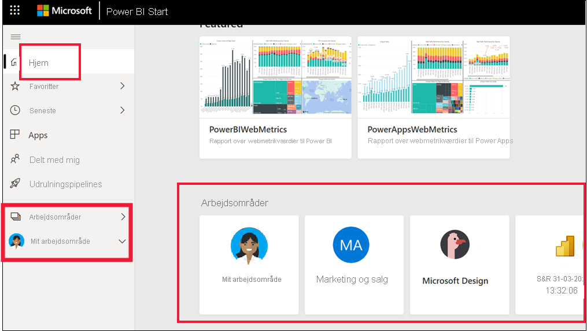
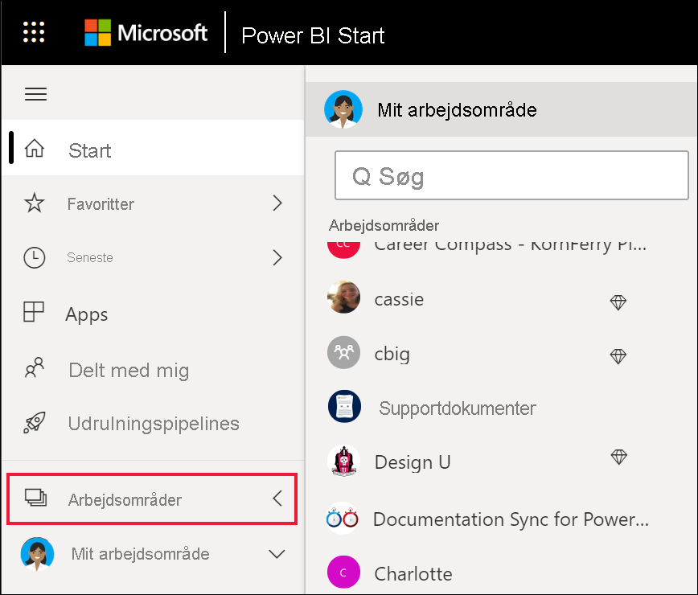

# Samarbejd i et arbejdsområde

 *Arbejdsområder* er steder, hvor du kan samarbejde med kolleger om bestemt indhold. Arbejdsområder oprettes af *Power BI-designere* til at opbevare samlinger af dashboards og rapporter. Designeren kan derefter dele arbejdsområdet med kollegaer. Designere kan også samle en samling af dashboards og rapporter i en *app* og distribuere den til hele community'et, til deres organisation eller til bestemte personer eller grupper. Visse typer apps, der kaldes *skabelonapps*, opretter et arbejdsområde, når appen installeres. [Få mere at vide om apps](end-user-apps.md). 

 Alle, der bruger Power BI-tjenesten, har også et **Mit arbejdsområde**.  Mit arbejdsområde er din personlige sandkasse, hvor du selv kan oprette indhold.

 Du kan se dine arbejdsområder på **startsiden** i Power BI eller ved at vælge **Arbejdsområde** i navigationsruden.

 

## Typer af arbejdsområder
I **Mit arbejdsområde** gemmes alt det indhold, du ejer og opretter. Tænk på det som din personlige sandkasse eller arbejdsområde til dit eget indhold. For mange Power BI-*erhvervsbrugere* vil **Mit arbejdsområde** blive ved med at være tomt, fordi deres job ikke involverer oprettelse af nyt indhold. *Erhvervsbrugere* forbruger pr. definition data, som er oprettet af andre, og de bruger disse data til at træffe forretningsbeslutninger. Hvis du opretter indhold, kan du overveje at læse [Power BI-artiklerne til designere](../create-reports/index.yml) i stedet for.

**Arbejdsområder** indeholder alt indhold til en specifik app. Når en *designer* opretter en app, samler vedkommende alt det indhold, der er nødvendigt for at bruge den pågældende app, og inkluderer det i appen. Indholdet kan omfatte: dashboards, rapporter, apps og datasæt. Det er ikke alle apps, der indeholder disse tre indholdselementer. En app kan indeholde blot ét dashboard eller tre af hver indholdstype eller endda 20 rapporter. Det afhænger af, hvad *designeren* inkluderer i appen. Normalt indeholder apparbejdsområder, der er delt med *erhvervsbrugere*, ikke datasæt.

Arbejdsområdet med salg af figner nedenfor indeholder tre rapporter og ét dashboard. 

## Tilladelser i arbejdsområder

Adgangstilladelser bestemmer, hvem der kan gøre hvad i et arbejdsområde, så teams kan samarbejde.  Når du giver adgang til et nyt arbejdsområde, kan *designere* føje enkeltpersoner eller grupper til en af arbejdsområderollerne: **Fremviser**, **Medlem**, **Bidragyder** eller **Administrator**. 

Du kan som *erhvervsbruger* i Power BI interagere i arbejdsområder ved hjælp af rollen **Læser**. Men en *designer* kan også tildele dig rollen som **Medlem** eller **Bidragyder**. Når du har læserrollen kan du få vist og interagere med indhold (dashboards, rapporter og apps), der er oprettet af andre og delt med dig. Eftersom rollen som læser ikke kan få adgang til det underliggende datasæt, er det en sikker måde at interagere med indhold på, uden at du behøver at bekymre dig om, at du "skader" de underliggende data.

Du kan finde en detaljeret liste over, hvad du kan foretage dig som *erhvervsbruger* med rollen Læser, i [Power BI-funktioner til erhvervsbrugere](end-user-features.md).

### Tilladelser til og roller i arbejdsområde

Her er funktionerne for de fire roller: Administratorer, medlemmer, bidragydere og fremvisere. Al denne funktionalitet med undtagelse af *visning af og interaktion med et element* kræver en Power BI Pro-licens.

[!INCLUDE[power-bi-workspace-roles-table](../includes/power-bi-workspace-roles-table.md)]

## Licenser, arbejdsområder og kapacitet
Licensering spiller også en rolle, da licenseringen bestemmer, hvad du kan og ikke kan gøre i et arbejdsområde. Mange funktioner kræver, at brugeren har en Power BI *Pro*-licens, eller at arbejdsområdet er gemt i en Premium-kapacitet. 

De fleste *erhvervsbrugere* arbejder med en gratis licens. [Få mere at vide om licensering](end-user-license.md). Hvis indholdet ikke gemmes i en Premium-kapacitet, har erhvervsbrugeren ikke adgang.

Hvis arbejdsområdet er gemt i en Premium-kapacitet, kan *erhvervsbrugere* få vist og interagere med indholdet i det pågældende arbejdsområde. Et diamantikon angiver de arbejdsområder, der er gemt i en Premium-kapacitet.

 Du kan få mere at vide under [Hvilken licens har jeg?](end-user-license.md).

## Næste trin
* [Apps i Power BI](end-user-apps.md)    

* Har du spørgsmål? [Prøv at spørge Power BI-community'et](https://community.powerbi.com/)

