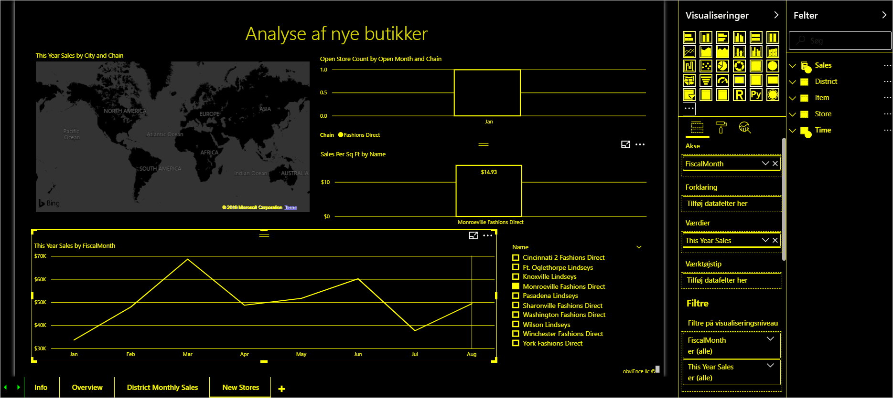

# Oversigt over tilgængelighed i Power BI

Når du arbejder med Power BI, skal du tage højde for de forskellige typer brugere, som kan interagere med dine rapporter. Du kan oprette rapporter, der nemt kan navigeres i og forstås af brugere, der anvender tastatur eller skærmlæsere. Med sådanne rapporter kan brugere med nedsat syn eller fysiske handicap få glæde af dine rapporter.

Denne artikel indeholder en oversigt over Power BI og tilgængelighed. Yderligere artikler indeholder vejledning og værktøjer, som kan hjælpe dig med at oprette fantastiske rapporter med tanke for tilgængelighed.

## Universelt design

Et universelt design betyder, at produktet er designet, så det kan bruges af så mange personer som muligt, uden at der er behov for særlig tilpasning eller et specialiseret design. Når du opretter rapporter eller oplevelser i Power BI, er det vigtigt at tænke på brugernes behov. Det er ikke kun slutbrugere med nedsat hørelse eller syn eller med fysiske eller kognitive handicap, som kan få glæde af, at du designer en tilgængelig oplevelse. Det kan hjælpe alle slutbrugere i din organisation. Power BI giver dig værktøjerne til at skabe og forbruge tilgængelige rapporter. Det er op til dig som opretteren af rapporten at bruge disse værktøjer til at forbedre alles oplevelse.

## Tilgængelighedsstandarder

Power BI har forpligtet sig til at overholde følgende standarder for tilgængelighed. Standarderne hjælper dig med at sikre, at dine Power BI-oplevelser er tilgængelige for så mange personer som muligt. Når du bygger tilgængelige rapporter eller dashboards, er indholdet tilgængeligt for alle, der ser det ved hjælp af Power BI-mobilapps.

### WCAG 2.1

WCAG-retningslinjer (Web Content Accessibility Guidelines) hjælper med at gøre webindhold tilgængeligt for personer med handicap. Nedenfor er de vigtigste principper for retningslinjerne:

1. **Opfattelig**. Oplysninger og komponenter på brugergrænsefladen skal præsenteres for brugerne på en måde, som de nemt kan opfatte.
2. **Driftsklar**. Komponenter på brugergrænsefladen og navigation skal være driftsklar.
3. **Forståelig**. Oplysninger og håndteringen af brugergrænsefladen skal være forståelig.

### US Section 508

US Section 508 er en standard, der kræver, at myndigheder og føderale institutioner gør deres elektroniske teknologi og informationsteknologi tilgængelig for personer med handicap.

### EN 301 549

EN 301 549 er den harmoniserede europæiske standard for tilgængelighed med krav for ICT-produkter og -tjenester.  

## De næste trin

Du kan finde flere oplysninger om Power BI-tilgængelighed i følgende ressourcer:

* [Design tilgængelige Power BI-rapporter](desktop-accessibility-creating-reports.md)
* [Forbrug Power BI-rapporter ved hjælp af tilgængelighedsværktøjer](desktop-accessibility-consuming-tools.md)
* [Oprettelse af rapporter i Power BI ved hjælp af tilgængelighedsværktøjer](desktop-accessibility-creating-tools.md)
* [Tastaturgenveje i Power BI Desktop](desktop-accessibility-keyboard-shortcuts.md)
* [Tjekliste for tilgængeligheden af rapporten](desktop-accessibility-creating-reports.md#report-accessibility-checklist)

