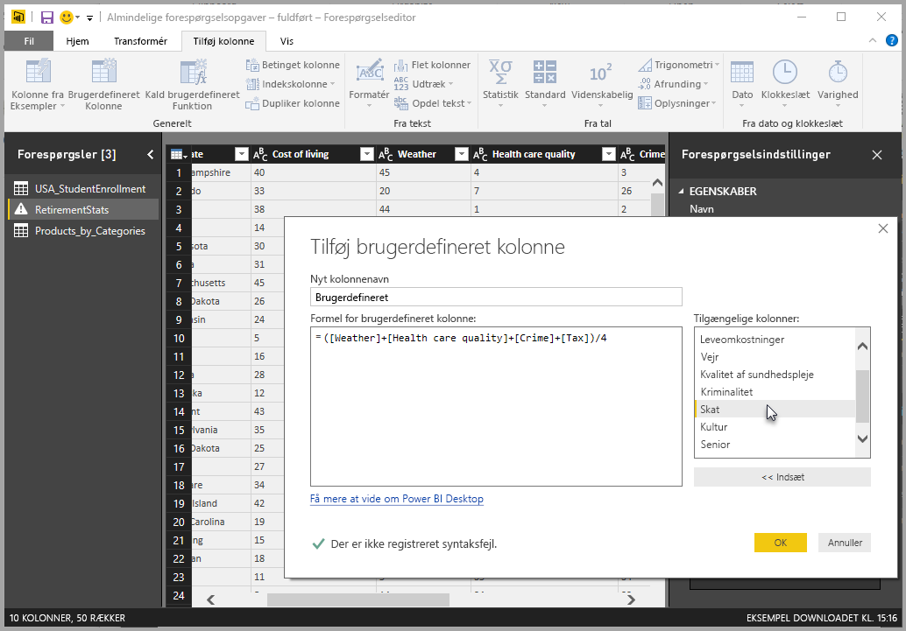
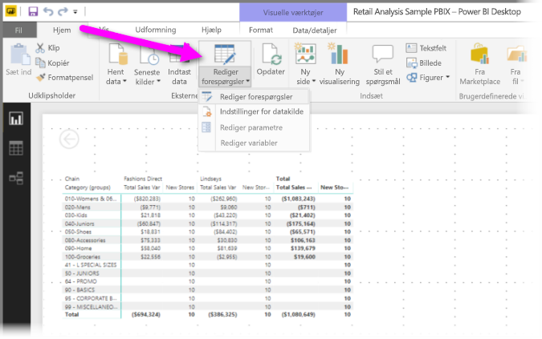
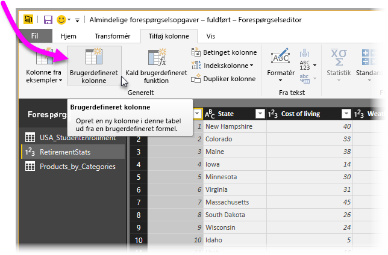
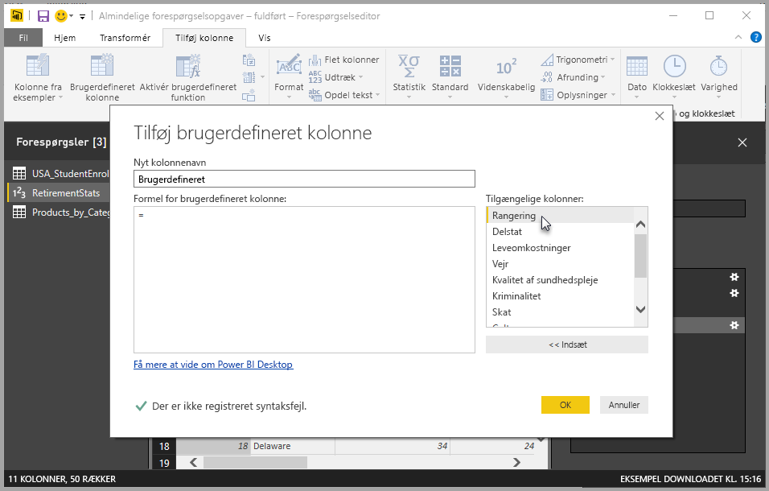
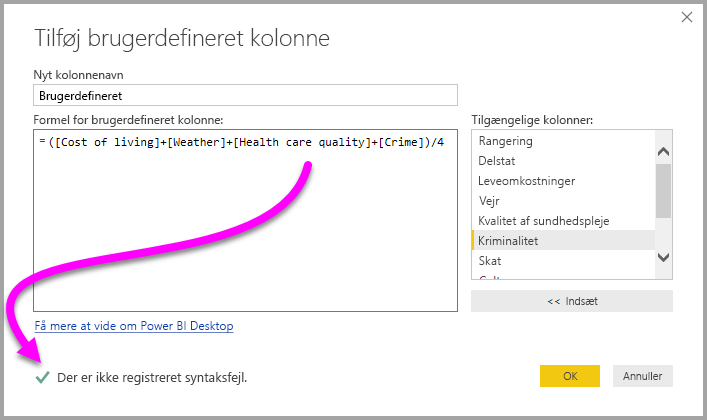
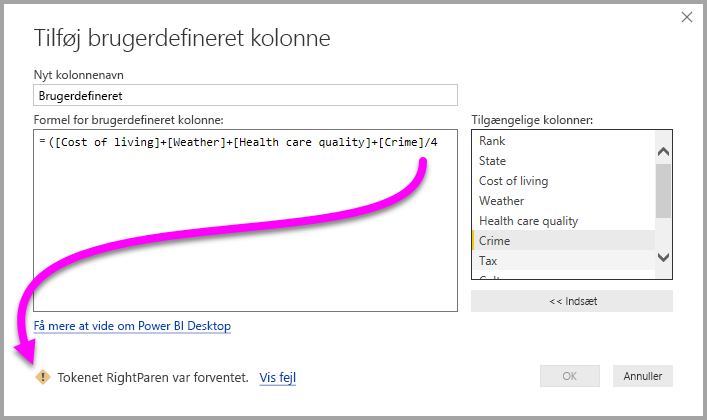
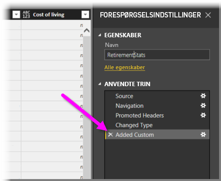
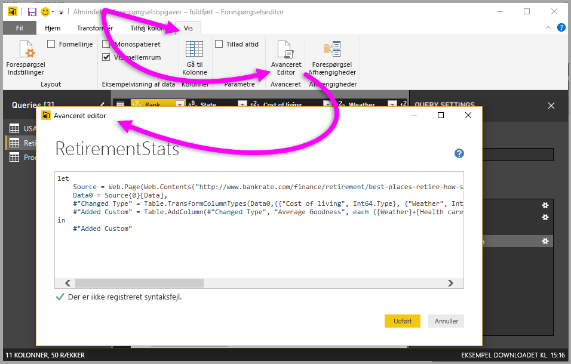

# Tilføj en brugerdefineret kolonne i Power BI Desktop

I Power BI Desktop kan du nemt føje en ny brugerdefineret kolonne med data til din model ved hjælp af Query Editor. Med Forespørgselseditor kan du oprette og omdøbe din brugerdefinerede kolonne for at oprette [M-formelforespørgsler i PowerQuery](/powerquery-m/quick-tour-of-the-power-query-m-formula-language) og definere din brugerdefinerede kolonne. M-formelforespørgsler i PowerQuery indeholder et [indholdssæt med omfattende funktionsreference](/powerquery-m/power-query-m-function-reference). 

Når du opretter en brugerdefineret kolonne i Forespørgselseditor, tilføjer Power BI Desktop den som et **Anvendt trin** i **Forespørgselsindstillinger** i forespørgslen. Den kan ændres, flyttes eller redigeres når som helst.

## Brug Forespørgselseditor til at tilføje en brugerdefineret kolonne

Følg disse trin for at begynde at oprette en brugerdefineret kolonne:

1. Start Power BI Desktop, og indlæs nogle data.

2. Fra fanen **Start** på båndet skal du vælge **Rediger forespørgsler** og derefter vælge **Rediger forespørgsler** i menuen.

   

   Vinduet **Forespørgselseditor** vises. 

2. Under fanen **Tilføj kolonne** på båndet skal du vælge **Brugerdefineret kolonne**.

   

   Vinduet **Tilføj brugerdefineret kolonne** vises.

## Vinduet Tilføj brugerdefineret kolonne

Vinduet **Tilføj brugerdefineret kolonne** indeholder følgende funktioner: 
- En liste over tilgængelige kolonner på listen **Tilgængelige kolonner** til højre.

- Det indledende navn på din brugerdefinerede kolonne i feltet **Nyt kolonnenavn**. Du kan omdøbe denne kolonne.

- [M-formelforespørgsler i PowerQuery](/powerquery-m/power-query-m-function-reference) i feltet **Formel for brugerdefineret kolonne**. Du kan oprette disse forespørgsler ved at udarbejde den formel, som den nye brugerdefinerede kolonne er defineret på. 

   

## Opret formler til din brugerdefinerede kolonne

1. Vælg en kolonne på listen **Tilgængelige kolonner** til højre, og vælg derefter **Indsæt** under listen for at føje dem til formlen for den brugerdefinerede kolonne. Du kan også tilføje en kolonne ved at dobbeltklikke på den på listen.

2. Bemærk indikatoren nederst i vinduet **Tilføj brugerdefineret kolonne**, når du angiver formlen og opretter kolonnen. 

   Hvis der ikke er nogen fejl, får du vist en grøn markering, og meddelelsen *Der er ikke registreret nogen syntaksfejl*.

   

   Hvis der er en syntaksfejl, får du vist et gult advarselsikon sammen med et link til det sted, hvor fejlen opstod i din formel.

   

3. Vælg **OK**. 

   Power BI Desktop føjer din brugerdefinerede kolonne til modellen og føjer trinnet **Tilføjet brugerdefineret** til listen **Anvendte trin** i din forespørgsel under **Forespørgselsindstillinger**.

   

4. Hvis du vil redigere din brugerdefinerede kolonne, skal du dobbeltklikke på trinnet **Tilføjet brugerdefineret** på listen **Anvendte trin**. 

   Vinduet **Tilføj brugerdefineret kolonne** vises med formlen for den brugerdefinerede kolonne, du har oprettet.

## Brug Avanceret editor til brugerdefinerede kolonner

Når du har oprettet din forespørgsel, kan du også bruge **Avanceret editor** til at redigere et hvilket som helst trin i din forespørgsel. Hvis du vil gøre dette, skal du følge disse trin:

1. I vinduet **Forespørgselseditor** skal du vælge fanen **Vis** på båndet. 

2. Vælg **Avanceret editor**.

   Siden **Avanceret editor** vises og giver dig fuld kontrol over din forespørgsel. 

   

   
## De næste trin

- Du kan oprette en brugerdefineret kolonne på andre måder, f.eks. ved at oprette en kolonne baseret på eksempler, du angiver i Forespørgselseditor. Du kan finde flere oplysninger i [Tilføj en kolonne fra et eksempel i Power BI Desktop](desktop-add-column-from-example.md).

- Du kan finde oplysninger om M-reference i Power Query i [M-funktionsreference i Power Query](/powerquery-m/power-query-m-function-reference).